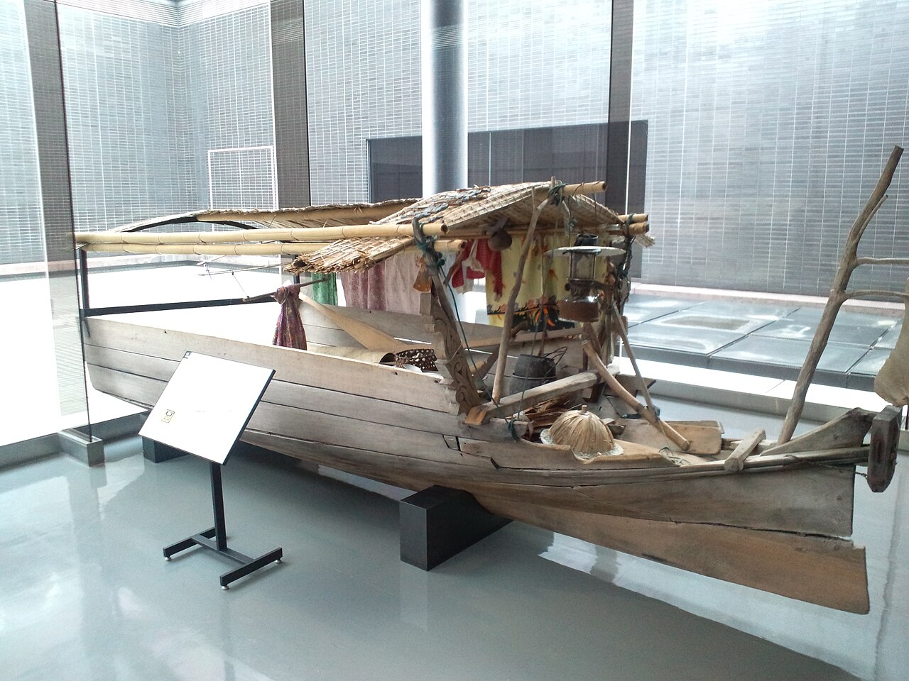
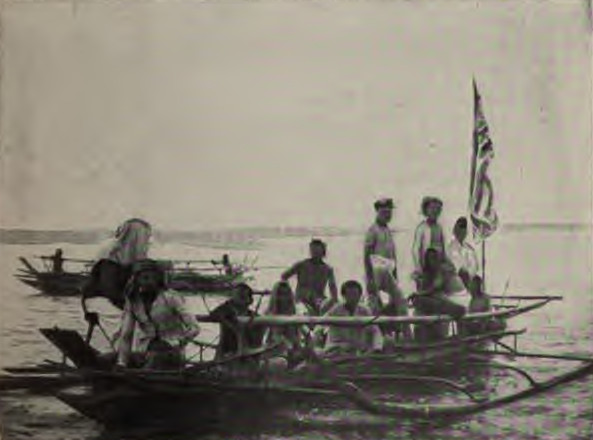

## On this deck

**Week 1** of 14

- [Course outline](../../docs/course-outline.html) — full semester plan
- [Home](../../index.html)
- Use **arrow keys** / on-screen controls · **M** opens slide menu · **Esc** overview grid

## This course

- Quantitative Biology I
- Parallel to your **R programming** course
- Programming: *how* to code
- Here: *why* biologists use code

## Today's goal

1. One striking biological story — told through people, not only papers
2. What kinds of evidence it needs
3. How this course builds the matching tools

---

## Meet Andika

{fig-alt="Andika free-diving near a manta ray" width="52%"}

Andika — his father is **Bajau**.

## A personal entry point

::: {.notes}
Tell your story here: how you met Andika, where you were, what struck you about diving culture / family history. Keep it short and human (2–3 minutes). This is the emotional hook before the science.
:::

- I met Andika while …
- What stayed with me: …
- His family story opened a scientific door: **local adaptation to diving**

## Why start with a person?

- Science is about living systems — and living people
- A photo and a story make the questions feel real
- Then we ask: what would it take to *prove* a biological claim?

---

## The Bajau (“sea nomads”)

- Indigenous maritime peoples of Island Southeast Asia
- Subsistence lifestyle with extreme **breath-hold diving**
- Hours per day in the water; deep free dives with minimal gear
- Andika’s family is one living connection to this culture

## Life on the water

:::: {.columns}

::: {.column width="50%"}
{fig-alt="Bajau village life in Sampela, Wakatobi" width="100%"}

Sampela, Wakatobi (Indonesia)
:::

::: {.column width="50%"}
{fig-alt="Floating Bajau houses reflected in water, Wakatobi" width="100%"}

Stilt / floating houses
:::

::::

::: {.aside}
Photos: BastianKyle, Wikimedia Commons (CC BY-SA 4.0)
:::

## Boats and mobility

:::: {.columns}

::: {.column width="50%"}
{fig-alt="Vinta boat of the Bajau Laut" width="100%"}

Vinta (Bajau Laut)
:::

::: {.column width="50%"}
{fig-alt="Bajau houseboat off Sandakan, Sabah" width="100%"}

Houseboat, Sabah
:::

::::

::: {.aside}
Torben Venning (CC BY 2.0); CEphoto / Uwe Aranas (CC BY-SA 3.0) — Wikimedia Commons
:::

## The biological puzzle

Is exceptional diving ability only:

- training and culture?

Or also:

- **physiology** shaped by evolution?

---

## Clue 1 — the spleen

- During diving, the spleen can contract and release O₂-rich red blood cells
- Like a built-in oxygen boost
- Prediction: if diving selected on physiology, spleen size might differ

## What the data show

- Bajau spleens ~**50% larger** than nearby non-diving Saluan neighbors
- Difference seen in divers **and** non-divers → not only training
- Method: field ultrasound + population comparison

**Paper:** Ilardo et al. (2018), *Cell*

## Evidence type: physiology / medicine

| Observation | Interpretation |
|---|---|
| Larger spleen | larger RBC reservoir |
| Present regardless of diving status | likely genetic component |
| Plausible dive-response mechanism | biology, not just anecdote |

---

## Clue 2 — the genome

Question:

> Are genetic variants under selection in Bajau — and linked to spleen / diving traits?

## Genetic findings (Ilardo et al. 2018)

- Selection scan: candidates enriched in Bajau vs comparison groups
- **PDE10A** — associated with spleen size (thyroid-hormone pathway)
- **BDKRB2** — linked to the human diving reflex (vasoconstriction)
- Standing variation + selection, not a brand-new private mutation only

## Follow-up mechanism paper

Ilardo et al. (2021), *Frontiers in Physiology*

- PDE10A → thyroid hormone → RBC precursor proliferation
- Appears **EPO-independent** (unlike classic high-altitude hypoxia response)
- Connects gene → physiology more tightly

## Evidence type: genetics + association

Still hard questions remain:

- Is the association causal?
- Which variant is functional?
- How do we avoid confounding (relatedness, environment, population structure)?

→ pointer to statistical genetics / study design

---

## Clue 3 — deep history?

Ilardo et al. also report a possible **Denisovan-related** signal at **FAM178B**.

Important nuance:

- **PDE10A / BDKRB2** (the diving/spleen candidates): *no* clear archaic introgression
- Archaic DNA can matter in human adaptation — but not every adaptive gene is archaic

## A clearer Denisovan teaching example

Tibetan high-altitude adaptation:

- **EPAS1** haplotype from Denisovan-like ancestry
- Huerta-Sánchez et al. (2014), *Nature*

Use Bajau for physiology + selection.  
Use Tibetans when asking: *how do we know DNA came from Denisovans?*

## Why archaic claims are hard

To accept “this DNA is Denisovan” we need:

- archaic reference genomes
- haplotype sharing / introgression statistics
- rejection of look-alike alternatives (ILS, convergent mutation)

→ bioinformatics + population-genetic modelling

---

## Three hard questions (course map)

## Question 1

**How show genes are tied to the adaptation?**

Ilardo route: ultrasound phenotypes + selection scans + association  

→ study design, confounders, replication

## Question 2

**How infer archaic origin of a sequence?**

Best classroom example: Tibetan **EPAS1** (Huerta-Sánchez et al. 2014)  

→ genomes, comparative genomics, introgression tests

## Question 3

**How rule out “it only looks archaic / adaptive”?**

→ simulate alternative histories; compare models to data

---

## Take-home message

Cool biology stacks evidence:

| Line of evidence | In this story |
|---|---|
| People & culture | Andika / Bajau diving life |
| Physiology | larger spleens; dive response |
| Genetics | PDE10A, BDKRB2 (+ follow-ups) |
| Deep history methods | archaic introgression toolkit (e.g. EPAS1) |
| Modelling | alternative scenarios |

## Key papers (starter set)

1. **Ilardo et al. (2018)** *Cell* — Bajau spleen size; PDE10A; BDKRB2  
   https://doi.org/10.1016/j.cell.2018.03.054
2. **Ilardo et al. (2021)** *Front. Physiol.* — PDE10A / TH / EPO-independent mechanism  
   https://doi.org/10.3389/fphys.2021.760851
3. **Huerta-Sánchez et al. (2014)** *Nature* — Tibetan EPAS1 Denisovan introgression  
   https://doi.org/10.1038/nature13408

::: {.notes}
Optional extras if you want a reading list: Scholander diving response classics; Sankararaman et al. on archaic landscapes; Racimo et al. on detecting adaptive introgression.
:::

## What “quantitative” means here

Not a separate subject — tools for biology:

- measurement & study design
- genomes / algorithms
- simulation & model comparison
- clear plots and careful claims

## Semester roadmap (biology)

| Weeks | Biology |
|---|---|
| 2–4 | **Ecology** |
| 5–7 | **Evolution** (deterministic) |
| 8–10 | **Evolution** (random) |
| 11–13 | **Microbiome** — ecology with randomness |
| 14 | Project |

## Next up (Weeks 2–4)

| Week | Ecology focus | Code link |
|---|---|---|
| 2 | Bio contrast → Lotka–Volterra | function → vector → loop |
| 3 | Richer models + parameters | edit terms; explore |
| 4 | Data + your own model | transfer + create |

## Exit ticket

1. What stayed with you from Andika’s story?
2. Which evidence type feels strongest — and which feels hardest to prove?
3. Which programming idea do you already know that you will reuse?

## Next week

A cool ecological contrast (with/without predators) → take apart → rebuild with **function, vector, loop**.

---

## More culture visuals (optional)

:::: {.columns}

::: {.column width="50%"}
{fig-alt="Museum display of a Bajau houseboat from Sabah" width="95%"}

Houseboat model (Sabah)
:::

::: {.column width="50%"}
{fig-alt="Historic illustration of a Bajao boat" width="95%"}

Historic “Bajao” boat
:::

::::

Credits in `pics/README.md`. Your own field photos still welcome beside Andika.

---

## Navigation

| | |
|---|---|
| Overview | [Course outline](../../docs/course-outline.html) |
| Home | [Course home](../../index.html) |
| Previous | *Start of course* |
| Next | [Week 2 →](../week-02/slides.html) |

Keyboard: ← → move slides · **M** menu · **Esc** slide grid · **F** fullscreen

