## Übersicht

**Woche 1** von 14 · **Do., 17. Sept. 2026, 08:15–10:00**

| Teil | Dauer | Was |
|------|-------|-----|
| 1. Hälfte | ~45 min | Warum quantitative Biologie? · Bajau |
| Pause | ~5 min | |
| 2. Hälfte | ~45 min | Tibet · vier Kursbegriffe |

Kein Notebook in der Sitzung. [Glossar](../../docs/glossary.html)

::: aside
Pfeiltasten · **M** Menü · **Esc** Übersicht
:::

## Dieser Kurs

::::: columns
::: {.column width="22%"}
{fig-alt="Biologie" width="70%"}
:::
::: {.column width="22%"}
{fig-alt="Mathematik" width="70%"}
:::
::: {.column width="22%"}
{fig-alt="Statistik" width="70%"}
:::
::: {.column width="22%"}
{fig-alt="Code" width="70%"}
:::
:::::

-   Quantitative Biologie I — parallel zu **R-Programmierung**
-   Dort: *wie* man code schreibt · Hier: *welche Fragen* Biologie stellt — und wo Mathematik, Statistik, Algorithmen **natürlich** auftauchen
-   Do **08:15–10:00** · Kurzvorträge Wochen **4, 8, 11, 14**
-   [KI-Richtlinie](../../docs/ai-policy.html)

## Lernziele (Woche 1 = Einführung)

{fig-alt="Drei Lernziele als Karten" width="95%"}

Am Ende sollen Sie **sehen** — nicht alles können:  
eine biologische **Frage** → sinnvolle **Daten / Experimente** → wo quantitative Methoden ins Spiel kommen.  
Kein Leistungsdruck heute: Orientierung und Neugier.

## Heute in dieser Reihenfolge

1. Warum Mathematik in der Biologie?
2. Bajau: eine Frage, mehrere Ebenen
3. Tibet: dieselbe Logik, schärfere Frage
4. Was müssen wir festlegen: Population, Gen, Generation, Selektion?

::: aside
[Modul 1](../../docs/module-01-overview.html) · [Glossar](../../docs/glossary.html)
:::

# Einstieg · Warum quantitative Biologie?

## Lange getrennt

{fig-alt="Biologie und Mathematik lange getrennt" width="92%"}

Historisch: Biologie und Mathematik waren lange **wenig verknüpft**.

Spannende Naturforschung brauchte beides — das wurde erst allmählich selbstverständlich.

## Darwin — schon damals klar

Charles Darwin, *Autobiography* (1876):

> … I have deeply regretted that I did not proceed far enough at least to understand something of the great leading principles of mathematics, for men thus endowed seem to have an extra sense.

::: aside
Darwin Online / *Life and Letters*; gemeinfrei
:::

## Auf Deutsch

> … ich habe zutiefst bedauert, dass ich nicht wenigstens so weit gekommen bin, etwas von den grossen Leitprinzipien der Mathematik zu verstehen — denn Menschen, die damit ausgestattet sind, scheinen einen **zusätzlichen Sinn** zu haben.

Punkt: Selbst Darwin sah Mathematik als **Hilfe für die Biologie** — nicht als Fremdkörper.

In diesem Kurs: das **Beispiel** zwingt zur Mathematik. Heute sehen Sie
*warum*. Ableiten kommt später — dort sitzen Sie nicht verloren.

## Zeitlinie (Überblick)

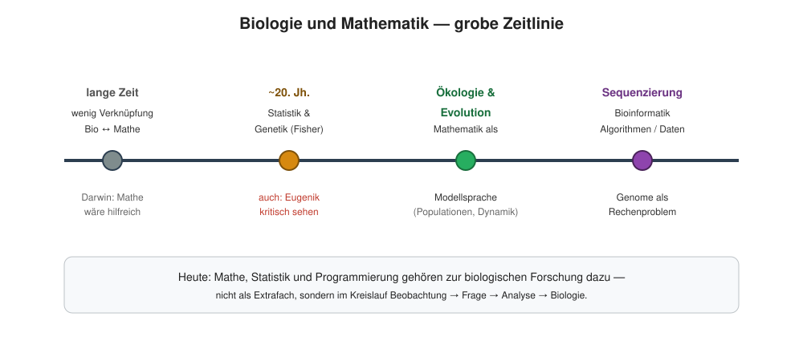{fig-alt="Zeitlinie quantitative Biologie" width="92%"}

Drei Stränge, die heute selbstverständlich wirken — jeweils mit einem Beispiel:

**Statistik** · **Ökologie / Evolution** · **Bioinformatik**

# Beispiel · Statistik

## Frage → Daten → Analyse

**Frage:** Hängt Merkmal $Y$ mit einer Messgrösse $X$ zusammen?  
**Daten:** Paare $(X_i, Y_i)$ aus einer Stichprobe.  
**Analyse:** Regression / Trend — und Vorsicht bei Struktur (Simpson).

## Regression

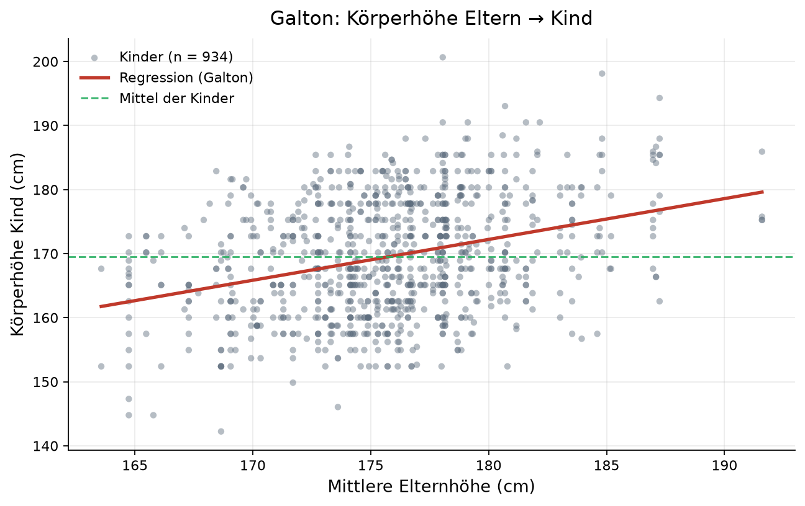{fig-alt="Regression Lehrbeispiel" width="88%"}

Streuende Punkte + Ausgleichsgerade: Variation zählen und Zusammenhänge schätzen.

Mit Evolution/Genetik wurde das zentral — u. a. **R. A. Fisher** (1930).

## Kritischer Einschub: Eugenik

Dieselbe quantitative Tradition wurde auch für **Eugenik** missbraucht  
(Bewertung / Steuerung menschlicher «Erbanlagen»).

Für uns heute:

-   Methoden sind mächtig — **Forschungsziele** und Ethik gehören dazu  
-   «Können wir messen?» ≠ «Sollen wir das so verwenden?»  
-   Im Kurs: quantitative Methoden verstehen **und** Ansprüche kritisch halten

## «I am just following the data»

{fig-alt="Satirischer Tweet Race Realist" width="70%"}

Klassischer Sound eines **«race realist» on Twitter**:  
Rassismus im Laborkittel — getarnt als reine Empirie.

## Daten sprechen nicht

{fig-alt="Daten sprechen nicht sie antworten" width="90%"}

Dazu gehören: Was messen wir? An wem? Welche Annahmen? Welcher **Kontext** fehlt?

Ohne das ist «die Daten sagen …» Theater — keine Wissenschaft.

## Simpson-Paradoxon (Pinguin-Lehrbeispiel)

Manchmal dreht sich ein Trend um, sobald man nach **Gruppe / Population** trennt.

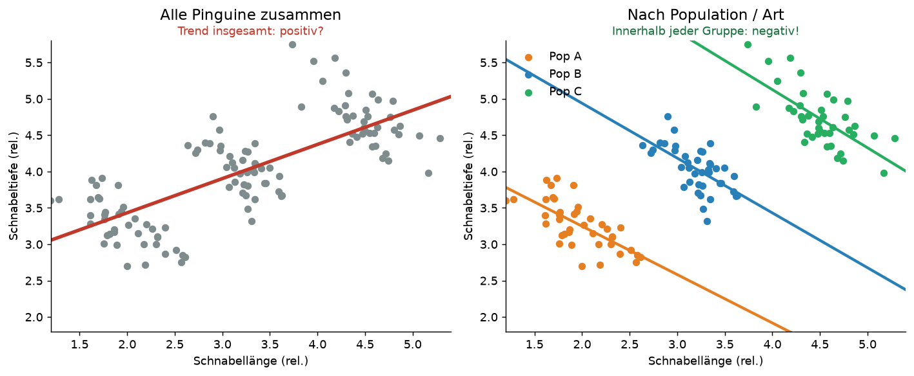{fig-alt="Simpson-Paradoxon: Trend insgesamt vs nach Population" width="95%"}

::: aside
Lehrsimulation (Pinguin-Stil). Idee wie bei Art-/Populationsstruktur in echten Daten.
:::

## Was lernen wir daraus?

Links: «Schnabel länger → tiefer» — sieht überzeugend aus.  
Rechts: **innerhalb** jeder Population eher das Gegenteil.

Beide Plots nutzen dieselben Punkte.  
Unterschied: die **Frage** (ignorieren wir Struktur — oder nicht?).

Deshalb: Kontext, Annahmen, Gruppierung — bevor man «den Daten folgt».

# Beispiel · Ökologie & Evolution

## Mathematik als Sprache für Dynamik

**Frage:** Wie ändern sich Populationen über die Zeit (Wachstum, Interaktion, Selektion)?  
**Daten / Idee:** Zählungen, Experimente — oder ein Modell der Regeln.  
**Analyse:** Differenzen-/Differenzialgleichungen, Simulation.

Ab **Woche 2** bauen wir genau diesen Strang.

## Räuber–Beute: Lotka–Volterra

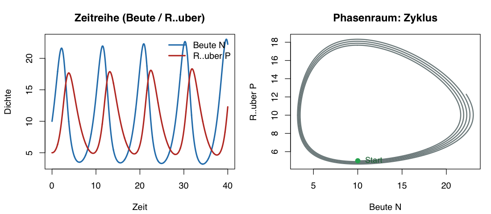{fig-alt="Lotka-Volterra Zeitreihe und Phasenzyklus" width="92%"}

Klassische Idee: Beute und Räuber oszillieren — im Phasenraum ein **Zyklus**.

## Schlüsselreferenzen (Ökologie / Evolution)

| | |
|---|---|
| Lotka (1925), Volterra (1926) | Räuber–Beute / populationsdynamische Modelle |
| Gause (1934) | Experimente mit *Paramecium* / Konkurrenz |
| Fisher (1930) | *The Genetical Theory of Natural Selection* |
| Wright (1931 u. a.) | Populationsstruktur, Drift |

Heute: nur **sehen**, dass solche Modelle existieren. Ab Woche 2: selber bauen.

# Beispiel · Bioinformatik

## Sequenzdaten → Algorithmen

**Frage:** Wie rekonstruiert man Genome aus Millionen kurzer Reads?  
**Daten:** DNA/RNA-Sequenzfragmente (NGS).  
**Analyse:** Graphen, Pfade, Vergleiche — **Bioinformatik**.

Ohne Informatik und Statistik keine moderne Genomik —  
Bajau- und Tibet-Geschichten brauchen genau das.

## Assembly: de Bruijn-Idee

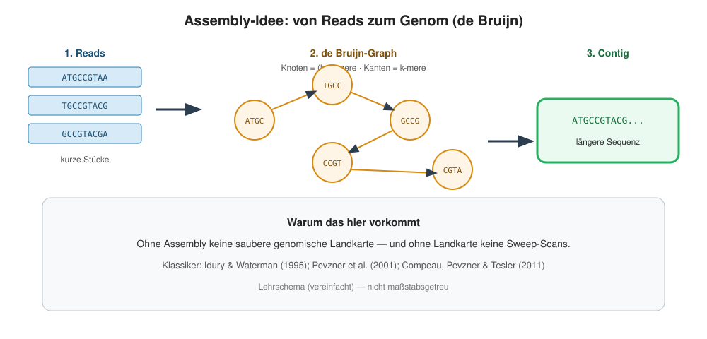{fig-alt="de Bruijn Graph Assembly Schema" width="92%"}

## Schlüsselreferenzen (Bioinformatik)

| | |
|---|---|
| Idury & Waterman (1995) | Fragment-Assembly über Graphen |
| Pevzner, Tang & Waterman (2001) | Eulerian-Pfad / de Bruijn für Sequencing |
| Compeau, Pevzner & Tesler (2011) | *How to apply de Bruijn graphs…* (*Nat. Biotechnol.*) |
| NGS / Genome projects | Datenflut → Algorithmen unvermeidbar |

Punkt: Biologie erzeugt hier ein **Rechenproblem** — nicht nur eine Laborfrage.

# Heute weiter: zwei Geschichten

## Der grosse Bogen heute

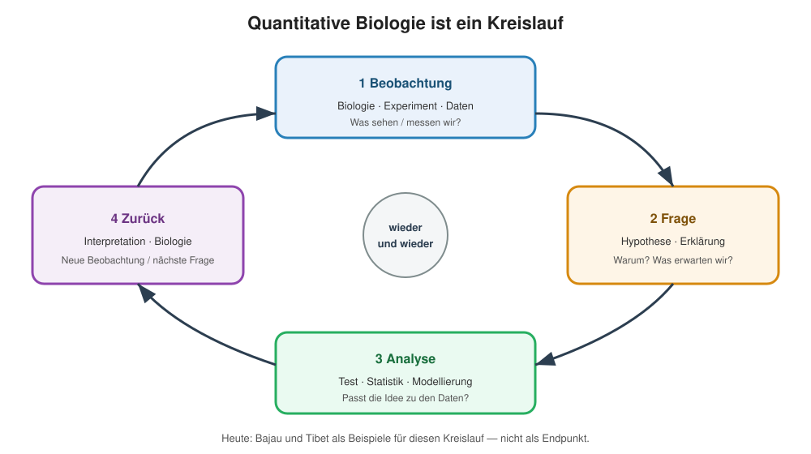{fig-alt="Kreislauf Beobachtung Frage Analyse Biologie" width="82%"}

**Beobachtung → Frage → Analyse / Modell → zurück zur Biologie**

## Sitzungsablauf (A–D)

| | |
|---|---|
| **A** Beobachtung | Andika / Bajau — Frage |
| **B** Bajau | Messung → Statistik → Genome → Sweep |
| **C** Tibet | EPAS1 / Denisova → rivalisierende Modelle |
| **D** Abschluss | Interpretation, Begriffe, Annahmen |

# A · Beobachtung

## Andika

::::: columns
::: {.column width="33%"}
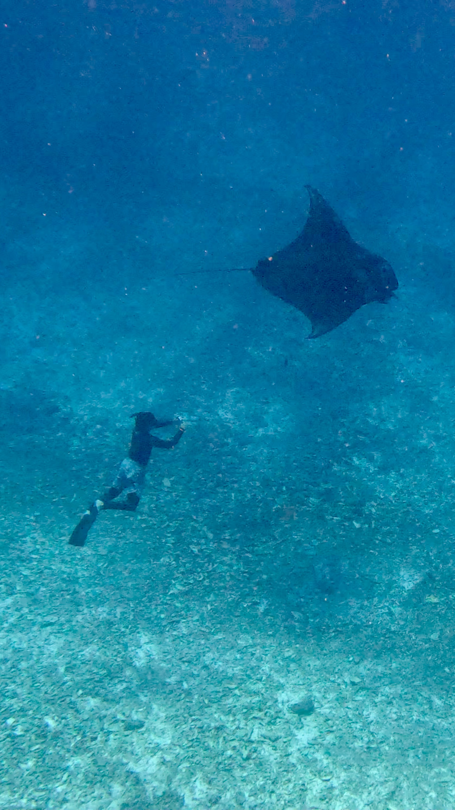{fig-alt="Andika beim Freitauchen" width="100%"}

Andika
:::

::: {.column width="33%"}
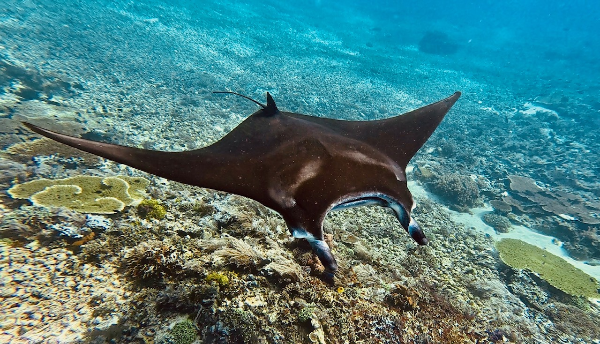{fig-alt="Manta" width="100%"}

Manta
:::

::: {.column width="34%"}
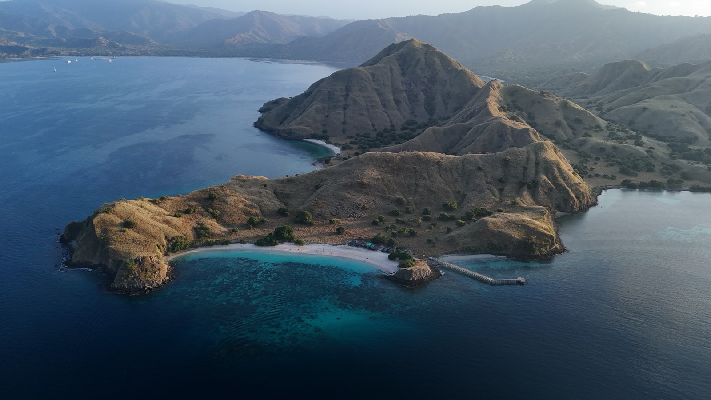{fig-alt="Komodo" width="100%"}

Komodo
:::
:::::

Sommer 2026: mit ihm schnorcheln — tiefer, länger, entspannter.  
Frage: stammst du aus Sulawesi?

::: aside
Private Kursfotos
:::

## Die Bajau («Seenomaden»)

-   Indigene Meeresvölker in SE-Asien
-   Extremes **Apnoetauchen** (Atem anhalten, ohne Pressluft)
-   Viele Stunden täglich im Wasser

## Wo leben die Bajau?

::::: columns
::: {.column width="55%"}
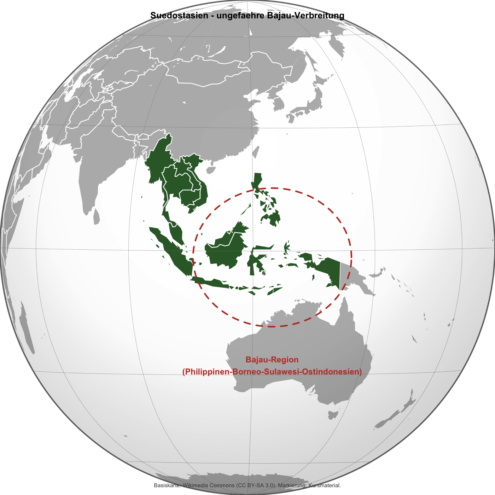{fig-alt="Karte Bajau-Region" width="100%"}
:::

::: {.column width="45%"}
-   Philippinen · Borneo · Sulawesi · Ostindonesien
-   Studienort u. a. **Wakatobi**
-   Lehrkarte — ungefähre Region
:::
:::::

::: aside
Commons CC BY-SA 3.0 + Kursmarkierung
:::

## Leben auf dem Wasser

::::: columns
::: {.column width="50%"}
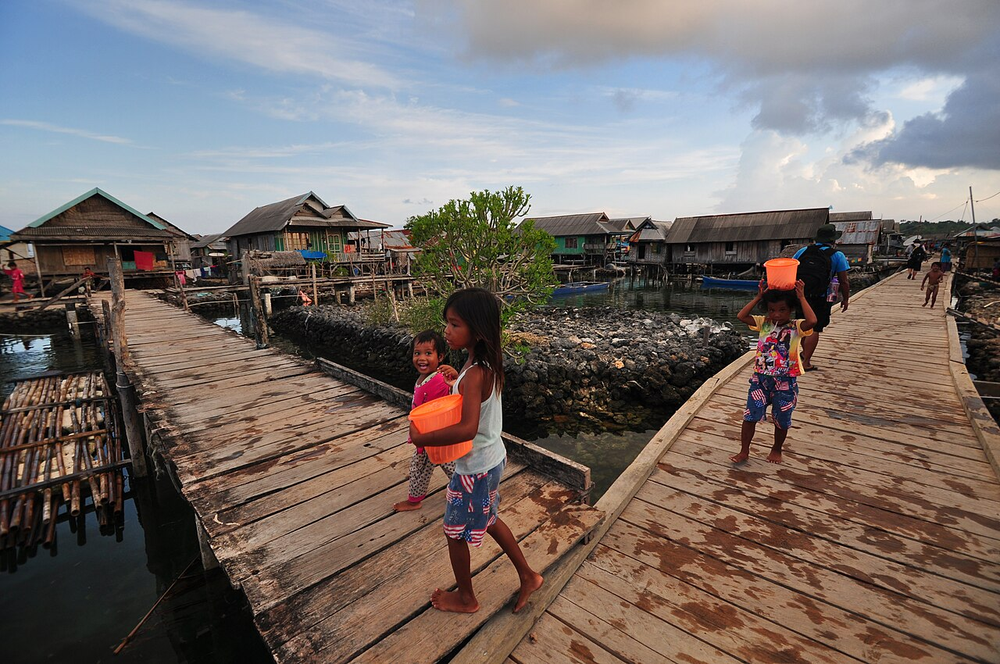{fig-alt="Sampela" width="100%"}

Sampela, Wakatobi
:::

::: {.column width="50%"}
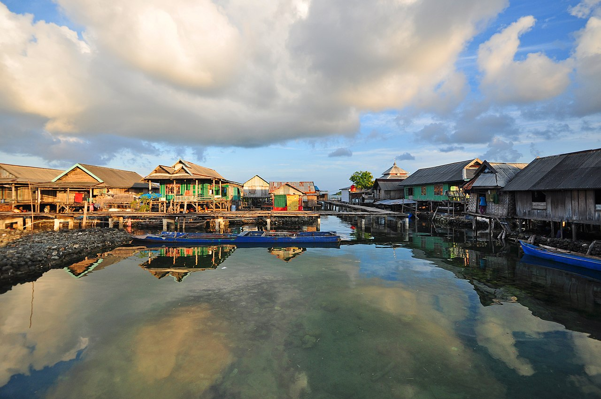{fig-alt="Pfahlbauten" width="100%"}

Pfahlbauten
:::
:::::

::: aside
BastianKyle, CC BY-SA 4.0
:::

## Boote und Mobilität

::::: columns
::: {.column width="50%"}
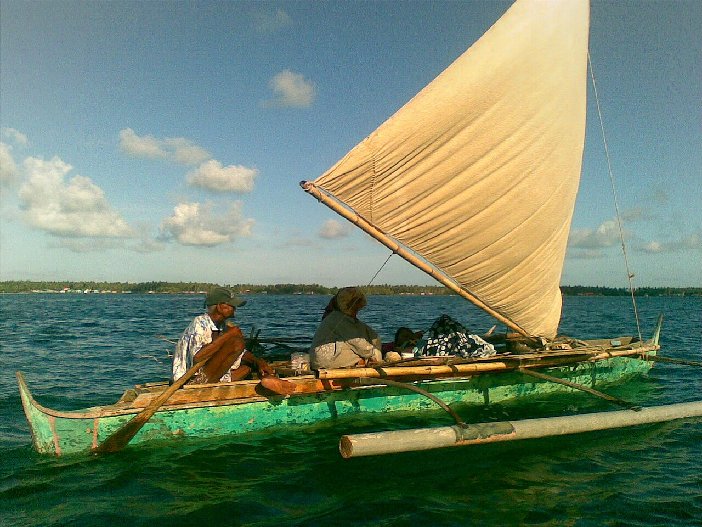{fig-alt="Vinta" width="100%"}

Vinta
:::

::: {.column width="50%"}
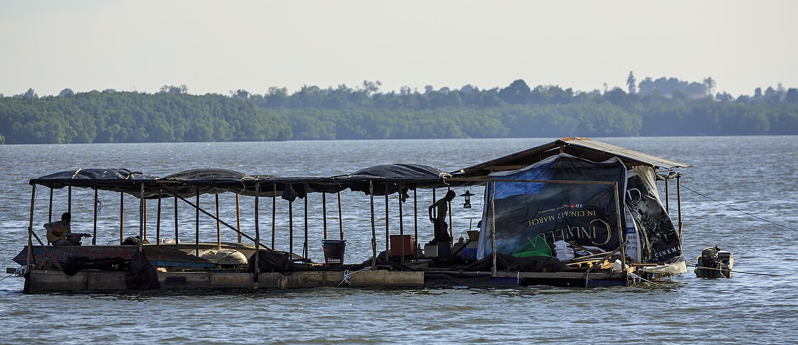{fig-alt="Hausboot" width="100%"}

Hausboot, Sabah
:::
:::::

::: aside
Venning CC BY 2.0 · Aranas CC BY-SA 3.0
:::

## Das biologische Rätsel

Nur **Training und Kultur**?

Oder auch **Physiologie** — evolutionär geprägt?

## Umfrage 1

::::: columns
::: {.column width="50%"}
### A · Nur Training / Kultur
:::

::: {.column width="50%"}
### B · Auch Physiologie
:::
:::::

::: notes
Noch keine Auflösung.
:::

# B · Bajau — eine Frage, mehrere Antwortenbenen

## Leitfrage (Bajau)

**Frage:** Ist extremes Apnoetauchen «nur» Training/Kultur — oder auch Physiologie (ggf. evolutionär)?

**Idee für Daten:** etwas Messbares finden, das mit O₂-Vorrat beim Tauchen zu tun hat — z. B. **Milzgrösse**.

Dann: Gruppen vergleichen → wenn Genetik plausibel wird: Genome → Signaturen.

## Anatomie: wo sitzt die Milz?

Idee dahinter: Beim Tauchen kann die **Milz** O₂-reiche Blutkörperchen freisetzen.  
Wenn das langfristig zählt, könnte sich die **Milzgrösse** zwischen Gruppen unterscheiden.

::::: columns
::: {.column width="45%"}
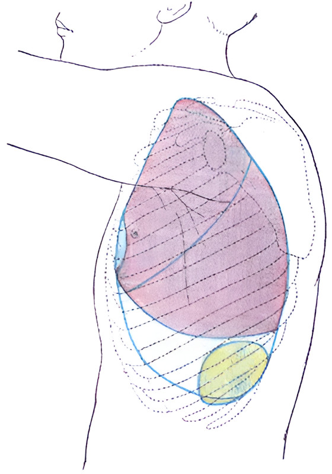{fig-alt="Lage der Milz im Körper" width="95%"}
:::

::: {.column width="55%"}
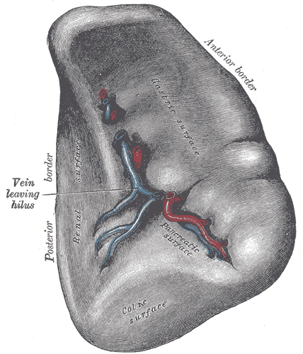{fig-alt="Klassische Anatomie der Milz (Gray)" width="90%"}
:::
:::::

::: aside
Lage: gemeinfrei · Gray-Tafel (*Gray's Anatomy*): gemeinfrei
:::

## Wie liefert die Milz O₂?

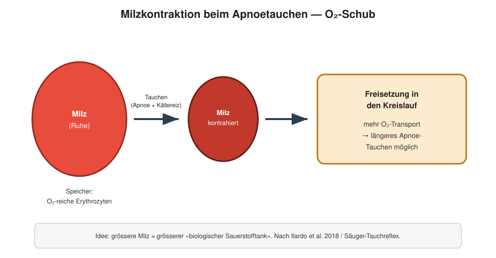{fig-alt="Milzkontraktion und O2-Freisetzung" width="92%"}

Beim Apnoe-Tauchen: Kontraktion → Erythrozyten in den Kreislauf → mehr O₂-Transport.

## Was die Daten zeigen

Zwei Vergleiche (Ilardo et al. 2018 *Cell*):

1.  **Nachbarpopulation:** Bajau vs. **Saluan** (nicht tauchend)  
    → Bajau ≈ **50 % grössere** Milz  
2.  **Innerhalb der Bajau:** tauchend vs. **nicht tauchend**  
    → auch nicht-tauchende Bajau haben grosse Milzen

Ultraschall + Populationsvergleich.

## Milzgrösse — die beiden Vergleiche

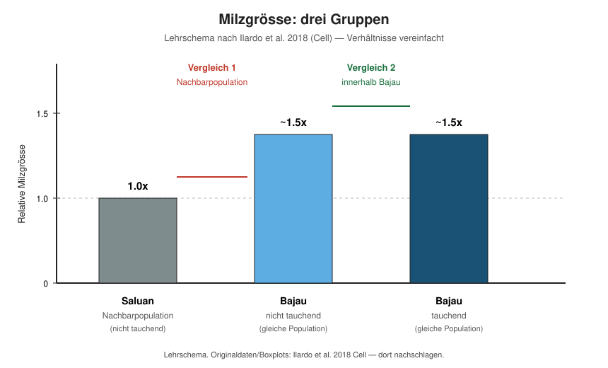{fig-alt="Milzgroesse Saluan vs Bajau tauchend und nicht tauchend" width="88%"}

::: aside
Lehrschema; Original-Boxplots in *Cell* (Elsevier)
:::

## Warum Vergleich 2 zählt

Wenn nur **Training** die Milz vergrösserte, erwartete man:

nicht-tauchende Bajau ≈ Saluan

Stattdessen: nicht-tauchende Bajau ≈ tauchende Bajau ≫ Saluan.

Training allein reicht als Erklärung nicht —  
Population / Physiologie / Genetik kommen ins Spiel.

## Umfrage 2

Physiologischer Unterschied → schon **evolutionäre Anpassung**?

::::: columns
::: {.column width="50%"}
### A · Ja
:::

::: {.column width="50%"}
### B · Nein — Kultur / **Plastizität** möglich
:::
:::::

## Schärfere Evidenz — kurz

| Vergleich | Befund (vereinfacht) |
|-----------|----------------------|
| Bajau vs. Saluan (Nachbar) | Bajau grössere Milz |
| Bajau tauchend vs. nicht tauchend | Unterschied bleibt klein; beide > Saluan |

→ Nachbarpopulation **und** Nicht-Taucher innerhalb der Bajau sind der Schlüssel.

## Statistik kommt natürlich dazu

**Frage:** Ist die Milz bei Bajau wirklich grösser als bei Saluan / Nicht-Tauchern?

**Daten:** Ultraschall-Messungen an Stichproben (Ilardo et al. 2018).

**Analyse:** Gruppenunterschiede unter Variation und Unsicherheit beurteilen  
(z. B. t-Test — Vertiefung in QuBi II).

> Frage → Messung → Vergleich → vorsichtige Interpretation

## Weiter: Gene?

Physiologie erklärt einen Teil.  
**Nächste Frage:** Warum ist sie anders — und wie sieht man das im Genom?

## Genome lesen braucht Algorithmen

**Daten:** Sequenz-Reads (Rohstücke).

**Problem:** daraus eine brauchbare genomische Landkarte machen (**Assembly**).

Ohne diesen Schritt keine sauberen Scans  
(de Bruijn-Idee: siehe Einstieg).

::: aside
Pevzner et al. 2001; Compeau et al. 2011
:::

## Selektion hinterlässt Spuren

**Frage:** Wo im Genom sieht man Hinweise auf Selektion (Anpassung)?

Idee eines **Selective Sweep**:

-   vorteilhaftes **Allel** wird häufig
-   Nachbarn «fahren mit» (**Hitchhiking**)
-   lokal weniger Vielfalt → **Valley of Diversity**

## Hitchhiking

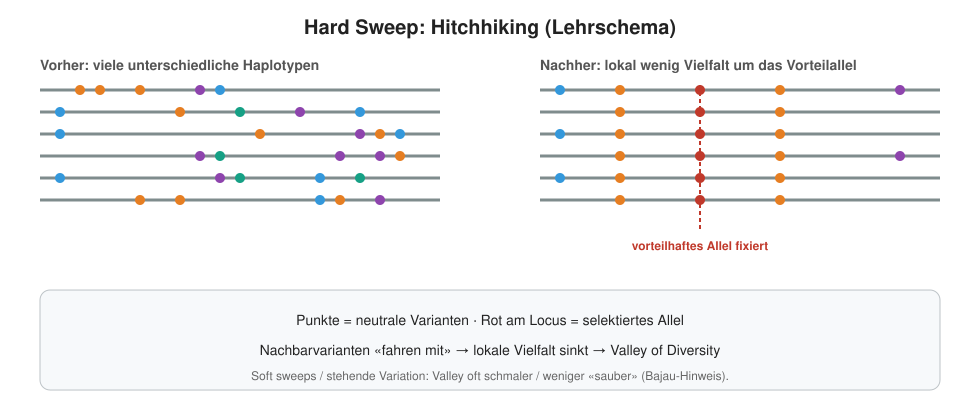{fig-alt="Hitchhiking" width="88%"}

## Valley of Diversity

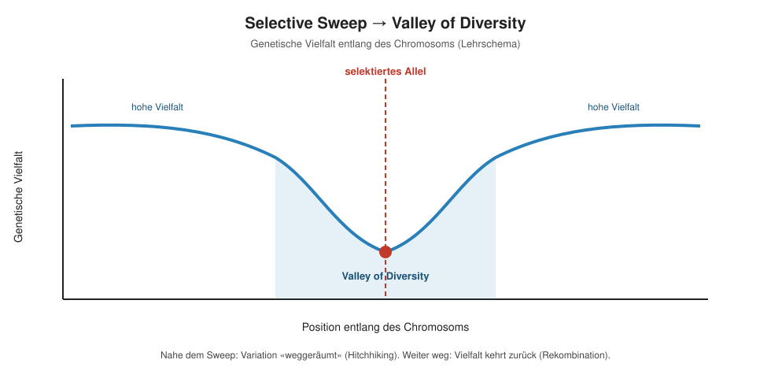{fig-alt="Valley of Diversity" width="85%"}

## Schlüsselreferenzen (Sweeps)

| | |
|---|---|
| Maynard Smith & Haigh (1974) | Hitchhiking / selective sweep |
| Kaplan, Hudson & Langley (1989) | Genetik des Sweeps |
| Nielsen et al.; Sabeti et al. | Scan-Methoden / menschliche Beispiele |
| Ilardo et al. (2018) | Bajau — Sweep-Signaturen im Genom |

Heute reicht: **Idee + Scan → Treffer**. Details später.

## Und jetzt der Scan

Idee: Genome vergleichen → wo sind die **Sweep-Signale** am stärksten?

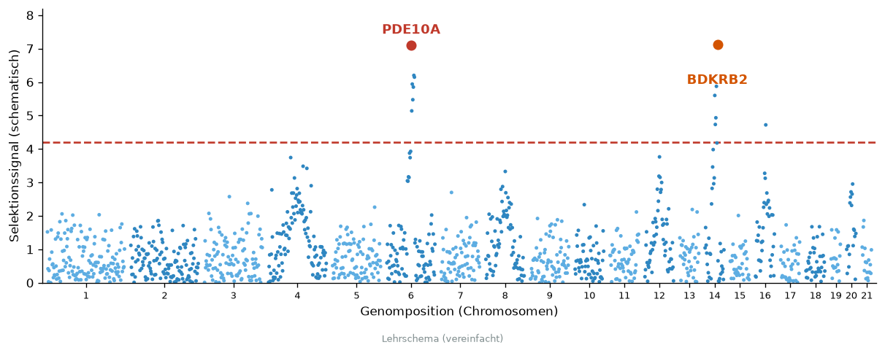{fig-alt="Lehrschema Genomscan Bajau mit PDE10A und BDKRB2" width="92%"}

## Bajau: was der Scan liefert

Bei den Bajau stechen u. a. Regionen um **PDE10A** und **BDKRB2** heraus  
(Ilardo et al. 2018 *Cell*) — Kandidaten im Zusammenhang mit der Physiologie.

Heute reicht: **Scan → Treffer**.  
Originalfiguren: im Paper (Elsevier; Campus-Zugang / DOI).

::: aside
DOI: [10.1016/j.cell.2018.03.054](https://doi.org/10.1016/j.cell.2018.03.054)
:::

## Bajau — Zwischenbilanz

{fig-alt="Drei Ebenen Statistik Bioinformatik Sweep" width="92%"}

Drei Ebenen derselben Geschichte — **ohne** Denisova.  
Je Stufe: Frage → Daten → Analyse.  
Gennamen (PDE10A, BDKRB2) sind **Illustration**; der Punkt ist die Argumentkette.

## Pause (~5 min)

Erste Hälfte: Frage → Daten → Bajau.

Zweite Hälfte: Tibet — dieselbe Logik, schärfere Frage.

# C · Tibet — dieselbe Logik, schärfere Frage

## Zweites Extrem

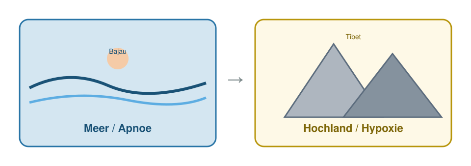{fig-alt="Meer vs Hochland" width="90%"}

Wieder: Anpassung — und welche Geschichte erzählt die DNA?  
Die Bajau-Kette reicht hier nicht; die **Frage** wird anspruchsvoller.

## Tibet

::::: columns
::: {.column width="50%"}
{fig-alt="Plateau" width="100%"}
:::

::: {.column width="50%"}
{fig-alt="Pilgerin" width="90%"}
:::
:::::

::: aside
CC BY-SA 4.0
:::

## Hypoxie — die biologische Herausforderung

-   Hochland: weniger O₂ verfügbar (**Hypoxie**)
-   Anpassung an Höhe ist ein klassisches Evolutionsbeispiel
-   Frage: welche Gene fallen im **Scan** auf?

## Tibet: der Scan hebt EPAS1 heraus

Dieselbe Logik wie bei den Bajau: genomweiter Vergleich → Ausreisser.

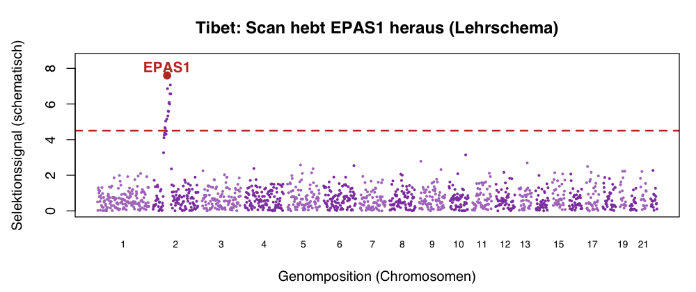{fig-alt="Lehrschema Genomscan Tibet EPAS1" width="90%"}

**EPAS1** (Hypoxie-Signalweg) ist der berühmteste Treffer.

## Original: EPAS1 als Ausreisser

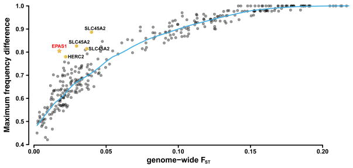{fig-alt="Huerta-Sanchez 2014 Figure 1: EPAS1 outlier" width="78%"}

::: aside
Huerta-Sánchez et al. 2014 *Nature* · Author manuscript via PMC4134395
:::

## Was die Figur sagt

-   x: durchschnittliche genetische Distanz zwischen Populationen ($F_{ST}$)  
-   y: stärkster Allelfrequenz-Unterschied irgendwo im Genom  
-   **EPAS1** (Stern): extrem differenziert — obwohl Han und Tibeter:innen  
    insgesamt relativ ähnlich sind

Kurz: der Scan / Vergleich **liefert EPAS1** als Ausnahme.

## EPAS1 sieht bei Tibeter:innen anders aus

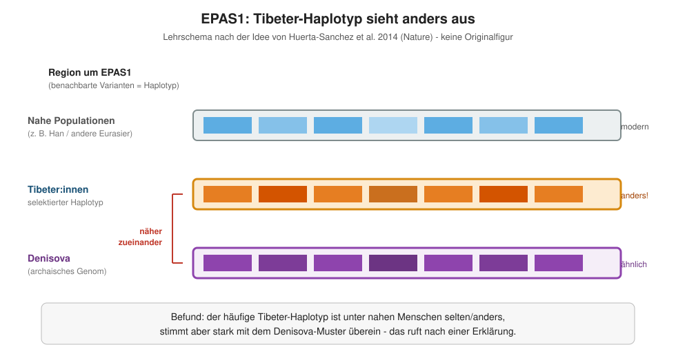{fig-alt="EPAS1 Haplotyp Tibet vs nahe Populationen vs Denisova" width="90%"}

## Original: Haplotyp-Muster

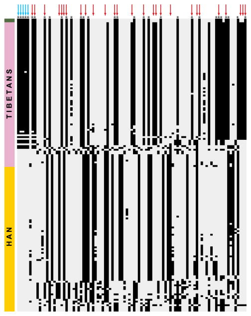{fig-alt="Huerta-Sanchez 2014 Figure 2 haplotypes" width="72%"}

::: aside
Huerta-Sánchez et al. 2014 · PMC author manuscript — Tibeter-Haplotyp vs Han
:::

## Was bedeutet das Muster?

-   Der selektierte Tibeter-**Haplotyp** ist unter **nahen** Populationen selten / anders  
-   Er gleicht stark dem Muster aus dem **Denisova**-Genom  
-   «Ähnlich» ist ein Befund — noch keine fertige Geschichte

## Original: Nähe zu Denisova

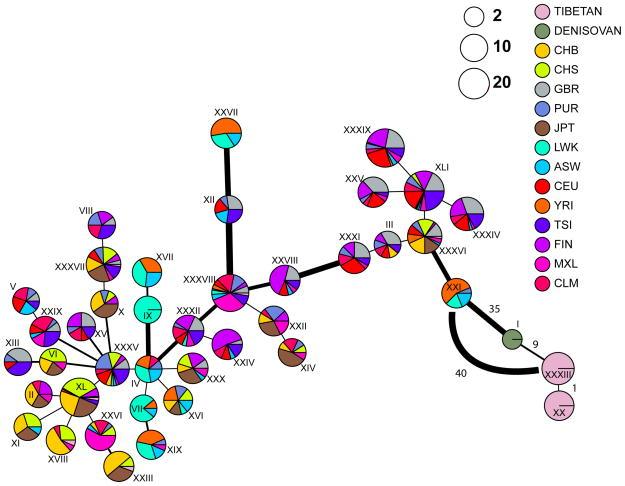{fig-alt="Huerta-Sanchez 2014 Figure 3 haplotype network" width="70%"}

::: aside
Huerta-Sánchez et al. 2014 Fig. 3 · Tibeter-Haplotyp nahe Denisova im Netzwerk
:::

## Wer waren die Denisova-Menschen?

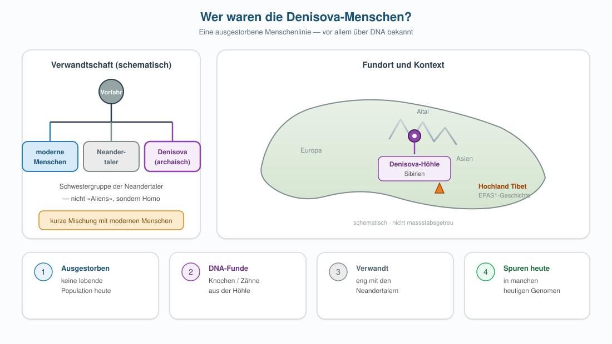{fig-alt="Denisova-Hoehle Altai schematisch" width="90%"}

## Die Denisova-Höhle

::::: columns
::: {.column width="55%"}
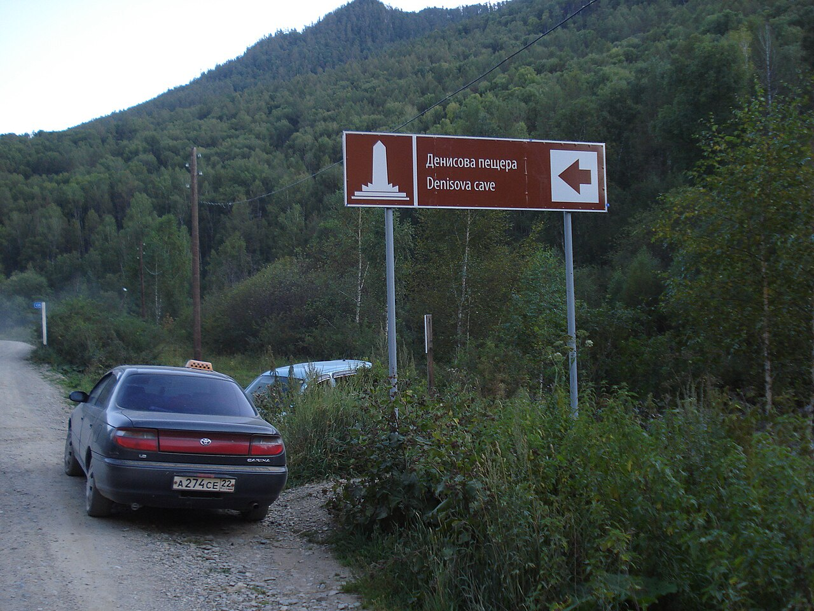{fig-alt="Denisova-Hoehle" width="100%"}
:::

::: {.column width="45%"}
-   Altai-Gebirge, Sibirien
-   Knochen / Zähne → DNA
-   Ausgestorbene Menschenlinie  
    (Verwandte der Neandertaler)
-   Heute: vor allem über **Genome** bekannt
:::
:::::

::: aside
Denisova cave 01 · CC BY-SA 3.0 (Wikimedia Commons)
:::

## Gab es Mischung?

Ja — archaische und moderne Menschen haben sich **vermischt**  
(**Admixture**): Nachkommen mit DNA aus beiden Linien.

Spuren davon finden sich in manchen heutigen Genomen  
(Denisova-Anteile besonders in Teilen Asiens / Ozeaniens — grob).

Für uns heute zählt: einzelne DNA-Stücke können **wandern**.

## Was ist Introgression?

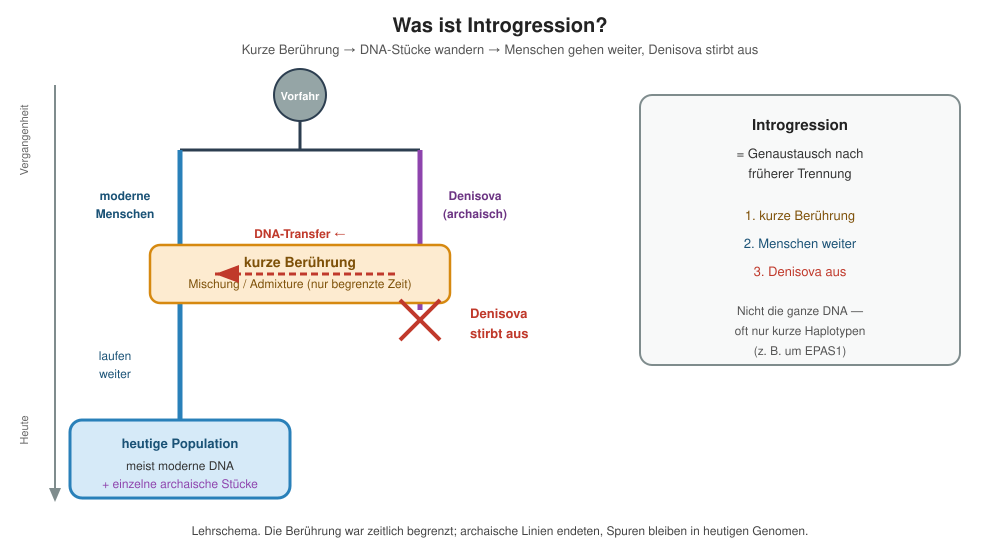{fig-alt="Introgression Schema" width="90%"}

## Introgression — in einem Satz

**Introgression** = nach früherer Trennung wird DNA  
durch Mischung in eine andere Linie übernommen  
— oft nur kurze Abschnitte (**Haplotypen**), nicht das ganze Genom.

Lehrfrage bei EPAS1: Kam der Tibeter-Haplotyp so von Denisova?

## Aber: «ähnlich» reicht nicht

Denselbe Befund («Denisova-ähnlich») kann **verschiedene** Geschichten haben.

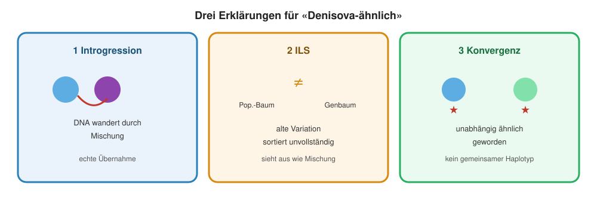{fig-alt="Drei Erklaerungen Introgression ILS Konvergenz" width="92%"}

## Alternative 1: ILS

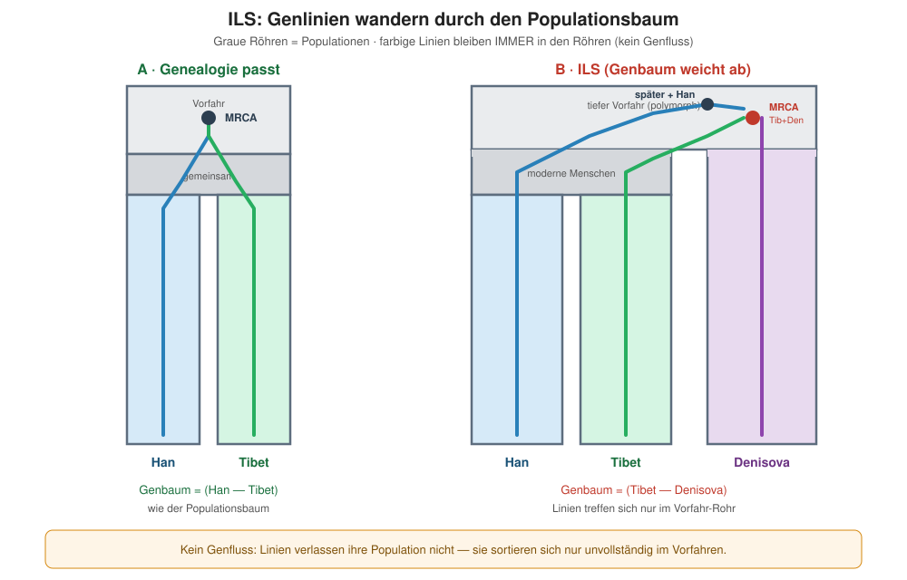{fig-alt="ILS: Genlinien wandern durch Populationsbaum" width="92%"}

## ILS — in einem Satz

**Incomplete lineage sorting:** DNA-Kopien «wandern» in den  
Populations-Röhren rückwärts in der Zeit und treffen sich  
manchmal **anders** als der Populationsbaum vorgibt —  
ohne dass Gene zwischen Populationen fließen.

Dann sieht ein Locus «archaisch / Denisova-ähnlich» aus,  
obwohl keine Introgression stattfand.

## Alternative 2: Konvergenz

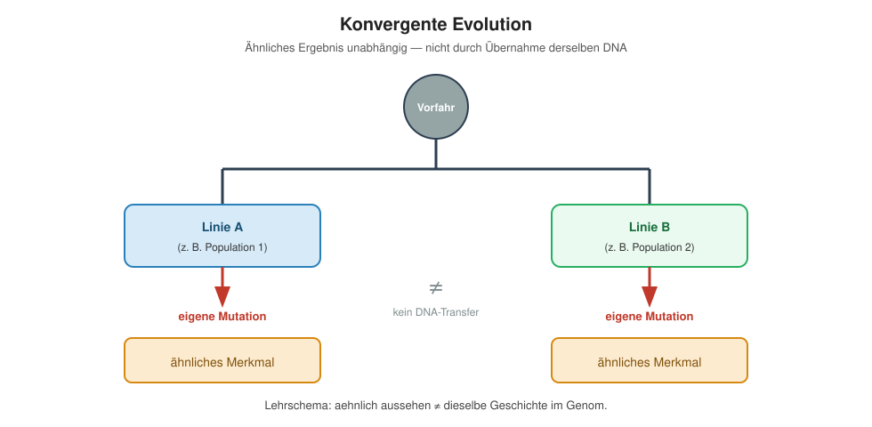{fig-alt="Konvergente Evolution Schema" width="90%"}

## Konvergenz — in einem Satz

**Konvergente Evolution:** ähnliche Merkmale (oder Muster)  
entstehen **unabhängig** — ohne dass dieselbe DNA übernommen wurde.

## Mehrere Geschichten möglich

| Geschichte | Idee |
|------------|------|
| **Introgression** | Denisova-DNA übernommen, dann Selektion |
| **ILS** | Alte Variation sieht nur *aus* wie Introgression |
| **Konvergenz** | Ähnlichkeit ohne direkte Weitergabe |

Ohne systematischen Vergleich bleibt «Denisova-ähnlich» eine **attraktive Erzählung**.

## Modellvergleich

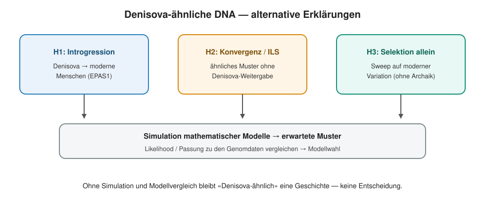{fig-alt="Modellvergleich" width="88%"}

## Was die schärfere Frage verlangt

| Idee | Rolle |
|------|--------|
| Simulation | Was erzeugt Geschichte X typischerweise? |
| Likelihood | Wie gut passen die Daten zu X? |
| Model selection | Welche Geschichte gewinnt den Vergleich? |

Bei Tibet reicht «Scan → Treffer» nicht: mehrere Erklärungen müssen **gegeneinander** getestet werden.

## Bajau und Tibet — nebeneinander

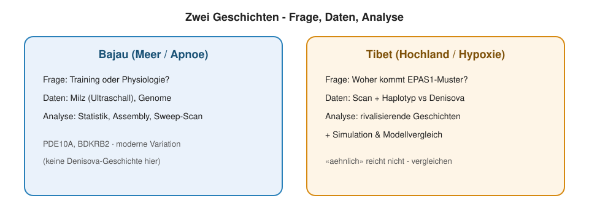{fig-alt="Bajau und Tibet Fragen und Analysen" width="88%"}

# D · Abschluss

## Drei Fragen für den Kurs

1.  Gene ↔ Anpassung? → Messung, Assoziation, Statistik  
2.  Archaischer Ursprung? → Referenzen, Introgressionsideen  
3.  Nur «ähnlich»? → rivalisierende Modelle vergleichen  

## Zusammenfassung

Heute war eine **Einführung** — keine Werkzeugkiste zum Abhaken.

Zwei Geschichten stehen für sich. Jeweils:

**Frage → Experiment / Daten → Analyse** — und dort tauchen Mathematik, Statistik, Programmierung und Algorithmen ganz natürlich auf.

**Daten sprechen nicht** — sie antworten auf unsere Fragen  
(Kontext, Annahmen, Gruppierung: siehe Simpson).

Können kommt über das Semester; heute reicht: **sehen und nachdenken**.

## Take-home

1. Das Beispiel zwingt zur Mathematik — Bajau und Tibet zuerst, dann Zahlen.
2. Dieselbe Frage auf mehreren Ebenen: Physiologie, Genetik, Geschichte.
3. Vier Begriffe festlegen: Population, Gen, Generation, Selektion.

## Beiläufige Begriffe

*Population · Gen · Generation · Selektion* klangen heute selbstverständlich.

Erst wenn wir verbale Modelle **konkret** machen, werden Ungenauigkeit und **versteckte Annahmen** sichtbar.

## Härtefragen

| Begriff | Härte |
|---------|--------|
| Population | Wer gehört dazu? |
| Gen | Welches Objekt? |
| Generation | Welche Uhr? |
| Selektion | Effekt wovon, auf wen? |

## Abschlussfrage

Einen Begriff wählen: Wie kam er vor? Wo unscharf? Was müsste ein Modell festlegen?

## Literatur 1/2

:::: {.lit}
**Fallstudien**

1. Ilardo, M., et al. (2018). Physiological and genetic adaptations to diving in sea nomads. *Cell* 173: 569–580. [doi:10.1016/j.cell.2018.03.054](https://doi.org/10.1016/j.cell.2018.03.054)
2. Ilardo, M. A., et al. (2021). An erythropoietin-independent mechanism of erythrocytic precursor proliferation underlies hypoxia tolerance in sea nomads. *Frontiers in Physiology* 12: 760851. [doi:10.3389/fphys.2021.760851](https://doi.org/10.3389/fphys.2021.760851)
3. Huerta-Sánchez, E., et al. (2014). Altitude adaptation in Tibetans caused by introgression of Denisovan-like DNA. *Nature* 512: 194–197. [doi:10.1038/nature13408](https://doi.org/10.1038/nature13408)

**Einstieg / Statistik / Modelle**

4. Darwin, C. (1876/1958). *The Autobiography of Charles Darwin* (Auszug zu Mathematik). Darwin Online / gemeinfrei.
5. Simpson, E. H. (1951). The interpretation of interaction in contingency tables. *Journal of the Royal Statistical Society B* 13: 238–241. *(Simpson-Paradoxon)*
6. Lotka, A. J. (1925). *Elements of Physical Biology*. Williams & Wilkins.
7. Volterra, V. (1926). Variazioni e fluttuazioni del numero d’individui in specie animali conviventi. *Mem. Accad. Lincei*.
8. Gause, G. F. (1934). *The Struggle for Existence*. Williams & Wilkins.
9. Fisher, R. A. (1930). *The Genetical Theory of Natural Selection*. Clarendon Press.
10. Wright, S. (1931). Evolution in Mendelian populations. *Genetics* 16: 97–159.
::::

## Literatur 2/2

:::: {.lit}
**Sweeps / Assembly**

11. Maynard Smith, J., & Haigh, J. (1974). The hitch-hiking effect of a favourable gene. *Genetical Research* 23: 23–35.
12. Kaplan, N. L., Hudson, R. R., & Langley, C. H. (1989). The «hitchhiking effect» revisited. *Genetics* 123: 887–899.
13. Sabeti, P. C., et al. (2002). Detecting recent positive selection in the human genome from haplotype structure. *Nature* 419: 832–837.
14. Nielsen, R., et al. (2005). Genomic scans for selective sweeps using SNP data. *Genome Research* 15: 1566–1575.
15. Idury, R. M., & Waterman, M. S. (1995). A new algorithm for DNA sequence assembly. *Journal of Computational Biology* 2: 291–306.
16. Pevzner, P. A., Tang, H., & Waterman, M. S. (2001). An Eulerian path approach to DNA fragment assembly. *PNAS* 98: 9748–9753.
17. Compeau, P. E. C., Pevzner, P. A., & Tesler, G. (2011). How to apply de Bruijn graphs to genome assembly. *Nature Biotechnology* 29: 987–991.

Abbildungsnachweise: `pics/README.md` und Bildunterschriften.
::::

## Glossar

Ausführlich: **[Kursglossar](../../docs/glossary.html)**

| | |
|---|---|
| Allel, Haplotyp, Sweep, Valley | Genom-Spuren |
| de Bruijn, Assembly | Bioinformatik |
| Lotka–Volterra, Fisher, Wright | Modelle / Evolution |
| Introgression, ILS, Konvergenz | rivalisierende Geschichten |
| Likelihood, Model selection | Modellvergleich |
| Plastizität, Hypoxie, Apnoe | Physiologie / Kontext |

## Navigation

| | |
|---|---|
| Glossar | [Kursglossar](../../docs/glossary.html) |
| Kursplan | [Kursplan](../../docs/course-outline.html) |
| Weiter | [Woche 2 →](../week-02/slides.html) |

← → · **M** · **Esc** · **F**
