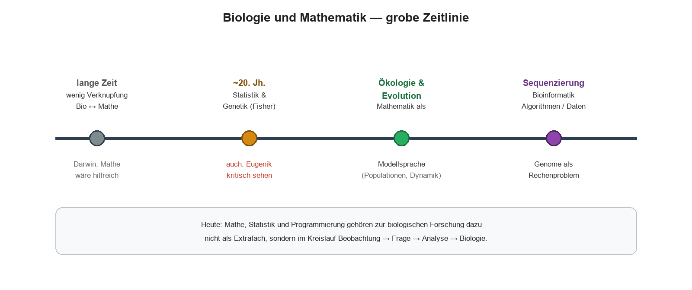
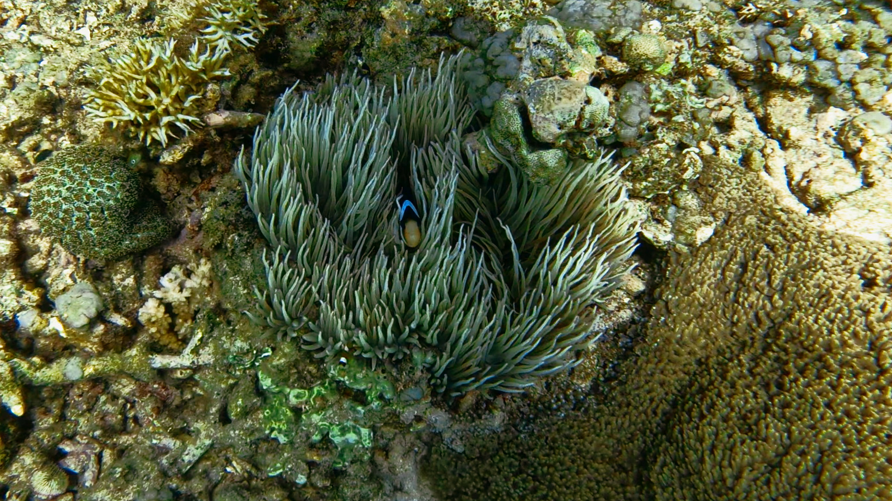
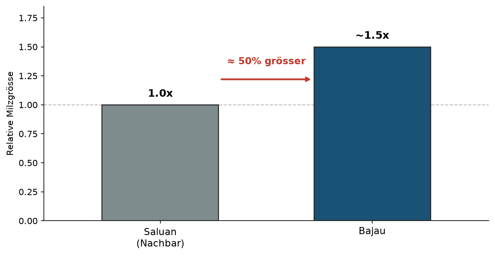
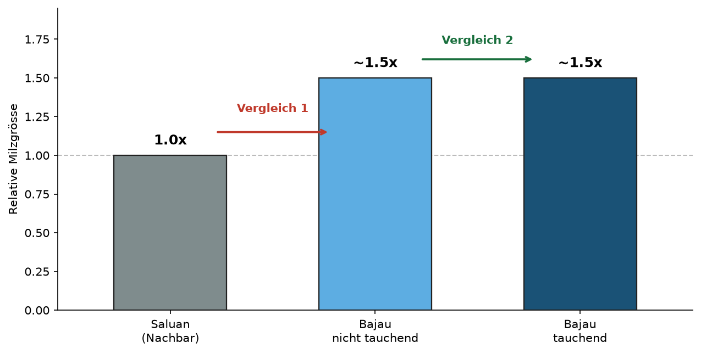
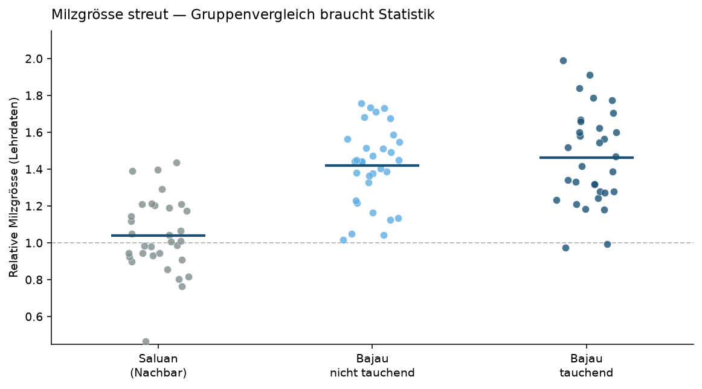
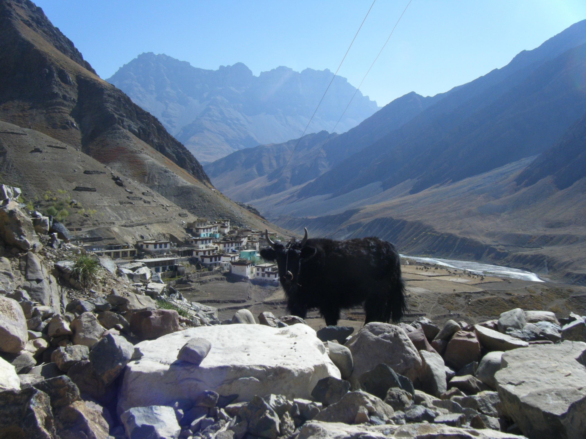
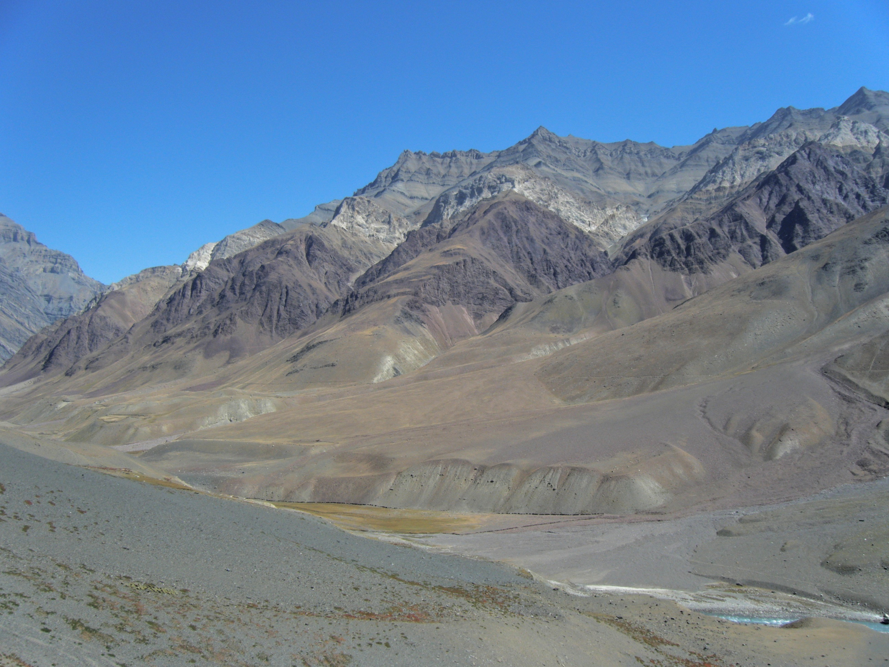
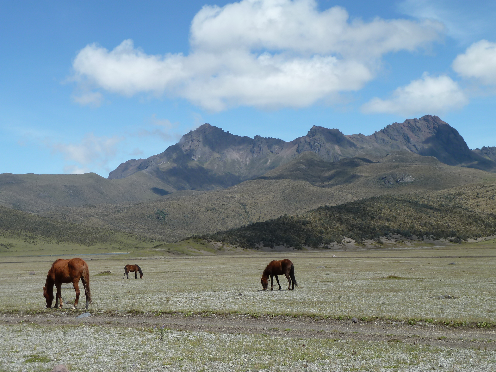
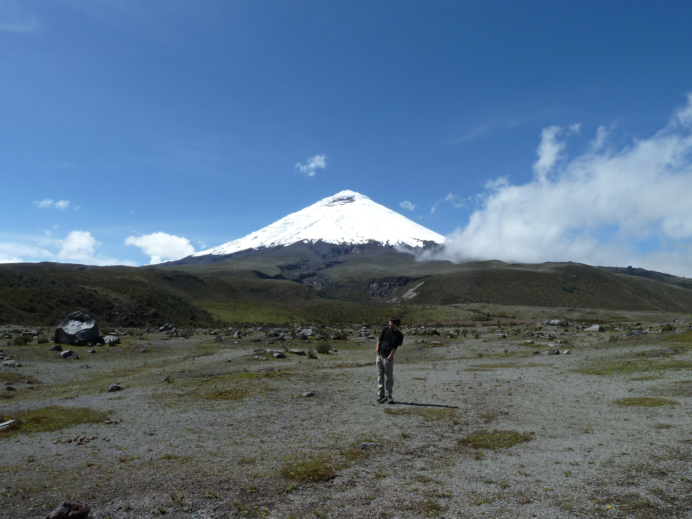

## Übersicht

**Woche 1** von 14 · **Do., 17. Sept. 2026, 08:15–10:00**

| Teil | Dauer | Was |
|------|-------|-----|
| 1. Hälfte | ~45 min | Warum quantitative Biologie? · Beispiel 1: Bajau |
| Pause | ~5 min | |
| 2. Hälfte | ~45 min | Beispiel 2: Tibet · Abschluss |

::: aside
Pfeiltasten · **M** Menü · **E** PDF · **Esc** Übersicht
:::

## Kurs & heute

::::: columns
::: {.column width="22%"}
{fig-alt="Biologie" width="70%"}
:::
::: {.column width="22%"}
{fig-alt="Mathematik" width="70%"}
:::
::: {.column width="22%"}
{fig-alt="Statistik" width="70%"}
:::
::: {.column width="22%"}
{fig-alt="Code" width="70%"}
:::
:::::

-   **QuBi I** parallel zum **R-Kurs** (Anja Mühlemann): dort *wie* man code schreibt — hier *welche Fragen* Biologie stellt
-   Do **08:15–10:00** · Kurzvorträge Wochen **4, 8, 11, 14** · [KI-Richtlinie](../../docs/ai-policy.html)
-   Heute: eine biologische **Frage** → sinnvolle **Daten** → wo quantitative Methoden auftauchen

## Umfrage

{fig-alt="QR-Code zum Fragebogen" width="55%"}

# Einstieg · Warum quantitative Biologie?

## Bio und Mathe

{fig-alt="Biologie und Mathematik lange getrennt" width="92%"}

Historisch lange getrennt — spannende Naturforschung brauchte beides.

## Darwin

Charles Darwin, *Autobiography* (1876):

> … I have deeply regretted that I did not proceed far enough at least to understand something of the great leading principles of mathematics, for men thus endowed seem to have an extra sense.

> … ich habe zutiefst bedauert, dass ich nicht wenigstens so weit gekommen bin, etwas von den grossen Leitprinzipien der Mathematik zu verstehen — denn Menschen, die damit ausgestattet sind, scheinen einen **zusätzlichen Sinn** zu haben.

Punkt: Mathematik als **Hilfe für die Biologie** — nicht als Fremdkörper.

::: aside
Darwin Online / *Life and Letters*; gemeinfrei
:::

## Zeitlinie (Überblick)

{fig-alt="Zeitlinie quantitative Biologie" width="92%"}

Drei Stränge: **Statistik** · **Ökologie / Evolution** · **Bioinformatik**

# Beispiel · Statistik

## Frage → Daten → Analyse

**Frage:** Hängt Merkmal $Y$ mit Messgrösse $X$ zusammen?  
**Daten:** Paare $(X_i, Y_i)$.  
**Analyse:** Regression / Trend — und Vorsicht bei Struktur (Simpson).

## Regression

{fig-alt="Galton Regression Eltern- und Kindeshöhe" width="72%"}

**Galton:** mittlere Elternhöhe vs. Körperhöhe der Kinder.  
Sehr grosse Eltern → Kinder im Schnitt etwas kleiner als sie selbst; sehr kleine → etwas grösser.  
Die Gerade ist flacher als $1\!:\!1$: Extreme rücken zum Populationsmittel.

## Kritischer Einschub: Eugenik

**Francis Galton** (Darwin-Cousin) entwickelte u. a. **Regression** und Korrelation — ursprünglich, um **Vererbung** quantitativ zu verstehen (genau solche Eltern–Kind-Vergleiche).

Aus derselben Tradition entstand die **Eugenik**: der Versuch, menschliche Fortpflanzung über «Erbanlagen» zu steuern. Das war keine Randnotiz — in vielen Ländern Programme mit Zwangssterilisation und Rassismus (u. a. **R. A. Fisher** war in dieser Bewegung aktiv).

-   Eine Formel sagt nicht, *wozu* man sie einsetzt: dieselbe Statistik kann Vererbung beschreiben — oder politische Selektion rechtfertigen  
-   Deshalb: Messbarkeit allein reicht nicht; Absicht, Anwendung und Folgen müssen mitbedacht werden

## Daten sprechen nicht

{fig-alt="Satirischer Tweet Race Realist" width="55%"}

{fig-alt="Daten sprechen nicht sie antworten" width="85%"}

Was messen wir? An wem? Welche Annahmen? Welcher **Kontext** fehlt?  
Ohne das ist «die Daten sagen …» Theater — keine Wissenschaft.

## Simpson-Paradoxon

Manchmal dreht sich ein Trend um, sobald man nach **Gruppe / Population** trennt.

{fig-alt="Simpson-Paradoxon: Trend insgesamt vs nach Population" width="92%"}

Links: «Schnabel länger → tiefer». Rechts: **innerhalb** jeder Population eher das Gegenteil — dieselben Punkte, andere **Frage**.

# Beispiel · Ökologie & Evolution

## Mathematik als Sprache für Dynamik

**Frage:** Wie ändern sich Populationen über die Zeit (Wachstum, Interaktion, Selektion)?  
**Daten / Idee:** Zählungen, Experimente — oder ein Modell der Regeln.  
**Analyse:** Differenzen-/Differenzialgleichungen, Simulation.

Ab **Woche 2** bauen wir genau diesen Strang weiter aus.

## Räuber–Beute: Lotka–Volterra

{fig-alt="Lotka-Volterra Zeitreihe und Phasenzyklus" width="92%"}

Klassische Idee: Beute und Räuber oszillieren — im Phasenraum ein **Zyklus**.

## Schlüsselreferenzen (Ökologie / Evolution)

| | |
|---|---|
| Lotka (1925), Volterra (1926) | Räuber–Beute / populationsdynamische Modelle |
| Gause (1934) | Experimente mit *Paramecium* / Konkurrenz |
| Fisher (1930) | *The Genetical Theory of Natural Selection* |
| Wright (1931 u.a.) | Populationsstruktur, Drift |

Heute: nur **sehen**, dass solche Modelle existieren. Ab Woche 2: selber bauen.

# Beispiel · Bioinformatik

## Sequenzdaten → Algorithmen

**Frage:** Wie rekonstruiert man Genome aus Millionen kurzer Reads?  
**Daten:** DNA/RNA-Sequenzfragmente (NGS).  
**Analyse:** Graphen, Pfade, Vergleiche — **Bioinformatik**.

Ohne Informatik und Statistik keine moderne Genomik —  
Bajau- und Tibet-Geschichten brauchen genau das.

## Assembly: de Bruijn-Idee

{fig-alt="de Bruijn Graph Assembly Schema" width="92%"}

## Schlüsselreferenzen (Bioinformatik)

| | |
|---|---|
| Idury & Waterman (1995) | Fragment-Assembly über Graphen |
| Pevzner, Tang & Waterman (2001) | Eulerian-Pfad / de Bruijn für Sequencing |
| Compeau, Pevzner & Tesler (2011) | *How to apply de Bruijn graphs…* (*Nat. Biotechnol.*) |
| NGS / Genome projects | Datenflut → Algorithmen unvermeidbar |

Punkt: Biologie erzeugt hier ein **Rechenproblem** — nicht nur eine Laborfrage.

# A · Beobachtung

## Warum taucht Andika besser als ich?

::: {.photo-grid}
::: {.photo-tile .photo-portrait}
{fig-alt="Andika beim Freitauchen"}

Andika
:::

::: {.photo-stack}
::: {.photo-tile .photo-landscape}
{fig-alt="Manta"}

Manta
:::

::: {.photo-tile .photo-landscape}
{fig-alt="Komodo"}

Komodo
:::
:::

::: {.photo-tile .photo-portrait-crop}
{fig-alt="Clownfish in Anemone"}

Clownfish
:::
:::

::: aside
Fotos: Stephan Peischl, Andika Ramadhan ([Instagram](https://www.instagram.com/andikaramadhan__/))  
[Marion Talbi](https://www.aqua.iee.unibe.ch/about_us/team/marion_talbi/talbi_marion/index_eng.html) (Uni Bern) forscht an percomorph fishes
:::

## Die Bajau («Seenomaden»)

-   Indigene Meeresvölker in SE-Asien
-   Extremes **Apnoetauchen** (Atem anhalten, ohne Pressluft)
-   Viele Stunden täglich im Wasser

## Wo leben die Bajau?

::::: columns
::: {.column width="55%"}
{fig-alt="Karte Bajau-Region" width="100%"}
:::

::: {.column width="45%"}
-   Philippinen · Borneo · Sulawesi · Ostindonesien
-   Studienort u.a. **Wakatobi** (Sulawesi)
:::
:::::

::: aside
Commons CC BY-SA 3.0 + Kursmarkierung
:::

## Leben auf dem Wasser

::: {.photo-grid-2x2}
::: {.photo-tile}
{fig-alt="Sampela"}

Sampela
:::
::: {.photo-tile}
{fig-alt="Pfahlbauten"}

Pfahlbauten
:::
::: {.photo-tile}
{fig-alt="Vinta"}

Vinta
:::
::: {.photo-tile}
{fig-alt="Hausboot"}

Hausboot
:::
:::

::: aside
BastianKyle CC BY-SA 4.0 · Venning CC BY 2.0 · Aranas CC BY-SA 3.0
:::

## Das biologische Rätsel

Nur **Training und Kultur** — oder auch **Physiologie** (ggf. evolutionär)?

::::: columns
::: {.column width="50%"}
### A · Nur Training / Kultur
:::

::: {.column width="50%"}
### B · Auch Physiologie
:::
:::::

::: notes
Umfrage 1 — noch keine Auflösung.
:::

# B · Bajau — von der Milz zum Genom

## Anatomie: wo sitzt die Milz?

Idee: Beim Tauchen kann die **Milz** O₂-reiche Blutkörperchen freisetzen.  
Dann könnte sich die **Milzgrösse** zwischen Gruppen unterscheiden.

::::: columns
::: {.column width="48%"}
{fig-alt="Lage der Milz im Körper" width="95%"}
:::
::: {.column width="48%"}
{fig-alt="Klassische Anatomie der Milz (Gray)" width="90%"}
:::
:::::

::: aside
Lage / Gray: gemeinfrei
:::

## Wie liefert die Milz O₂?

{fig-alt="Milzkontraktion und O2-Freisetzung" width="92%"}

Beim Apnoe-Tauchen: Kontraktion → Erythrozyten in den Kreislauf → mehr O₂-Transport.

## Was die Daten zeigen

Erster Vergleich (Ilardo et al. 2018 *Cell*): **Bajau** vs. **Saluan**.

{fig-alt="Milzgroesse Bajau vs Saluan" width="70%"}

Bajau ≈ **50 %** grössere Milz.

## Drei Gruppen

Bajau nach **tauchend** / **nicht tauchend** trennen:

{fig-alt="Milzgroesse Saluan vs Bajau tauchend und nicht tauchend" width="72%"}

## Training allein reicht nicht

Wäre nur **Training** verantwortlich → nicht-tauchende Bajau ≈ Saluan.

Stattdessen: nicht-tauchende ≈ tauchende Bajau ≫ Saluan.

→ Population / Physiologie / Genetik kommen ins Spiel.

## Umfrage 2

Physiologischer Unterschied → schon **evolutionäre Anpassung**?

::::: columns
::: {.column width="50%"}
### A · Ja
:::

::: {.column width="50%"}
### B · Nein — Kultur / **Plastizität** möglich
:::
:::::

## Gruppen vergleichen: Statistik

Die Messwerte **streuen**. Ob Bajau wirklich grössere Milzen haben, sieht man nicht «auf einen Blick» — man braucht statistische Methoden, um Gruppen unter Variation zu vergleichen (z. B. t-Test; Vertiefung in QuBi II).

{fig-alt="Streudiagramm Milzgroesse drei Gruppen" width="88%"}

## Vom Genom zum Scan

Physiologie erklärt einen Teil. **Nächste Frage:** Gibt es Spuren im Genom?

Zuerst: Genome aus vielen kurzen **Reads** zusammensetzen (**Assembly** / Bioinformatik, z. B. de Bruijn-Graphen).  
Erst mit einer brauchbaren genomischen Landkarte kann man sinnvoll scannen.

## Selective Sweep

Ein vorteilhaftes **Allel** steigt in der Population. Weil DNA-Stücke gekoppelt vererbt werden, «fahren» benachbarte Varianten mit (**Hitchhiking**).

Effekt im Genom: lokal weniger Variation → ein **Valley of Diversity** um das selektierte Allel.

::::: columns
::: {.column width="50%"}
{fig-alt="Hitchhiking" width="100%"}

Hitchhiking
:::
::: {.column width="50%"}
{fig-alt="Valley of Diversity" width="100%"}

Valley of Diversity
:::
:::::

::: aside
Vertiefung: Populationsgenetik-Vorlesungen von Prof. Claudia Bank und Mado Kapopoulou
:::

## Ein Genom-Scan

Sobald das Genom zusammengesetzt ist, fragen wir:

Gibt es **Regionen mit weniger Diversität** als der Rest des Genoms?

Solche «Täler» sind Kandidaten für Selektion — das ist die Idee eines **Genom-Scans** nach Sweeps.

## Bajau: Scan-Treffer

{fig-alt="Lehrschema Genomscan Bajau mit PDE10A und BDKRB2" width="88%"}

Ausreisser u. a. **PDE10A** und **BDKRB2** (Ilardo et al. 2018 *Cell*).

## Bajau — Zwischenbilanz

**Was die beiden Gene erklären können:**

::::: {.columns .compact-cols}
::: {.column width="48%"}
**PDE10A**  
Schilddrüsenhormon-Haushalt → **Milzgrösse** → mehr O₂-Reserve.
:::
::: {.column width="48%"}
**BDKRB2**  
**Tauchreaktion** / Vasokonstriktion → O₂ eher zu Gehirn und Herz.
:::
:::::

## Fazit Bajau

Grössere Milz auch bei **nicht-tauchenden** Bajau → nicht nur Training.

Messung und Scan zeigen dieselbe Richtung (O₂-Bewirtschaftung).  
Das sind **Kandidaten** — noch keine fertige Beweiskette.

## Pause (~5 min)

# C · Höhenanpassung in Tibet

## Zweites Extrem

{fig-alt="Meer vs Hochland" width="90%"}

## High Altitude Adaptation

::: {.photo-grid}
::: {.photo-tile .photo-portrait-crop}
{fig-alt="Yak und Siedlung im Hochland"}

Yak, gut angepasst
:::

::: {.photo-stack}
::: {.photo-tile .photo-landscape}
{fig-alt="Spiti Valley"}

Spiti Valley
:::

::: {.photo-tile .photo-landscape}
{fig-alt="Pferde vor Hochgebirge"}

Pferde, auch gut angepasst
:::
:::

::: {.photo-tile .photo-portrait-crop}
{fig-alt="Cotopaxi"}

Ich, nicht angepasst
:::
:::

::: aside
Fotos: Stephan Peischl (privat)
:::

## Hypoxie

In grosser Höhe ist der **Luftdruck** niedriger — damit sinkt der Partialdruck von O₂.

Folge für den Körper:

-   weniger O₂ pro Atemzug im Blut verfügbar
-   typische akute Reaktionen: schnellerer Puls, schnellere Atmung, Leistungsabfall  
    (Höhenkrankheit möglich)
-   langfristig: Anpassung der Physiologie / Genetik in Hochlandpopulationen

Frage: welche Gene fallen im **Genom-Scan** auf?

## Tibet: EPAS1

Dieselbe Logik wie bei den Bajau: genomweiter Vergleich → Ausreisser.

{fig-alt="Lehrschema Genomscan Tibet EPAS1" width="88%"}

**EPAS1** (Hypoxie-Signalweg) ist der berühmteste Treffer.

## Original: EPAS1 als Ausreisser

{fig-alt="Huerta-Sanchez 2014 Figure 1: EPAS1 outlier" width="75%"}

$x$: mittlere Distanz ($F_{ST}$); $y$: stärkster Allelfrequenz-Unterschied.  
**EPAS1** (Stern): extrem differenziert — obwohl Han und Tibeter:innen insgesamt ähnlich sind.

::: aside
Huerta-Sánchez et al. 2014 *Nature* · PMC4134395
:::

## EPAS1-Haplotyp (Schema)

{fig-alt="EPAS1 Haplotyp Tibet vs nahe Populationen vs Denisova" width="90%"}

Der selektierte Tibeter-**Haplotyp** gleicht stark dem **Denisova**-Muster — «ähnlich» ist ein Befund, noch keine fertige Geschichte.

## Original: Haplotyp-Muster

{fig-alt="Huerta-Sanchez 2014 Figure 2 haplotypes" width="72%"}

::: aside
Huerta-Sánchez et al. 2014 · PMC
:::

## Nähe zu Denisova

{fig-alt="Huerta-Sanchez 2014 Figure 3 haplotype network" width="68%"}

::: aside
Huerta-Sánchez et al. 2014 Fig. 3
:::

## Denisova-Menschen

::::: columns
::: {.column width="55%"}
{fig-alt="Denisova-Hoehle" width="100%"}
:::

::: {.column width="45%"}
-   Altai-Gebirge, Sibirien
-   Ausgestorbene Menschenlinie (Verwandte der Neandertaler)
-   Heute vor allem über **Genome** bekannt
:::
:::::

::: aside
Denisova cave 01 · CC BY-SA 3.0
:::

## Admixture und Introgression

Archaische und moderne Menschen haben sich **vermischt** (**Admixture**).

{fig-alt="Introgression Schema" width="88%"}

**Introgression** = nach früherer Trennung wird DNA durch kurze Berührung übernommen — oft kurze **Haplotypen**.  
Lehrfrage: Kam der Tibeter-EPAS1-Haplotyp so von Denisova?

## Aber: «ähnlich» reicht nicht

Denselbe Befund kann **verschiedene** Geschichten haben.

{fig-alt="Drei Erklaerungen Introgression ILS Konvergenz" width="90%"}

## Drei rivalisierende Geschichten

::::: columns
::: {.column width="33%"}
{fig-alt="Introgression" width="100%"}

**Introgression** — DNA übernommen, dann Selektion
:::
::: {.column width="33%"}
{fig-alt="ILS" width="100%"}

**ILS** — Genbaum ≠ Populationsbaum, ohne Genfluss
:::
::: {.column width="33%"}
{fig-alt="Konvergenz" width="100%"}

**Konvergenz** — unabhängig entstanden
:::
:::::

Ohne systematischen Vergleich bleibt «Denisova-ähnlich» nur eine attraktive Erzählung.

## Modelle zum Vergleich

Wir errichten **explizite Modelle**, die vorhersagen, was jede Geschichte in den Daten erzeugen würde — und vergleichen sie:

| Werkzeug | Rolle |
|----------|--------|
| **Simulation** | Was erzeugt Geschichte X typischerweise? |
| **Likelihood** | Wie gut passen die Daten zu X? |
| **Model selection** | Welche Geschichte gewinnt den Vergleich? |

{fig-alt="Modellvergleich" width="78%"}

So lässt sich sagen, welche Erklärung **am wahrscheinlichsten** ist.

## Ergebnis — und seine Grenze

Die Analyse zeigt **Introgression** als die **wahrscheinlichste** Erklärung für den Tibeter-EPAS1-Haplotyp.

Aber: die Vergangenheit lässt sich nicht beliebig detailliert rekonstruieren.  
Modelle fassen Annahmen zusammen — sie liefern die beste verfügbare Geschichte unter diesen Annahmen, keine absolute Gewissheit.

# D · Abschluss

## Take-home

1. Zwei Geschichten, dieselbe Logik: **Frage → Daten → Analyse** — und dort tauchen Mathematik, Statistik und Algorithmen auf.
2. **Daten sprechen nicht** — sie antworten auf unsere Fragen (Kontext, Annahmen, Gruppierung: Simpson).
3. Dieselbe Frage auf mehreren Ebenen: Physiologie, Genetik, Geschichte — und rivalisierende Modelle müssen verglichen werden.

## Literatur

:::: {.lit}
1. Ilardo, M., et al. (2018). Physiological and genetic adaptations to diving in sea nomads. *Cell* 173: 569–580. [doi:10.1016/j.cell.2018.03.054](https://doi.org/10.1016/j.cell.2018.03.054)
2. Huerta-Sánchez, E., et al. (2014). Altitude adaptation in Tibetans caused by introgression of Denisovan-like DNA. *Nature* 512: 194–197. [doi:10.1038/nature13408](https://doi.org/10.1038/nature13408)
3. Darwin, C. (1876/1958). *The Autobiography of Charles Darwin* (Auszug zu Mathematik). Darwin Online / gemeinfrei.
4. Simpson, E. H. (1951). The interpretation of interaction in contingency tables. *JRSS B* 13: 238–241.
5. Galton, F. (1886). Regression towards mediocrity in hereditary stature. *J. Anthropol. Inst.* 15: 246–263.
6. Lotka, A. J. (1925). *Elements of Physical Biology*. Williams & Wilkins.
7. Volterra, V. (1926). Variazioni e fluttuazioni del numero d’individui in specie animali conviventi. *Mem. Accad. Lincei*.
8. Maynard Smith, J., & Haigh, J. (1974). The hitch-hiking effect of a favourable gene. *Genet. Res.* 23: 23–35.
9. Pevzner, P. A., Tang, H., & Waterman, M. S. (2001). An Eulerian path approach to DNA fragment assembly. *PNAS* 98: 9748–9753.
10. Compeau, P. E. C., Pevzner, P. A., & Tesler, G. (2011). How to apply de Bruijn graphs to genome assembly. *Nat. Biotechnol.* 29: 987–991.
11. Fisher, R. A. (1930). *The Genetical Theory of Natural Selection*. Clarendon Press.

Abbildungsnachweise: `pics/README.md`
::::

## Weiter

| | |
|---|---|
| Glossar | [Kursglossar](../../docs/glossary.html) |
| PDF | Taste **E**, dann Drucken → Als PDF speichern |
| Weiter | [Woche 2 →](../week-02/slides.html) |
