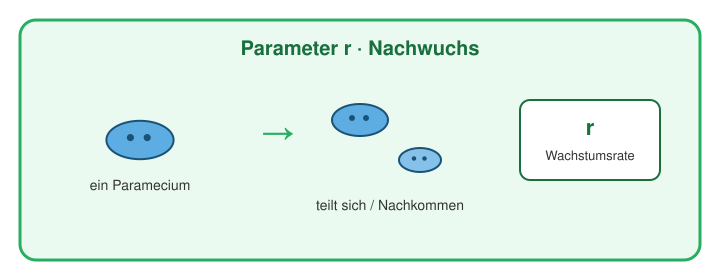
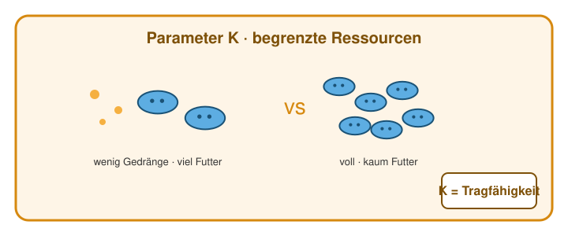
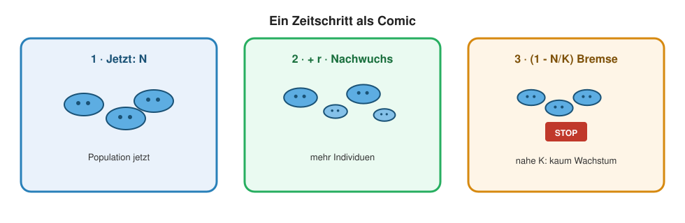
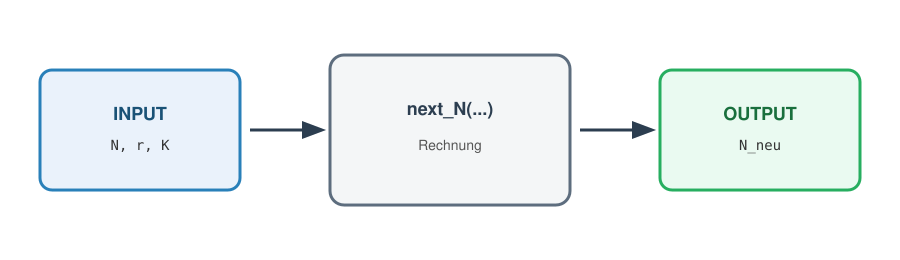
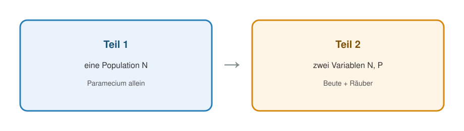
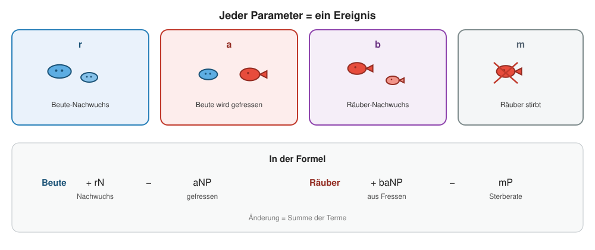
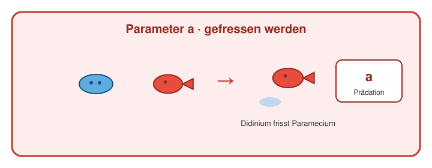
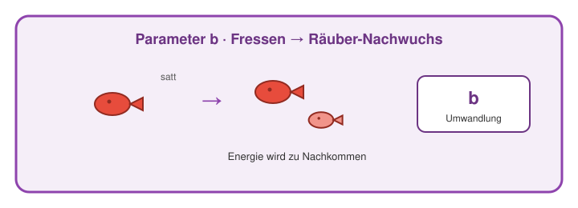
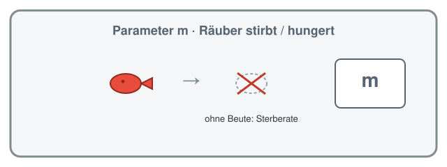

## Übersicht

**Woche 2** von 14 · **Do., 24. Sept. 2026, 08:15–10:00**

[Kursplan](../../docs/course-outline.html) · [Start](../../index.html) · **[Notebook](notebook.html)**

::: aside
Pfeiltasten · **M** Menü · **Esc** Übersicht
:::

## Sitzungsablauf (~2 h)

| Teil | Dauer | Was |
|------|-------|-----|
| Vorlesung | ~45 min | *Paramecium* → Modell → Räuber–Beute |
| Notebook | ~45 min | selbst herumspielen |

## Lernziele

Nach heute können Sie …

1. *Paramecium*-Wachstum als **eine** Variable $N$ lesen,
2. die Gleichung $N_{t+1}=N_t+f(N_t)$ als **einen Zeitschritt** sehen,
3. denselben Schritt für **zwei Arten** nachvollziehen.

## Heute in einem Blick

::::: columns
::: {.column width="22%"}
{fig-alt="Beobachten" width="70%"}
:::
::: {.column width="22%"}
{fig-alt="Modell" width="70%"}
:::
::: {.column width="22%"}
{fig-alt="Code" width="70%"}
:::
::: {.column width="22%"}
{fig-alt="Plot" width="70%"}
:::
:::::

**Frage** (*Paramecium*-Wachstum) → **Daten** (Gause) → **Modell** → **Code** (`next` → Vektor → `for` → `plot`).

## R parallel — und hier

::::: columns
::: {.column width="22%"}
{fig-alt="Code" width="75%"}
:::
::: {.column width="78%"}
Im Programmierkurs lernt ihr R systematisch.

**Hier:** nur so viel, dass ihr danach im Notebook spielen könnt:

Funktion (Input/Output) · Vektor · Schleife · `plot()`
:::
:::::

## Heute in dieser Reihenfolge

1. Was macht *Paramecium* allein?
2. Warum reicht «wächst» nicht — Regulation?
3. Ein Zeitschritt, dann viele: $N_{t+1}=N_t+f(N_t)$
4. Zwei Arten: Räuber und Beute

::: aside
[Modul 1](../../docs/module-01-overview.html) · [Glossar](../../docs/glossary.html)
:::

# Teil 1 · Eine Population

## Die Biologie zuerst

::::: columns
::: {.column width="45%"}
{fig-alt="Paramecium caudatum" width="95%"}
:::
::: {.column width="55%"}
***Paramecium caudatum*** (Pantoffeltierchen)

Daten: **Gause (1934)** · heute zuerst: **nur eine Population**
:::
:::::

::: aside
Fritzmann2002, CC BY-SA 4.0
:::

## Daten laden

```{r}
alone <- read.csv("data/paramecium_alone.csv")
head(alone, 3)
```

-   `read.csv(...)` liest eine Tabelle  
-   Ergebnis → Objekt `alone` (Zuweisung mit `<-`)  
-   Spalten z. B. `alone$day`, `alone$paramecium`

## Erste Abbildung — der Befehl

```{r}
#| fig-height: 3.6
#| fig-width: 7
plot(alone$day, alone$paramecium,
     type = "b", pch = 16, lwd = 2,
     xlab = "Tag",
     ylab = "Haeufigkeit (Paramecium)",
     main = "Paramecium allein (Gause 1934)")
```

## Was bedeutet `plot(...)`?

| Teil | Rolle |
|------|--------|
| `alone$day` | **x**-Achse (Zeit) |
| `alone$paramecium` | **y**-Achse (Häufigkeit) |
| `type = "b"` | both: Punkte **und** Linien |
| `pch = 16` | Punktform (ausgefüllter Kreis) |
| `xlab`, `ylab`, `main` | Achsenbeschriftung / Titel |

Später im Notebook: Parameter ändern und neu plotten.

## Was sehen wir biologisch?

::::: columns
::: {.column width="28%"}
{fig-alt="Beobachtung" width="70%"}
:::
::: {.column width="72%"}
-   Population **wächst**
-   später: **Plateau**
-   ohne Räuber: bleibt bestehen
:::
:::::

## Wie modellieren wir das?

**Zeitreihe** · eine Variable: Populationsgrösse $N$

Frage: Wie wird aus $N_t$ das nächste $N_{t+1}$?

## Kräfte (verbal)

1.  **Wachstum** — mehr Individuen → mehr Nachwuchs  
2.  **Regulation** — begrenzte Ressourcen → Bremse  

→ Plateau wie in den Daten.

##  Nachwuchs ($r$)

{fig-alt="Comic Parameter r Nachwuchs" width="82%"}

## Kapazität ($K$)

{fig-alt="Comic Parameter K Gedraenge" width="82%"}

## Ein Zeitschritt

> Kennen wir $N_t$, wie lautet $N_{t+1}$?

**Differenzengleichung** = Regel für **einen** Schritt.

## ein Zeitschritt

{fig-alt="Comic logistischer Zeitschritt" width="92%"}

## Regel (diskret, logistisch)

$$
N_{t+1} = N_t + r\, N_t \left(1 - \frac{N_t}{K}\right)
$$

**Jetzt + Änderung** — additive Differenzengleichung (ein Schritt).

## Parameter (Logistik)

| Symbol | Bedeutung | Einschränkung | Kursbeispiel |
|--------|-----------|---------------|--------------|
| $N_t$ | Populationsgrösse jetzt | $N \ge 0$ | Start oft $20$ |
| $r$ | Netto-Wachstum **pro Schritt** | $r > 0$ | $0.5$ |
| $K$ | Deckel (Platz / Futter) | $K > 0$ | $200$ |

Nahe $K$: Faktor $\bigl(1-N/K\bigr)$ bremst das Wachstum (bei $N>K$ negativ).

## Kurz: was die Literatur oft schreibt

Viele Papers nutzen **Differentialgleichungen**. Wir nutzen **Differenzengleichungen** $N_{t+1}=N_t+f(N_t)$.

Vertiefung: Vorlesung **Mathematische Modellierung**.

::: {.callout-warning}
## Parameter nicht blind aus Papers kopieren

ODE-Zahlen ≠ unsere **pro-Schritt**-Parameter.
:::

**Kursstandard:** $N_{t+1} = N_t + f(N_t)$

# R-Basics · Funktion

## Was ist eine Funktion?

{fig-alt="Funktion Input Output" width="88%"}

Eine **Maschine**: Input → Rechnung → Output

```r
next_N <- function(N, r, K) {
  N + r * N * (1 - N / K)
}
```

## Input und Output von `next_N`

| | |
|---|---|
| **Name** | `next_N` |
| **Inputs** | `N` (aktuell), `r`, `K` |
| **Output** | eine Zahl: $N$ im **nächsten** Schritt |

Die **letzte** Zeile im Funktionskörper wird zurückgegeben.

## Funktion aufrufen — Beispiel

```{r}
next_N <- function(N, r, K) {
  N + r * N * (1 - N / K)
}

next_N(N = 20, r = 0.5, K = 200)
```

Start 20 · etwas Wachstum · noch weit unter $K=200$.

## Noch ein Aufruf: näher an $K$

```{r}
next_N(N = 180, r = 0.5, K = 200)
next_N(N = 200, r = 0.5, K = 200)
```

Nahe $K$: wenig Wachstum.  
Bei $N=K$: Veränderung $= 0$.

## Benannte Argumente

```r
next_N(N = 20, r = 0.5, K = 200)
next_N(20, 0.5, 200)   # gleiche Reihenfolge
```

Mit Namen lesbarer — besonders bei vielen Parametern.

# R-Basics · Vektor & Schleife

## Der Workflow

{fig-alt="Funktion Vektor Schleife plot" width="95%"}

## Zeitreihe = Vektor

$$
N_0,\; N_1,\; \ldots,\; N_T
$$

```{r}
T <- 5
N <- numeric(T + 1)   # Vektor aus Nullen, Laenge 6
N[1] <- 20            # Startwert (R zaehlt ab 1!)
N
```

`N[i]` = Eintrag Nummer $i$.

## Von Hand — mühsam

```{r}
r <- 0.5
K <- 200
N[2] <- next_N(N[1], r, K)
N[3] <- next_N(N[2], r, K)
N[4] <- next_N(N[3], r, K)
N[1:4]
```

Muster klar — aber nicht skalierbar.

## Schleife: Computer wiederholt

```{r}
T <- 40
N <- numeric(T + 1)
N[1] <- 20
r <- 0.5
K <- 200

for (t in 1:T) {
  N[t + 1] <- next_N(N[t], r, K)
}

N[1:6]   # erste Werte ansehen
```

## Anatomie der `for`-Schleife

```r
for (t in 1:T) {
  N[t + 1] <- next_N(N[t], r, K)
}
```

| Teil | Bedeutung |
|------|-----------|
| `t` | Zählvariable (läuft 1, 2, …, $T$) |
| `1:T` | Folge der Werte für `t` |
| `{ ... }` | Körper: wird jedes Mal ausgeführt |
| `N[t]` | Input: Zustand jetzt |
| `N[t + 1]` | Output: speichern |

## Abbildung der Simulation

```{r}
#| fig-height: 3.6
#| fig-width: 7
plot(0:T, N,
     type = "l", lwd = 2,
     xlab = "Schritt t",
     ylab = "N",
     main = "Simulation: eine Population")
abline(h = K, lty = 2, col = "grey40")
```

## Plot der Simulation — Zerlegung

| Befehl | Rolle |
|--------|--------|
| `plot(0:T, N, ...)` | x = Zeitindex, y = gespeicherte $N$ |
| `type = "l"` | nur Linie (line) |
| `lwd = 2` | Linienbreite |
| `abline(h = K, ...)` | horizontale Hilfslinie bei $K$ |

## Vergleich Daten ↔ Modell

```{r}
#| fig-height: 3.5
#| fig-width: 7.5
par(mfrow = c(1, 2), mar = c(4, 4, 2, 1))
plot(alone$day, alone$paramecium, type = "b", pch = 16, lwd = 2,
     xlab = "Tag", ylab = "Paramecium", main = "Daten")
plot(0:T, N, type = "l", lwd = 2,
     xlab = "Schritt", ylab = "N", main = "Modell")
abline(h = K, lty = 2, col = "grey40")
```

`par(mfrow = c(1, 2))` = zwei Plots nebeneinander.

## Zwischenstand

{fig-alt="Workflow" width="90%"}

| Idee | In R |
|------|------|
| ein Schritt | `next_N(N, r, K)` |
| Zeitreihe | Vektor `N` |
| viele Schritte | `for (t in 1:T) ...` |
| ansehen | `plot(...)` |

# Teil 2 · Räuber und Beute

## Erweiterung

{fig-alt="Eine vs zwei Populationen" width="90%"}

Zwei Populationen: Beute $N$ · Räuber $P$

**Dieselbe Logik** — mehr Inputs/Outputs.

## Organismen

::::: columns
::: {.column width="50%"}
{fig-alt="Paramecium" width="95%"}

Beute
:::

::: {.column width="50%"}
{fig-alt="Didinium" width="80%"}

Räuber (*Didinium*)
:::

:::::

## Daten laden und Plot programmieren

```{r}
#| fig-height: 3.6
#| fig-width: 7
#| fig-show: hide
both <- read.csv("data/paramecium_with_didinium.csv")

plot(both$day, both$paramecium, type = "b", pch = 16, lwd = 2,
     xlab = "Tag", ylab = "Haeufigkeit",
     main = "Paramecium + Didinium",
     ylim = c(0, max(both$paramecium, both$didinium) * 1.05))
lines(both$day, both$didinium, type = "b", pch = 17, lwd = 2, lty = 2)
legend("topright", c("Paramecium", "Didinium"),
       pch = c(16, 17), lty = 1:2, bty = "n")
```

## Neue Plot-Befehle

| Befehl | Rolle |
|--------|--------|
| `ylim = ...` | y-Achse gross genug für beide Arten |
| `lines(...)` | **zweite** Kurve in dasselbe Bild |
| `lty = 2` | gestrichelte Linie |
| `legend(...)` | Legende |

Erst `plot`, dann `lines` — sonst neues Fenster.

## Die Daten im Plot

```{r}
#| echo: false
#| fig-height: 3.8
#| fig-width: 7.5
#| out-width: 62%
plot(both$day, both$paramecium, type = "b", pch = 16, lwd = 2,
     xlab = "Tag", ylab = "Haeufigkeit",
     main = "Paramecium + Didinium",
     ylim = c(0, max(both$paramecium, both$didinium) * 1.05))
lines(both$day, both$didinium, type = "b", pch = 17, lwd = 2, lty = 2)
legend("topright", c("Paramecium", "Didinium"),
       pch = c(16, 17), lty = 1:2, bty = "n")
```

## Was fällt auf?

Beute ↑ → Räuber ↑ (verzögert) → Beute ↓ → Räuber ↓  
→ Schwingungen (Oszillationen)

{fig-alt="Lotka-Volterra Zyklen" width="88%"}

::: aside
Lehrbeispiel Lotka–Volterra (Idee) — Gause-Daten daneben
:::

## Kräfte (verbal)

1. Beute wächst  
2. Beute wird gefressen (**Prädation**)  
3. Räuber wachsen mit Beute  
4. Räuber sterben ohne Beute  

## Parameter = Ereignisse

{fig-alt="Comics Parameter r a b m" width="92%"}

## Noch mal einzeln: fressen ($a$)

{fig-alt="Comic Praedation a" width="78%"}

## Fressen → Räuber-Babys ($b$)

{fig-alt="Comic Umwandlung b" width="78%"}

## Räuber stirbt ($m$)

{fig-alt="Comic Sterberate m" width="72%"}

## Wie liest man einen Modellterm?

{fig-alt="r mal N hängt von einer Art ab; N Quadrat beschreibt Begegnungen derselben Art; N mal P beschreibt Begegnungen zweier Arten" width="62%"}

**Produkte zählen gemeinsame Anwesenheit.**

## Terme und mögliche Wirkungen

::: {style="font-size: 0.72em;"}
| Term | braucht | Wirkung |
|------|---------|---------|
| $+rN$ | $N$ | Wachstum / Geburten |
| $-cN^2$ | $N$ zweimal | innerartliches Gedränge |
| $-aNP$ | $N$ und $P$ | Verlust durch Begegnung |
| $+baNP$ | $N$ und $P$ | Konsument gewinnt |
| $-mP$ | $P$ | unabhängige Sterblichkeit |

**Koeffizient:** Richtung/Stärke · **Produkt:** Abhängigkeit.
:::

## Ein Zeitschritt (Idee)

Jetzt + Änderung — **additive** Differenzengleichung:

$$
\begin{aligned}
N_{t+1} &= N_t + (r N_t - a N_t P_t) \\
P_{t+1} &= P_t + (b a N_t P_t - m P_t)
\end{aligned}
$$

## Parameter (Räuber–Beute)

| Symbol | Bedeutung | Einschränkung | Kursbeispiel |
|--------|-----------|---------------|--------------|
| $N_t$ | Beute | $N \ge 0$ | Start $40$ |
| $P_t$ | Räuber | $P \ge 0$ | Start $2$ |
| $r$ | Beute-Wachstum ohne Räuber | $r > 0$ | $0.05$ |
| $a$ | Prädation | $a > 0$ | $0.005$ |
| $b$ | Umwandlung Beute → Räuber | $0 < b \le 1$ | $0.5$ |
| $m$ | Räuber-Sterblichkeit | $m > 0$ | $0.03$ |

## Terme im Update

| Term | Ereignis |
|------|----------|
| $+ r N$ | Beute-Nachwuchs |
| $- a N P$ | Beute wird gefressen |
| $+ b\,a N P$ | Räuber-Nachwuchs aus Fressen |
| $- m P$ | Räuber stirbt |

## Funktion mit **zwei** Outputs

```{r}
next_state <- function(N, P, r, a, b, m) {
  dN <- r * N - a * N * P
  dP <- b * a * N * P - m * P
  c(N = max(N + dN, 0), P = max(P + dP, 0))
}
```

`c(N = ..., P = ...)` = benannter Vektor mit **zwei** Werten.

## Input / Output von `next_state`

| | |
|---|---|
| **Inputs** | `N`, `P`, Parameter `r, a, b, m` |
| **Output** | Vektor Länge 2: neues `N`, neues `P` |
| `max(..., 0)` | keine negativen Häufigkeiten |

## Aufruf — ein Schritt

```{r}
out <- next_state(N = 40, P = 2, r = 0.05, a = 0.005, b = 0.5, m = 0.03)
out
out["N"]
out["P"]
```

Ergebnis in `out` speichern · mit `out["N"]` Einzelteile holen.

## Zwei Vektoren + Schleife

```{r}
T <- 400
N <- numeric(T + 1)
P <- numeric(T + 1)
N[1] <- 40
P[1] <- 2
r <- 0.05; a <- 0.005; b <- 0.5; m <- 0.03

for (t in 1:T) {
  out <- next_state(N[t], P[t], r, a, b, m)
  N[t + 1] <- out["N"]
  P[t + 1] <- out["P"]
}
```

## Simulation plotten

```{r}
#| fig-height: 3.6
#| fig-width: 7
plot(0:T, N, type = "l", lwd = 2,
     xlab = "Schritt", ylab = "Häufigkeit",
     main = "Simulation: Beute und Räuber",
     ylim = range(0, N, P))
lines(0:T, P, lwd = 2, lty = 2)
legend("topright", c("Beute N", "Räuber P"),
       lty = 1:2, lwd = 2, bty = "n")
```

## Daten und Simulation — vier Panels

```{r}
#| echo: false
#| fig-height: 5.2
#| fig-width: 9
#| out-width: 95%
par(mfrow = c(2, 2), mar = c(4, 4, 2.2, 1), oma = c(0, 0, 0, 0))

# 1 Zeitreihe: Daten
plot(both$day, both$paramecium, type = "b", pch = 16, lwd = 2,
     xlab = "Tag", ylab = "Haeufigkeit",
     main = "Daten: Zeitreihe",
     ylim = c(0, max(both$paramecium, both$didinium) * 1.05))
lines(both$day, both$didinium, type = "b", pch = 17, lwd = 2, lty = 2)
legend("topright", c("Paramecium", "Didinium"),
       pch = c(16, 17), lty = 1:2, bty = "n", cex = 0.8)

# 2 Zeitreihe: Simulation
plot(0:T, N, type = "l", lwd = 2,
     xlab = "Schritt", ylab = "Haeufigkeit",
     main = "Simulation: Zeitreihe",
     ylim = range(0, N, P))
lines(0:T, P, lwd = 2, lty = 2)
legend("topright", c("Beute N", "Raeuber P"),
       lty = 1:2, lwd = 2, bty = "n", cex = 0.8)

# 3 Phasenraum: Daten
plot(both$paramecium, both$didinium, type = "o", pch = 16, lwd = 1.5,
     xlab = "Beute: Paramecium", ylab = "Raeuber: Didinium",
     main = "Daten: Phasenraum")
arrows(both$paramecium[-nrow(both)], both$didinium[-nrow(both)],
       both$paramecium[-1], both$didinium[-1],
       length = 0.06, angle = 22, col = "#5d6d7e")

# 4 Phasenraum: Simulation
plot(N, P, type = "l", lwd = 1.8,
     xlab = "Beute N", ylab = "Raeuber P",
     main = "Simulation: Phasenraum")
```

Oben: Zeitreihen nebeneinander · unten: Phasenräume nebeneinander.

## Mini-Glossar R (heute)

| Konzept | Merksatz |
|---------|----------|
| `<-` | speichert Ergebnis in einem Namen |
| `function(...) { }` | Input → Output |
| `numeric(n)` | leerer Zahlenvektor |
| `x[i]` | i-tes Element |
| `for (i in ...) { }` | wiederholen |
| `plot` / `lines` | Abbildung |

## Programmierung ↔ Biologie

{fig-alt="Bruecke Programmierung Biologie" width="88%"}

| Programmierung | Biologie |
|----------------|----------|
| Funktion | ein Zeitschritt |
| Vektor | Zeitreihe |
| Schleife | viele Schritte |
| Plot | Dynamik lesen |

## Take-home

1. Erst das Beispiel (*Paramecium*), dann die Gleichung $N_{t+1}=N_t+f(N_t)$.
2. Ein Zeitschritt als Funktion; viele Schritte als Schleife.
3. Zwei Arten: dieselbe Idee, zwei Variablen.

## Notebook (~45 min)

**→ [Notebook Woche 2 öffnen](notebook.html)**

::::: columns
::: {.column width="22%"}
{fig-alt="Notebook" width="70%"}
:::
::: {.column width="78%"}
Zuerst: Ordner `data/` mit den CSVs neben dem Notebook.

**A** eine Spezies — `next_N`, $r$ und Start $\lessgtr K$ **selbst ändern**  

**B** zwei Spezies — `next_state`, Parameter selbst ändern  

**C** Diskussion: Immigration vs. Aussterben; Modell und «fast null»
:::
:::::

## Abschlussfragen

1.  Was sind Input und Output von `next_N`?  
2.  Warum `for` statt Abschreiben?  
3.  Was ändert `lines()` gegenüber nur `plot()`?

## Literatur

:::: {.lit}
Alles, was in dieser Einheit namentlich vorkommt:

1. **Gause, G. F. (1934).** *The Struggle for Existence*. Williams & Wilkins. — *Paramecium*-Monokultur und *Paramecium*–*Didinium*-Experimente (Kursdaten).
2. **Lotka, A. J. (1925).** *Elements of Physical Biology*. Williams & Wilkins. — Räuber–Beute-Idee.
3. **Volterra, V. (1926).** Variazioni e fluttuazioni del numero d’individui in specie animali conviventi. *Memorie della R. Accademia Nazionale dei Lincei*. — Räuber–Beute-Idee.
4. **Mühlbauer, L. K., Schulze, M., Harpole, W. S., & Clark, A. T. (2020).** gauseR: Simple methods for fitting Lotka–Volterra models describing Gause’s «Struggle for Existence». *Ecology and Evolution* 10: 13296–13306. [doi:10.1002/ece3.6926](https://doi.org/10.1002/ece3.6926) — Digitalisierung der Gause-Daten (`gauseR` / Kurs-CSVs).

Bildnachweise: `pics/README.md` · Organismenfotos Wikimedia Commons (siehe Bildunterschriften).
::::

## Navigation

| | |
|---|---|
| Kursplan | [Kursplan](../../docs/course-outline.html) |
| Notebook | [Notebook Woche 2](notebook.html) |
| Zurück | [← Woche 1](../week-01/slides.html) |
| Weiter | [Woche 3 →](../week-03/slides.html) |
