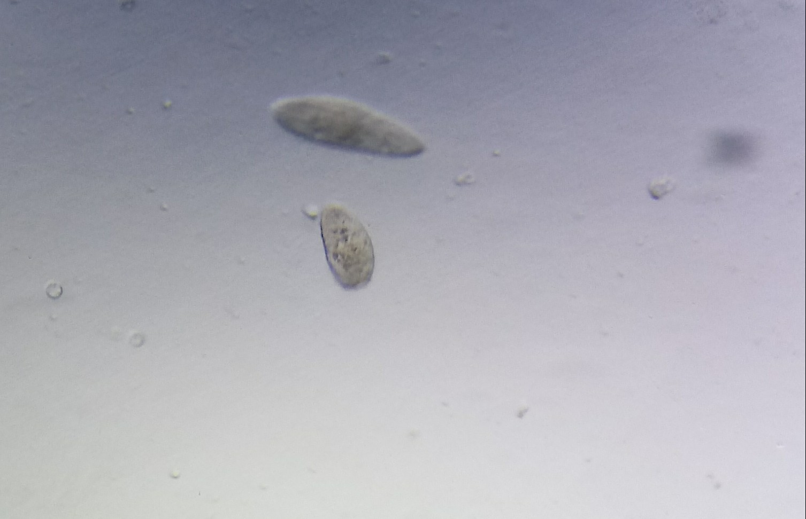
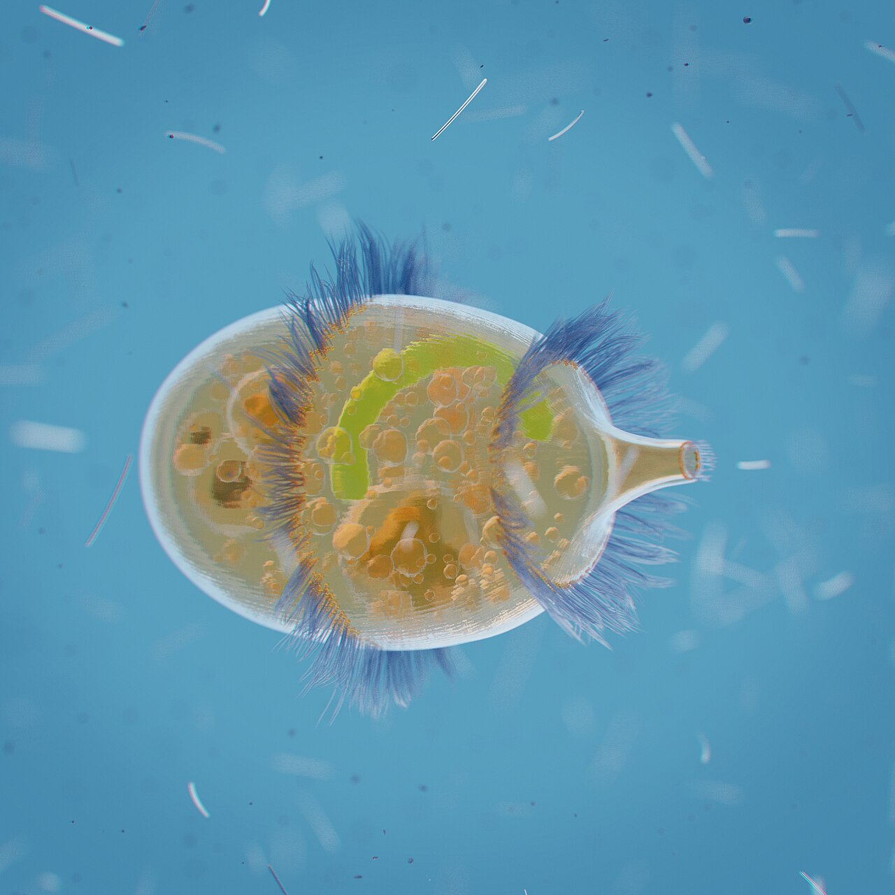
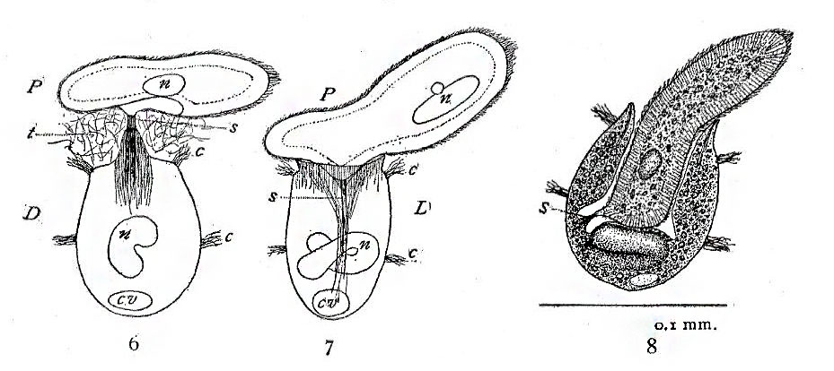

## On this deck

**Week 2** of 14 · Ecology block

- [Course outline](../../docs/course-outline.html)
- [Home](../../index.html)
- Arrow keys / controls · **M** menu · **Esc** grid

## Recap from Week 1

- Cool biology needs quantitative tools
- Today: first modelling bridge to programming

## Learning goals today

1. Read a real ecological contrast in data
2. Write a **next-state function**
3. Store results in a **vector**
4. Automate with a **loop**

---

## Start with biology (not equations)

Classic microcosm system from **real experiments**:

- Prey: ***Paramecium caudatum***
- Predator: ***Didinium nasutum***

Data digitized from **Gause (1934)** (*The Struggle for Existence*), via R package `gauseR`.

## Meet the organisms

:::: {.columns}

::: {.column width="50%"}
{fig-alt="Paramecium caudatum under a light microscope" width="100%"}

***Paramecium caudatum*** (prey)
:::

::: {.column width="50%"}
{fig-alt="3D illustration of Didinium nasutum" width="85%"}

***Didinium nasutum*** (predator)
:::

::::

::: {.aside}
Fritzmann2002 (CC BY-SA 4.0); Denis Zarubin (CC BY-SA 4.0) — Wikimedia Commons
:::

## Predator meets prey

{fig-alt="Historic illustration of Didinium consuming Paramecium" width="78%"}

Classic illustration: *Didinium* engulfing *Paramecium* (Mast 1909; public domain)

## The contrast we care about

**Same prey, two published figures:**

1. *Paramecium* **alone** (Fig. 21 monoculture)
2. *Paramecium* **with** *Didinium* (Fig. 32)

Question: what process explains the difference?

## Data: prey alone (Gause Fig. 21)

```{r}
#| fig-height: 4
#| fig-width: 7
alone <- read.csv("data/paramecium_alone.csv")
plot(alone$day, alone$paramecium, type = "b", pch = 16, lwd = 2,
     xlab = "Day", ylab = "Paramecium abundance",
     main = "Paramecium alone (Gause 1934, Fig. 21)")
```

Grows, then levels off — persists without predators.

## Data: prey + predator (Gause Fig. 32)

```{r}
#| fig-height: 4
#| fig-width: 7
both <- read.csv("data/paramecium_with_didinium.csv")
plot(both$day, both$paramecium, type = "b", pch = 16, lwd = 2,
     xlab = "Day", ylab = "Abundance",
     main = "Paramecium + Didinium (Gause 1934, Fig. 32)",
     ylim = c(0, max(c(both$paramecium, both$didinium), na.rm = TRUE) * 1.1))
lines(both$day, both$didinium, type = "b", pch = 17, lwd = 2, lty = 2)
# mark immigration pulses (Gause periodically added individuals)
imm <- both$day[both$immigration == "y"]
abline(v = imm, col = "grey70", lty = 3)
legend("topright",
       c("Paramecium (prey)", "Didinium (predator)", "Immigration day"),
       pch = c(16, 17, NA), lty = c(1, 2, 3), col = c("black", "black", "grey70"),
       bty = "n", cex = 0.85)
```

## Side by side

```{r}
#| fig-height: 4.2
#| fig-width: 8
par(mfrow = c(1, 2), mar = c(4, 4, 2, 1))
plot(alone$day, alone$paramecium, type = "b", pch = 16, lwd = 2,
     xlab = "Day", ylab = "Paramecium", main = "Alone (Fig. 21)")
plot(both$day, both$paramecium, type = "b", pch = 16, lwd = 2,
     xlab = "Day", ylab = "Abundance", main = "With Didinium (Fig. 32)",
     ylim = c(0, max(c(both$paramecium, both$didinium), na.rm = TRUE)))
lines(both$day, both$didinium, type = "b", pch = 17, lwd = 2, lty = 2)
legend("topright", c("Prey", "Predator"), pch = c(16, 17), lty = 1:2, bty = "n", cex = 0.8)
```

## What jumps out?

With predators (Fig. 32):

- prey rise → predators rise (delay)
- prey crash → predators decline
- **oscillations** appear — but Gause added occasional **immigrants** (grey lines)

Without predators (Fig. 21):

- prey grow then **persist**

## Honest teaching note

Gause’s mixture experiment is famous partly because **simple LV is not enough**:

- without immigration / refuges, predators often ate all prey then died
- see also Fig. 30 extinction series in `data/paramecium_didinium_extinction.csv`

Today we still use LV as a *first* quantitative story — then ask what is missing (Week 3+).

## Think–pair–share (2 min)

In words (no equations yet):

1. What happens to prey when predators appear?
2. What happens to predators when prey become rare?
3. Why might immigration matter for coexistence?

## Why a model?

Words are not enough.

We want a precise rule that can generate predator–prey dynamics when we change one ingredient: **predation**.

**Sources:** Gause (1934); digitized in `gauseR` (`gause_1934_book_f21`, `gause_1934_book_f32`).

---

## Take the model apart

## Biological rules (verbal)

1. Prey grow when predators are rare
2. Prey decline when eaten
3. Predators grow when prey are abundant
4. Predators die when prey are scarce

## Continuous form (orientation only)

Classic Lotka–Volterra:

\[
\frac{dN}{dt} = rN - aNP
\]
\[
\frac{dP}{dt} = baNP - mP
\]

We will **not** solve this analytically.

We simulate in **discrete time**.

## Discrete-time idea

> If I know the state **now**, what is the state **next**?

A **recurrence / update rule**.

## Discrete update (Euler-style)

\[
N_{t+1} = N_t + (rN_t - aN_tP_t)\,\Delta t
\]
\[
P_{t+1} = P_t + (baN_tP_t - mP_t)\,\Delta t
\]

**next state = current state + change**

## Variables and parameters

| Symbol | Meaning | In today's story |
|---|---|---|
| \(N_t\) | prey abundance | *Paramecium* |
| \(P_t\) | predator abundance | *Didinium* |
| \(r\) | prey growth rate | alone-culture growth |
| \(a\) | predation rate | Didinium attack |
| \(b\) | conversion efficiency | prey → predator babies |
| \(m\) | predator mortality | starvation / death |
| \(\Delta t\) | time step | e.g. fraction of a day |

---

## Programming link 1: a function

In programming class: functions take inputs → return outputs.

Here:

> A function that calculates the **next state** from the **current state**.

## Conceptual function

```r
next_state <- function(N, P, r, a, b, m, dt) {
  dN <- (r * N - a * N * P) * dt
  dP <- (b * a * N * P - m * P) * dt
  c(N = N + dN, P = P + dP)
}
```

One biological time step = one function call.

## Live demo: one step

Start from \((N_0, P_0)\) like the early Didinium experiment.

Call once → \((N_1, P_1)\).

Ask:

- Did *Paramecium* go up or down?
- Did *Didinium* go up or down?
- Does that match the verbal rules?

---

## Programming link 2: vectors

Store a trajectory:

\[
N_0, N_1, N_2, \ldots, N_T
\]

A **vector** (you already know this from programming).

## Manual iteration (painful)

```r
N <- numeric(6); P <- numeric(6)
N[1] <- 40; P[1] <- 2
out <- next_state(N[1], P[1], r, a, b, m, dt)
N[2] <- out["N"]; P[2] <- out["P"]
## ... repeat by hand ...
```

Five steps: annoying.  
Hundreds of steps: impossible by hand.

## The punchline

We need **automation**.

---

## Programming link 3: loops

```r
for (t in 1:(length(N) - 1)) {
  out <- next_state(N[t], P[t], r, a, b, m, dt)
  N[t + 1] <- out["N"]
  P[t + 1] <- out["P"]
}
```

Biology: many days/generations.  
Programming: one loop.

## From 5 steps to 500

Change the loop length.

Same function. Same vectors. Same biology.

This is **deterministic simulation**.

## Simulate something Didinium-like

```{r}
#| fig-height: 4
#| fig-width: 7
next_state <- function(N, P, r, a, b, m, dt) {
  dN <- (r * N - a * N * P) * dt
  dP <- (b * a * N * P - m * P) * dt
  c(N = max(N + dN, 0), P = max(P + dP, 0))
}

T <- 200; dt <- 0.05
N <- numeric(T + 1); P <- numeric(T + 1)
N[1] <- 40; P[1] <- 2
r <- 1.0; a <- 0.1; b <- 0.5; m <- 0.6
for (t in 1:T) {
  out <- next_state(N[t], P[t], r, a, b, m, dt)
  N[t + 1] <- out["N"]; P[t + 1] <- out["P"]
}
time <- 0:T * dt
plot(time, N, type = "l", lwd = 2, xlab = "Time", ylab = "Abundance",
     main = "LV simulation (prey + predator)", ylim = range(0, N, P))
lines(time, P, lwd = 2, lty = 2)
legend("topright", c("Prey N", "Predator P"), lty = 1:2, lwd = 2, bty = "n")
```

## Connect model to data

The model is not a perfect fit today — and that is OK.

We ask qualitative questions:

- Can predation create a crash that alone-culture does not?
- Which parameter is the “Didinium knob”?
- What is missing for real microcosms? (Week 3+)

## Check your understanding

If we increase predation rate \(a\):

1. Short-run effect on *Paramecium*?
2. Soon after, effect on *Didinium*?
3. Which line of code changes?

---

## Notebook today

**Build an iterative simulator + compare to the microcosm contrast**

1. Load the two CSV files
2. Complete `next_state()`
3. Vectors + loop + plot
4. Change one parameter
5. Relate output to *Paramecium* / *Didinium* patterns

## Bridge to programming course

| Programming | Biology today |
|---|---|
| Function | one time-step update |
| Vector | abundance time series |
| Loop | many days |
| Plot | interpret predator–prey dynamics |

## Exit ticket

1. What differs biologically between the two datasets?
2. What does `next_state()` represent?
3. Why do we need a loop?

## Next week

Richer ecological models:

- carrying capacity (why alone-cultures plateau)
- extra terms / species
- systematic parameter play

---

## Navigation

| | |
|---|---|
| Overview | [Course outline](../../docs/course-outline.html) |
| Home | [Course home](../../index.html) |
| Previous | [← Week 1](../week-01/slides.html) |
| Next | [Week 3 →](../week-03/slides.html) |

Keyboard: ← → · **M** menu · **Esc** grid · **F** fullscreen
