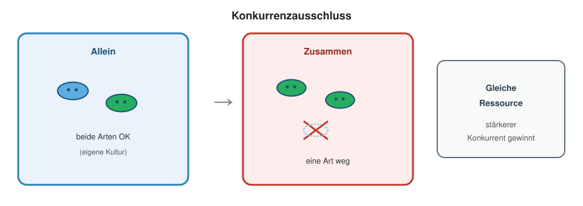
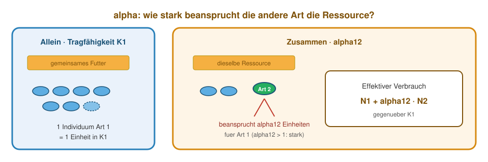
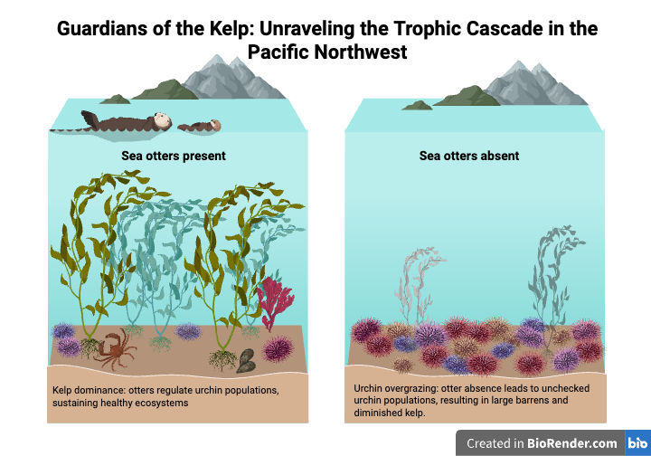
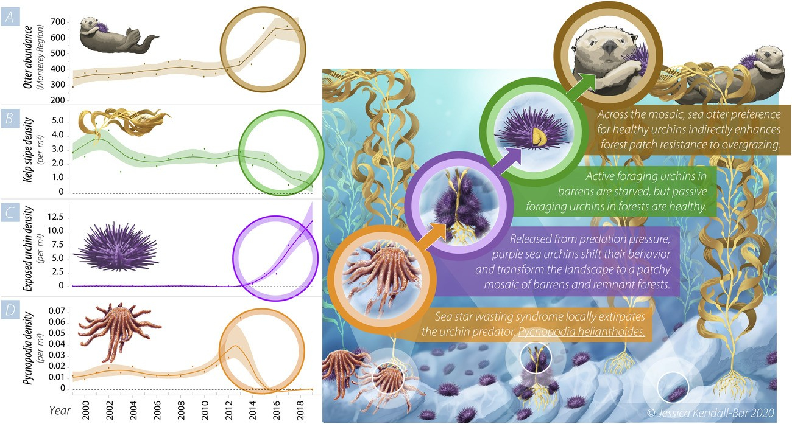
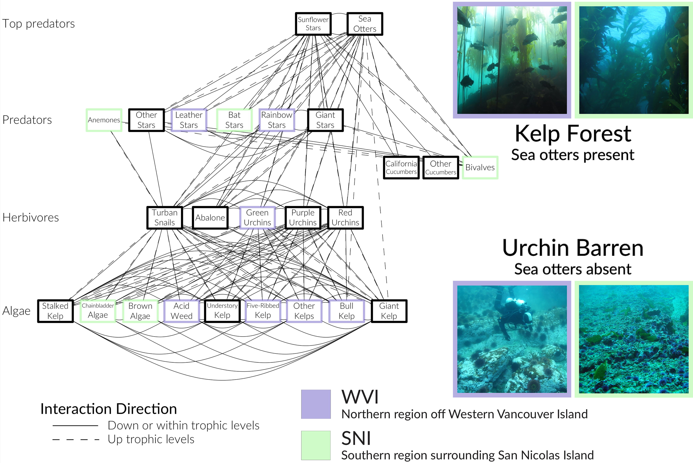
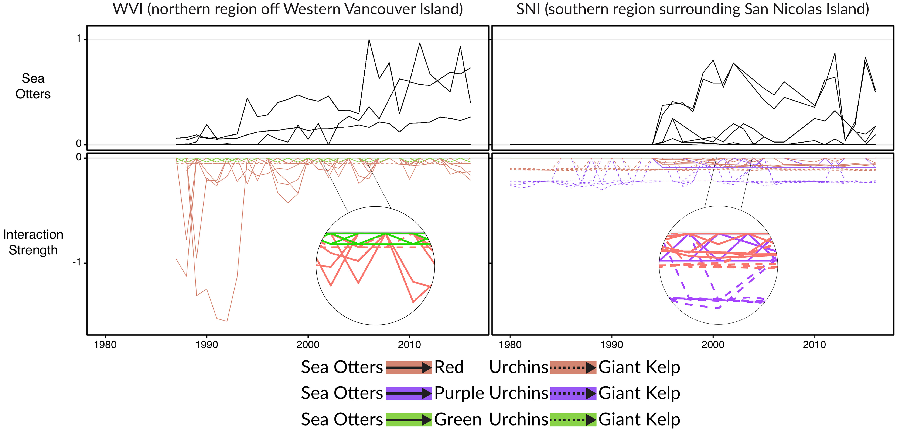
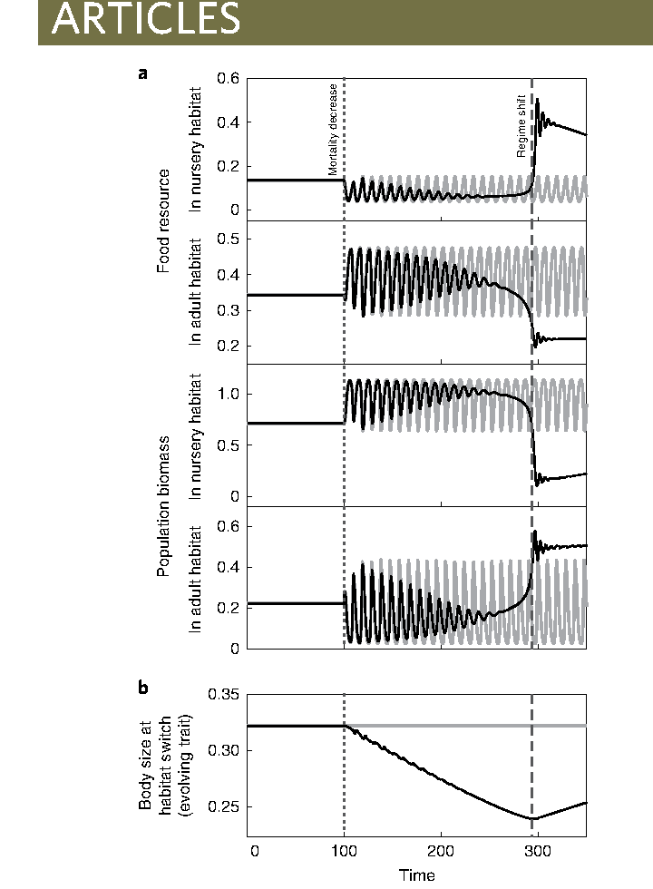

## Übersicht

**Woche 3** von 14 · **Do., 1. Okt. 2026, 08:15–10:00**

| Teil | Dauer | Was |
|------|-------|-----|
| Vorlesung | ~45 min | Stabilität → Bistabilität → Food Web → Kipppunkt |
| Notebook | ~45 min | dieselben Modelle selbst verändern |

::: aside
Pfeiltasten · **M** Menü · **Esc** Übersicht
:::

## Lernziele

Nach heute können Sie …

1. **Gleichgewicht**, **Stabilität** und **Einzugsgebiet** unterscheiden,
2. Konkurrenzausschluss und **Bistabilität** am Bild erkennen,
3. ein Food Web als System lesen — nicht als Artenliste,
4. einen **Kipppunkt** als Konzept benennen.

## Heute in dieser Reihenfolge

1. Wann ist ein Zustand stabil?
2. Ein Endpunkt: *Paramecium*
3. Zwei Endpunkte: Bistabilität
4. Food Web und Kipppunkt

## Räuber–Beute: Persistenz ohne Gleichgewicht

Woche 2: Beute und Räuber schwingen auf der **beobachteten Zeitskala**; beide bleiben im System.

Das nennen wir hier **Persistenz**, nicht Rückkehr zu einem stabilen Gleichgewicht.

> Persistenz ist beobachtbar — aber wann nennen wir einen Zustand **stabil**?

::: aside
Das diskrete Lehrmodell aus Woche 2 wird heute nicht erneut simuliert. Klassische Lotka–Volterra-Orbits kehren nach einer Störung nicht zum selben Orbit zurück.
:::

## Was bedeutet stabil?

::::: columns
::: {.column width="33%"}
### Gleichgewicht

Der Zustand ändert sich nicht mehr.
:::
::: {.column width="33%"}
### Stabil

Nach einer **kleinen Störung** kehrt das System zum Gleichgewicht zurück.
:::
::: {.column width="33%"}
### Einzugsgebiet

Alle Starts und Störungen, die zum selben Gleichgewicht führen.
:::
:::::

Ein System kann **ein** oder **mehrere** Einzugsgebiete besitzen.

## 1 · Ein Endpunkt: *Paramecium*

{fig-alt="Zwei Paramecium-Arten überleben allein; zusammen wird eine verdrängt" width="62%"}

**Biologische Frage:** Beide Arten überleben allein. Warum wird eine Art zusammen verdrängt?

::: aside
*P. caudatum* vs. *P. aurelia* · gleiche Ressource. Quelle: Gause (1934).
:::

## Allein: beide erreichen ein Plateau

```{r}
#| fig-height: 3.7
#| fig-width: 8
#| out-width: 62%
pc <- read.csv("data/paramecium_caudatum_alone.csv")
pa <- read.csv("data/paramecium_aurelia_alone.csv")
par(mfrow = c(1, 2), mar = c(4, 4, 2.5, 1))
plot(pc$day, pc$volume, type = "b", pch = 16, lwd = 2,
     xlab = "Tag", ylab = "Volumen", main = "P. caudatum allein")
plot(pa$day, pa$volume, type = "b", pch = 17, lwd = 2,
     xlab = "Tag", ylab = "Volumen", main = "P. aurelia allein")
```

Die Ressource reicht für jede Art **allein**.

## Zusammen: eine Art wird verdrängt

```{r}
#| fig-height: 3.8
#| fig-width: 7.5
#| out-width: 58%
mix <- read.csv("data/paramecium_competition.csv")
c_ok <- !is.na(mix$caudatum)
a_ok <- !is.na(mix$aurelia)
ymax <- max(c(mix$caudatum, mix$aurelia), na.rm = TRUE)
plot(mix$day[c_ok], mix$caudatum[c_ok], type = "b", pch = 16, lwd = 2,
     xlab = "Tag", ylab = "Volumen", main = "Beide Arten zusammen",
     ylim = c(0, ymax * 1.05), xlim = range(mix$day, na.rm = TRUE))
lines(mix$day[a_ok], mix$aurelia[a_ok], type = "b", pch = 17, lwd = 2, lty = 2)
legend("topright", c("P. caudatum", "P. aurelia"),
       pch = c(16, 17), lty = 1:2, bty = "n")
```

**Konkurrenzausschluss** (*competitive exclusion*): eine Art verdrängt die andere.

## Allein: $K_i$ ist das Ressourcenbudget

{fig-alt="Begrenzte Ressourcen setzen der Populationsgrösse einen Deckel K" width="52%"}

Art $i$ wächst allein, solange Futter und Platz reichen.

Bei $N_i=K_i$ ist ihr Ressourcenbudget ausgeschöpft: weiteres Wachstum wird durch Gedränge ausgeglichen.

## Zusammen: beide nutzen dieselbe Ressource

{fig-alt="Alpha übersetzt Art 2 in effektiven Ressourcenverbrauch aus Sicht von Art 1" width="62%"}

Für Art 1 zählen **beide Arten** gegen $K_1$:

$$N_1+\alpha_{12}N_2$$

## $\alpha_{12}$ rechnet Ressourcenverbrauch um

Ein Individuum von Art 2 beansprucht $\alpha_{12}$ **Art-1-Plätze**.

| Wert | aus Sicht von Art 1 |
|------|---------------------|
| $\alpha_{12}=0$ | Art 2 nutzt keine relevante Ressource |
| $\alpha_{12}=1$ | Art 2 zählt wie 1 Art 1 |
| $\alpha_{12}=1.5$ | Art 2 zählt wie 1.5 Art 1 |

Umgekehrt: $\alpha_{21}$ = **Art-2-Plätze** pro Individuum von Art 1.

## Modell: Konkurrenz

::: {style="font-size: 0.52em;"}
$$
\begin{aligned}
N_{1,t+1}
  &= N_{1,t}
     + r_1 N_{1,t}\left(1-\frac{N_{1,t}+\alpha_{12}N_{2,t}}{K_1}\right)\\
N_{2,t+1}
  &= N_{2,t}
     + r_2 N_{2,t}\left(1-\frac{N_{2,t}+\alpha_{21}N_{1,t}}{K_2}\right)
\end{aligned}
$$
:::

**Zuwachs = Nachwuchs − Gedränge − Konkurrenz**

- Exclusion: $(\alpha_{12},\alpha_{21})=(1.4,0.5)$
- Bistabilität: $(\alpha_{12},\alpha_{21})=(1.5,1.5)$

::: aside
Unterrichtswerte, keine Schätzungen aus den Gause-Daten.
:::

## Zwei Starts — derselbe Endpunkt [SIM]

```{r}
#| include: false
next_comp <- function(N1, N2, r1 = 0.05, r2 = 0.05,
                      K1 = 100, K2 = 100, a12, a21) {
  d1 <- r1 * N1 * (1 - (N1 + a12 * N2) / K1)
  d2 <- r2 * N2 * (1 - (N2 + a21 * N1) / K2)
  c(N1 = max(N1 + d1, 0), N2 = max(N2 + d2, 0))
}
sim_comp <- function(N10, N20, a12, a21, T = 800) {
  N1 <- numeric(T + 1); N2 <- numeric(T + 1)
  N1[1] <- N10; N2[1] <- N20
  for (t in 1:T) {
    out <- next_comp(N1[t], N2[t], a12 = a12, a21 = a21)
    N1[t + 1] <- out["N1"]; N2[t + 1] <- out["N2"]
  }
  data.frame(time = 0:T, N1 = N1, N2 = N2)
}
```

```{r}
#| fig-height: 3.8
#| fig-width: 9
#| out-width: 62%
A <- sim_comp(80, 10, 1.4, 0.5)
B <- sim_comp(10, 80, 1.4, 0.5)
par(mfrow = c(1, 2), mar = c(4, 4.2, 2.5, 1))
matplot(A$time, cbind(A$N1, A$N2), type = "l", lty = 1, lwd = 2.5,
        col = c("#2980b9", "#27ae60"), ylim = c(0, 110),
        xlab = "Zeit", ylab = "N", main = "Start: viel N1")
matplot(B$time, cbind(B$N1, B$N2), type = "l", lty = 1, lwd = 2.5,
        col = c("#2980b9", "#27ae60"), ylim = c(0, 110),
        xlab = "Zeit", ylab = "N", main = "Start: viel N2")
legend("right", c("N1", "N2"), col = c("#2980b9", "#27ae60"),
       lty = 1, lwd = 2.5, bty = "n")
```

**Beide positiven Starts →** $N_1\to0$, $N_2\to K$.

## Warum nennen wir diesen Endpunkt stabil?

1. Wir starten an verschiedenen positiven Punkten.
2. Alle Trajektorien nähern sich demselben Gleichgewicht.
3. Eine kleine Störung ändert den langfristigen Endpunkt nicht.

**Ein Gleichgewicht · ein Einzugsgebiet.**

## Beobachtung: Grasland oder Wald

{fig-alt="Schematische Gegenüberstellung von Grasland und Wald" width="58%"}

Bei ähnlichem Niederschlag: **wenig** oder **viel** Baumbedeckung (Staver et al. 2011; kein experimenteller Beweis).

> Kann dieselbe Umwelt zwei stabile Zustände haben?

## 2 · Zwei Endpunkte: kleine Änderung, grosse Wirkung

{fig-alt="Bei starker gegenseitiger Konkurrenz gewinnt die anfangs häufigere Art" width="62%"}

**Modellhypothese:** Gras und Wald hemmen einander stark: $\alpha_{12}=\alpha_{21}=1.5$.

Beide Arten verbrauchen aus Sicht der jeweils anderen mehr als einen „Platz“. Die anfangs häufigere Art erzeugt dadurch zuerst starken Konkurrenzdruck.

## Zwei Starts — zwei Endpunkte [SIM]

```{r}
#| fig-height: 3.8
#| fig-width: 9
#| out-width: 62%
G <- sim_comp(80, 15, 1.5, 1.5)
W <- sim_comp(15, 80, 1.5, 1.5)
par(mfrow = c(1, 2), mar = c(4, 4.2, 2.5, 1))
matplot(G$time, cbind(G$N1, G$N2), type = "l", lty = 1, lwd = 2.5,
        col = c("#d68910", "#1e8449"), ylim = c(0, 110),
        xlab = "Zeit", ylab = "N", main = "Start: viel Gras")
matplot(W$time, cbind(W$N1, W$N2), type = "l", lty = 1, lwd = 2.5,
        col = c("#d68910", "#1e8449"), ylim = c(0, 110),
        xlab = "Zeit", ylab = "N", main = "Start: viel Wald")
legend("right", c("Gras", "Wald"), col = c("#d68910", "#1e8449"),
       lty = 1, lwd = 2.5, bty = "n")
```

**Bistabilität:** Der Start wählt das Gleichgewicht.

## Zwei Einzugsgebiete

```{r}
#| fig-height: 4.2
#| fig-width: 7.5
#| out-width: 68%
plot(NA, xlim = c(0, 105), ylim = c(0, 105),
     xlab = "Art 1 / Gras", ylab = "Art 2 / Wald",
     main = "Bistabilitaet im Phasenraum (schematisch)")
abline(a = 0, b = 1, lty = 2, lwd = 2, col = "#7f8c8d")
points(c(100, 0), c(0, 100), pch = 16, cex = 1.8,
       col = c("#d68910", "#1e8449"))
points(40, 40, pch = 4, cex = 1.8, lwd = 2, col = "#8e44ad")
arrows(70, 20, 96, 3, length = 0.1, lwd = 2, col = "#d68910")
arrows(20, 70, 3, 96, length = 0.1, lwd = 2, col = "#1e8449")
text(72, 9, "Gras gewinnt", col = "#d68910")
text(10, 75, "Wald gewinnt", col = "#1e8449", srt = 90)
text(47, 43, "instabiler Sattelpunkt", col = "#8e44ad", pos = 4)
```

**Beckengrenze:** Kleine Störung bleibt im Becken. Wechsel nur nach Überschreiten.

## Ein oder zwei Endpunkte?

| | Ein stabiler Endpunkt | Bistabilität |
|--|-----------------------|--------------|
| Gleichgewichte | 1 | 2 |
| Rolle des Starts | langfristig unwichtig | entscheidet das Becken |
| kleine Störung | Rückkehr | Rückkehr im selben Becken |
| grosse Störung | gleicher Endpunkt | Wechsel möglich, wenn Grenze überschritten |

## 3 · Food Web: Wolf und Yellowstone

::::: columns
::: {.column width="48%"}
{fig-alt="Wolf im Yellowstone" width="94%"}
:::
::: {.column width="52%"}
{fig-alt="Elch" width="94%"}
:::
:::::

**Hypothese:** Wolf ↓ → Elch ↑ → Beweidungsdruck auf Aspen ↑.

Nach der Wolfsrückkehr können sich bevorzugte Gehölze lokal erholen. Reale Effekte sind räumlich und zeitlich variabel; unser Modell isoliert den Mechanismus.

## Kaskade und Keystone

{fig-alt="Vereinfachte Yellowstone-Kaskade" width="88%"}

- **Trophische Kaskade:** Wirkungskette über mehrere Nahrungsebenen.
- **Keystone-Spezies:** überproportionaler Einfluss auf Struktur oder Vielfalt der Gemeinschaft.

Die Begriffe beschreiben **Mechanismen**, keine eigene mathematische Stabilitätsform.

## Vier-Knoten-Modell

{fig-alt="Aspen Sage Elch Wolf" width="72%"}

1. Aspen und Sage können koexistieren.
2. Elch bevorzugt Aspen → Aspen geht gegen null.
3. Wolf senkt Elch → Aspen bleibt positiv; Elch bleibt ebenfalls positiv.

::: aside
Aspen-Verlust entsteht hier top-down durch Beweidung, nicht durch Konkurrenz mit Sage.
:::

## Vom Pfeil zum Term

::: {style="font-size: 0.72em;"}
| Ereignis | Term |
|----------|------|
| Aspen wächst | $+r_AA$ |
| Pflanzen konkurrieren | $-A(A+\alpha_{AS}S)/K$ |
| Elch frisst Aspen | $-a_{EA}AE$ |
| Elch nutzt Nahrung | $+e_Ea_{EA}AE$ |
| Wolf frisst Elch | $-a_{WE}EW$ |
| Mortalität | $-m_EE$, $-m_WW$ |
:::

**$AE$, $EW$: Beide Partner sind nötig.**

## Was bewirken die Parameter?

::: {style="font-size: 0.74em;"}
| Parameter ↑ | direkte Wirkung |
|-------------|-----------------|
| $r_A,r_S$ | Pflanzen wachsen schneller |
| $\alpha_{AS},\alpha_{SA}$ | Pflanzen konkurrieren stärker |
| $a_{EA},a_{ES}$ | mehr Verbiss: Pflanze $-$, Elch $+$ |
| $e_E,e_W$ | mehr Konsument aus derselben Nahrung |
| $m_E,m_W$ | jeweilige Tierart $-$ |
| $a_{WE}$ | mehr Prädation: Elch $-$, Wolf $+$ |
:::

**Wichtig:** Ein Parameter wirkt oft in zwei Gleichungen mit entgegengesetztem Vorzeichen.

## Vollständiges Kursmodell

::: {style="font-size: 0.50em;"}
$$
\begin{aligned}
A^{+}&=A+r_AA\left(1-\frac{A+\alpha_{AS}S}{K}\right)-a_{EA}AE\\
S^{+}&=S+r_SS\left(1-\frac{S+\alpha_{SA}A}{K}\right)-a_{ES}SE\\
E^{+}&=E+e_E(a_{EA}A+a_{ES}S)E-m_EE-a_{WE}EW\\
W^{+}&=W+e_Wa_{WE}EW-m_WW
\end{aligned}
$$
:::

- $a_{EA}>a_{ES}$: Elch bevorzugt Aspen.
- Dasselbe Fressen: Pflanze $-$ · Elch $+$.

## Pflanzen → Elch → Wolf [SIM]

```{r}
#| include: false
next_web <- function(x, p) {
  A <- x["Aspen"]; S <- x["Sage"]; E <- x["Elch"]; W <- x["Wolf"]
  dA <- p$rA * A * (1 - (A + p$aAS * S) / p$K) - p$aEA * A * E
  dS <- p$rS * S * (1 - (S + p$aSA * A) / p$K) - p$aES * S * E
  dE <- p$eE * (p$aEA * A + p$aES * S) * E - p$mE * E - p$aWE * E * W
  dW <- p$eW * p$aWE * E * W - p$mW * W
  c(Aspen = max(A + dA, 0), Sage = max(S + dS, 0),
    Elch = max(E + dE, 0), Wolf = max(W + dW, 0))
}
web_p <- list(rA = 0.024, rS = 0.020, K = 100,
              aAS = 0.55, aSA = 0.70, aEA = 0.0007, aES = 0.0004,
              eE = 0.45, mE = 0.002, aWE = 0.0008, eW = 0.40, mW = 0.006)
sim_web <- function(Wolf0 = 0, T = 6000, p = web_p) {
  X <- matrix(0, T + 1, 4,
              dimnames = list(NULL, c("Aspen", "Sage", "Elch", "Wolf")))
  X[1, ] <- c(Aspen = 40, Sage = 50, Elch = 25, Wolf = Wolf0)
  for (t in 1:T) X[t + 1, ] <- next_web(X[t, ], p)
  data.frame(time = 0:T, X)
}
```

```{r}
#| fig-height: 3.8
#| fig-width: 9
#| out-width: 62%
plants <- sim_comp(40, 50, 0.55, 0.7)
noW <- sim_web(0)
withW <- sim_web(2)
cols <- c(Aspen = "#27ae60", Sage = "#1abc9c",
          Elch = "#d68910", Wolf = "#2c3e50")
par(mfrow = c(1, 3), mar = c(4, 3.5, 2.5, 1))
matplot(plants$time, cbind(plants$N1, plants$N2), type = "l",
        lty = 1, lwd = 2, col = cols[1:2], ylim = c(0, 100),
        xlab = "Zeit", ylab = "Dichte", main = "Nur Pflanzen")
matplot(noW$time, noW[, names(cols)], type = "l", lty = 1, lwd = 2,
        col = cols, xlab = "Zeit", ylab = "Dichte", main = "+ Elch")
matplot(withW$time, withW[, names(cols)], type = "l", lty = 1, lwd = 2,
        col = cols, xlab = "Zeit", ylab = "Dichte", main = "+ Wolf")
legend("topright", names(cols), col = cols, lty = 1, lwd = 2,
       bty = "n", cex = 0.65)
```

## Mechanismus

Wolf senkt Elch → Beweidungsdruck auf Aspen sinkt → Aspen **bleibt positiv**.

| langfristiger Mittelwert | Aspen | Elch |
|--------------------------|------:|----:|
| ohne Wolf | ≈ 0 | ≈ 44 |
| mit Wolf | ≈ 18 | ≈ 19 |

Das Modell zeigt nicht allgemeine „Netzwerkstabilität“, sondern konkret: **Wolf verhindert hier den Verlust von Aspen.**

## Empirie 1: *Pisaster* als Keystone

::::: columns
::: {.column width="48%"}
{fig-alt="Pisaster" width="92%"}
:::
::: {.column width="52%"}
{fig-alt="Paine Keystone Skizze" width="96%"}
:::
:::::

Paine (1966): *Pisaster* entfernen → Miesmuscheln dominieren den Raum → Vielfalt sinkt.

**Definitorisches Keystone-Beispiel:** relativ selten, aber überproportionaler Effekt auf Gemeinschaftsstruktur.

## Kipppunkte — die Grundidee

::: {style="font-size: 0.72em;"}
Eine **Umweltveränderung** kann ein System zunächst nur wenig verändern.

Wird eine **Schwelle** überschritten, wechselt es abrupt in einen anderen Zustand:

**Umwelt ändert sich** → **Schwelle** → **System kippt**

Danach genügt es oft **nicht**, die Umweltveränderung einfach rückgängig zu machen. Die Rückkehr kann zusätzliche Massnahmen erfordern.
:::

## Beispiele für ökologische Kipppunkte

::: {style="font-size: 0.72em;"}
| Umweltveränderung | möglicher Zustandswechsel |
|---|---|
| mehr Nährstoffe | klarer See → trüber, algenreicher See |
| Dürre und Beweidung | Grasland → vegetationsarmer Zustand |
| Erwärmung und Korallensterben | Korallenriff → algendominiertes Riff |

**Gemeinsame Idee:** Kleine weitere Änderungen können nahe der Schwelle grosse Folgen haben — und die Erholung ist nicht automatisch der umgekehrte Weg.
:::

## Seeotter als Wächter des Kelpwaldes

{fig-alt="Mit Seeottern bleibt der Kelpwald erhalten; ohne Seeotter nehmen Seeigel zu und überweiden den Kelp" width="66%"}

**Hypothese:** Viele Seeotter halten den Seeigeldruck niedrig und stabilisieren dadurch einen **bestehenden** Kelpwald.

## Trophische Kaskade: Seeotter → Seeigel → Kelp

::: {style="font-size: 0.78em;"}
1. **Mehr Seeotter** → mehr Seeigel werden gefressen.
2. **Weniger Seeigel** → weniger Kelp wird abgeweidet.
3. **Mehr Kelp** → der Kelpwald kann sich erholen.

**Indirekter Effekt:**

**Seeotter** ─(−)→ **Seeigel** ─(−)→ **Kelp**

Zwei negative Effekte ergeben einen **positiven indirekten Effekt** auf Kelp.

> **Ohne Seeotter:** Seeigel ↑ → Kelp ↓ → Seeigel-Barren.
:::

## Aber: Erhalten ist leichter als Wiederherstellen

::: {style="text-align: center;"}
{fig-alt="Seeotter, Seeigel und Kelp bilden eine trophische Kaskade; Kelpwald und Seeigel-Barren reagieren unterschiedlich" width="52%"}

<span style="font-size: 0.40em;">Smith et al. (2021), Fig. 10 · Grafik: Jessica Kendall-Bar · Planet-Vie/PNAS<br>Reproduktion für Lehre und nicht-kommerzielle Nutzung erlaubt.</span>
:::

- **Kelpwald:** Gut ernährte Seeigel sind lohnende Beute; Otter begrenzen den Frassdruck.
- **Seeigel-Barren:** Ausgehungerte Seeigel sind wenig lohnende Beute; Otter weichen eher auf andere Beute aus.
- **Folge:** Die verbleibenden Seeigel verhindern die Erholung — mehr Otter allein reichen nicht unbedingt.

> Dieselbe Otterdichte kann einen Kelpwald erhalten, aber einen Barren nicht automatisch zurückverwandeln.

## Das ganze Food Web

::: {style="text-align: center;"}
{fig-alt="Food-Web-Modell zweier Kelpregionen mit vielen gerichteten Interaktionen sowie Fotos von Kelpwald und Seeigel-Barren" width="74%"}

<span style="font-size: 0.40em;">Langendorf et al. (2025), Fig. 1 · PNAS · CC BY-NC-ND 4.0<br>Seeotter–Seeigel–Kelp ist die Kaskade; die Linien sind weitere gerichtete Interaktionen.</span>
:::

## Dieselben Interaktionen, wechselnde Stärke

::: {style="text-align: center;"}
{fig-alt="Geschätzte zeitabhängige Stärken der Interaktionen Seeotter zu Seeigel und Seeigel zu Kelp in zwei Regionen" width="70%"}

<span style="font-size: 0.40em;">Langendorf et al. (2025), Fig. 3 · PNAS · CC BY-NC-ND 4.0</span>
:::

Otter → Igel und Igel → Kelp sind **nicht konstant**. Stärke ändert sich mit Ort, Zeit und Zustand der Gemeinschaft.

## Lachs: wann wechselt man das Habitat?

Junge wachsen im **Aufwuchsgewässer**. Ab einer Körpergrösse wechseln sie
ins **Adult-Habitat**. Diese Wechselgrösse kann sich vererben.

- Später wechseln: man kommt grösser an, bleibt aber länger im Aufwuchs.
- Früher wechseln: der Aufwuchs wird früher frei, man kommt kleiner an.

Wird das Adult-Habitat etwas **sicherer** (weniger Sterblichkeit), lohnt
sich ein etwas früherer Wechsel. Die Bestände ändern sich zuerst kaum —
es ändert sich die **Selektion**.

Chaparro-Pedraza & de Roos (2020)

## Die Umwelt jetzt — der Absturz später

:::: {.columns}
::: {.column width="48%"}
::: {style="text-align: center;"}
{fig-alt="Fuenf Zeitreihen: Futter und Biomasse in Aufwuchs und Adult-Habitat, unten die evolvierende Wechselgroesse; Sterblichkeit sinkt bei Zeit 100, Zustand kippt um Zeit 300" width="92%"}

<span style="font-size: 0.38em;">Chaparro-Pedraza & de Roos (2020), Fig. 2</span>
:::
:::
::: {.column width="52%"}
::: {style="font-size: 0.62em;"}
**Unten:** Wechselgrösse — das **Merkmal**. Es wird kleiner:
früher / kleiner ins Adult-Habitat.

**Oben, von oben nach unten:**
Futter Aufwuchs · Futter Adult · Biomasse Aufwuchs · Biomasse Adult.

- **Schwarz:** Merkmal evolviert
- **Grau:** Merkmal fest (Kontrolle)
- **Gepunktet** $t=100$: Adult-Sterblichkeit sinkt
- **Gestrichelt** $\approx 300$: Zustand kippt

Erst das Merkmal läuft nach. Dann springen Futter und Biomasse
in **beiden** Habitaten — ohne neue Umweltänderung.
:::
:::
::::

## Was das bedeutet

Ökologie und Evolution agieren oft auf **ähnlichen Zeitskalen**, aber oft
**verschoben**.

::: {style="font-size: 0.92em;"}
**Umweltänderung** → **Merkmal läuft nach** → **Zustand kippt später**
:::

Nicht: Evolution sei immer viel langsamer. Hier bewegen sich Zahlen und
Merkmal im selben Zeitfenster — nur die Wirkung liegt versetzt.

Ohne die nachlaufende Evolution gäbe es den späten Sprung nicht.

## Take-home

| Konzept | Kernaussage |
|---------|-------------|
| stabiles Gleichgewicht | Rückkehr nach kleiner Störung |
| Einzugsgebiet | Starts, die zum selben Gleichgewicht führen |
| Bistabilität | zwei stabile Gleichgewichte; Start/Störung entscheidet |
| trophische Kaskade | eine Art verändert über Wirkungsketten den Endzustand |
| Kipppunkt | Schwelle, nach der der Zustand abrupt wechselt |
| eco-evo (Lachs) | ähnliche Zeitskalen, oft verschoben |

**Stabilität ist keine Eigenschaft einzelner Arten — sie gehört zur Dynamik des Systems.**

## Notebook

1. *Paramecium*: Daten und Konkurrenzausschluss  
2. Ein Endpunkt: verschiedene positive Starts  
3. Bistabilität: zwei Einzugsgebiete und Beckengrenze  
4. Food Web: Pflanzen → +Elch → +Wolf  
5. Vertiefung: reicheres Netz mit Kojote und Biber

## Abschlussfragen

1. Was unterscheidet Persistenz von einem stabilen Gleichgewicht?  
2. Warum ist der Gewinner bei Exclusion unabhängig vom positiven Start?  
3. Was muss eine Störung tun, um bei Bistabilität den Zustand zu wechseln?  
4. Was zeigt der Wolf im Kursmodell — und was zeigt er nicht?  
5. Wie hilft die Seeottergeschichte, die Idee eines Kipppunkts zu verstehen?
6. Warum kann ein Zustandswechsel lange *nach* der Umweltänderung kommen?

## Literatur

:::: {.lit}
1. **Gause, G. F. (1934).** *The Struggle for Existence*. Williams & Wilkins.
2. **Mühlbauer, L. K., et al. (2020).** gauseR. *Ecology and Evolution* 10: 13296–13306. [doi:10.1002/ece3.6926](https://doi.org/10.1002/ece3.6926).
3. **Scheffer, M., et al. (2001).** Catastrophic shifts in ecosystems. *Nature* 413: 591–596. [doi:10.1038/35098000](https://doi.org/10.1038/35098000).
4. **Staver, A. C., Archibald, S., & Levin, S. A. (2011).** Savanna and forest as alternative biome states. *Science* 334: 230–232. [doi:10.1126/science.1210465](https://doi.org/10.1126/science.1210465).
5. **Ripple, W. J., & Beschta, R. L. (2012).** Trophic cascades in Yellowstone. *Biological Conservation* 145: 205–213.
6. **Paine, R. T. (1966).** Food web complexity and species diversity. *The American Naturalist* 100: 65–75.
7. **Smith, J. G., et al. (2021).** Sea otter–urchin trophic cascade. *PNAS* 118: e2012493118. [doi:10.1073/pnas.2012493118](https://doi.org/10.1073/pnas.2012493118).
8. **Langendorf, R. E., et al. (2025).** Dynamic and context-dependent keystone species effects in kelp forests. *PNAS* 122: e2413360122. [doi:10.1073/pnas.2413360122](https://doi.org/10.1073/pnas.2413360122).
9. **Chaparro-Pedraza, P. C., & de Roos, A. M. (2020).** Ecological changes with minor effect initiate evolution to delayed regime shifts. *Nature Ecology & Evolution* 4: 412–418. [doi:10.1038/s41559-020-1110-0](https://doi.org/10.1038/s41559-020-1110-0).

Bildnachweise: `pics/ecosystems/`, `pics/yellowstone/`, `pics/keystone/` (CREDITS).
::::

## Navigation

| | |
|---|---|
| Kursplan | [Kursplan](../../docs/course-outline.html) |
| Notebook | [Notebook Woche 3](notebook.html) |
| Zurück | [← Woche 2](../week-02/slides.html) |
| Weiter | [Woche 4 →](../week-04/slides.html) |
