## Übersicht

**Woche 3** von 14 · **Do., 1. Okt. 2026, 08:15–10:00**

[Kursplan](../../docs/course-outline.html) · [Start](../../index.html)

::: aside
Pfeiltasten · **M** Menü · **Esc** Übersicht
:::

## Sitzungsablauf (~2 h)

| Teil | Dauer | Was |
|------|-------|-----|
| Vorlesung | ~55 min | Ausschluss → Bistabilität → Yellowstone-Food-Web |
| Notebook | ~45 min | dieselben Experimente (Aspen / Sage / Elk / Wolf) |

## Heute in einem Blick

::::: columns
::: {.column width="22%"}
{fig-alt="Frage" width="70%"}
:::
::: {.column width="22%"}
{fig-alt="Biologie" width="70%"}
:::
::: {.column width="22%"}
{fig-alt="Modell" width="70%"}
:::
::: {.column width="22%"}
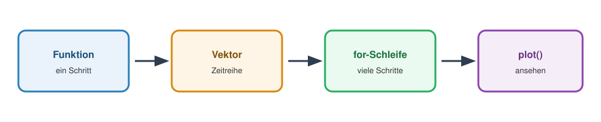{fig-alt="Pipeline" width="70%"}
:::
:::::

**Frage** (wer gewinnt / was stabilisiert?) → **Daten / Motivation** → **LV-Modell** → dieselbe Pipeline wie Woche 2.

## Heute in zwei Stories

| Story | Punchline |
|-------|-----------|
| **1. Konkurrenz** | Stärkere Art gewinnt *immer* — bis wir $\alpha$ drehen → Bistabilität |
| **2. Food Web** | Elk → Aspen gegen 0 · Wolf → Aspen **stabil positiv**, Elk bleibt mittel |

Modell = Herz. Daten / Fotos = Motivation.

::: aside
[Modul 1](../../docs/module-01-overview.html) · Wochen 1–4
:::

## Pipeline

Woche 2: Funktion → Vektor → `for` → `plot`.

Heute: dieselbe Pipeline — 2 Konkurrenten, dann **Aspen + Sage + Elk + Wolf**.

------------------------------------------------------------------------

# Story 1 · Competitive Exclusion

## Biologische Frage

Beide Arten überleben **allein**. Warum stirbt eine **zusammen**?

## Daten: *Paramecium* (Gause)

***P. caudatum*** vs ***P. aurelia*** · gleiche Ressource.

**Quelle:** Gause (1934) · `data/paramecium_*.csv` · `real_digitized`

## Allein: beide schaffen ein Plateau

```{r}
#| fig-height: 3.4
#| fig-width: 8
pc <- read.csv("data/paramecium_caudatum_alone.csv")
pa <- read.csv("data/paramecium_aurelia_alone.csv")
par(mfrow = c(1, 2), mar = c(4, 4, 2.5, 1))
plot(pc$day, pc$volume, type = "b", pch = 16, lwd = 2,
     xlab = "Tag", ylab = "Volumen", main = "caudatum allein")
plot(pa$day, pa$volume, type = "b", pch = 17, lwd = 2,
     xlab = "Tag", ylab = "Volumen", main = "aurelia allein")
```

Beide Arten schaffen allein ein Plateau → Ressource reicht für jede allein.

## Zusammen: eine verschwindet

```{r}
#| fig-height: 3.6
#| fig-width: 7
mix <- read.csv("data/paramecium_competition.csv")
# digitalisierte Punkte: fehlende Werte weglassen (sonst Luecken in type="b")
c_ok <- !is.na(mix$caudatum)
a_ok <- !is.na(mix$aurelia)
ymax <- max(c(mix$caudatum, mix$aurelia), na.rm = TRUE)
plot(mix$day[c_ok], mix$caudatum[c_ok], type = "b", pch = 16, lwd = 2,
     xlab = "Tag", ylab = "Volumen",
     main = "Mischung (Gause)", ylim = c(0, ymax * 1.05),
     xlim = range(mix$day, na.rm = TRUE))
lines(mix$day[a_ok], mix$aurelia[a_ok], type = "b", pch = 17, lwd = 2, lty = 2)
legend("topright", c("caudatum", "aurelia"), pch = c(16, 17), lty = 1:2, bty = "n")
```

→ **Competitive exclusion:** eine Art gewinnt, die andere → 0.

## Modell: LV-Konkurrenz

Direkte additive Änderung von einem Schritt zum nächsten:

$$
\begin{aligned}
N_{1,t+1}
  &= N_{1,t}
     + r_1 N_{1,t}\left(1 - \frac{N_{1,t} + \alpha_{12} N_{2,t}}{K_1}\right) \\[0.35em]
N_{2,t+1}
  &= N_{2,t}
     + r_2 N_{2,t}\left(1 - \frac{N_{2,t} + \alpha_{21} N_{1,t}}{K_2}\right)
\end{aligned}
$$

$\alpha_{ij}$: wie stark Art $j$ Art $i$ die Ressource wegnimmt.  
$\alpha_{12} \gt 1$: Art 2 hemmt Art 1 *stärker* als Art 1 sich selbst.

## Parameter der Konkurrenz

| Symbol | Bedeutung | Wertebereich | Kursbeispiel |
|--------|-----------|--------------|--------------|
| $r_1,r_2$ | Wachstum der Arten | $0 < r \le 1$ | $0.05$ |
| $K_1,K_2$ | Tragfähigkeiten | $K > 0$ | $100$ |
| $\alpha_{12},\alpha_{21}$ | Konkurrenzstärken | $\alpha \ge 0$ | Exclusion: $1.4$ / $0.5$; Bistabil: beide $>1$ |

:::: callout-note
In der Literatur stehen häufig kontinuierliche Änderungsraten. Wir verwenden hier nur diskrete additive Schritte: neuer Bestand = alter Bestand + Änderung.
::::

## Im Code

```r
next_comp <- function(N1, N2, r1, r2, K1, K2, a12, a21) {
  d1 <- r1 * N1 * (1 - (N1 + a12 * N2) / K1)
  d2 <- r2 * N2 * (1 - (N2 + a21 * N1) / K2)
  c(N1 = max(N1 + d1, 0), N2 = max(N2 + d2, 0))
}
```

## Punchline: Start egal — Gewinner fest $$
SIM
$$

$\alpha_{12} = 1.4$, $\alpha_{21} = 0.5$: Art 2 ist «stärker».

```{r}
#| fig-height: 3.8
#| fig-width: 9
next_comp <- function(N1, N2, r1, r2, K1, K2, a12, a21) {
  d1 <- r1 * N1 * (1 - (N1 + a12 * N2) / K1)
  d2 <- r2 * N2 * (1 - (N2 + a21 * N1) / K2)
  c(N1 = max(N1 + d1, 0), N2 = max(N2 + d2, 0))
}
sim_comp <- function(N10, N20, a12, a21, T = 800) {
  N1 <- numeric(T + 1); N2 <- numeric(T + 1)
  N1[1] <- N10; N2[1] <- N20
  for (t in 1:T) {
    out <- next_comp(N1[t], N2[t], 0.05, 0.05, 100, 100, a12, a21)
    N1[t + 1] <- out["N1"]; N2[t + 1] <- out["N2"]
  }
  data.frame(time = 0:T, N1 = N1, N2 = N2)
}
A <- sim_comp(80, 10, 1.4, 0.5)
B <- sim_comp(10, 80, 1.4, 0.5)
par(mfrow = c(1, 2), mar = c(4, 4.2, 2.5, 1))
matplot(A$time, cbind(A$N1, A$N2), type = "l", lty = 1, lwd = 2.5,
        col = c("#2980b9", "#27ae60"), ylim = c(0, 110),
        xlab = "Zeit (Schritte)", ylab = "N", main = "Start: viel N1")
legend("right", c("N1", "N2"), col = c("#2980b9", "#27ae60"),
       lty = 1, lwd = 2.5, bty = "n", cex = 0.8)
matplot(B$time, cbind(B$N1, B$N2), type = "l", lty = 1, lwd = 2.5,
        col = c("#2980b9", "#27ae60"), ylim = c(0, 110),
        xlab = "Zeit (Schritte)", ylab = "N", main = "Start: viel N2")
legend("right", c("N1", "N2"), col = c("#2980b9", "#27ae60"),
       lty = 1, lwd = 2.5, bty = "n", cex = 0.8)
```

**Immer** gewinnt N2 — unabhängig vom Start. Ein Attraktor (Punkt: N1≈0, N2≈K).

------------------------------------------------------------------------

# Story 1b · Drehen → Bistabilität

## Kleine Änderung, grosse Wirkung

Bisher: eine Art klar überlegen → **ein** Gewinner.

Jetzt: **beide** $\alpha \gt 1$ (starke gegenseitige Hemmung) → wer voraus ist, gewinnt.

## Grasland oder Wald?

::::: columns
::: {.column width="50%"}
{fig-alt="Grasland" width="95%"}

**Grasland**
:::
::: {.column width="50%"}
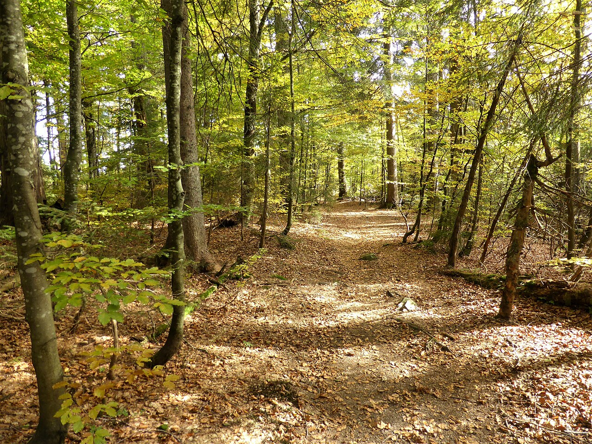{fig-alt="Wald" width="95%"}

**Wald**
:::
:::::

::: aside
Fotos: Wikimedia Commons. Kein Kurs-Datensatz — Idee + Literatur.
:::

## Idee (Literatur)

Alternative stabile Zustände: Feuer, Schatten, Beweidung.  
Gleiche Regeln, anderer Start → Grasland **oder** Wald.

Referenzen: Scheffer et al. (2001); Staver, Archibald & Levin (2011) — siehe Literaturliste.

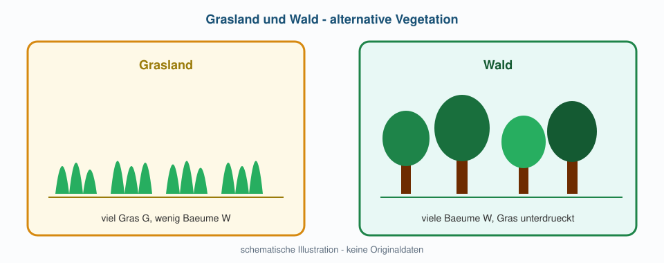{fig-alt="Grasland Wald" width="88%"}

## Simulation: Start entscheidet $$
SIM
$$

$\alpha_{12} = \alpha_{21} = 1.5$

```{r}
#| fig-height: 3.8
#| fig-width: 9
G <- sim_comp(80, 15, 1.5, 1.5)  # Gras voraus
W <- sim_comp(15, 80, 1.5, 1.5)  # Wald voraus
par(mfrow = c(1, 2), mar = c(4, 4.2, 2.5, 1))
matplot(G$time, cbind(G$N1, G$N2), type = "l", lty = 1, lwd = 2.5,
        col = c("#d68910", "#1e8449"), ylim = c(0, 110),
        xlab = "Zeit (Schritte)", ylab = "N", main = "Start: viel Gras (N1)")
legend("right", c("Gras", "Wald"), col = c("#d68910", "#1e8449"),
       lty = 1, lwd = 2.5, bty = "n", cex = 0.8)
matplot(W$time, cbind(W$N1, W$N2), type = "l", lty = 1, lwd = 2.5,
        col = c("#d68910", "#1e8449"), ylim = c(0, 110),
        xlab = "Zeit (Schritte)", ylab = "N", main = "Start: viel Wald (N2)")
legend("right", c("Gras", "Wald"), col = c("#d68910", "#1e8449"),
       lty = 1, lwd = 2.5, bty = "n", cex = 0.8)
```

Gleiche Parameter — anderer Attraktor. **Bistabilität.**

## Was heisst «stabil»? — Übersicht

{fig-alt="Stabilitaet mit Beispielen" width="96%"}

## Beispiel Punkt: Exclusion-Endpunkt $$
SIM
$$

```{r}
#| fig-height: 3.4
#| fig-width: 7.5
ex <- sim_comp(50, 50, 1.4, 0.5)
matplot(ex$time, cbind(ex$N1, ex$N2), type = "l", lty = 1, lwd = 2.5,
        col = c("#2980b9", "#27ae60"), ylim = c(0, 110),
        xlab = "Zeit (Schritte)", ylab = "N",
        main = "Punktattraktor: Exclusion (N1 -> 0, N2 -> K)")
legend("right", c("N1 (verliert)", "N2 (gewinnt)"),
       col = c("#2980b9", "#27ae60"), lty = 1, lwd = 2.5, bty = "n")
abline(h = 0, lty = 3, col = "grey60")
```

Nach Störung (anderer Start) kehren Trajektorien zum **selben** Punkt zurück.

## Beispiel Bistabil: Gras vs. Wald $$
SIM
$$

Schon gesehen: zwei Starts → zwei Endzustände.  
Schematisch:

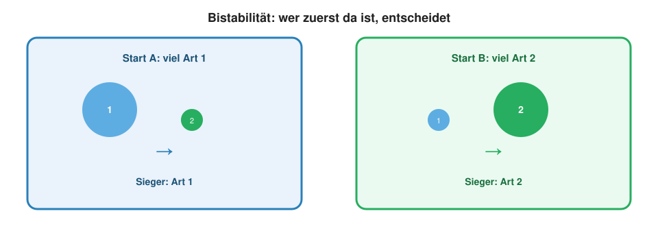{fig-alt="Bistabilitaet" width="80%"}

## Beispiel Zyklus: Räuber–Beute $$
SIM
$$

Klassisches Lotka–Volterra (wie Woche 2 / *Didinium*): Dichten schwingen, sterben nicht aus.

| Symbol | Bedeutung | Wertebereich | Kursbeispiel |
|--------|-----------|--------------|--------------|
| $r$ | Wachstum der Beute | $0 < r \le 0.1$ | $0.020$ |
| $a$ | Angriffsrate | $0 < a \le 0.02$ | $0.002$ |
| $e$ | Umwandlungseffizienz | $0 < e \le 1$ | $0.3$ |
| $m$ | Mortalität der Räuber | $0 < m \le 0.1$ | $0.008$ |

```{r}
#| fig-height: 3.5
#| fig-width: 8.5
sim_pp <- function(N0 = 40, P0 = 8, T = 2500) {
  N <- numeric(T + 1); P <- numeric(T + 1)
  N[1] <- N0; P[1] <- P0
  r <- 0.020; a <- 0.002; e <- 0.3; m <- 0.008
  for (t in 1:T) {
    dN <- r * N[t] - a * N[t] * P[t]
    dP <- e * a * N[t] * P[t] - m * P[t]
    N[t + 1] <- max(N[t] + dN, 0)
    P[t + 1] <- max(P[t] + dP, 0)
  }
  data.frame(time = 0:T, N = N, P = P)
}
pp <- sim_pp()
par(mfrow = c(1, 2), mar = c(4, 4, 2.5, 1))
matplot(pp$time, cbind(pp$N, pp$P), type = "l", lty = 1, lwd = 2.2,
        col = c("#27ae60", "#c0392b"), xlab = "Zeit (Schritte)", ylab = "Dichte",
        main = "Zeitreihe: Schwingung")
legend("topright", c("Beute N", "Raeuber P"), col = c("#27ae60", "#c0392b"),
       lty = 1, lwd = 2.2, bty = "n", cex = 0.75)
plot(pp$N, pp$P, type = "l", lwd = 2, col = "#8e44ad",
     xlab = "Beute N", ylab = "Raeuber P", main = "Phasenraum: Orbit")
```

Attraktor = **Orbit**, nicht ein einzelner Punkt.

------------------------------------------------------------------------

# Story 2 · Food Web: Wolf stabilisiert Aspen

## Neue Leitfrage

Kann ein Top-Prädator (**Wolf**) eine Pflanze (**Aspen**) retten, die sonst gegen 0 geht — ohne dass der Herbivor (**Elk**) ausstirbt?

## Motivation: Yellowstone (kurz)

::::: columns
::: {.column width="48%"}
{fig-alt="Wolf" width="95%"}
:::
::: {.column width="52%"}
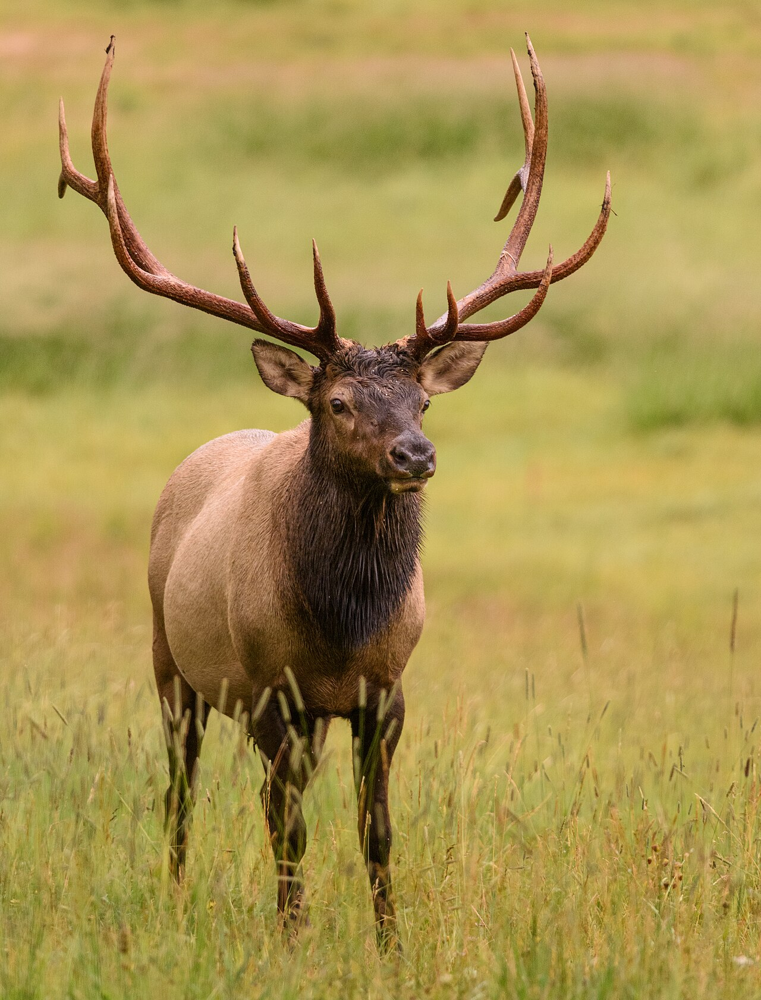{fig-alt="Elk" width="95%"}
:::
:::::

Wolf zurück → Elk kontrolliert → bevorzugte Weiden / Aspen können sich erholen.

::: aside
Fotos: Commons. CSVs `yellowstone_*.csv`: Motivation · Vegetation nicht in unseren Daten.
:::

## Kaskade (Skizze)

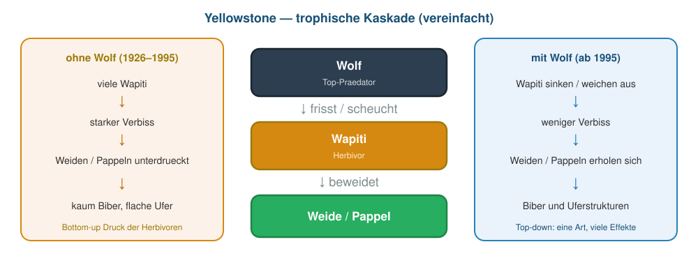{fig-alt="Yellowstone Kaskade" width="92%"}

## Das Gedankenexperiment (mit Namen)

1. **Aspen** und **Sage** konkurrieren — beide können koexistieren  
2. **+ Elk**, der Aspen stark bevorzugt → **Aspen → 0**  
3. **+ Wolf** auf Elk → Aspen bleibt **weg von 0**, Elk bleibt **mittel** (nicht «fast ausgestorben»)

## Modell-Netz

{fig-alt="Aspen Sage Elk Wolf" width="90%"}

## Modell (Herz) — dieselben Namen

Additive Differenzengleichungen, $X^+ = X_{t+1}$:

$$
\begin{aligned}
A^{+}
  &= A
     + r_A A\bigl(1 - \tfrac{A + \alpha_{AS} S}{K}\bigr)
     - a_{\mathrm{EA}} A E \\[0.35em]
S^{+}
  &= S
     + r_S S\bigl(1 - \tfrac{S + \alpha_{SA} A}{K}\bigr)
     - a_{\mathrm{ES}} S E \\[0.35em]
E^{+}
  &= E
     + e_E(a_{\mathrm{EA}} A + a_{\mathrm{ES}} S)E
     - m_E E - a_{\mathrm{WE}} E W \\[0.35em]
W^{+}
  &= W
     + e_W a_{\mathrm{WE}} E W - m_W W
\end{aligned}
$$

Kurz: $a_{\mathrm{EA}}=a_{\mathrm{elk,aspen}}$, $a_{\mathrm{ES}}=a_{\mathrm{elk,sage}}$, $a_{\mathrm{WE}}=a_{\mathrm{wolf,elk}}$.  
$a_{\mathrm{EA}} \gg a_{\mathrm{ES}}$: Elk frisst vor allem Aspen.  

## Parameter (Unterrichts-Set)

| Symbol | Bedeutung | Wertebereich | Kursbeispiel |
|--------|-----------|--------------|--------------|
| $r_A,r_S$ | Wachstum Aspen / Sage | $0 < r \le 0.1$ | $\approx 0.02$–$0.025$ |
| $K$ | Tragfähigkeit der Pflanzen | $K > 0$ | $100$ |
| $\alpha_{AS},\alpha_{SA}$ | Konkurrenz | $\alpha \ge 0$ | $\approx 0.55$ / $0.7$ |
| $a_{\mathrm{EA}},a_{\mathrm{ES}}$ | Beweidungsraten | $0 < a \le 0.05$ | $a_{\mathrm{EA}} \gg a_{\mathrm{ES}}$ |
| $a_{\mathrm{WE}}$ | Angriff Wolf → Elk | $0 < a \le 0.05$ | klein positiv |
| $e_E,e_W$ | Umwandlungseffizienzen | $0 < e \le 1$ | $\approx 0.2$–$0.8$ |
| $m_E,m_W$ | Mortalitäten | $0 < m < 1$ | $\approx 0.01$–$0.1$ |

## Schritt A: nur Pflanzen $$
SIM
$$

```{r}
#| fig-height: 3.3
#| fig-width: 7.5
plants <- sim_comp(40, 50, 0.55, 0.7)
matplot(plants$time, cbind(plants$N1, plants$N2), type = "l", lty = 1, lwd = 2.5,
        col = c("#27ae60", "#1abc9c"), ylim = c(0, 100),
        xlab = "Zeit (Schritte)", ylab = "Dichte", main = "Nur Aspen + Sage: Koexistenz [SIM]")
legend("bottomright", c("Aspen", "Sage"),
       col = c("#27ae60", "#1abc9c"), lty = 1, lwd = 2.5, bty = "n", cex = 0.85)
```

Ohne Herbivor: beide Pflanzen bleiben positiv.

## Schritt B: + Elk, kein Wolf → Aspen Exclusion $$
SIM
$$

```{r}
#| fig-height: 3.9
#| fig-width: 8.8
next_web <- function(x, p) {
  A <- x["Aspen"]; S <- x["Sage"]; E <- x["Elk"]; W <- x["Wolf"]
  dA <- p$rA * A * (1 - (A + p$aAS * S) / p$K) - p$a_elk_aspen * A * E
  dS <- p$rS * S * (1 - (S + p$aSA * A) / p$K) - p$a_elk_sage * S * E
  dE <- (p$eE * (p$a_elk_aspen * A + p$a_elk_sage * S) * E -
           p$mE * E - p$a_wolf_elk * E * W)
  dW <- p$eW * p$a_wolf_elk * E * W - p$mW * W
  c(Aspen = max(A + dA, 0), Sage = max(S + dS, 0),
    Elk = max(E + dE, 0), Wolf = max(W + dW, 0))
}
web_p <- list(
  rA = 0.024, rS = 0.020, K = 100,
  aAS = 0.55, aSA = 0.70,
  a_elk_aspen = 0.0007, a_elk_sage = 0.0004,
  eE = 0.45, mE = 0.002,
  a_wolf_elk = 0.0008, eW = 0.40, mW = 0.006
)
sim_web <- function(Wolf0 = 0, T = 6000, p = web_p) {
  X <- matrix(0, T + 1, 4,
              dimnames = list(NULL, c("Aspen", "Sage", "Elk", "Wolf")))
  X[1, ] <- c(Aspen = 40, Sage = 50, Elk = 25, Wolf = Wolf0)
  for (t in 1:T) X[t + 1, ] <- next_web(X[t, ], p)
  data.frame(time = 0:T, X)
}
noW <- sim_web(Wolf0 = 0)
cols <- c(Aspen = "#27ae60", Sage = "#1abc9c", Elk = "#d68910", Wolf = "#2c3e50")
matplot(noW$time, noW[, names(cols)], type = "l", lty = 1, lwd = 2.4,
        col = cols, xlab = "Zeit (Schritte)", ylab = "Haeufigkeit",
        main = "+ Elk, kein Wolf: Aspen -> 0 [SIM]")
legend("topright", names(cols), col = cols, lty = 1, lwd = 2.4, bty = "n", cex = 0.75)
```

Aspen geht gegen **null**. Elk ist hoch (~45). Sage bleibt (wenig beweidet).

## Schritt C: + Wolf → Aspen gerettet, Elk mittel $$
SIM
$$

```{r}
#| fig-height: 3.9
#| fig-width: 8.8
withW <- sim_web(Wolf0 = 2)
matplot(withW$time, withW[, names(cols)], type = "l", lty = 1, lwd = 2.4,
        col = cols, xlab = "Zeit (Schritte)", ylab = "Haeufigkeit",
        main = "+ Wolf: Aspen stabil, Elk bleibt mittel [SIM]")
legend("topright", names(cols), col = cols, lty = 1, lwd = 2.4, bty = "n", cex = 0.75)
```

Aspen bleibt klar positiv. Elk fällt, bleibt aber **deutlich über null** (~19) — kein «fast Aussterben».

## Der Effekt auf einen Blick

```{r}
#| fig-height: 3.8
#| fig-width: 8.5
late <- function(df) colMeans(tail(df[, names(cols)], 1500))
M <- rbind(ohne_Wolf = late(noW), mit_Wolf = late(withW))
par(mfrow = c(1, 2), mar = c(4.5, 4, 2.5, 1))
barplot(t(M[, c("Aspen", "Sage")]), beside = TRUE,
        col = c("#27ae60", "#1abc9c"), ylab = "Mittel (spaete Zeit)",
        main = "Pflanzen", legend.text = c("Aspen", "Sage"),
        args.legend = list(x = "topleft", bty = "n", cex = 0.8))
barplot(t(M[, c("Elk", "Wolf")]), beside = TRUE,
        col = c("#d68910", "#2c3e50"), ylab = "Mittel (spaete Zeit)",
        main = "Tiere", legend.text = c("Elk", "Wolf"),
        args.legend = list(x = "topleft", bty = "n", cex = 0.8))
```

| | Aspen | Sage | Elk | Wolf |
|--|------:|-----:|----:|-----:|
| ohne Wolf | ≈ 0 | ~11 | ~44 | 0 |
| mit Wolf | ~18 | ~50 | ~19 | ~16 |

## Mechanismus in einem Satz

Wolf senkt Elk → Beweidungsdruck auf Aspen fällt unter die Wachstumsschwelle → Aspen kann wieder einfallen / bleiben.  
Elk bleibt durch Pflanzen + moderate Wolf-Kontrolle im Gleichgewicht.

## Reiches Netz (Kontext)

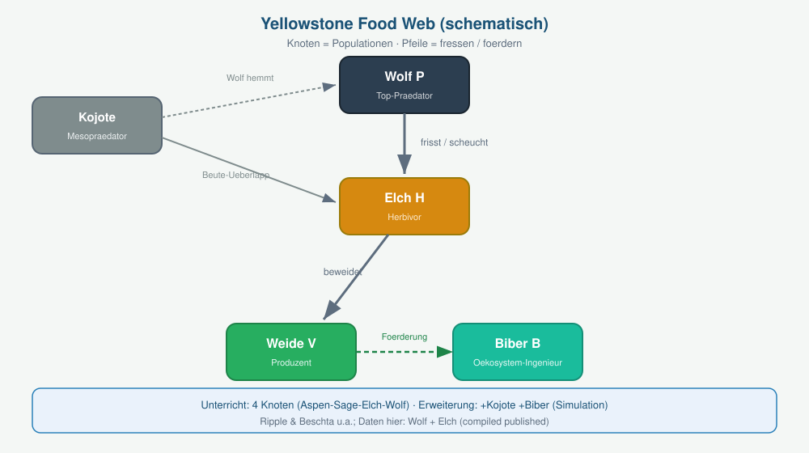{fig-alt="Food Web Yellowstone" width="88%"}

Dieselbe Pipeline — mehr Knoten. Kern-Punchline bleibt: Wolf → Aspen.

## Was kommt dazu?

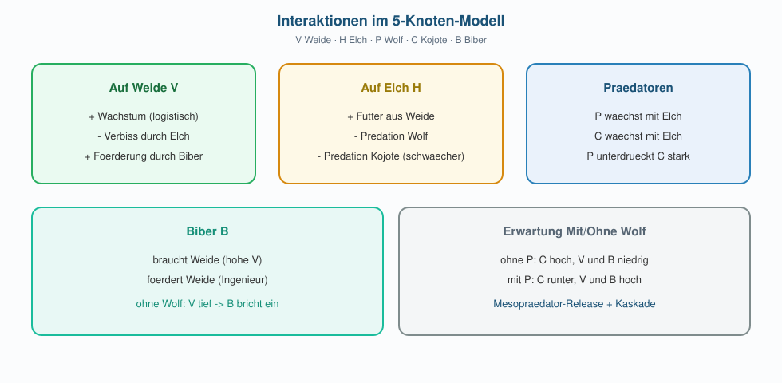{fig-alt="Mechanismen 5 Knoten" width="92%"}

| Knoten | Rolle im erweiterten Modell |
|--------|------------------------------|
| **Kojote** | Mesoprädator — ohne Wolf hoch (Release) |
| **Biber** | braucht Aspen; fördert Aspen (Ingenieur) |

## Erweitertes Modell $$
SIM
$$ — ohne Wolf

| Symbol | Bedeutung | Wertebereich | Kursbeispiel |
|--------|-----------|--------------|--------------|
| $r_C,r_B$ | Wachstum Kojote / Biber | $0 < r \le 0.1$ | klein positiv |
| $K_C,K_B$ | Tragfähigkeiten | $K > 0$ | positiv |
| $a_{WC}$ | Angriff Wolf → Kojote | $0 < a \le 0.05$ | klein positiv |
| $m_B$ | Mortalität Biber | $0 < m < 1$ | klein positiv |
| $f_{BA}$ | Förderung von Aspen | $0 < f \le 1$ | $\le 1$ |
| $h_A,h_B$ | Halbsättigung | $h > 0$ | positiv |

```{r}
#| fig-height: 3.9
#| fig-width: 9
next_rich <- function(x, p) {
  A <- x["Aspen"]; S <- x["Sage"]; E <- x["Elk"]
  W <- x["Wolf"]; C <- x["Coyote"]; B <- x["Beaver"]
  dA <- p$rA * A * (1 - (A + p$aAS * S) / p$K) *
           (1 + p$fBA * B / (p$hB + B)) - p$aEA * A * E
  dS <- p$rS * S * (1 - (S + p$aSA * A) / p$K) - p$aES * S * E
  dE <- p$eE * (p$aEA * A + p$aES * S) * E - p$mE * E - p$aWE * E * W
  dW <- p$eW * p$aWE * E * W - p$mW * W
  dC <- p$rC * C * (1 - C / p$KC) - p$aWC * C * W
  dB <- p$rB * B * (A / (p$hA + A)) - p$mB * B * (1 + B / p$KB)
  c(Aspen = max(A + dA, 0), Sage = max(S + dS, 0),
    Elk = max(E + dE, 0), Wolf = max(W + dW, 0),
    Coyote = max(C + dC, 0), Beaver = max(B + dB, 0))
}
rich_p <- list(
  rA = 0.024, rS = 0.020, K = 100, aAS = 0.55, aSA = 0.70,
  aEA = 0.0007, aES = 0.0004, eE = 0.45, mE = 0.002,
  aWE = 0.0008, eW = 0.40, mW = 0.006,
  rC = 0.014, KC = 28, aWC = 0.00044,
  rB = 0.010, hA = 10, mB = 0.0032, KB = 12, fBA = 0.30, hB = 5
)
sim_rich <- function(Wolf0 = 0, T = 5500, p = rich_p) {
  nm <- c("Aspen", "Sage", "Elk", "Wolf", "Coyote", "Beaver")
  X <- matrix(0, T + 1, 6, dimnames = list(NULL, nm))
  X[1, ] <- c(Aspen = 40, Sage = 50, Elk = 25, Wolf = Wolf0,
              Coyote = 12, Beaver = 3)
  for (t in 1:T) X[t + 1, ] <- next_rich(X[t, ], p)
  data.frame(time = 0:T, X)
}
rich_cols <- c(Aspen = "#27ae60", Sage = "#1abc9c", Elk = "#d68910",
               Wolf = "#2c3e50", Coyote = "#7f8c8d", Beaver = "#8e44ad")
noW_rich <- sim_rich(Wolf0 = 0)
matplot(noW_rich$time, noW_rich[, names(rich_cols)], type = "l", lty = 1,
        lwd = 2.2, col = rich_cols, xlab = "Zeit (Schritte)", ylab = "Haeufigkeit",
        main = "6 Knoten, kein Wolf: Aspen & Biber -> 0, Kojote hoch [SIM]")
legend("topright", names(rich_cols), col = rich_cols, lty = 1, lwd = 2.2,
       bty = "n", cex = 0.7, ncol = 2)
```

## Erweitertes Modell $$
SIM
$$ — mit Wolf

```{r}
#| fig-height: 3.9
#| fig-width: 9
withW_rich <- sim_rich(Wolf0 = 2)
matplot(withW_rich$time, withW_rich[, names(rich_cols)], type = "l", lty = 1,
        lwd = 2.2, col = rich_cols, xlab = "Zeit (Schritte)", ylab = "Haeufigkeit",
        main = "Mit Wolf: Aspen + Biber hoch, Kojote runter [SIM]")
legend("topright", names(rich_cols), col = rich_cols, lty = 1, lwd = 2.2,
       bty = "n", cex = 0.7, ncol = 2)
```

## Reichhaltigkeit auf einen Blick

```{r}
#| fig-height: 3.7
#| fig-width: 8.5
late6 <- function(df) colMeans(tail(df[, names(rich_cols)], 1200))
M6 <- rbind(ohne = late6(noW_rich), mit = late6(withW_rich))
par(mfrow = c(1, 2), mar = c(4.5, 4, 2.5, 1))
barplot(t(M6[, c("Aspen", "Beaver")]), beside = TRUE,
        col = c("#27ae60", "#8e44ad"), ylab = "Mittel (spaete Zeit)",
        main = "Aspen & Biber", legend.text = c("Aspen", "Biber"),
        args.legend = list(x = "topleft", bty = "n", cex = 0.75))
barplot(t(M6[, c("Coyote", "Wolf")]), beside = TRUE,
        col = c("#7f8c8d", "#2c3e50"), ylab = "Mittel (spaete Zeit)",
        main = "Kojote & Wolf", legend.text = c("Kojote", "Wolf"),
        args.legend = list(x = "topleft", bty = "n", cex = 0.75))
```

**Ohne Wolf:** Aspen ≈ 0, Biber ≈ 0, Kojote hoch.  
**Mit Wolf:** Aspen + Biber erholen sich, Kojote sinkt (Mesoprädator-Release rückgängig).

## Lehre daraus

4-Knoten-Modell = Unterrichts-Herz (klar, prüfbar).  
6-Knoten-Modell = dieselbe Idee, **reichhaltiger** — und immer noch simulierbar mit `next → for → plot`.

Mehr Realität ≠ neue Mathematik-Sprache; eher mehr Einträge in der Interaktionsliste.

------------------------------------------------------------------------

# Ausblick · zwei qualitative Beispiele

## Warum hier?

Dieselbe Idee wie heute — **Prädator verhindert Exclusion / hält Zustände** —  
in zwei berühmten Systemen. **Kein Modell**, nur Geschichte + Bild.

## 1 · Seeotter, Seeigel, Kelp (Smith et al. 2021)

[PNAS doi:10.1073/pnas.2012493118](https://doi.org/10.1073/pnas.2012493118)  
Graphical Abstract im Paper ansehen — hier nur unsere Unterrichtsskizze.

::::: columns
::: {.column width="33%"}
{fig-alt="Seeotter" width="95%"}
:::
::: {.column width="33%"}
{fig-alt="Seeigel" width="95%"}
:::
::: {.column width="33%"}
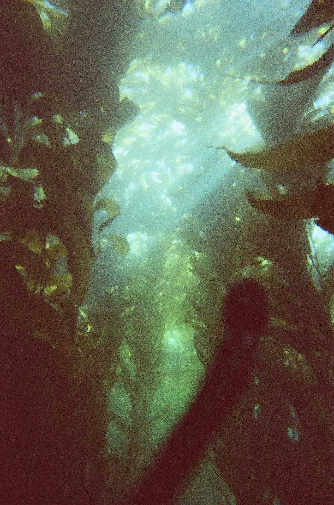{fig-alt="Kelpwald" width="95%"}
:::
:::::

::: aside
Fotos: Wikimedia Commons · Skizze: Kurs (kein PNAS-Copy)
:::

## Otter–Igel–Kelp: die Punchline

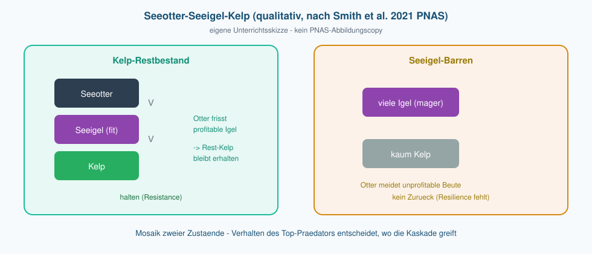{fig-alt="Otter Igel Kelp Mosaik" width="94%"}

Nach 2014: **Mosaik** aus Kelp-Resten und Seeigel-Barren (alternative Zustände).  
Seeotter fressen vor allem **profitable** Igel → halten Rest-Kelp (**Resistance**),  
stellen Barren aber nicht wieder her (**keine Resilience**).

Brücke zu heute: Top-down + Verhalten + zwei Zustände nebeneinander.

## 2 · Paine 1966 — Seestern als Keystone

Klassiker: *Pisaster* entfernen → Miesmuscheln gewinnen den Raum →  
andere Platzhalter verschwinden (**Exclusion**).

[USGS: Revisiting Paine 1966](https://www.usgs.gov/publications/revisiting-paines-1966-sea-star-removal-experiment-most-cited-empirical-article) · Paine (1966) *Am. Nat.*

::::: columns
::: {.column width="48%"}
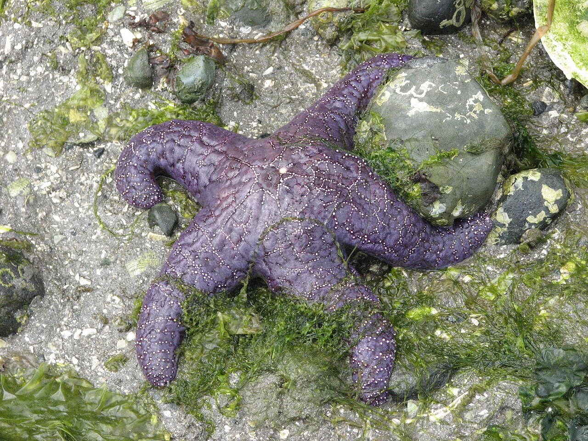{fig-alt="Pisaster" width="92%"}
:::
::: {.column width="52%"}
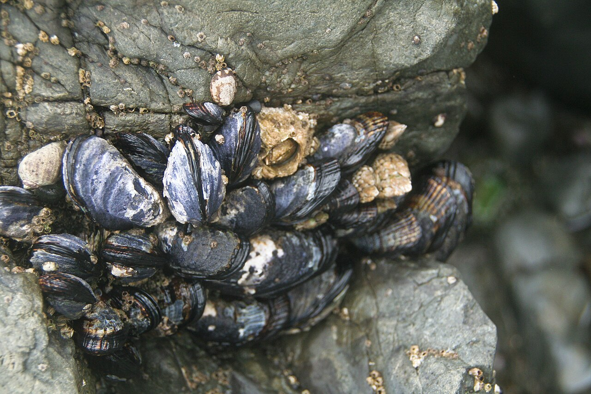{fig-alt="Miesmuscheln" width="92%"}
:::
:::::

## Paine: mit / ohne Seestern

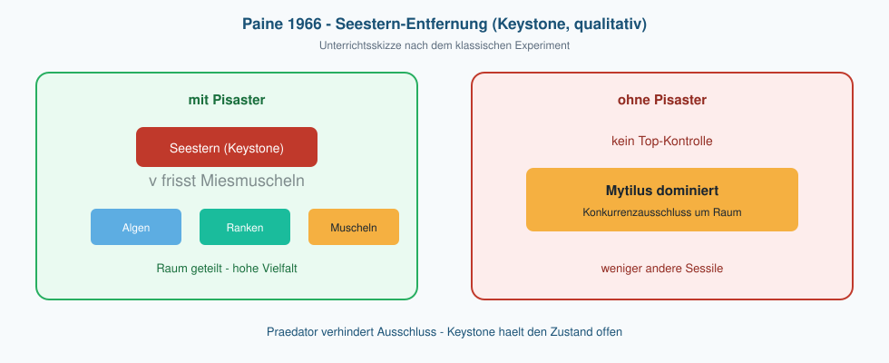{fig-alt="Paine Keystone Skizze" width="94%"}

**Keystone-Prädator:** relativ selten, aber entscheidet über Vielfalt —  
indem er den starken Konkurrenten (Muschel) in Schach hält.

## Was Sie mitnehmen

| Heute (Yellowstone-Modell) | Qualitativ |
|----------------------------|------------|
| Wolf rettet Aspen | *Pisaster* rettet Platzhalter-Vielfalt |
| Elk würde Aspen excludieren | *Mytilus* excludiert andere um Raum |
| Bistabilität Gras/Wald | Kelp vs. Barren (Mosaik) |
| Verhalten/Netz reichhaltig | Otter frisst selektiv |

Nächste Woche: dieselben Interaktionsideen als **Strategien** (RPS).

------------------------------------------------------------------------

# Notebook & Abschluss

## Notebook

1. *Paramecium*-Daten + Exclusion (Start egal)  
2. $\alpha$ drehen → Bistabilität (Gras/Wald) + Stabilitäts-Beispiele  
3. Food Web: Aspen/Sage → +Elk → +Wolf; Aspen retten, Elk mittel halten  
4. (Demo) reicheres Netz: +Kojote +Biber — dieselbe Pipeline 

## Brücke zu Woche 4

Interaktionskoeffizienten: wer unterdrückt wen ($a_{\mathrm{elk,aspen}}$, …).  
Woche 4: dieselbe Sprache für **Strategien** (RPS / Spieltheorie).

## Abschlussfragen

1. Wann ist der Gewinner unabhängig vom Start — wann nicht?  
2. Was ändert sich biologisch, wenn beide $\alpha \gt 1$?  
3. Warum rettet der Wolf Aspen, ohne dass Elk gegen 0 geht?  
4. (Qualitativ) Was verbindet Paine / Seeotter–Kelp mit dem heutigen Food-Web-Punch?

## Nächste Woche

Spieltheorie · Echsen-RPS · **Checkpoint A**

## Literatur

Alles, was in dieser Einheit namentlich vorkommt:

1. **Gause, G. F. (1934).** *The Struggle for Existence*. Williams & Wilkins. — Konkurrenz *P. caudatum* / *P. aurelia*; Kursdaten `data/paramecium_*.csv`.
2. **Mühlbauer, L. K., Schulze, M., Harpole, W. S., & Clark, A. T. (2020).** gauseR… *Ecology and Evolution* 10: 13296–13306. [doi:10.1002/ece3.6926](https://doi.org/10.1002/ece3.6926) — Digitalisierung der Gause-Daten.
3. **Lotka, A. J. (1925)**; **Volterra, V. (1926).** — klassisches Räuber–Beute / Zyklus-Beispiel (Stabilitätsform «Zyklus»).
4. **Scheffer, M., et al. (2001).** Catastrophic shifts in ecosystems. *Nature* 413: 591–596. [doi:10.1038/35098000](https://doi.org/10.1038/35098000) — alternative stabile Zustände.
5. **Staver, A. C., Archibald, S., & Levin, S. A. (2011).** The global extent and determinants of savanna and forest as alternative biome states. *Science* 334: 230–232. [doi:10.1126/science.1210465](https://doi.org/10.1126/science.1210465) — Grasland/Wald-Lesart.
6. **Ripple, W. J., & Beschta, R. L. (2012).** Trophic cascades in Yellowstone: The first 15 years after wolf reintroduction. *Biological Conservation* 145: 205–213. — Motivation Wolf / Elk / Vegetation (Kursmodell ist vereinfacht).
7. **Smith, J. G., et al. (2021).** Behavioral responses across a mosaic of ecosystem states restructure a sea otter–urchin trophic cascade. *PNAS* 118: e2012493118. [doi:10.1073/pnas.2012493118](https://doi.org/10.1073/pnas.2012493118) — Seeotter–Seeigel–Kelp (qualitativ).
8. **Paine, R. T. (1966).** Food web complexity and species diversity. *The American Naturalist* 100: 65–75. — Keystone-*Pisaster*.

Bildnachweise: `pics/ecosystems/`, `pics/yellowstone/`, `pics/keystone/` (CREDITS).

## Navigation

| | |
|---|---|
| Kursplan | [Kursplan](../../docs/course-outline.html) |
| Zurück | [← Woche 2](../week-02/slides.html) |
| Weiter | [Woche 4 →](../week-04/slides.html) |
