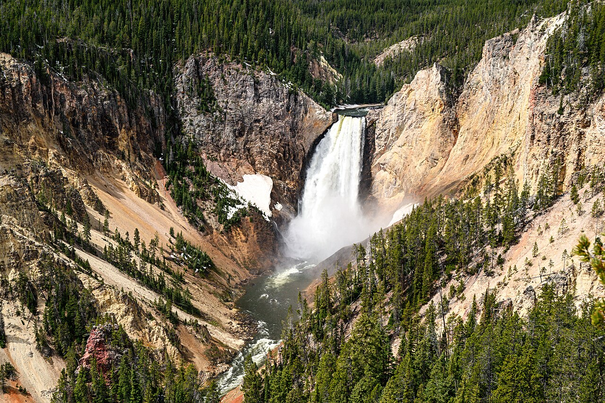
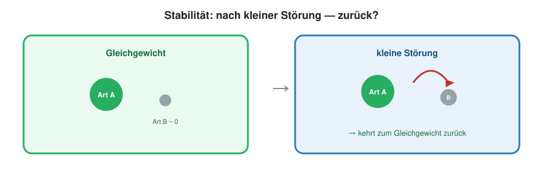
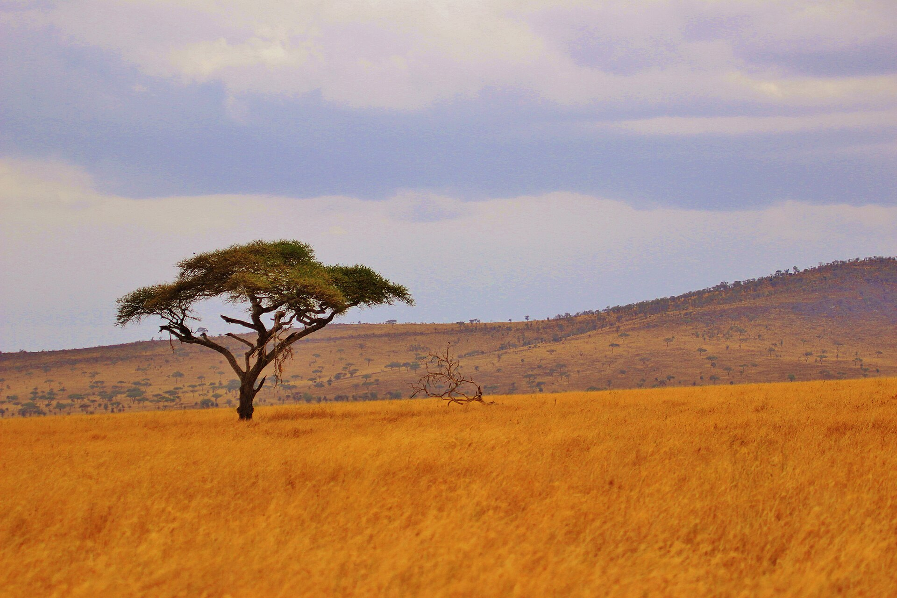
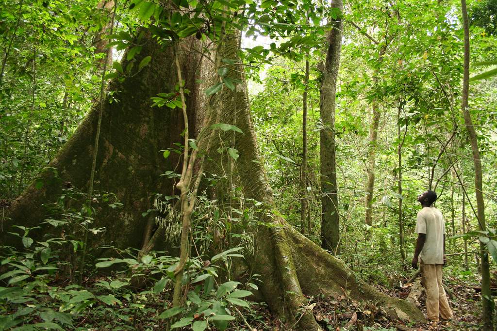
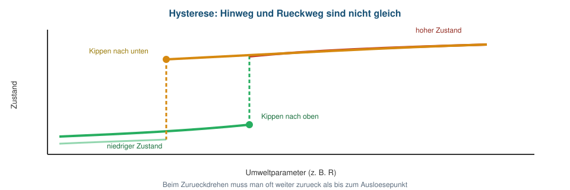

## Übersicht

**Woche 3** von 14 · **Do., 1. Okt. 2026, 08:15–10:00**

[Start](../../index.html) · **[Notebook](notebook.html)**

::: aside
Pfeiltasten · **M** Menü · **E** PDF · **Esc** Übersicht
:::

## Sitzungsablauf

| Teil | Dauer | Was |
|------|-------|-----|
| Vorlesung | ~45–60 min | Störung → Bistabilität → Keystone → Hysterese |
| Notebook | ~45 min | Yellowstone-Netz selbst rechnen |

## Lernziele

Nach heute **kennen** Sie …

1. **Gleichgewicht**, **Stabilität** und **Einzugsgebiet**: stabil heisst, das System kehrt nach einer kleinen Umweltänderung zurück,
2. dass Konkurrenz **einen** Endpunkt oder **Bistabilität** haben kann, und welche Rolle $\alpha$ und der Start dabei spielen,
3. **Keystone** (starke Wirkung einer Art auf die Gemeinschaft) und **Hysterese** (Hinweg und Rückweg sind nicht gleich).

# Einstieg · Eine Art ändert das System

## Yellowstone

::::: columns
::: {.column width="48%"}
{fig-alt="Grand Canyon of the Yellowstone" width="100%"}
:::
::: {.column width="52%"}
Ein grosses Ökosystem, viele Wechselwirkungen.

1995/96 kehren **Wölfe** zurück, nach Jahrzehnten ohne Top-Prädator.

Frage: Ändert **eine** Art den Zustand des ganzen Systems?
:::
:::::

::: aside
Yellowstone National Park
:::

## Ohne Wolf (1926–1995)

1926 wird der letzte Wolf im Park getötet.

::::: columns
::: {.column width="42%"}
{fig-alt="Wapiti-Hirsch Cervus canadensis" width="92%"}
:::
::: {.column width="58%"}
**Wapiti-Hirsche** (*Cervus canadensis*) — nicht Elche (*Alces*).

Danach beobachtet und diskutiert:

- starke Beweidung an Flussufern  
- Weiden und Pappeln kommen kaum nach  
- weniger Lebensraum für Biber und andere Uferarten  
:::
:::::

::: aside
Wapiti: Rocky Mountain · stellvertretend für Yellowstones Herbivoren
:::

## Wiederansiedlung 1995/96

::::: columns
::: {.column width="45%"}
{fig-alt="Wolf Canis lupus" width="100%"}
:::
::: {.column width="55%"}
Grauwölfe werden wiederangesiedelt. Das ist eine **Störung** des Systems.

Diskutierte Folgen:

- Wapiti werden seltener oder meiden riskante Orte  
- Verbiss an Ufern nimmt ab  
- Vegetation kann nachwachsen  
:::
:::::

::: aside
*Canis lupus*
:::

## Trophische Kaskade

{fig-alt="Yellowstone Kaskade ohne und mit Wolf" width="96%"}

Die Wirkung läuft von oben nach unten.

Räumlich und zeitlich ist der Befund komplizierter als das Schema (Ripple & Beschta 2012; Fortin et al. 2005).

## Drei Begriffe

::::: columns
::: {.column width="33%"}
### Gleichgewicht

Der Zustand ändert sich nicht mehr.
:::
::: {.column width="33%"}
### Stabil

Nach einer **kleinen Umweltänderung** kehrt das System zum Ausgangszustand zurück.
:::
::: {.column width="33%"}
### Einzugsgebiet

Alle Starts, die zum **selben** Gleichgewicht führen.
:::
:::::

## Stabilität = Reaktion auf Störung

Woche 2: Beute und Räuber bleiben oft **sichtbar**. Das ist Persistenz, noch nicht Stabilität.

{fig-alt="Stabilitaet: nach kleinem Push kehrt das System zum Endzustand zurueck" width="70%"}

**Stabilität** heisst hier: nach einer kleinen Veränderung der Umwelt kehrt das System in den ursprünglichen Zustand zurück.

Zum Beispiel ein trockener Sommer, ein paar zusätzliche Wapiti, oder eine Art, die kurz auftaucht und wieder verschwindet. Bleibt danach derselbe Zustand, war das Gleichgewicht stabil.

# 1 · Zwei Arten, eine Ressource

## Beide allein — beide bleiben

{fig-alt="Zwei Paramecium-Arten ueberleben allein; zusammen wird eine verdraengt" width="58%"}

Beide *Paramecium*-Arten überleben **allein**. Warum gewinnt zusammen **eine**?

::: aside
*P. caudatum* vs. *P. aurelia* · Gause (1934)
:::

## Allein: ein Plateau

```{r}
#| fig-height: 3.6
#| fig-width: 8
#| out-width: 70%
source("../slides-ggplot.R")
pc <- read.csv("data/paramecium_caudatum_alone.csv")
pa <- read.csv("data/paramecium_aurelia_alone.csv")
p_pc <- ggplot(pc, aes(day, volume)) +
  geom_line(colour = col_blue, linewidth = 0.9) +
  geom_point(colour = col_blue, size = 1.7) +
  labs(x = "Tag", y = "Volumen", title = "P. caudatum allein") +
  theme_slide()
p_pa <- ggplot(pa, aes(day, volume)) +
  geom_line(colour = col_orange, linewidth = 0.9) +
  geom_point(colour = col_orange, size = 1.7, shape = 17) +
  labs(x = "Tag", y = "Volumen", title = "P. aurelia allein") +
  theme_slide()
p_pc + p_pa
```

Die Ressource reicht für jede Art allein → Tragfähigkeit $K_i$.

## Zusammen: eine Art verschwindet

```{r}
#| fig-height: 3.7
#| fig-width: 7.5
#| out-width: 62%
mix <- read.csv("data/paramecium_competition.csv")
long <- rbind(
  data.frame(day = mix$day, volume = mix$caudatum, art = "P. caudatum"),
  data.frame(day = mix$day, volume = mix$aurelia, art = "P. aurelia")
)
long$art <- factor(long$art, levels = c("P. caudatum", "P. aurelia"))
ggplot(subset(long, !is.na(volume)), aes(day, volume, colour = art, shape = art)) +
  geom_line(linewidth = 0.95) +
  geom_point(size = 1.8) +
  scale_colour_manual(values = c(col_blue, col_orange)) +
  scale_shape_manual(values = c(16, 17)) +
  labs(x = "Tag", y = "Volumen", title = "Beide Arten zusammen") +
  theme_slide()
```

**Konkurrenzausschluss:** langfristig bleibt eine Art.

## Wie modellieren wir das?

Diesmal **nicht** Räuber und Beute: keine Art frisst die andere.

Beide *Paramecium*-Arten nutzen **dieselbe Ressource**.

Das modellieren wir als **Konkurrenz**.

## Dieselbe Logik wie Woche 2

**Zuwachs = Wachstum − Gedränge − Konkurrenz.**

Eine Population: die Bremse ist $N/K$.

Zwei Populationen: gegen $K_1$ zählt nicht nur $N_1$, sondern auch die andere Art — umgerechnet in Einheiten von Art 1.

## Was $\alpha_{12}$ misst

{fig-alt="Alpha uebersetzt Art 2 in effektiven Ressourcenverbrauch aus Sicht von Art 1" width="56%"}

$$
N_{1,t+1} = N_{1,t} + r_1 N_{1,t}\left(1 - \frac{N_1 + \alpha_{12} N_2}{K_1}\right)
$$

Ein Individuum von Art 2 zählt wie $\alpha_{12}$ Individuen von Art 1. Analog Art 2 mit $\alpha_{21}$.

## Die Interaktionsmatrix

$$
A = \begin{pmatrix}
1 & \alpha_{12} \\
\alpha_{21} & 1
\end{pmatrix}
$$

**Lesen:** Zeile $i$ ist die Art, die gehemmt wird. Spalte $j$ ist die Art, die hemmt. $A_{12}=\alpha_{12}$: ein Individuum von Art 2 zählt in der Tragfähigkeit von Art 1 wie $\alpha_{12}$ eigene.

**Warum $1$ auf der Diagonale?** Die eigene Dichte ist der Massstab. $\alpha=1$ heisst: ein Fremdes hemmt genau so stark wie ein Eigenes. Alles andere ist relativ zu dieser $1$.

## $\alpha$ wählen

Massstab **1** = so stark wie die eigene Selbstkonkurrenz.

**$\alpha_{12}<1$.** Art 2 hemmt schwächer als ein eigenes Individuum. Zwei Gräser auf leicht verschiedenen Stellen: jede leidet vor allem unter der eigenen Dichte. Beide können bleiben.

**$\alpha_{12}=1$.** Ein Fremdes zählt wie ein Eigenes. Zwei Sorten desselben Getreides, dieselbe Nische — austauschbar.

**$\alpha_{12}>1$.** Art 2 hemmt stärker. *P. aurelia* gegen *P. caudatum*: die stärkere Art verdrängt. Oder Wald gegen Gras: die Krone beschattet stärker, als Gras den Wald bremst.

Man vergleicht **beide** $\alpha$ mit $1$. Davon hängt ab, ob eine Art bleibt, beide, oder — je nach Start — die eine oder die andere.

::: aside
Kurswerte zur Illustration — keine Schätzungen aus den Gause-Daten.
:::

```{r}
#| include: false
source("../slides-ggplot.R")
next_comp <- function(N1, N2, r1 = 0.05, r2 = 0.05,
                      K1 = 100, K2 = 100, a12, a21) {
  d1 <- r1 * N1 * (1 - (N1 + a12 * N2) / K1)
  d2 <- r2 * N2 * (1 - (N2 + a21 * N1) / K2)
  c(N1 = max(N1 + d1, 0), N2 = max(N2 + d2, 0))
}
sim_comp <- function(N10, N20, a12, a21, T = 800) {
  N1 <- numeric(T + 1); N2 <- numeric(T + 1)
  N1[1] <- N10; N2[1] <- N20
  for (t in 1:T) {
    out <- next_comp(N1[t], N2[t], a12 = a12, a21 = a21)
    N1[t + 1] <- out["N1"]; N2[t + 1] <- out["N2"]
  }
  data.frame(time = 0:T, N1 = N1, N2 = N2)
}
next_space <- function(M, O, P = 0,
                       rM = 0.08, rO = 0.06, K = 100,
                       aOM = 0.45, aMO = 1.55, a = 0.0045) {
  dM <- rM * M * (1 - (M + aOM * O) / K) - a * P * M
  dO <- rO * O * (1 - (O + aMO * M) / K)
  c(M = max(M + dM, 0), O = max(O + dO, 0))
}
sim_space <- function(P, T = 600, M0 = 35, O0 = 35) {
  M <- numeric(T + 1); O <- numeric(T + 1)
  M[1] <- M0; O[1] <- O0
  for (t in 1:T) {
    out <- next_space(M[t], O[t], P = P)
    M[t + 1] <- out["M"]; O[t + 1] <- out["O"]
  }
  data.frame(time = 0:T, M = M, O = O)
}
```

## Drei Muster relativ zu $1$

| $\alpha$ | Intuition | Endpunkt |
|----------|-----------|----------|
| eine Richtung $>1$, die andere $<1$ | eine Art hemmt die andere stärker als sich selbst | **Ausschluss** |
| beide $<1$ | Fremdkonkurrenz schwächer als Selbstkonkurrenz | **Koexistenz** |
| beide $>1$ | gegenseitig zu stark | **zwei** mögliche Gewinner |

Die Gleichungen bleiben dieselben. Welches der drei Muster entsteht, hängt davon ab, wo die beiden $\alpha$ relativ zu 1 liegen.

## Ausschluss

Eine Art hemmt die andere stärker als sich selbst. $(\alpha_{12},\alpha_{21})=(1.4,\ 0.5)$.

```{r}
#| fig-height: 3.5
#| fig-width: 9
#| out-width: 74%
A <- sim_comp(80, 10, 1.4, 0.5)
B <- sim_comp(10, 80, 1.4, 0.5)
plot_two_ts(
  rbind(ts_long(A, "Start: viel N1"), ts_long(B, "Start: viel N2")),
  cols = c(col_navy, col_green)
)
```

Von beiden Starts aus bleibt am Ende dieselbe Art übrig. Es gibt ein stabiles Gleichgewicht, wie bei den beiden *Paramecium*.

## Koexistenz

Fremdkonkurrenz schwächer als Selbstkonkurrenz. $(\alpha_{12},\alpha_{21})=(0.5,\ 0.5)$.

```{r}
#| fig-height: 3.5
#| fig-width: 9
#| out-width: 74%
C <- sim_comp(80, 10, 0.5, 0.5)
D <- sim_comp(10, 80, 0.5, 0.5)
plot_two_ts(
  rbind(ts_long(C, "Start: viel N1"), ts_long(D, "Start: viel N2")),
  cols = c(col_navy, col_green)
)
```

Von beiden Starts aus bleiben beide Arten bei denselben positiven Dichten. Wieder ein Gleichgewicht, diesmal mit beiden Arten.

## Wenn beide $\alpha>1$

Jede Art hemmt die andere stärker als sich selbst.

Wer zuerst häufig ist, zieht den Zustand zu sich.  
Dann gibt es **zwei** mögliche Gewinner — der Start entscheidet.

# 2 · Bistabilität

## Grasland oder Wald

::::: columns
::: {.column width="49%"}
{fig-alt="Savanne mit Akazie, Serengeti" height="280px"}

**Savanne** · Serengeti
:::
::: {.column width="49%"}
{fig-alt="Geschlossener Regenwald, Gabun" height="280px"}

**Wald** · Gabun
:::
:::::

Bei ähnlichem Jahresniederschlag gibt es **beides** (Staver et al. 2011). Mittlere Baumbedeckung ist selten — die Verteilung ist **bimodal**. Das Klima legt den Zustand nicht eindeutig fest.

::: aside
Fotos: Michelle Maria · Axel Rouvin · Wikimedia Commons · Hirota et al. 2011: dasselbe Muster tropisch global
:::

## Selbstverstärkung

- viel Gras → häufigere Feuer → Jungbäume sterben → Gras bleibt  
- geschlossene Krone → wenig Gras, wenig Feuer → Wald hält sich  

Gras und Bäume konkurrieren um Licht, Wasser und Raum. Feuer verstärkt die jeweils häufige Form.

Dieselbe Umwelt, zwei langfristige Zustände.

## Klima reicht nicht

Niederschlag allein sagt das Biom **nicht** voraus.

Nach Rodung kann Feuer das Grasland halten, auch wenn Wald klimatisch möglich wäre. Einzelne Bäume zu pflanzen oder das Feuer nur kurz zu unterdrücken reicht oft nicht: solange Gras und Feuer bleiben, bleibt das System im Grasland.

Wie viel Kohlenstoff gebunden ist und welche Arten vorkommen, hängt vom Einzugsgebiet ab, also von der Geschichte, nicht nur vom Klima.

## Starke gegenseitige Hemmung

{fig-alt="Bei starker gegenseitiger Konkurrenz gewinnt die anfangs haeufigere Art" width="70%"}

$\alpha_{12}=\alpha_{21}=1.5$: jede Form zählt aus Sicht der anderen mehr als eine Einheit der Tragfähigkeit.

## Der Start entscheidet

```{r}
#| fig-height: 3.8
#| fig-width: 9
#| out-width: 72%
G <- sim_comp(80, 15, 1.5, 1.5)
W <- sim_comp(15, 80, 1.5, 1.5)
plot_two_ts(
  rbind(
    ts_long(G, "Start: viel Gras", names = c("Gras", "Wald")),
    ts_long(W, "Start: viel Wald", names = c("Gras", "Wald"))
  ),
  cols = c(col_grass, col_forest)
)
```

**Bistabilität:** die Parameter sind dieselben. Welches Gleichgewicht erreicht wird, hängt vom Start ab.

## Zwei Einzugsgebiete

```{r}
#| fig-height: 4.2
#| fig-width: 7.5
#| out-width: 68%
arr <- arrow(length = unit(0.22, "cm"), type = "closed")
ggplot() +
  geom_abline(slope = 1, intercept = 0, linetype = "dashed",
              colour = "#7f8c8d", linewidth = 0.7) +
  annotate("point", x = 100, y = 0, colour = col_grass, size = 3.4) +
  annotate("point", x = 0, y = 100, colour = col_forest, size = 3.4) +
  annotate("point", x = 40, y = 40, colour = "#8e44ad", size = 3, shape = 4,
           stroke = 1.2) +
  annotate("segment", x = 70, y = 20, xend = 96, yend = 3,
           colour = col_grass, linewidth = 0.9, arrow = arr) +
  annotate("segment", x = 20, y = 70, xend = 3, yend = 96,
           colour = col_forest, linewidth = 0.9, arrow = arr) +
  annotate("text", x = 78, y = 12, label = "Gras gewinnt",
           colour = col_grass, size = 3.6) +
  annotate("text", x = 16, y = 78, label = "Wald gewinnt",
           colour = col_forest, size = 3.6, angle = 90) +
  annotate("text", x = 54, y = 44, label = "Grenze",
           colour = "#8e44ad", size = 3.5, hjust = 0) +
  coord_equal(xlim = c(0, 105), ylim = c(0, 105)) +
  labs(x = "Art 1 / Gras", y = "Art 2 / Wald", title = "zwei Einzugsgebiete") +
  theme_slide()
```

Eine kleine Störung bleibt im selben Einzugsgebiet. Der Zustand wechselt erst, wenn die Störung über die Grenze geht.

## Ein Endpunkt oder zwei

| | Ausschluss / Koexistenz | Bistabilität |
|--|-------------------------|--------------|
| $\alpha$ | asymmetrisch oder beide $<1$ | beide $>1$ |
| stabile Gleichgewichte | eines | zwei |
| Start | langfristig egal | wählt das Einzugsgebiet |

# 3 · Ein Räuber dazu

## Die naive Erwartung

Teil 1–2: zwei Arten um **dieselbe Ressource**. Oft bleibt **eine**.

Jetzt kommt ein Räuber hinzu — zusätzliche Sterblichkeit.

Die naive Erwartung: zusätzliche Sterblichkeit macht den Ausschluss härter, und es bleiben noch weniger Arten.

## Felsküste: Raum als Ressource

::::: columns
::: {.column width="48%"}
{fig-alt="Miesmuscheln an der Felskueste" width="92%"}
:::
::: {.column width="52%"}
An der Nordpazifik-Felsküste ist **Raum** knapp. Viele sessile Arten sitzen auf derselben Fläche.

*Mytilus* (Miesmuschel) ist ein besonders starker Konkurrent um diesen Raum — analog zur häufigeren Form in Teil 2.
:::
:::::

## Paines Experiment (1966)

::::: columns
::: {.column width="28%"}
{fig-alt="Pisaster ochraceus" width="92%"}
:::
::: {.column width="72%"}
Paine entfernte *Pisaster*. Im Modell ist das $P=0$ — der Frassterm fällt weg.

$$
M_{t+1}=M_t+r_M M_t\left(1-\frac{M_t+\alpha_{MO}O_t}{K}\right)\mathbf{-a\,P\,M_t}
$$

$M$ = Muschel (starke Konkurrentin), $O$ = die anderen. Nur $M$ wird gefressen. $O$ bleibt die Gleichung aus Teil 2.

Ohne Seestern: $-aPM$ ist null. Dieselbe Konkurrenz, keine zusätzliche Sterblichkeit.
:::
:::::

::: aside
*Pisaster ochraceus* · Paine (1966)
:::

## Was die Flächen zeigen

{fig-alt="Mit Pisaster geteilter Raum; ohne dominieren Miesmuscheln" width="92%"}

Ohne Seestern überwachsen die Muscheln den Fels. Die Vielfalt sinkt.

Mit Seestern bleibt der Raum geteilt. Der Räuber verschärft den Ausschluss nicht. Die Versuchsflächen zeigen das Gegenteil der Erwartung.

## Zum Verstehen: das Modell

Dieselben Konkurrenzgleichungen wie Teil 2. Zusätzlich frisst der Seestern nur die **starke** Konkurrentin.

```{r}
#| fig-height: 3.5
#| fig-width: 9
#| out-width: 74%
noP <- sim_space(0)
withP <- sim_space(8)
pis <- rbind(
  ts_long(noP, "ohne Pisaster", names = c("Muschel", "andere")),
  ts_long(withP, "mit Pisaster", names = c("Muschel", "andere"))
)
pis$start <- factor(pis$start, levels = c("ohne Pisaster", "mit Pisaster"))
plot_two_ts(
  pis,
  cols = c(col_mussel, col_other),
  ylab = "Bedeckung",
  ylim = c(0, 105)
)
```

Ohne Seestern: Ausschluss. Mit Seestern: beide bleiben.

## Keystone

Eine Art mit grosser Wirkung auf die Gemeinschaft, oft ohne grossen Anteil an der Biomasse.

*Pisaster* verhindert den Ausschluss. Dieselbe Frage wie in Yellowstone: ändert eine Art, welche anderen bestehen bleiben?

Im **[Notebook](notebook.html)** sehen Sie so ein Modell genauer: Wolf, Wapiti, Vegetation. Sie setzen den Wolf und lesen, welche anderen bleiben.

# 4 · Seeotter und Kelp

## Das Food-Web

::::: columns
::: {.column width="32%"}
{fig-alt="Seeotter Enhydra lutris" height="240px"}

**Seeotter** · *Enhydra lutris*
:::
::: {.column width="32%"}
{fig-alt="Purpurner Seeigel" height="240px"}

**Seeigel** · *Strongylocentrotus*
:::
::: {.column width="32%"}
{fig-alt="Kelpwald" height="240px"}

**Kelp** · Unterwasserwald
:::
:::::

Otter fressen Seeigel, Seeigel fressen Kelp.

::: aside
*Pycnopodia* (Sonnenblumenstern) frisst ebenfalls Igel; das kommt gleich.
:::

## Das geschätzte Netz

::::: columns
::: {.column width="34%"}
Langendorf et al. (2025), etwa 30 Jahre. Vancouver Island und San Nicolas Island.

Otter–Igel–Kelp ist **eine** Kante unter vielen.

- violett: nur Norden  
- grün: nur Süden  
- durchgezogen: wirkt nach unten  
- gestrichelt: wirkt nach oben  
:::
::: {.column width="66%"}
{fig-alt="Geschaetztes Kelp-Food-Web mit Ottern, Raeubern, Herbivoren und Algen an zwei Kueste" width="100%"}
:::
:::::

::: aside
Langendorf et al. (2025), Fig. 1 · unverändert · CC BY-NC-ND 4.0
:::

## Die erwartete Kaskade

::::: columns
::: {.column width="32%"}
An der kalifornischen Küste regulieren Seeotter Seeigel.

**Mit Otter:** Kelpwald.

**Ohne Otter:** Seeigelwüste.
:::
::: {.column width="68%"}
{fig-alt="Mit Seeottern bleibt der Kelpwald; ohne nehmen Seeigel zu und fressen Kelp weg" width="100%"}
:::
:::::

::: aside
«Guardians of the Kelp» · BioRender.com
:::

## Monterey Bay, ab etwa 2014

Mit Ottern bleibt Kelp, ohne Otter eine Seeigelwüste. Nehmen die Otter wieder zu, sollte sich der Wald erholen.

Smith et al. (2021):

1. Der Sonnenblumenstern *Pycnopodia* bricht ein.  
2. Seeigel werden freier.  
3. Kelp bricht lokal ein.  
4. Otter nehmen später wieder zu.

Die erwartete Folge wäre: mehr Otter → weniger Igel → Kelp erholt sich.

## Was die Daten zeigen

::::: columns
::: {.column width="30%"}
Otter oben (A), Kelp (B), Seeigel (C), *Pycnopodia* weg (D).

Die Otterdichte steigt wieder. Der Kelpwald kommt **nicht** überall zurück.
:::
::: {.column width="70%"}
{fig-alt="Zeitreihen Otter, Kelp, Seeigel, Pycnopodia und Mechanismus-Skizze" width="100%"}
:::
:::::

::: aside
Smith et al. (2021), Fig. 10 · Jessica Kendall-Bar · Planet-Vie/PNAS · Lehre / nicht-kommerziell
:::

## Wo Otter jagen — und wo nicht

Smith et al. (2021): Otter **stärken die bestehenden** Kelpwälder. Die Wiederbesiedlung von Seeigelwüsten fördern sie nicht.

Sie jagen nicht dort, wo die Igel am dichtesten sind. Sie jagen dort, wo der Fang sich **lohnt**.

Die profitabelsten Seeigel leben im Kelpwald. In der Wüste sind sie mager — viele, aber kein guter Tauchgang.

Deshalb kein starker Effekt, der das System zurück zum Wald bringt.

## Hysterese

Halten $\neq$ wiederherstellen. Ist der Zustand gekippt, reicht oft **nicht** dieselbe Otterdichte wie zuvor.

{fig-alt="Hysterese: Kelp gegen Otteranzahl, Kippen und Rueckkehr bei verschiedener Dichte" height="280px"}

Dieselbe Otterdichte, zwei Zustände. Der Rückweg braucht eine **andere** Schwelle.

Siehe auch Bonus-Anhang am Ende der Folien.

# Abschluss

## Take-home

- Ein System kann **mehrere Gleichgewichte** haben.
- Prädatoren können Ökosysteme **stabilisieren** (Keystone).
- Manchmal ist es schwer, ein System wieder in den Ursprungszustand zu bringen (Kipppunkt / Hysterese).

## Notebook

Yellowstone als Modell: Pappel, Steppen-Beifuss, Wapiti, Wolf. Sie setzen den Wolf und lesen den Endzustand.

1. *Paramecium*: Daten und Ausschluss  
2. $\alpha$ verändern: ein Endpunkt oder Bistabilität  
3. Food-Web: Kann ein Wolf unser Modell-System stabilisieren?

## Abschlussfragen

1. Was unterscheidet Persistenz von einem stabilen Gleichgewicht?  
2. Warum ist der Gewinner beim Ausschluss unabhängig vom positiven Start?  
3. Was muss eine Störung bei Bistabilität tun, um den Zustand zu wechseln?  
4. Warum führt eine höhere Otterdichte nach dem Kelp-Zusammenbruch oft nicht zur Erholung?

## Literatur

:::: {.lit}
1. **Gause, G. F. (1934).** *The Struggle for Existence*. Williams & Wilkins.
2. **Staver, A. C., Archibald, S., & Levin, S. A. (2011).** Savanna and forest as alternative biome states. *Science* 334: 230–232. [doi:10.1126/science.1210465](https://doi.org/10.1126/science.1210465).
3. **Hirota, M., Holmgren, M., Van Nes, E. H., & Scheffer, M. (2011).** Global resilience of tropical forest and savanna to critical transitions. *Science* 334: 232–235. [doi:10.1126/science.1210657](https://doi.org/10.1126/science.1210657).
4. **Paine, R. T. (1966).** Food web complexity and species diversity. *The American Naturalist* 100: 65–75.
5. **Ripple, W. J., & Beschta, R. L. (2012).** Trophic cascades in Yellowstone. *Biological Conservation* 145: 205–213. [doi:10.1016/j.biocon.2011.11.005](https://doi.org/10.1016/j.biocon.2011.11.005)
6. **Fortin, D., et al. (2005).** Wolves influence elk movements. *Ecology* 86: 1320–1330. [doi:10.1890/04-0953](https://doi.org/10.1890/04-0953)
7. **Smith, J. G., et al. (2021).** Sea otter–urchin trophic cascade. *PNAS* 118: e2012493118. [doi:10.1073/pnas.2012493118](https://doi.org/10.1073/pnas.2012493118).
8. **Langendorf, R. E., Estes, J. A., Watson, J. C., et al. (2025).** Dynamic and context-dependent keystone species effects in kelp forests. *PNAS*. [doi:10.1073/pnas.2413360122](https://doi.org/10.1073/pnas.2413360122) — geschätztes Interaktionsnetz.
9. **Ludwig, D., Jones, D. D., & Holling, C. S. (1978).** Qualitative analysis of insect outbreak systems: the spruce budworm and forest. *Journal of Animal Ecology* 47: 315–332. [doi:10.2307/3939](https://doi.org/10.2307/3939) — Konzeptmodell im Bonus.
10. **Morris, R. F. (Ed.). (1963).** The dynamics of epidemic spruce budworm populations. *Memoirs of the Entomological Society of Canada* 31: 1–332.
11. **Royama, T. (1984).** Population dynamics of the spruce budworm *Choristoneura fumiferana*. *Ecological Monographs* 54: 429–462. [doi:10.2307/1942595](https://doi.org/10.2307/1942595)
::::

## Bildnachweise

:::: {.lit}
**Fotos** (Wikimedia Commons):

- Yellowstone: Eric Kilby (CC BY-SA 4.0) · Wapiti: Andrew Russell (CC BY 2.0) · Wolf: John und Karen Hollingsworth (gemeinfrei, USFWS)
- Savanne, Serengeti: Michelle Maria (CC BY 3.0) · Wald, Gabun: Axel Rouvin (CC BY 2.0)
- Miesmuscheln: Sharon Mollerus (CC BY 2.0) · *Pisaster*: D. Gordon E. Robertson (CC BY-SA 3.0)
- Seeotter: Marshal Hedin (CC BY-SA 2.0) · Seeigel: Jerry Kirkhart (CC BY 2.0) · Kelpwald: Eric T. Gunther (CC BY-SA 3.0)

**Abbildungen:** «Guardians of the Kelp» · BioRender.com · Fig. 10: Jessica Kendall-Bar nach Smith et al. (2021), via Planet-Vie (Lehre, nicht kommerziell) · Food-Web: Langendorf et al. (2025), Fig. 1, unverändert, CC BY-NC-ND 4.0

**Lehrskizzen** (Comics, Schemata): Kursmaterial.
::::

# Bonus · Fichtenwickler

## Nicht Stoff der Sitzung

Die Skizze oben ist dieselbe Form wie ein klassisches Insektenmodell. Hier die Biologie dazu, und warum Hinweg und Rückweg auseinanderfallen.

Empirie der Zyklen: Morris (1963), Royama (1984). Die Gleichung: Ludwig, Jones & Holling (1978). Die Zahlen sind Kurswerte, keine Schätzung aus den Zählungen.

## Der Falter im Wald

Der **Fichtenwickler** (*Choristoneura fumiferana*) lebt in den borealen Wäldern Ostkanadas und des nordöstlichen Nordamerikas. Eine Generation pro Jahr. Die Raupen fressen im späten Frühjahr die jungen Nadeln von Balsamtanne und Fichte.

Über Jahrzehnte bleibt die Dichte niedrig. Dann folgen mehrere Jahre schwerer Frass, und der Bestand bricht wieder zusammen (Morris 1963; Royama 1984).

## Was die Raupen tun

- Sie fressen Nadeln und junge Triebe.  
- Bei einem Ausbruch entlauben sie Bestände über grosse Flächen.  
- Wiederholter starker Frass kann Bäume absterben lassen.  

Die Nadelfläche des Waldes ändert sich dabei über Jahre, nicht über Wochen. Sie setzt, wie viele Wickler der Wald ernähren kann.

## Was die Räuber tun

Vögel und andere Feinde halten eine niedrige Dichte oft unten. Jeder Räuber kann nur begrenzt fressen. Wird der Wickler häufig, ist dieser Frass gesättigt: der Anteil, den die Vögel noch wegnehmen, fällt.

Unterhalb dieser Sättigung bleibt die Population klein. Kommt sie darüber, wächst sie fast ohne diese Bremse weiter, bis die Nadeln knapp werden.

::: aside
Royama (1984) führt die Zyklen auf ein ganzes Gefüge von Feinden mit Verzögerung zurück, nicht nur auf sättigende Vögel. Das Modell unten behält nur diesen einen Mechanismus.
:::

## Zwei Zustände im selben Wald

Bei mittlerer Nadelfläche können zwei langfristige Regime nebeneinander bestehen:

| Zustand | Wicklerdichte | Was die Dichte hält |
|---------|---------------|---------------------|
| niedrig, endemisch | klein | Prädation nimmt den Zuwachs weg |
| Ausbruch | gross | Räuber sind gesättigt; die Nadelmenge bremst erst spät |

Der Sprung nach oben ist oft abrupt. Zurück in die niedrige Dichte braucht häufig weniger Nadelfläche, als den Ausbruch ausgelöst hat.

## Die langsame Variable

Im Modell ist $R$ die effektive Nadelfläche, also wie gut der Wald den Wickler ernähren kann. $R$ ändert sich langsamer als die Wicklerdichte $u$.

**$R$ steigt**, wenn Kronen nachwachsen und die Dichte niedrig bleibt: der Wickler frisst den Wald dann kaum zurück.

**$R$ sinkt**, wenn ein Ausbruch die Bestände entlaubt oder Bäume absterben. Weniger Nadeln dämpfen danach das Wachstum des Wicklers.

Diese Trennung der Zeitskalen ist der Grund für die Hysterese. Die schnelle Variable springt; die langsame hat sich unterdessen schon weiterbewegt.

## Die Gleichung

$$
\frac{du}{d\tau}
  = u\left(
      R\Bigl(1-\frac{u}{Q}\Bigr)
      - \frac{u}{1+u^2}
    \right)
\qquad (Q=20)
$$

| Symbol | Bedeutung |
|--------|-----------|
| $u$ | Wicklerdichte |
| $R$ | Nadelfläche, der langsame Parameter |
| $Q$ | Skala der Selbstbegrenzung, hier fest |
| $R(1-u/Q)$ | Wachstum, gebremst durch knappe Nadeln |
| $u/(1+u^2)$ | Typ-III-Frass, pro Beute |

Der Frass sättigt. Bei mittlerem $R$ gibt es zwei stabile $u$.

## Die langsame Rampe

$R$ wird langsam erhöht. Nach jedem Schritt wartet das Modell, bis sich $u$ eingestellt hat. Danach läuft $R$ auf demselben Weg zurück.

```{r}
#| fig-height: 3.8
#| fig-width: 8.2
#| out-width: 78%
f_bud <- function(u, R, Q = 20) {
  R * (1 - u / Q) - u / (1 + u^2)
}
track_bud <- function(Rseq, u0) {
  u <- u0
  out <- numeric(length(Rseq))
  for (i in seq_along(Rseq)) {
    for (k in 1:350) u <- max(u + 0.03 * u * f_bud(u, Rseq[i]), 1e-12)
    out[i] <- u
  }
  out
}
R_up <- seq(0.12, 0.65, length.out = 140)
R_dn <- rev(R_up)
u_up <- track_bud(R_up, 0.25)
u_dn <- track_bud(R_dn, tail(u_up, 1))
bud <- rbind(
  data.frame(R = R_up, u = u_up, weg = "Nadelflaeche steigt"),
  data.frame(R = R_dn, u = u_dn, weg = "Nadelflaeche sinkt")
)
roots_at <- function(Rv) {
  uu <- seq(0.02, 19.8, length.out = 2500)
  d <- f_bud(uu, Rv)
  ix <- which(d[-length(d)] * d[-1] < 0)
  uu[ix]
}
arrow_at <- function(Rv, u, len) {
  s <- sign(f_bud(u, Rv))
  data.frame(R = Rv, y = u - s * len / 2, yend = u + s * len / 2)
}
flow_rows <- list()
for (Rv in c(0.15, 0.24, 0.32, 0.40, 0.48, 0.58)) {
  r <- sort(roots_at(Rv))
  if (length(r) == 1 && r[1] < 5) {
    for (u in c(3, 8, 13, 17.5)) {
      flow_rows[[length(flow_rows) + 1]] <- arrow_at(Rv, u, 1.7)
    }
  } else if (length(r) == 1) {
    for (u in c(2, 6, 11, 15)) {
      flow_rows[[length(flow_rows) + 1]] <- arrow_at(Rv, u, 1.7)
    }
  } else {
    lo <- r[1]
    mid <- r[2]
    hi <- r[3]
    if (mid - lo > 0.7) {
      flow_rows[[length(flow_rows) + 1]] <- arrow_at(
        Rv, (lo + mid) / 2, min(1.8, 0.65 * (mid - lo))
      )
    }
    ys <- seq(mid + 1.6, hi - 1.6, length.out = 2)
    for (u in ys) {
      flow_rows[[length(flow_rows) + 1]] <- arrow_at(Rv, u, 1.5)
    }
    if (20.2 - hi > 1.6) {
      flow_rows[[length(flow_rows) + 1]] <- arrow_at(
        Rv, min(19.2, hi + 1.6), 1.2
      )
    }
  }
}
flow <- do.call(rbind, flow_rows)
ggplot(bud, aes(R, u, colour = weg)) +
  geom_segment(
    data = flow,
    aes(x = R, xend = R, y = y, yend = yend),
    inherit.aes = FALSE,
    arrow = arrow(length = unit(0.14, "cm"), type = "closed"),
    colour = "#34495e", linewidth = 0.55
  ) +
  geom_line(linewidth = 1.15) +
  annotate("text", x = 0.275, y = 3.6, label = "niedrig",
           colour = "#1a5276", size = 3.6) +
  annotate("text", x = 0.50, y = 10, label = "Ausbruch",
           colour = "#9a7b0a", size = 3.6) +
  scale_colour_manual(values = c(
    "Nadelflaeche steigt" = col_navy,
    "Nadelflaeche sinkt" = col_grass
  )) +
  coord_cartesian(ylim = c(0, 21)) +
  labs(x = "R = Nadelflaeche", y = "u = Wicklerdichte") +
  theme_slide()
```

## Die Kurve lesen

Blau: die Nadelfläche wächst. Die Dichte bleibt lange niedrig, weil die Vögel den Zuwachs wegnehmen. An einer Schwelle verschwindet dieses niedrige Gleichgewicht, und $u$ springt in den Ausbruch.

Orange: die Nadelfläche nimmt wieder ab. Der Ausbruch bleibt, bis eine **tiefere** Schwelle erreicht ist. Erst dort verschwindet das hohe Gleichgewicht, und die Dichte fällt zurück.

Die Pfeile zeigen, wohin $u$ bei festem $R$ läuft. Links nur nach unten, rechts nur nach oben. Dazwischen an demselben $R$ in beide Richtungen: unter einer Schwelle zurück zur niedrigen Dichte, darüber in den Ausbruch. Das ist die Bistabilität.

## Wickler und Kelp

| | Fichtenwickler | Seeotter und Kelp |
|--|----------------|-------------------|
| langsame Grösse | Nadelfläche $R$ | Zustand der Fläche, ob sich der Frass für Otter lohnt |
| niedriger Zustand | endemische Dichte | Kelpwald, von Ottern gehalten |
| hoher Zustand | Ausbruch | Seeigelwüste |
| Rückweg | braucht kleineres $R$ | dieselbe Otterdichte stellt den Wald oft nicht wieder her |

Im Wald ist die langsame Grösse die Nadelfläche. An der Küste kommen Raum und Verhalten dazu: Otter fressen dort, wo die Seeigel sich lohnen, und meiden die magere Seeigelwüste. Die Hysterese ist in beiden Fällen dieselbe Form.

## Navigation

| | |
|---|---|
| Notebook | [Notebook Woche 3](notebook.html) |
| PDF | Taste **E**, dann Drucken → Als PDF speichern |
| Zurück | [← Woche 2](../week-02/slides.html) |
| Weiter | [Woche 4 →](../week-04/slides.html) |
