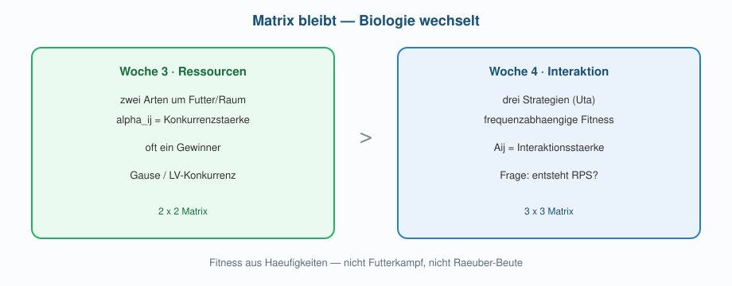
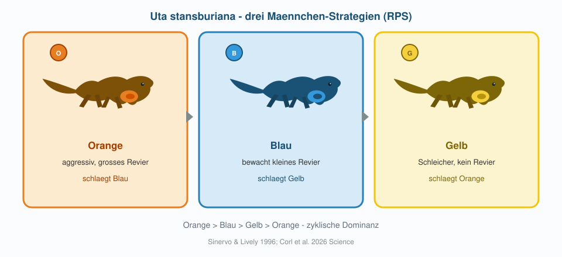

## Übersicht

**Woche 4** von 14 · **Do., 8. Okt. 2026, 08:15–10:00**

[Kursplan](../../docs/course-outline.html) · [Start](../../index.html)

::: aside
Pfeiltasten · **M** Menü · **Esc** Übersicht
:::

## Sitzungsablauf (~90 min)

| Teil | Dauer | Was |
|------|-------|-----|
| **Intro** | **~20 min** | Spieltheorie · Echsen · 2 vs. 3 · Stabilitätsformen |
| **Notebook** | **~40 min** | $A$ drehen → RPS; Form diagnostizieren |
| **Präsentationen** | **~30 min** | Matrix · Plot · welche Stabilitätsform? |

## Heute in einem Blick

::::: columns
::: {.column width="22%"}
{fig-alt="Biologie" width="70%"}
:::
::: {.column width="22%"}
{fig-alt="Matrix" width="70%"}
:::
::: {.column width="22%"}
{fig-alt="Code" width="70%"}
:::
::: {.column width="22%"}
{fig-alt="Praesentation" width="70%"}
:::
:::::

**Frage** (frequenzabhängige Fitness / RPS) → **Modell** $A$ → **Simulation** → **Kurzpräsentation**.

## Checkpoint A — Anwesenheit Pflicht

::::: columns
::: {.column width="18%"}
{fig-alt="Wichtig" width="80%"}
:::
::: {.column width="82%"}
Heute wird **präsentiert und benotet**.  
Sie müssen **anwesend sein und vortragen**.

[Modul 1](../../docs/module-01-overview.html) · [Infos](../../docs/general-info.html)
:::
:::::

## Brücke von Woche 3

Woche 3: Exclusion · Bistabilität · Punkt / Zyklus.  
Heute: **Strategien** statt trophischer Ebenen — und warum **drei** Strategien anders sind als zwei.

{fig-alt="Bruecke Food Web zu Spiel" width="88%"}

------------------------------------------------------------------------

# Spieltheorie & Echsen

## Idee in einem Satz

Der Erfolg einer Strategie hängt davon ab, **was die anderen tun**  
(frequenzabhängige Fitness).

## *Uta* — Rock–Paper–Scissors

{fig-alt="Drei Echsen-Strategien" width="90%"}

Orange → Blau → Gelb → Orange. Sinervo & Lively (1996); Corl et al. (2026).

## Modell (vorgegeben)

Kursstandard — additive Differenzengleichung (wie im R-Code):

$$
N_{i,t+1}
  = N_{i,t}
    + r\, N_{i,t}\left(1 - \frac{(AN)_i}{K}\right),
\qquad
(AN)_i = \sum_j A_{ij}\, N_j
$$

Zuwachs von Typ $i$ pro Schritt: $r N_i\bigl(1-(AN)_i/K\bigr)$.

$(AN)_i$: **Gesamtlast** auf Typ $i$.  
$A_{ij}$: **Interaktionsstärke** — wie stark Typ $j$ Typ $i$ unterdrückt.

| Symbol | Bedeutung | Wertebereich | Kursbeispiel |
|--------|-----------|--------------|--------------|
| $r$ | Wachstumsrate pro Schritt | $0 < r \le 0.2$ | oft $0.02$–$0.05$ |
| $K$ | Tragfähigkeit | $K > 0$ | $100$ |
| $A_{ij}$ | Last von Typ $j$ auf Typ $i$ | meist $\ge 0$ | Diagonale $=1$; RPS: eine Richtung $>1$, Gegenrichtung $<1$ |
| $s,w$ | starke / schwache Interaktion | $s > 1 > w \ge 0$ | z. B. $s=1.5$, $w=0.5$ |

**Kurzer Hinweis:** In der Literatur stehen oft Differentialgleichungen; wir verwenden additive diskrete Schritte.

## Warum Diagonale = 1 (nicht 0)?

Das ist ein **Konkurrenz**-LV: alle Einträge von $A$ sind Unterdrückung (Last).  
Keine «positiven Fitness-Payoffs» mit Vorzeichen ± — die Diagonale misst **Selbstkonkurrenz**.

| Situation | Last $(AN)_i$ | Zuwachs pro Schritt |
|-----------|-----------------|-------------------------|
| allein, $N_i \lt K$ | $A_{ii} N_i = N_i \lt K$ | $\gt 0$ → **wächst** |
| allein, $N_i = K$ | $= K$ | $= 0$ → **Gleichgewicht** |
| allein, $N_i \gt K$ | $\gt K$ | $\lt 0$ → **schrumpft** |

Diagonale $1$ = Normierung: «eine Einheit eigener Dichte zählt als eine Einheit Last».  
(Andere Modelle — Payoff-Matrix / Replikator — setzen oft $0$ auf der Diagonale und arbeiten mit Vorzeichen. **Hier nicht.**)

## Wann schrumpft / wächst Typ $i$ mit Konkurrenten?

Massstab ist immer die Diagonale $1$:

- $A_{ij} \gt 1$: Typ $j$ belastet $i$ **stärker** als $i$ sich selbst → $i$ hat es schwerer  
- $A_{ij} \lt 1$: Typ $j$ belastet $i$ **schwächer** als Selbstkonkurrenz → $i$ hat es leichter  
- $A_{ij} = 1$: $j$ wirkt wie ein weiteres Individuum von $i$

Also: **$\gt 1$ / $\lt 1$** heisst «stärker / schwächer als Selbstkonkurrenz» — nicht «positiv / negativ».

## RPS mit zwei Interaktionsparametern

Vollständige $3\times 3$-Matrix: **9** Einträge. Diagonale fix $=1$ → noch **6** Interaktionen.  
Wir reduzieren auf **zwei** Parameter $s$ und $w$:

$$
A =
\begin{pmatrix}
1 & w & s \\
s & 1 & w \\
w & s & 1
\end{pmatrix}
\qquad
(s \gt 1 \gt w)
$$

- $s$: **starke** Interaktion ($s \gt 1$)  
- $w$: **schwache** Interaktion ($w \lt 1$)

**Warum reduzieren?** Annahme der **zyklischen Symmetrie**: jedes Paar sieht denselben Kontrast «stark vs. schwach», nur rotiert.  
Dann reichen $s,w$ — und die Faustregel $s+w$ vs. $2$ wird lesbar.

## $s$ und $w$ sind Interaktionen

Merksatz: **$s$ = starke Interaktion**, **$w$ = schwache Interaktion** (Unterdrückung $j \to i$).

In jedem Paar eine Richtung stark, die Gegenrichtung schwach:

| Paar | starke Interaktion $s$ | schwache Interaktion $w$ | Gewinner |
|------|--------------------------|----------------------------|----------|
| 1 vs 2 | $A_{21}=s$: 1 drückt 2 stark | $A_{12}=w$: 2 drückt 1 schwach | **1 schlägt 2** |
| 2 vs 3 | $A_{32}=s$ | $A_{23}=w$ | **2 schlägt 3** |
| 3 vs 1 | $A_{13}=s$ | $A_{31}=w$ | **3 schlägt 1** |

→ Zyklus **1 → 2 → 3 → 1** (Schere–Stein–Papier / *Uta*).

## Was braucht RPS wirklich? (Muster, nicht volle Symmetrie)

Das **qualitative** Muster ist ein Zyklus von «stärker / schwächer»:

$$
A_{\mathrm{Muster}} =
\begin{pmatrix}
1 & \lt 1 & \gt 1 \\
\gt 1 & 1 & \lt 1 \\
\lt 1 & \gt 1 & 1
\end{pmatrix}
$$

- Volle $s,w$-Symmetrie ist nur eine **bequeme** Spezialisierung.  
- RPS braucht **nicht**, dass alle starken Einträge gleich $s$ und alle schwachen gleich $w$ sind — nur dass in jedem Paar die richtige Richtung $\gt 1$ bzw. $\lt 1$ ist.

## Asymmetrisch, aber immer noch RPS $$
SIM
$$

```{r}
#| fig-height: 3.4
#| fig-width: 8
# Unterschiedliche starke/schwache Werte — gleiches +/- Muster
A_asym <- matrix(c(1, 0.4, 1.5,
                   1.15, 1, 0.55,
                   0.7, 1.35, 1), 3, 3, byrow = TRUE)
next_3lv <- function(N, r, A, K) {
  load <- as.numeric(A %*% N)
  pmax(N + r * N * (1 - load / K), 0)
}
sim_n <- function(A, N0, T = 2000, r = 0.05, K = 100) {
  n <- length(N0)
  N <- matrix(0, T + 1, n)
  N[1, ] <- N0
  for (t in 1:T) N[t + 1, ] <- next_3lv(N[t, ], r, A, K)
  data.frame(time = 0:T, N)
}
cols <- c("#e67e22", "#2980b9", "#f1c40f")
d_asym <- sim_n(A_asym, c(40, 35, 30), T = 3000)
matplot(d_asym$time, d_asym[, -1], type = "l", lty = 1, lwd = 2.5, col = cols,
        xlab = "Zeit", ylab = "N",
        main = "Asymmetrische Interaktionen, gleiches RPS-Muster [SIM]")
legend("right", c("1", "2", "3"), col = cols, lty = 1, lwd = 2.5, bty = "n", cex = 0.8)
```

Drei Typen bleiben — ohne dass $A$ nur aus zwei Zahlen $s,w$ gebaut ist.  
Im Notebook nutzen wir trotzdem $s,w$: **weniger Drehknöpfe**, gleiche Idee.

## Faustregel $s+w$ (bei Symmetrie)

Nur wenn wir auf $s,w$ reduzieren, gilt die einfache Orientierung:

- mild ($s,w$ näher an 1, $s+w \lt 2$) → eher **Punkt**  
- Grenze $s+w \approx 2$ → **stabile Oszillation**  
- scharf ($s+w \gt 2$) → **Heteroklin**

Die May–Leonard-Ergebnisse sind hier nur eine **qualitative Orientierung**; Parameter nicht 1:1 aus Papers kopieren.

------------------------------------------------------------------------

# Warum drei? — das macht RPS aus

## Zwei Strategien: immer Exclusion $$
SIM
$$

```{r}
#| fig-height: 3.5
#| fig-width: 8.5
next_3lv <- function(N, r, A, K) {
  load <- as.numeric(A %*% N)
  pmax(N + r * N * (1 - load / K), 0)
}
sim_n <- function(A, N0, T = 2000, r = 0.05, K = 100) {
  n <- length(N0)
  N <- matrix(0, T + 1, n)
  N[1, ] <- N0
  for (t in 1:T) N[t + 1, ] <- next_3lv(N[t, ], r, A, K)
  data.frame(time = 0:T, N)
}
# RPS-Matrix, aber nur zwei Typen vorhanden
A_rps <- matrix(c(1, 0.5, 1.2,
                  1.2, 1, 0.5,
                  0.5, 1.2, 1), 3, 3, byrow = TRUE)
cols <- c("#e67e22", "#2980b9", "#f1c40f")
par(mfrow = c(1, 2), mar = c(4, 4, 2.5, 1))
d1 <- sim_n(A_rps[1:2, 1:2], c(50, 40))
matplot(d1$time, d1[, -1], type = "l", lty = 1, lwd = 2.5,
        col = cols[1:2], ylim = c(0, 110), xlab = "Zeit", ylab = "N",
        main = "Nur Typ 1 & 2")
legend("right", c("1", "2"), col = cols[1:2], lty = 1, lwd = 2.5, bty = "n", cex = 0.8)
d2 <- sim_n(A_rps[c(1, 3), c(1, 3)], c(50, 40))
matplot(d2$time, d2[, -1], type = "l", lty = 1, lwd = 2.5,
        col = cols[c(1, 3)], ylim = c(0, 110), xlab = "Zeit", ylab = "N",
        main = "Nur Typ 1 & 3")
legend("right", c("1", "3"), col = cols[c(1, 3)], lty = 1, lwd = 2.5, bty = "n", cex = 0.8)
```

Bei **zwei** Strategien gewinnt immer eine — die andere → 0.

## Dritte Strategie stabilisiert $$
SIM
$$

```{r}
#| fig-height: 3.5
#| fig-width: 8
# Punkt-RPS: s+w < 2
A_point <- matrix(c(1, 0.5, 1.2,
                    1.2, 1, 0.5,
                    0.5, 1.2, 1), 3, 3, byrow = TRUE)
d3 <- sim_n(A_point, c(40, 35, 30), T = 2500)
matplot(d3$time, d3[, -1], type = "l", lty = 1, lwd = 2.5, col = cols,
        xlab = "Zeit", ylab = "N",
        main = "Alle drei: Koexistenz (Punkt) [SIM]")
legend("right", c("1", "2", "3"), col = cols, lty = 1, lwd = 2.5, bty = "n", cex = 0.8)
```

Dieselbe zyklische Logik — aber **drei** Typen bleiben. Das ist der RPS-Kern.

## Merksatz

> RPS heisst nicht zwingend «Schwingung».  
> RPS heisst: zyklische Dominanz + die **dritte Strategie verhindert Exclusion**.  
> Ein **Punktgleichgewicht** kann also durchaus RPS sein.

------------------------------------------------------------------------

# Drei Stabilitätsformen (Beispiele)

## Übersicht

| Form | $s,w$-Intuition | Zeitreihe | Simplex |
|------|-------------------|-----------|---------|
| **Punkt** | mild ($s+w < 2$) | → konstante Dichten | Spirale **ins Innere** |
| **Stabile Oszillation** | $s+w \approx 2$ | dauerhafte Schwingung | **geschlossener Zyklus** |
| **Heteroklinzyklus** | scharf ($s+w > 2$) | Minima → 0 | Drift zu den **Rändern** |

## Phasenraum: das Simplex

Drei Typen → Zustände als **Häufigkeiten**
$f_i = N_i / \sum_j N_j$ mit $f_1 + f_2 + f_3 = 1$.  
Das ist ein **Dreieck** (2-Simplex): Ecken = eine Strategie allein.

```{r}
#| fig-height: 3.6
#| fig-width: 7
to_simplex_xy <- function(N) {
  N <- as.matrix(N)
  s <- pmax(rowSums(N), 1e-12)
  f <- N / s
  v1 <- c(0.5, sqrt(3) / 2); v2 <- c(0, 0); v3 <- c(1, 0)
  cbind(x = f[, 1] * v1[1] + f[, 2] * v2[1] + f[, 3] * v3[1],
        y = f[, 1] * v1[2] + f[, 2] * v2[2] + f[, 3] * v3[2])
}
plot_simplex_traj <- function(df, main = "", fade = TRUE) {
  xy <- to_simplex_xy(df[, -1, drop = FALSE])
  v1 <- c(0.5, sqrt(3) / 2); v2 <- c(0, 0); v3 <- c(1, 0)
  plot(NA, xlim = c(-0.08, 1.08), ylim = c(-0.12, sqrt(3) / 2 + 0.1),
       asp = 1, axes = FALSE, xlab = "", ylab = "", main = main)
  polygon(c(v1[1], v2[1], v3[1]), c(v1[2], v2[2], v3[2]),
          border = "#2c3e50", lwd = 2, col = "#f4f6f7")
  text(v1[1], v1[2] + 0.07, "1", col = cols[1], font = 2, cex = 1.15)
  text(v2[1] - 0.06, v2[2] - 0.05, "2", col = cols[2], font = 2, cex = 1.15)
  text(v3[1] + 0.06, v3[2] - 0.05, "3", col = cols[3], font = 2, cex = 1.15)
  n <- nrow(xy)
  if (fade && n > 40) {
    for (i in seq_len(n - 1)) {
      a <- 0.12 + 0.78 * (i / n)
      segments(xy[i, 1], xy[i, 2], xy[i + 1, 1], xy[i + 1, 2],
               col = rgb(0.12, 0.15, 0.22, a), lwd = 1.6)
    }
  } else {
    lines(xy[, 1], xy[, 2], lwd = 2, col = "#2c3e50")
  }
  points(xy[1, 1], xy[1, 2], pch = 16, col = "#27ae60", cex = 1.25)
  points(xy[n, 1], xy[n, 2], pch = 16, col = "#c0392b", cex = 1.05)
  legend("topleft", c("Start", "Ende"), pch = 16, col = c("#27ae60", "#c0392b"),
         bty = "n", cex = 0.75)
}
# Schema: Ecken + Mitte
plot(NA, xlim = c(-0.08, 1.08), ylim = c(-0.12, sqrt(3) / 2 + 0.1),
     asp = 1, axes = FALSE, xlab = "", ylab = "",
     main = "Simplex: wo der Zyklus lebt")
v1 <- c(0.5, sqrt(3) / 2); v2 <- c(0, 0); v3 <- c(1, 0)
polygon(c(v1[1], v2[1], v3[1]), c(v1[2], v2[2], v3[2]),
        border = "#2c3e50", lwd = 2, col = "#f4f6f7")
text(v1[1], v1[2] + 0.07, "nur 1", col = cols[1], font = 2)
text(v2[1] - 0.02, v2[2] - 0.05, "nur 2", col = cols[2], font = 2, adj = 1)
text(v3[1] + 0.02, v3[2] - 0.05, "nur 3", col = cols[3], font = 2, adj = 0)
mid <- to_simplex_xy(matrix(c(1, 1, 1), 1))
points(mid[1], mid[2], pch = 16, cex = 1.2, col = "#8e44ad")
text(mid[1], mid[2] - 0.08, "Mischung", col = "#8e44ad", cex = 0.85)
```

Kanten = eine Strategie fehlt (Exclusion-Rand).  
Innen = alle drei $\gt 0$.

## 1 · Punktgleichgewicht (auch RPS!) $$
SIM
$$

$s=1.2$, $w=0.5$ → $s+w=1.7 < 2$

```{r}
#| fig-height: 3.5
#| fig-width: 9
par(mfrow = c(1, 2), mar = c(4, 4, 2.5, 1))
matplot(d3$time, d3[, -1], type = "l", lty = 1, lwd = 2.5, col = cols,
        xlab = "Zeit", ylab = "N",
        main = "Zeitreihe")
legend("right", c("1", "2", "3"), col = cols, lty = 1, lwd = 2.5, bty = "n", cex = 0.75)
plot_simplex_traj(d3, main = "Simplex → Punkt")
```

Dominanz-Logik zyklisch — Langzeit = **fester Punkt** im Inneren (alle ≈ gleich).

## 2 · Stabile Oszillation $$
SIM
$$

$s=1.35$, $w=0.65$ → $s+w=2$

```{r}
#| fig-height: 3.5
#| fig-width: 9
A_osc <- matrix(c(1, 0.65, 1.35,
                  1.35, 1, 0.65,
                  0.65, 1.35, 1), 3, 3, byrow = TRUE)
d_osc <- sim_n(A_osc, c(45, 30, 25), T = 4000, r = 0.02)
par(mfrow = c(1, 2), mar = c(4, 4, 2.5, 1))
matplot(d_osc$time, d_osc[, -1], type = "l", lty = 1, lwd = 2.2, col = cols,
        xlab = "Zeit", ylab = "N",
        main = "Zeitreihe")
legend("topright", c("1", "2", "3"), col = cols, lty = 1, lwd = 2.2, bty = "n", cex = 0.7)
plot_simplex_traj(d_osc, main = "Simplex: geschlossener Zyklus")
```

Dominanz rotiert dauerhaft — auf dem Simplex ein **Orbit**, der nicht an den Rand driftet.

## 3 · Heteroklinzyklus $$
SIM
$$

$s=1.40$, $w=0.65$ → $s+w=2.05 > 2$

```{r}
#| fig-height: 3.5
#| fig-width: 9
A_het <- matrix(c(1, 0.65, 1.40,
                  1.40, 1, 0.65,
                  0.65, 1.40, 1), 3, 3, byrow = TRUE)
d_het <- sim_n(A_het, c(45, 30, 25), T = 12000, r = 0.015)
par(mfrow = c(1, 2), mar = c(4, 4, 2.5, 1))
matplot(d_het$time, d_het[, -1], type = "l", lty = 1, lwd = 1.8, col = cols,
        xlab = "Zeit", ylab = "N",
        main = "Zeitreihe")
legend("topright", c("1", "2", "3"), col = cols, lty = 1, lwd = 1.8, bty = "n", cex = 0.7)
plot_simplex_traj(d_het, main = "Simplex → Kanten")
```

Alle drei bleiben lange sichtbar — aber die Bahn wandert zu den **Kanten** (fast-Exclusion, dann Wechsel).  
Attraktor «lebt» am Rand des Simplex.

## Minima über die Zeit (Heteroklin)

```{r}
#| fig-height: 3.3
#| fig-width: 7.5
z <- d_het[, -1]
nblock <- 5
blen <- floor(nrow(z) / nblock)
mins <- sapply(1:3, function(j) {
  sapply(0:(nblock - 1), function(b) {
    i1 <- b * blen + 1; i2 <- min((b + 1) * blen, nrow(z))
    min(z[i1:i2, j])
  })
})
matplot(1:nblock, mins, type = "b", pch = 16, lwd = 2.5, col = cols,
        xlab = "Zeitblock", ylab = "Minimum in Block",
        main = "Heteroklin: Minima sinken", ylim = c(0, max(mins) * 1.1))
legend("topright", c("1", "2", "3"), col = cols, lty = 1, lwd = 2.5, bty = "n", cex = 0.8)
```

## Vergleich: drei Formen auf dem Simplex

```{r}
#| fig-height: 3.7
#| fig-width: 9.5
par(mfrow = c(1, 3), mar = c(1, 1, 2.5, 1))
plot_simplex_traj(d3, main = "Punkt")
plot_simplex_traj(d_osc, main = "Oszillation")
plot_simplex_traj(d_het, main = "Heteroklin")
```

Gleiche zyklische Interaktionslogik — **verschiedene Orbits** im Simplex.

------------------------------------------------------------------------

# Auftrag

## Notebook (~40 min)

1. Zwei Strategien → Exclusion bestätigen  
2. Mit drei Strategien RPS erzeugen  
3. Mindestens **eine** Form klar hinbekommen (Punkt / Oszillation / Heteroklin)  
4. Optional: alle drei Formen ansteuern ($s+w$ drehen)  

## Präsentation (~2–3 Min.)

1. Matrix $A$  
2. Ein Plot (Zeitreihe **oder** Simplex)  
3. **Welche Form?** Punkt · Oszillation · Heteroklin — Beleg in einem Satz  
4. Warum wäre dasselbe mit nur zwei Strategien unmöglich?

**Anwesenheit Pflicht** — ohne Vortrag kein Checkpoint A.

## Abschlussfragen

1. Warum Diagonale $=1$ — und was heisst $A_{ij}\gt 1$ vs. $A_{ij}\lt 1$?  
2. Warum reduzieren wir auf $s,w$ — und was braucht RPS *ohne* volle Symmetrie?  
3. Was sehen Sie auf dem **Simplex** bei Punkt vs. Oszillation vs. Heteroklin?  
4. Woran erkennen Sie einen Heteroklinzyklus (Zeitreihe *und* Simplex)?

## Literatur

Alles, was in dieser Einheit namentlich vorkommt:

1. **Sinervo, B., & Lively, C. M. (1996).** The rock–paper–scissors game and the evolution of alternative male strategies. *Nature* 380: 240–243. [doi:10.1038/380240a0](https://doi.org/10.1038/380240a0) — *Uta*-RPS.
2. **Corl, A., et al. (2026).** The genetics, evolution, and maintenance of a biological rock-paper-scissors game. *Science* 391: 69–74. [doi:10.1126/science.adw8265](https://doi.org/10.1126/science.adw8265).
3. **May, R. M., & Leonard, W. J. (1975).** Nonlinear aspects of competition between three species. *SIAM Journal on Applied Mathematics* 29: 243–253. — $s,w$-Idee / Stabilitätsformen (Faustregel qualitativ).
4. **Lotka, A. J. (1925)**; **Volterra, V. (1926)**; **Gause, G. F. (1934).** — Konkurrenz / Exclusion-Hintergrund (Wochen 2–3).
5. Berkeley Understanding Evolution: [High-stakes rock-paper-scissors…](https://evolution.berkeley.edu/evo-news/high-stakes-rock-paper-scissors-these-lizards-are-all-in-on-an-evolutionary-game/) — populäre Zusammenfassung zu Corl et al.

## Navigation

| | |
|---|---|
| Kursplan | [Kursplan](../../docs/course-outline.html) |
| Zurück | [← Woche 3](../week-03/slides.html) |
| Weiter | [Woche 5 →](../week-05/slides.html) |
| Notebook | [Notebook](notebook.html) |
