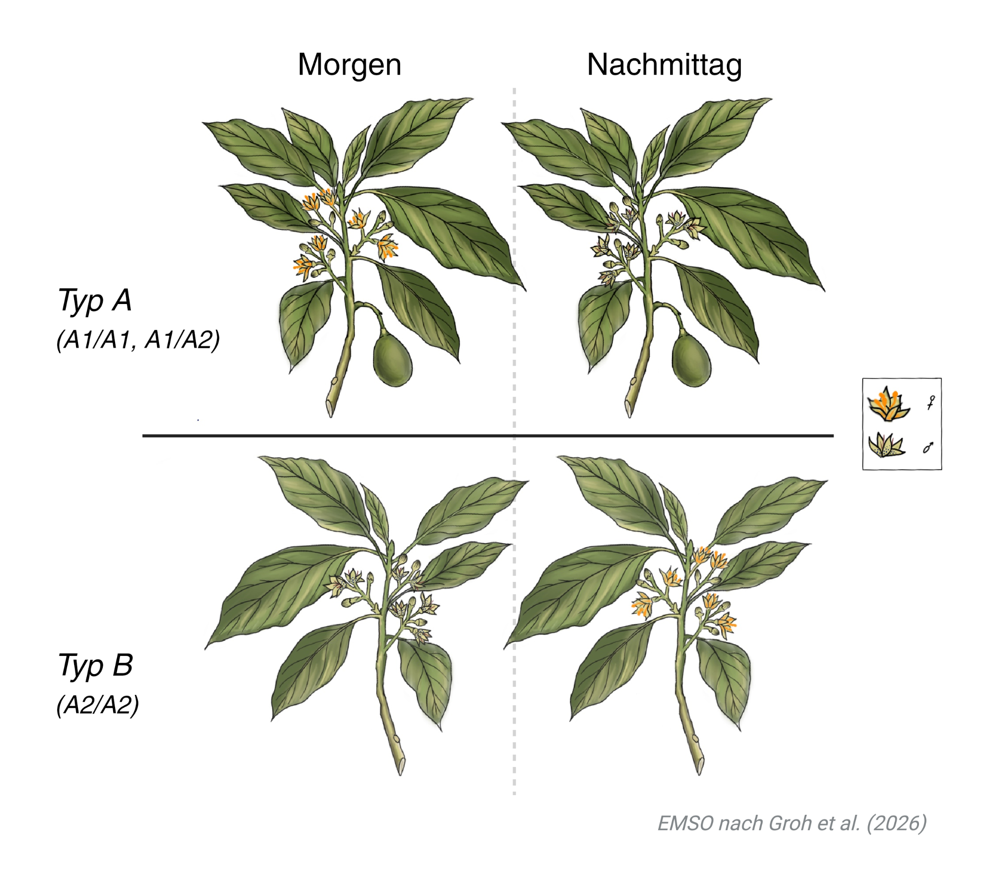

# Ziel

- Hardy–Weinberg rechnen und vergleichen — wie in der Vorlesung.
- Die Annahmen von Hardy-Weinberg verstehen und ein Beispiel nennen, wo sie jeweils erfüllt oder nicht erfüllt werden

## Die Grössen

Zwei Allele $A$ und $B$. Zählungen `AA`, `AB`, `BB`.

- **Relative Häufigkeit** eines Genotyps: Zählung geteilt durch $n$.
- **Allelfrequenz** $p = (2\,n_{AA} + n_{AB}) / (2n)$.
- **HWE-Erwartung:** $p^2$, $2pq$, $q^2$.

---

# Teil A - theoretische Grundlagen
# A1) · Genotypzählungen

Eine Population mit 100 Individuen.

```{r pop_definition}
pop <- data.frame(AA = 16, AB = 48, BB = 36)

```

::: {.callout-tip}
## F1

Rechnen Sie die **relativen** Genotypfrequenzen von Hand nach
   (`AA / n`, …).
:::

---

# A2) Hardy-Weinberg

```{r HW_definition}
# Funktion für die Berechnung der erwarteten Genotypfrequenzen
zusammenfassen <- function(d) {
  n <- d$AA + d$AB + d$BB # Populationsgrösse
  p <- (2 * d$AA + d$AB) / (2 * n) # Frequenz von A
  data.frame(
    n = n,
    p = p,
    f_AA = d$AA / n,
    f_AB = d$AB / n,
    f_BB = d$BB / n,
    hwe_AA = p^2, # Hardy-Weinberg Erwartung für Genotyp AA
    hwe_AB = 2 * p * (1 - p), # Hardy-Weinberg Erwartung für Genotyp AB
    hwe_BB = (1 - p)^2 # Hardy-Weinberg Erwartung für Genotyp BB
  )
}

zusammenfassen(pop)

```

::: {.callout-tip}
## F2

1. Stimmen die beobachteten und erwarteten Genotypfrequenzen überein?
2. Warum steht im Nenner von $p$ die $2n$?
3. Was sind unsere Annahmen für diese Berechnung? (Schauen Sie in der Vorlesung nach)
:::

---

# Teil B - Blutgruppen
Als erstes Beispiel schauen wir uns die Vererbung von Blutgruppen in Menschen an. Für das brauchen wir einen Ausschnitt aus den Daten von Mourant et al. (1976) via dem package `HardyWeinberg`. Die Daten enthalten die Genotypfrequnzen MM, MN un NN am MN im MNS-Antigensystem für eine Stichprobe aus der Schweiz.

```{r load CH}
# Daten reinladen
bloodgroups_CH <- read.csv("data/bloodgroups_Mourant1976_CH.csv")

# Daten auschauen
bloodgroups_CH

```
## B1) HW-Erwartungen Schweiz

```{r HW_definition MN}
# Funktion für die Berechnung der erwarteten Genotypfrequenzen
zusammenfassen <- function(d) {
  n <- d$MM + d$MN + d$NN # Populationsgrösse
  p <- (2 * d$MM + d$MN) / (2 * n) # Frequenz von M
  data.frame(
    n = n,
    p = p,
    f_MM = d$MM / n,
    f_MN = d$MN / n,
    f_NN = d$NN / n,
    hwe_MM = p^2, # Hardy-Weinberg Erwartung für Genotyp MM
    hwe_MN = 2 * p * (1 - p), # Hardy-Weinberg Erwartung für Genotyp MN
    hwe_NN = (1 - p)^2 # Hardy-Weinberg Erwartung für Genotyp NN
  )
}

HW_CH <- zusammenfassen(bloodgroups_CH)
HW_CH

```


::: {.callout-tip}
## F3

1. Stimmen die beobachteten und erwarteten Genotypfrequenzen überein?
2. Was sagt das über unsere Annahmen aus?
:::

# B2) HW-Erwartungen Welt

```{r load world}
# Daten reinladen
bloodgroups_world <- read.csv("data/bloodgroups_Mourant1976_world.csv")

# Daten anschauen
head(bloodgroups_world)

# HW berechnen
HW_world <- zusammenfassen(bloodgroups_world)
 
```


```{r plot HW}
# HW Erwartungen
p_grid <- seq(0, 1, length.out = 201)
plot(x = p_grid, 
     y = 2 * p_grid * (1 - p_grid), 
     type = "l", lwd = 2.5,
     col = "#1b9e77", ylim = c(0, 0.8),
     xlab = "p", ylab = "Heterozygotenanteil",
     main = "HWE-Kurve weltweite Beobachtungen")
# beobachteter Heterozygotenanteil
points(x = HW_world$p, 
       y = HW_world$f_MN, 
       pch = 16, cex = 1.6,
       col = "#2166ac")
points(x = HW_CH$p, 
       y = HW_CH$f_MN, 
       pch = 16, cex = 1.6,
       col = "#8500ac")
legend("topright", c("HWE", "Weltweit", "Schweiz"),
       col = c("#1b9e77", "#2166ac", "#8500ac"),
       lwd = c(2.5, NA, NA), pch = c(NA, 16, 16), bty = "n")
```

::: {.callout-tip}
## F3

Was beobachten Sie? Wie verhaltet sich der beobachtete Heterozygotenateil gegenüber den Hardy-Weinberg Erwartungen?
:::

---

# Teil C) Avocados
Als zweites Beispiel untersuchen wir die Vererbung von verschiedenem Blühtypen in Avocados. Dieses Beispiel ist an die Studie von Groh et. al (2026) angelehnt.
Avocados (**Persea americana**) blühen in Blütenständen, wobei einzelne Blüten entweder männlich oder weiblich sind. In "Typ A" Bäumen öffnen sich zuerst die weiblichen Blüten und später am Nachmittag die männlichen Blüten, während sich die weiblichen Blüten wieder schliessen; bei den "Typ B" Bäumen ist es genau umgekehrt. So haben beide Typen einen komplementären Zyklus von alternierenden Blütengeschlechtern. 
Dieser Zyklus wird durch die Allele A1 und A2 innerhalb eines sogenannten "synchronized dichogamy" locus geregelt. "Typ A" Bäume haben den Genotyp A1/A1 oder A1/A2 und "Typ B" Bäume haben den Genotyp A2/A2.



```{r avocado definition}
avocados <- data.frame(A1A1 = 5, A1A2 = 33, A2A2 = 62)

# Funktion für die Berechnung der erwarteten Genotypfrequenzen
zusammenfassen <- function(d) {
  n <- d$A1A1 + d$A1A2 + d$A2A2 # Populationsgrösse
  p <- (2 * d$A1A1 + d$A1A2) / (2 * n) # Frequenz von A1
  data.frame(
    n = n,
    p = p,
    f_A1A1 = d$A1A1 / n,
    f_A1A2 = d$A1A2 / n,
    f_A2A2 = d$A2A2 / n,
    hwe_A1A1 = p^2, # Hardy-Weinberg Erwartung für Genotyp A1A1
    hwe_A1A2 = 2 * p * (1 - p), # Hardy-Weinberg Erwartung für Genotyp MN
    hwe_A2A2 = (1 - p)^2 # Hardy-Weinberg Erwartung für Genotyp NN
  )
}

HW_avocados <- zusammenfassen(avocados)
HW_avocados

```

::: {.callout-tip}
## F5

1. Stimmen die beobachteten und erwarteten Genotypfrequenzen überein?
2. Was ist die erwartete Verteilung von Typ A und Typ B Bäumen?
:::

Die erfahrenen Avocadozüchter*innen erwarteten die folgende Genotypfrequenzen für die der geernteten Früchte:
| A1A1 | A1A2 | A2A2 |
|--------|-----------|--------------|
| 0 | 0.525 | 0.475 | 

::: {.callout-tip}
## F6

1. Was ist der Unterschied zwischen Ihren Erwartungen und der der Avocadozüchter*innen? 
2. Welche Hardy-Weinberg Erwartungen werden in diesem Beispiel erfüllt, welche eventuell nicht? Wieso?

:::

---
# Referenzen

Mourant, A. E, Kopec, A, and Domaniewska-Sobczak, K. (1976) **The Distribution of the Human Blood Groups and other Polymorphisms.** British Medical Journal. Jun 12;1(6023):1472. PMCID: PMC1640394.


Groh, J. S., Soares dos Santos, M. F., Avila de Dios, E., Ackerman, G., Solares, E., Iturrieta, R. A., ... & Coop, G. (2026). **Balanced polymorphism in a floral transcription factor underlies the ancient rhythm of daily sex alternation in avocado.** Proceedings of the National Academy of Sciences, 123(31), e2606876123.

