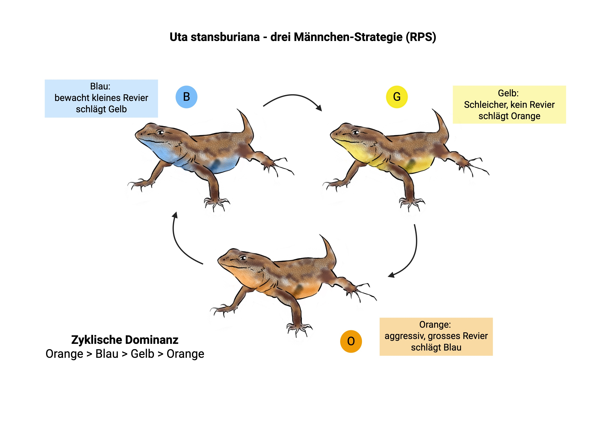
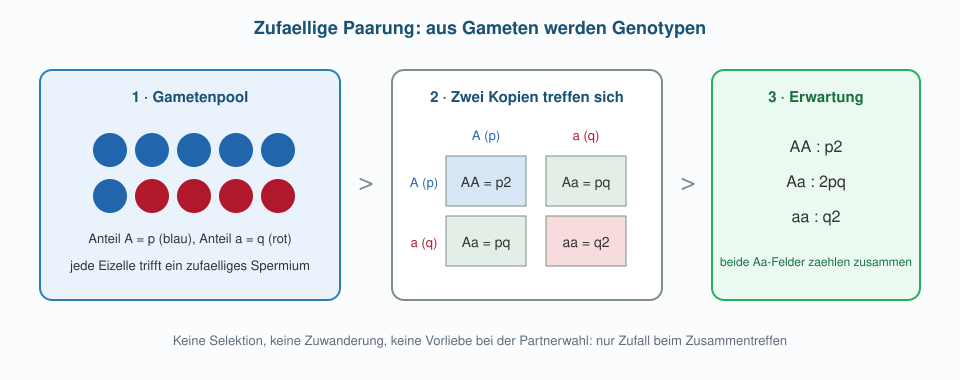

```{r}
#| include: false
snps <- read.csv("data/hapmap_chb_chr1.csv")
snps$n <- snps$AA + snps$AB + snps$BB
snps$p <- (2 * snps$AA + snps$AB) / (2 * snps$n)

col_AA <- "#2166ac"
col_AB <- "#1b9e77"
col_BB <- "#b2182b"

hwe_kurven <- function(main = "") {
  raster <- seq(0, 1, length.out = 301)
  plot(raster, raster^2, type = "l", lwd = 2.5, col = col_AA,
       ylim = c(0, 1), xlab = "Allelfrequenz p", ylab = "Genotypfrequenz",
       main = main)
  lines(raster, 2 * raster * (1 - raster), lwd = 2.5, col = col_AB)
  lines(raster, (1 - raster)^2, lwd = 2.5, col = col_BB)
}
```

## Übersicht

**Woche 5** von 14 · **Do., 15. Okt. 2026, 08:15–10:00**

| Teil | Dauer | Was |
|------|-------|-----|
| Vorlesung | ~45 min | Farbmorphen → Vererbung → Hardy–Weinberg |
| Notebook | ~45 min | 225 echte SNPs gegen das Nullmodell halten |

::: aside
Pfeiltasten · **M** Menü · **E** PDF · **Esc** Übersicht
:::

## Lernziele

Nach heute können Sie …

1. erklären, warum drei Farbmorphen **einer** Art die Vererbung ins Spiel bringen,
2. beschreiben, welche genetische Grundlage hinter den Kehlfarben steckt,
3. Locus, Allel, Genotyp und Allelfrequenz auseinanderhalten,
4. Hardy–Weinberg als **Erwartung ohne Selektion** lesen und echte Genotypdaten daran halten,
5. eine Rechnung auf eine **ganze Datenspalte** anwenden statt auf eine Schleife.

## Heute in einem Blick

::::: columns
::: {.column width="22%"}
{fig-alt="Biologie" width="70%"}
:::
::: {.column width="22%"}
{fig-alt="Genetik" width="70%"}
:::
::: {.column width="22%"}
{fig-alt="Modell" width="70%"}
:::
::: {.column width="22%"}
{fig-alt="Code" width="70%"}
:::
:::::

**Beobachtung** (drei Morphen) → **Genetik** (welche Allele?) → **Nullmodell** (was ohne Selektion zu erwarten wäre) → **Daten** (225 SNPs).

## Heute in dieser Reihenfolge

1. Warum aus Strategien Gene werden müssen
2. Was hinter den Kehlfarben steckt
3. Vererbung in drei Begriffen
4. Hardy–Weinberg: die Erwartung ohne Selektion
5. Echte Genotypdaten gegen diese Erwartung

::: aside
[Modul 2](../../docs/module-02-overview.html) · [Glossar](../../docs/glossary.html)
:::

# Teil 1 · Von Strategien zu Genen

## Woche 4: drei Strategien

{fig-alt="Seitenfleckeneidechse drei Maennchen-Strategien" width="66%"}

Orange schlägt Blau, Blau schlägt Gelb, Gelb schlägt Orange.  
Der Erfolg hing davon ab, **wie häufig** die anderen Morphen gerade sind.

::: aside
Illustration: Emma Ochsner · Sinervo & Lively (1996)
:::

## Was wir bisher beschrieben haben

Im Modell waren die Morphen **Anteile** einer Population: drei Zahlen, die sich gegenseitig hoch- und runterschieben.

Das genügt, um den Zyklus zu erzeugen. Es sagt aber nichts darüber, **wie** eine Eidechse orange wird.

## Der entscheidende Punkt

Die drei Morphen sind **keine drei Arten**. Sie gehören zu *Uta stansburiana*, leben nebeneinander und paaren sich miteinander.

Ein oranges Männchen hat also nicht zwingend orange Söhne. Was weitergegeben wird, sind **Gene** — und die mischen sich bei jeder Paarung neu.

## Die Frage dieser Woche

> Wenn die Strategien vererbt werden: Wie sieht eine Population ohne Selektion überhaupt aus?

Bevor wir sagen können, was Selektion tut (Woche 6), brauchen wir ein Bild davon, was **ohne** sie passiert. Genau das ist ein Nullmodell.

# Teil 2 · Was hinter den Kehlfarben steckt

## Die naheliegende Annahme

Drei Farben, also drei Allele an einem Locus — so wurde das System jahrzehntelang beschrieben, und so steht es in vielen Lehrbüchern.

Die Annahme ist sparsam und passt zur Intuition: eine Farbe, ein Allel.

## Was die Genome zeigen

Corl et al. (2026) haben Genome vieler Männchen sequenziert und gefragt, welche Regionen mit der Kehlfarbe zusammenhängen.

Gefunden wurde **eine** Region: die Regulatorregion von *SPR* (Sepiapterin-Reduktase), ein Enzym im Stoffwechsel gelber und roter Pigmente.

## Zwei Haplotypen statt drei Allele

Dort liegen **zwei** stark verschiedene Haplotypen — Varianten, die als Block vererbt werden.

| Träger | Kehlfarbe |
|--------|-----------|
| ein Haplotyp | orange |
| der andere | blau |

Für eine dritte, gelbe Variante ist in den Daten kein Platz.

## Woher kommt dann Gelb?

Gelbe Männchen tragen überwiegend **denselben** genetischen Hintergrund wie blaue. Die gelbe Kehle entsteht nicht aus einem eigenen Allel, sondern aus der Entwicklung: derselbe Genotyp, ein anderer Phänotyp.

Dafür gibt es einen Begriff: **Plastizität**.

## Warum dieser Befund zählt

1. Ein sichtbarer Unterschied ist **nicht automatisch** ein genetischer Unterschied.
2. Die Zahl der Morphen ist nicht die Zahl der Allele.
3. In den Modellen von Corl et al. bleibt der Polymorphismus mit «zwei Allele plus Plastizität» eher erhalten als mit drei Allelen.

Punkt 3 nehmen wir in Woche 6 wieder auf.

## Was das für heute heisst

Wir rechnen ab jetzt mit dem einfachsten Fall, der Vererbung wirklich abbildet:

**ein Locus, zwei Allele, diploide Individuen.**

Dieses Gerüst trägt die nächsten drei Wochen — von den Eidechsen über die Sichelzellanämie bis zum Stichling.

# Teil 3 · Vererbung in drei Begriffen

## Locus, Allel, Genotyp

| Begriff | Bedeutung | Beispiel |
|---------|-----------|----------|
| **Locus** | eine Stelle oder Region im Genom | die Regulatorregion von *SPR* |
| **Allel** | eine Variante an dieser Stelle | $A$ oder $B$ |
| **Genotyp** | die **beiden** Kopien eines Individuums | $AA$, $AB$, $BB$ |

Diploid heisst: jedes Individuum trägt zwei Kopien, eine von jedem Elternteil.

## Allelfrequenz zählt Kopien

Die Allelfrequenz $p$ ist der Anteil von $A$ unter **allen** Kopien in der Population — nicht der Anteil der Individuen mit $AA$.

$$
p = \frac{2\,n_{AA} + n_{AB}}{2n}
$$

Jedes $AA$-Individuum steuert zwei $A$-Kopien bei, jedes $AB$ eine, jedes $BB$ keine. Im Nenner steht $2n$, weil $n$ Individuen zusammen $2n$ Kopien tragen.

## Ein Zahlenbeispiel

100 Individuen: 36 $AA$, 48 $AB$, 16 $BB$.

$$
p = \frac{2\cdot 36 + 48}{200} = \frac{120}{200} = 0.6
$$

60 % der Kopien sind $A$, aber nur 36 % der Individuen sind $AA$. Die beiden Zahlen dürfen nie verwechselt werden.

## Zufällige Paarung

Für heute nehmen wir an: Partner finden sich **unabhängig** von ihrem Genotyp an diesem Locus.

Dann ist jede Befruchtung so, als würden zwei Kopien zufällig aus einem grossen Gametenpool gezogen.

# Teil 4 · Hardy–Weinberg

## Vom Gametenpool zum Genotyp

{fig-alt="Gametenpool Punnett Quadrat Hardy-Weinberg" width="92%"}

## Die drei Erwartungswerte

Mit $q = 1 - p$:

$$
f(AA) = p^2, \qquad f(AB) = 2pq, \qquad f(BB) = q^2
$$

Der Faktor $2$ bei den Heterozygoten steht für die zwei Wege, sie zu bekommen: $A$ von der Mutter und $B$ vom Vater — oder umgekehrt.

## Die Erwartung als Kurve

```{r}
#| fig-height: 3.9
#| fig-width: 8
hwe_kurven(main = "Erwartete Genotypfrequenzen")
legend("top", c("AA", "AB", "BB"), col = c(col_AA, col_AB, col_BB),
       lwd = 2.5, bty = "n", ncol = 3, cex = 0.9)
```

Heterozygote sind **nie** häufiger als die Hälfte: $2pq$ erreicht bei $p = 0.5$ sein Maximum von $0.5$.

## Wozu ein Nullmodell gut ist

Hardy–Weinberg sagt nicht: «hier passiert nichts». Es sagt:

> So sähe die Population aus, wenn nur zufällige Paarung wirkt — ohne Selektion, ohne Zuwanderung, ohne Vermischung zweier Gruppen, in einer grossen Population.

Erst mit dieser Referenz ist eine Abweichung überhaupt interessant.

## Fünf Annahmen

| Annahme | Verletzt, wenn … |
|---------|------------------|
| zufällige Paarung | Partnerwahl nach Merkmal (Woche 6) |
| keine Selektion | Genotypen unterschiedlich überleben (Woche 6) |
| keine Migration | Zuwanderung aus anderem Habitat (Woche 7) |
| eine Population | zwei Gruppen in einer Probe (Notebook) |
| sehr gross | Zufall in kleinen Populationen (Woche 9) |

Jede verletzte Annahme ist ein Thema der nächsten Wochen.

# Teil 5 · Die Erwartung an Daten halten

## Woher die Zahlen kommen

Das HapMap-Projekt hat für Tausende von SNPs ausgezählt, wie viele Menschen $AA$, $AB$ oder $BB$ tragen.

Unser Ausschnitt: **225 SNPs** auf Chromosom 1, je **84 Personen** aus Peking.

Ein SNP ist eine Stelle, an der in der Population zwei Nukleotide vorkommen — der einfachste denkbare Locus mit zwei Allelen.

## So sieht die Tabelle aus

```{r}
#| echo: true
snps <- read.csv("data/hapmap_chb_chr1.csv")
head(snps, 4)
```

Eine Zeile ist ein SNP, die Spalten sind Genotypzählungen. Keine Zeitreihe — eine Tabelle von Beobachtungen.

## 225 SNPs gegen die Erwartung

```{r}
#| fig-height: 4.1
#| fig-width: 8.6
hwe_kurven(main = "225 SNPs (Punkte) und die HWE-Erwartung (Linien)")
points(snps$p, snps$AA / snps$n, pch = 16, cex = 0.8, col = col_AA)
points(snps$p, snps$AB / snps$n, pch = 16, cex = 0.8, col = col_AB)
points(snps$p, snps$BB / snps$n, pch = 16, cex = 0.8, col = col_BB)
legend("top", c("AA", "AB", "BB"), col = c(col_AA, col_AB, col_BB),
       pch = 16, bty = "n", ncol = 3, cex = 0.9)
```

## Was wir sehen

Die Punkte streuen um die Kurven, aber sie folgen ihnen.

```{r}
#| echo: true
mean(snps$AB / snps$n)              # beobachtete Heterozygotie
mean(2 * snps$p * (1 - snps$p))     # vom Nullmodell erwartet
```

Ein Modell mit einer einzigen Zahl pro SNP trifft 225 reale Beobachtungen im Mittel auf drei Nachkommastellen.

## Vorsicht mit dem Umkehrschluss

Gute Übereinstimmung heisst **nicht**, dass keine Evolution stattfindet.

Hardy–Weinberg stellt sich nach **einer** Generation zufälliger Paarung wieder ein. Selektion verschiebt $p$ zwischen den Generationen — die Genotypen können trotzdem in jeder Generation nahe an der Erwartung liegen.

Deshalb sehen wir uns ab Woche 6 die **Veränderung von $p$** an, nicht die Genotypanteile einer Momentaufnahme.

# Neu im Code · Rechnen auf ganzen Spalten

## Was wir bisher programmiert haben

In den Wochen 2 bis 4 hatten wir immer eine **Zeitreihe**: ein Zustand, der aus dem vorigen folgt.

```r
for (t in 1:T) {
  N[t + 1] <- next_N(N[t], r, K)
}
```

Die Schleife war nötig, weil Schritt $t+1$ auf Schritt $t$ **wartet**.

## Heute ist die Lage anders

Die 225 SNPs wissen nichts voneinander. Kein SNP wartet auf einen anderen — es ist 225 Mal **dieselbe Rechnung** auf verschiedenen Zahlen.

Dafür gibt es in R den kürzeren Weg: die Rechnung auf die **ganze Spalte** anwenden.

## Eine Zeile statt einer Schleife

```{r}
#| echo: true
snps$n <- snps$AA + snps$AB + snps$BB
snps$p <- (2 * snps$AA + snps$AB) / (2 * snps$n)
head(snps$p, 6)
```

`snps$AA` ist keine einzelne Zahl, sondern ein Vektor mit 225 Einträgen. R rechnet elementweise und gibt 225 Ergebnisse zurück.

## Dieselbe Rechnung, zwei Schreibweisen

::::: columns
::: {.column width="50%"}
**Schleife**

```r
p <- numeric(nrow(snps))
for (i in 1:nrow(snps)) {
  p[i] <- (2 * snps$AA[i] +
           snps$AB[i]) /
          (2 * snps$n[i])
}
```
:::
::: {.column width="50%"}
**Vektorisiert**

```r
p <- (2 * snps$AA +
      snps$AB) /
     (2 * snps$n)
```
:::
:::::

Beide liefern dasselbe. Die rechte Variante ist kürzer, schneller — und sie sagt, was gemeint ist: «für jeden SNP».

## Wann welche Form?

| Situation | Werkzeug |
|-----------|----------|
| Schritt $t+1$ braucht Schritt $t$ | `for`-Schleife |
| jede Zeile ist unabhängig | ganze Spalte auf einmal |

Zeitreihen bleiben Schleifen. Tabellen mit unabhängigen Beobachtungen nicht.

## Mini-Glossar R (heute)

| Konzept | Merksatz |
|---------|----------|
| `read.csv("data/...")` | Tabelle einlesen |
| `d$spalte` | eine Spalte herausgreifen |
| `d$neu <- ...` | neue Spalte anlegen |
| `head(d, 4)` | erste Zeilen ansehen |
| `nrow(d)` | Anzahl Zeilen |
| Spalte $\pm\,\times\,\div$ Spalte | elementweise für alle Zeilen |

## Programmierung ↔ Biologie

| Programmierung | Biologie |
|----------------|----------|
| Zeile einer Tabelle | ein SNP, eine Beobachtung |
| Spalte | eine gemessene Grösse über alle SNPs |
| Rechnung auf der Spalte | dieselbe Frage an jeden Locus |
| Punkte über einer Kurve | Daten gegen Modellerwartung |

# Abschluss

## Take-home

1. Farbmorphen sind Varianten **einer** Art — damit zählt Vererbung, nicht nur Häufigkeit.
2. Hinter den Kehlfarben stehen zwei Haplotypen und Plastizität, nicht drei Allele (Corl et al. 2026).
3. $p$ zählt **Allelkopien**; $p^2$, $2pq$, $q^2$ sind die Genotypen, die daraus ohne Selektion folgen.
4. 225 reale SNPs liegen nahe an dieser Erwartung — ein Nullmodell, das trägt.
5. Unabhängige Zeilen rechnet man **spaltenweise**, nicht in einer Schleife.

## Notebook (~45 min)

**→ [Notebook Woche 5 öffnen](notebook.html)**

::::: columns
::: {.column width="20%"}
{fig-alt="Notebook" width="70%"}
:::
::: {.column width="80%"}
**A** Genotypzählungen → $p$ → Genotypfrequenzen  

**B** die 225 SNPs gegen die HWE-Kurven legen  

**C** zwei Populationen in einen Topf werfen — was passiert mit den Heterozygoten?
:::
:::::

## Abschlussfragen

1. Warum steht im Nenner von $p$ die Zahl $2n$ und nicht $n$?
2. Eine Population hat 100 % Heterozygote. Ist das mit Hardy–Weinberg vereinbar?
3. Warum ist ein sichtbarer Unterschied zwischen Individuen nicht automatisch ein genetischer?
4. Wann brauchen Sie eine Schleife — und wann genügt eine Spaltenrechnung?

## Literatur

:::: {.lit}
1. **Corl, A., et al. (2026).** The genetics, evolution, and maintenance of a biological rock-paper-scissors game. *Science* 391: 69–74. [doi:10.1126/science.adw8265](https://doi.org/10.1126/science.adw8265) — genetische Grundlage der Kehlfarben.
2. **Sinervo, B., & Lively, C. M. (1996).** The rock–paper–scissors game and the evolution of alternative male strategies. *Nature* 380: 240–243. [doi:10.1038/380240a0](https://doi.org/10.1038/380240a0)
3. **Hardy, G. H. (1908).** Mendelian proportions in a mixed population. *Science* 28: 49–50.
4. **Weinberg, W. (1908).** Über den Nachweis der Vererbung beim Menschen. *Jahreshefte des Vereins für vaterländische Naturkunde in Württemberg* 64: 369–382.
5. **The International HapMap Consortium (2007).** A second generation human haplotype map of over 3.1 million SNPs. *Nature* 449: 851–861. [doi:10.1038/nature06258](https://doi.org/10.1038/nature06258) — Kursdaten `hapmap_chb_chr1.csv`.
::::

## Navigation

| | |
|---|---|
| Notebook | [Notebook Woche 5](notebook.html) |
| Zurück | [← Woche 4](../week-04/slides.html) |
| Weiter | [Woche 6 →](../week-06/slides.html) |
| Modul | [Modul 2](../../docs/module-02-overview.html) |
| PDF | Taste **E**, dann Drucken → Als PDF speichern |
