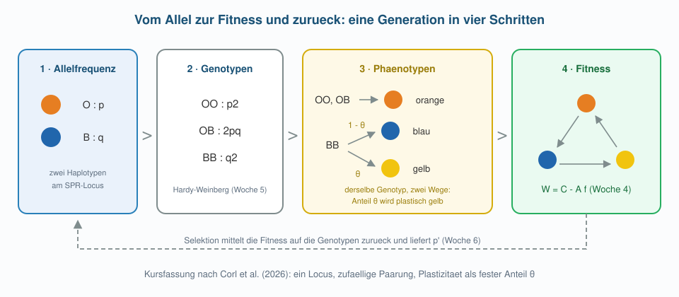

```{r}
#| include: false
sichel <- read.csv("data/sickle_nigeria.csv")
sichel$n <- sichel$AA + sichel$AS + sichel$SS
sichel$p <- (2 * sichel$AA + sichel$AS) / (2 * sichel$n)

erwartet <- function(zeile) {
  p <- zeile$p
  c(AA = p^2, AS = 2 * p * (1 - p), SS = (1 - p)^2) * zeile$n
}

selektionsschritt <- function(p, w) {
  q <- 1 - p
  w_quer <- p^2 * w[1] + 2 * p * q * w[2] + q^2 * w[3]
  (p^2 * w[1] + p * q * w[2]) / w_quer
}

simuliere <- function(p0, w, generationen = 150) {
  p <- numeric(generationen + 1)
  p[1] <- p0
  for (t in seq_len(generationen)) p[t + 1] <- selektionsschritt(p[t], w)
  p
}

trajektorien <- function(w, starts = c(0.05, 0.3, 0.7, 0.95),
                         generationen = 150, main = "") {
  farben <- c("#2166ac", "#1b9e77", "#d95f02", "#7570b3")
  plot(NA, xlim = c(0, generationen), ylim = c(0, 1),
       xlab = "Generation", ylab = "Frequenz p von A", main = main)
  abline(h = c(0, 1), col = "grey85")
  for (i in seq_along(starts)) {
    lines(0:generationen, simuliere(starts[i], w, generationen),
          lwd = 2.5, col = farben[i])
  }
}

## Teil 4: Kehlfarben-Modell
make_rps_A <- function(s, w) {           # aus Woche 4
  matrix(c(1, w, s,
           s, 1, w,
           w, s, 1), nrow = 3, byrow = TRUE)
}

morphen <- function(p, theta) {
  q <- 1 - p
  c(orange = p^2 + 2 * p * q, blau = (1 - theta) * q^2, gelb = theta * q^2)
}

corl_schritt <- function(p, theta, s = 1.2, w = 0.5, C = 2) {
  f   <- morphen(p, theta)
  W   <- C - as.vector(make_rps_A(s, w) %*% f)
  w_O <- W[1]
  w_B <- (1 - theta) * W[2] + theta * W[3]
  w_quer <- f[["orange"]] * w_O + (1 - p)^2 * w_B
  p * w_O / w_quer
}

corl <- function(p0, theta, generationen = 300, ...) {
  p <- numeric(generationen + 1)
  p[1] <- p0
  for (t in seq_len(generationen)) p[t + 1] <- corl_schritt(p[t], theta, ...)
  p
}

kehlfarben_bahnen <- function(theta, main = "", generationen = 300,
                              starts = c(0.10, 0.35, 0.65, 0.90)) {
  farben <- c("#2166ac", "#1b9e77", "#d95f02", "#7570b3")
  plot(NA, xlim = c(0, generationen), ylim = c(0, 1), xlab = "Generation",
       ylab = "Frequenz p des O-Haplotyps", main = main)
  abline(h = c(0, 1), col = "grey85")
  for (i in seq_along(starts)) {
    lines(0:generationen, corl(starts[i], theta, generationen),
          lwd = 2.5, col = farben[i])
  }
}
```

## Übersicht

**Woche 6** von 14 · **Do., 22. Okt. 2026, 08:15–10:00**

| Teil | Dauer | Was |
|------|-------|-----|
| Vorlesung | ~45 min | Sichelzelle → Fitness → drei Regime |
| Notebook | ~45 min | Parameter drehen, Gleichgewichte finden |

::: aside
Pfeiltasten · **M** Menü · **E** PDF · **Esc** Übersicht
:::

## Lernziele

Nach heute können Sie …

1. aus Genotypzählungen ablesen, dass Selektion gewirkt hat,
2. relative Fitness in die Rekursion für $p$ übersetzen,
3. gerichtete Selektion, Unterdominanz und Überdominanz an Trajektorien erkennen,
4. sagen, unter welchen Annahmen nur Überdominanz Vielfalt erhält,
5. dieselbe Simulation mit **einem** Aufruf für viele Parameterwerte laufen lassen.

## Heute in dieser Reihenfolge

1. Ein Befund: fehlende Genotypen bei Erwachsenen
2. Von der Abweichung zur Fitness
3. Die Gleichung für eine Generation
4. Drei Regime — und was sie mit Vielfalt machen
5. Warum die Eidechsen aus Woche 4 nicht dazugehören

::: aside
[Modul 2](../../docs/module-02-overview.html) · [Glossar](../../docs/glossary.html)
:::

# Teil 1 · Ein Befund

## Sichelzellanämie

::::: columns
::: {.column width="46%"}
{fig-alt="Sichelzellen im Blutausstrich" width="94%"}
:::
::: {.column width="54%"}
Eine Punktmutation im $\beta$-Globin-Gen (**HbS**) verändert das Hämoglobin. Unter Sauerstoffmangel verformen sich die roten Blutkörperchen.

Zwei Kopien (**SS**) bedeuten eine schwere Erkrankung — historisch mit sehr geringer Überlebenschance bis ins Erwachsenenalter.
:::
:::::

## Das Rätsel

Eine Variante, die homozygot oft tödlich ist, sollte selten sein.

In Teilen Afrikas, Indiens und des Mittelmeerraums ist sie **häufig**: bis zu jede vierte Person trägt eine Kopie.

Warum verschwindet sie nicht?

## Der Verdacht: Malaria

::::: columns
::: {.column width="46%"}
{fig-alt="Anopheles-Muecke" width="94%"}
:::
::: {.column width="54%"}
Die Verbreitung von HbS deckt sich mit der Verbreitung von *Plasmodium falciparum*.

Allison (1954) zeigte: **Heterozygote** (AS) haben bei Infektion weniger Parasiten im Blut und seltener schwere Verläufe.
:::
:::::

## Die entscheidende Beobachtung

Vergleichen wir dieselbe Population in **zwei Lebensstadien**:

```{r}
#| echo: true
sichel <- read.csv("data/sickle_nigeria.csv")
sichel$n <- sichel$AA + sichel$AS + sichel$SS
sichel$p <- (2 * sichel$AA + sichel$AS) / (2 * sichel$n)

sichel[, c("stadium", "AA", "AS", "SS", "n")]
```

Beide Zeilen beschreiben dieselbe Bevölkerung — einmal bei der Geburt, einmal im Erwachsenenalter. Die Allelfrequenz rechnen wir wie in Woche 5, spaltenweise.

## Neugeborene: alles wie erwartet

```{r}
#| echo: true
neu <- sichel[sichel$stadium == "Neugeborene", ]
round(erwartet(neu), 1)      # Hardy-Weinberg-Erwartung
c(AA = neu$AA, AS = neu$AS, SS = neu$SS)
```

Bei der Geburt liegen die Genotypen fast genau auf der Erwartung aus Woche 5. Die Paarung ist zufällig, Selektion hat noch nicht gewirkt.

## Erwachsene: eine Lücke

```{r}
#| echo: true
erw <- sichel[sichel$stadium == "Erwachsene", ]
round(erwartet(erw), 1)
c(AA = erw$AA, AS = erw$AS, SS = erw$SS)
```

Erwartet wären rund **188** SS-Individuen, beobachtet sind **29**. Gleichzeitig gibt es mehr Heterozygote als erwartet.

## Was hier sichtbar wird

Zwischen Geburt und Erwachsenenalter überleben die Genotypen **unterschiedlich gut**.

Das ist keine Statistik-Spitzfindigkeit, sondern der direkte Blick auf Selektion: Die Abweichung von der Erwartung ist ihre Signatur.

# Teil 2 · Von der Abweichung zur Fitness

## Fitness als Überlebensanteil

Wir teilen beobachtet durch erwartet und setzen den besten Genotyp auf $1$:

```{r}
#| echo: true
anteil <- c(AA = erw$AA, AS = erw$AS, SS = erw$SS) / erwartet(erw)
w <- round(anteil / max(anteil), 3)
w
```

Diese drei Zahlen heissen **relative Fitness**. Sie sind keine Erfindung des Modells — sie kommen aus der Auszählung.

## Der Fitnessvektor

$$
\mathbf{w} = (w_{AA},\; w_{AS},\; w_{SS}) \approx (0.88,\; 1,\; 0.14)
$$

Lesart: Von 100 Heterozygoten, die es ins Erwachsenenalter schaffen, schaffen es nur etwa 88 der AA und 14 der SS.

Der **Heterozygote** ist am besten dran. Dafür gibt es einen Namen: **Überdominanz**.

## Eine Generation als Gleichung

Vor der Selektion: $p^2$, $2pq$, $q^2$ (Woche 5).  
Jeder Genotyp überlebt mit seiner Fitness. Die mittlere Fitness ist

$$
\bar w = p^2 w_{AA} + 2pq\, w_{AS} + q^2 w_{SS}
$$

und danach gilt

$$
p' = \frac{p^2 w_{AA} + pq\, w_{AS}}{\bar w}.
$$

## Was in dieser Formel steckt

| Teil | Bedeutung |
|------|-----------|
| $p^2 w_{AA}$ | überlebende AA, jede mit zwei $A$-Kopien |
| $pq\, w_{AS}$ | überlebende Heterozygote, je eine $A$-Kopie |
| $\bar w$ | Normierung: Anteile müssen sich zu 1 addieren |

Dieselbe Bauweise wie in Woche 4: **Anteil × relativer Erfolg, geteilt durch den Durchschnitt.**

## Im Code

```{r}
#| echo: true
selektionsschritt <- function(p, w) {
  q <- 1 - p
  w_quer <- p^2 * w[1] + 2 * p * q * w[2] + q^2 * w[3]
  (p^2 * w[1] + p * q * w[2]) / w_quer
}

selektionsschritt(p = 0.5, w = c(0.88, 1, 0.14))
```

Bei $p = 0.5$ steigt $p$ — das seltene, tödliche Allel wird verdrängt, aber nicht beliebig weit.

## Vorhersage und Wirklichkeit

```{r}
#| echo: true
#| fig-height: 3.3
#| fig-width: 7.6
w_sichel <- c(0.88, 1, 0.14)
bahn <- simuliere(p0 = 0.5, w = w_sichel, generationen = 120)

plot(0:120, bahn, type = "l", lwd = 2.5, col = "#2166ac", ylim = c(0, 1),
     xlab = "Generation", ylab = "Frequenz p von A",
     main = "Vorhersage des Modells")
abline(h = erw$p, lty = 2, col = "#b2182b", lwd = 2)
```

Gestrichelt: die **beobachtete** Frequenz bei den Erwachsenen.

## Die Pointe

```{r}
#| echo: true
c(modell = round(tail(bahn, 1), 3),
  beobachtet = round(erw$p, 3))
```

Aus den Überlebensanteilen berechnet das Modell ein Gleichgewicht — und es liegt dort, wo die Population tatsächlich ist.

Etwa 12 % der Kopien sind HbS, in jeder Generation neu hergestellt aus dem Vorteil der Heterozygoten.

# Teil 3 · Drei Regime

## Was bestimmt den Ausgang?

Nicht die absoluten Zahlen, sondern die **Reihenfolge** der drei Fitnesswerte. Es gibt drei Möglichkeiten — und jede hat eine andere Folge für die Vielfalt.

## Gerichtete Selektion

$w_{AA} > w_{AB} > w_{BB}$: das bessere Allel setzt sich durch.

```{r}
#| fig-height: 3.4
#| fig-width: 7.6
trajektorien(c(1.1, 1.05, 1), main = "Gerichtet: A verdraengt B")
```

Am Ende ist die Population **einheitlich**. Vielfalt verschwindet.

## Unterdominanz

$w_{AB}$ ist kleiner als beide Homozygoten — Mischformen sind im Nachteil.

```{r}
#| fig-height: 3.4
#| fig-width: 7.6
trajektorien(c(1.1, 0.9, 1.1), main = "Unterdominanz: der Start entscheidet")
```

Wer schon häufig ist, gewinnt. Auch hier bleibt am Ende **ein** Allel übrig.

## Überdominanz

$w_{AB}$ ist grösser als beide Homozygoten — wie bei der Sichelzelle.

```{r}
#| fig-height: 3.4
#| fig-width: 7.6
trajektorien(c(0.88, 1, 0.14), main = "Ueberdominanz: alle Wege enden innen")
```

Egal wo wir starten: $p$ landet **im Inneren**. Beide Allele bleiben erhalten.

## Warum das so ist

Ist $A$ selten, sitzen fast alle $A$-Kopien in Heterozygoten — also im fittesten Genotyp. $A$ nimmt zu.

Ist $A$ häufig, gilt dasselbe für $B$. $A$ nimmt ab.

Jedes Allel wächst, **wenn es selten ist**. Das nennt man einen **geschützten Polymorphismus**.

## Das Gleichgewicht

Schreibt man $w_{AA} = 1-s$, $w_{AB} = 1$, $w_{BB} = 1-t$, liegt es bei

$$
\hat p = \frac{t}{s+t}.
$$

Für die Sichelzelle: $s = 0.12$, $t = 0.86$, also $\hat p = 0.86/0.98 \approx 0.88$ — die 12 % HbS von vorhin.

## Die Regel — und ihre Voraussetzungen

> In **einer** Population, bei **zufälliger Paarung**, an **einem** Locus, mit **konstanter** Fitness gilt: Vielfalt bleibt nur bei Überdominanz erhalten.

Jedes fettgedruckte Wort ist eine Bedingung. Fällt eine weg, ändert sich die Aussage.

# Teil 4 · Zurück zu den Eidechsen

## Warum die Regel dort nicht greift

In Woche 4 hing der Erfolg einer Strategie davon ab, **wie häufig** die anderen waren. Eine seltene Strategie war im Vorteil, eine häufige im Nachteil.

Genau das verbietet die Voraussetzung «konstante Fitness»: Dort ist $w$ keine feste Zahl, sondern eine **Funktion der Häufigkeiten**.

## Zwei Hälften, die zusammengehören

Bisher hatten wir von den Kehlfarben immer nur eine Hälfte:

| | Was wir hatten | Was fehlte |
|---|---|---|
| Woche 4 | das Spiel: drei Morphen, zyklisch geschlagen | die Vererbung — wir zählten Strategien, keine Allele |
| Woche 5 | die Genetik: zwei Haplotypen plus Plastizität | die Selektion — nichts trieb die Frequenzen |

Heute ist das dritte Stück da: die Rekursion für $p$. Damit lassen sich beide Hälften zusammensetzen.

## Die Frage, die dann entsteht

Der Zyklus braucht **drei** Morphen. Die Genetik liefert nur **zwei** Allele — die dritte Farbe entsteht erst in der Entwicklung.

> Kann ein Zyklus einen Polymorphismus tragen, wenn eine der drei Morphen gar nicht vererbt wird?

Das ist die Frage von Corl et al. (2026). Wir bauen eine Kursfassung ihres Modells — aus Teilen, die Sie alle schon kennen.

## Das Modell in vier Schritten

{fig-alt="Kreislauf von Allelfrequenz ueber Genotyp und Phaenotyp zur Fitness" width="96%"}

Ein Durchlauf ist eine Generation. Jeder Schritt stammt aus einer anderen Woche.

## Schritt 1 · Vom Genotyp zur Kehlfarbe

Zwei Haplotypen $O$ und $B$ mit Frequenzen $p$ und $q$. Hardy-Weinberg liefert $p^2$, $2pq$, $q^2$ — und dann kommt die Zuordnung zur Farbe:

- $OO$ und $OB$ werden **orange**
- $BB$ wird **blau** — ausser einem Anteil $\theta$, der plastisch **gelb** wird

$$
f_o = p^2 + 2pq, \qquad
f_b = (1-\theta)\,q^2, \qquad
f_y = \theta\, q^2
$$

Der Parameter $\theta$ ist das ganze Zugeständnis an die Plastizität: **wie oft die Entwicklung den anderen Weg nimmt.**

## Schritt 2 · Die Fitness kommt aus Woche 4

Die drei Farben spielen dasselbe Spiel wie damals:

$$
A =
\begin{pmatrix}
1 & w & s \\
s & 1 & w \\
w & s & 1
\end{pmatrix}
\qquad
\mathbf{W} = C - A\,\mathbf{f}
$$

Unverändert seit Woche 4. Neu ist nur, **woher $\mathbf f$ kommt**: nicht mehr frei gewählt, sondern von der Genetik geliefert.

## Schritt 3 · Zurück zur Allelfrequenz

Ein Genotyp hat jetzt keine eigene Fitness mehr — er hat eine **erwartete**:

$$
w_{OO} = w_{OB} = W_o,
\qquad
w_{BB} = (1-\theta)\,W_b + \theta\, W_y
$$

$BB$ trägt beide Möglichkeiten anteilig. Damit greift die Rekursion von vorhin:

$$
p' = \frac{p^2 w_{OO} + pq\, w_{OB}}{\bar w} = \frac{p\, W_o}{\bar w}
$$

::: aside
Die Vereinfachung rechts gilt, weil $OO$ und $OB$ dieselbe Farbe tragen.
:::

## Im Code

```{r}
#| echo: true
morphen <- function(p, theta) {
  q <- 1 - p
  c(orange = p^2 + 2 * p * q, blau = (1 - theta) * q^2, gelb = theta * q^2)
}

corl_schritt <- function(p, theta, s = 1.2, w = 0.5, C = 2) {
  f   <- morphen(p, theta)                       # 1 · Genetik zu Farben
  W   <- C - as.vector(make_rps_A(s, w) %*% f)   # 2 · Spiel aus Woche 4
  w_O <- W[1]
  w_B <- (1 - theta) * W[2] + theta * W[3]       # 3 · BB mittelt beide Wege
  p * w_O / (f[["orange"]] * w_O + (1 - p)^2 * w_B)
}
```

Vier Zeilen Biologie, eine Zeile Rekursion.

## Ohne Plastizität

```{r}
#| echo: true
#| fig-height: 3.3
#| fig-width: 7.6
kehlfarben_bahnen(theta = 0, main = "theta = 0: nur orange und blau")
```

Zwei Morphen, und Orange schlägt Blau. Das $B$-Allel verschwindet — langsam, weil es sich in orangen Heterozygoten versteckt, aber unaufhaltsam.

## Mit Plastizität

```{r}
#| echo: true
#| fig-height: 3.3
#| fig-width: 7.6
kehlfarben_bahnen(theta = 0.5, main = "theta = 0.5: die dritte Farbe ist da")
abline(h = 1 - sqrt(2/3), lty = 2, col = "#b2182b", lwd = 2)
```

Von überall her läuft $p$ auf denselben Wert. Beide Haplotypen bleiben erhalten — **ohne dass ein Heterozygoter im Vorteil wäre**.

## Wie viel Plastizität braucht es?

```{r}
#| echo: true
#| fig-height: 3.2
#| fig-width: 7.6
theta_werte <- seq(0, 0.75, by = 0.01)
p_eq <- sapply(theta_werte, function(th) tail(corl(0.5, th, 3000), 1))

plot(theta_werte, p_eq, type = "l", lwd = 2.5, col = "#2166ac", ylim = c(0, 1),
     xlab = expression(theta), ylab = "p im Gleichgewicht")
abline(v = c(0.286, 0.613), lty = 2, col = "#b2182b", lwd = 2)
```

::: aside
Kein neues Werkzeug: `sapply()` und die Vorgabewerte sind die von vorhin.
:::

## Ein Fenster, kein Schalter

Links im Bild fixiert Orange, rechts verschwindet es. Die linke Kante lässt sich hinschreiben:

$$
\theta^* = \frac{s-1}{s-w} = \frac{0.2}{0.7} \approx 0.29
$$

Unterhalb davon ist Gelb zu selten, um Orange zu bremsen. Oberhalb von $\theta \approx 0.61$ ist es so häufig, dass Orange selbst untergeht.

**Plastizität erhält die Vielfalt nur in einem Bereich — zu wenig und zu viel wirken gleich.**

## Wo die zwei Wochen zusammenfallen

Bei genau $\theta = 0.5$ gilt im Gleichgewicht $q^2 = 2/3$, und damit

$$
f_o = f_b = f_y = \tfrac{1}{3}
$$

Das ist exakt der symmetrische Punkt des Spiels aus Woche 4 — diesmal nicht gesetzt, sondern **aus der Vererbung hergeleitet**. Die drei gleich häufigen Morphen brauchen keine drei Allele.

## Zwei Mechanismen nebeneinander

| | Überdominanz | Häufigkeitsabhängige Fitness |
|---|---|---|
| Fitness | feste Zahlen | hängt von den Häufigkeiten ab |
| Wer ist im Vorteil? | immer die Heterozygoten | wer gerade selten ist |
| Beispiel | Sichelzelle, Malaria | Kehlfarben, Wirt–Parasit |
| Ergebnis | Vielfalt bleibt | Vielfalt kann bleiben |

Beide erhalten Polymorphismus — aus verschiedenen Gründen. Wer die Kehlfarben mit Überdominanz erklärt, nennt den falschen Mechanismus.

## Was diese Kursfassung weglässt

Unser Modell ist eine **vereinfachte Fassung** nach Corl et al. (2026):

- ein Locus, zufällige Paarung, unendlich grosse Population
- $\theta$ als feste Zahl, nicht als Antwort der Entwicklung auf die Umgebung
- keine Weibchen, kein Raum, keine Dichte

Was übrig bleibt, ist trotzdem die Aussage des Papers: **Plastizität kann die dritte Morphe liefern, die der Zyklus braucht.** Zwei Allele genügen.

# Neu im Code · Eine Funktion, viele Parameter

## Das Problem

Wir wollen dieselbe Simulation für vier Startwerte, dann für fünf Fitnesswerte, dann für ein ganzes Raster. Kopieren wäre fehleranfällig und unleserlich.

## Erst: Vorgabewerte

```{r}
#| echo: true
simuliere <- function(p0, w, generationen = 150) {
  p <- numeric(generationen + 1)
  p[1] <- p0
  for (t in seq_len(generationen)) p[t + 1] <- selektionsschritt(p[t], w)
  p
}
```

`generationen = 150` ist ein **Default-Argument**: Wer nichts angibt, bekommt 150. Wer will, schreibt `generationen = 500`.

## Dann: `sapply()` statt Kopieren

```{r}
#| echo: true
staerken <- c(0.1, 0.3, 0.5, 0.9)

endwerte <- sapply(staerken, function(t) {
  w <- c(1 - 0.12, 1, 1 - t)
  tail(simuliere(p0 = 0.5, w = w, generationen = 300), 1)
})

round(endwerte, 3)
```

Ein Aufruf, vier Ergebnisse: Je tödlicher der Homozygote SS, desto weiter rückt das Gleichgewicht nach oben.

## Was `sapply()` macht

`sapply(werte, funktion)` wendet dieselbe Funktion auf jeden Eintrag an und gibt die Ergebnisse als Vektor zurück.

| | |
|---|---|
| Eingabe | ein Vektor von Parameterwerten |
| Arbeit | pro Wert ein Funktionsaufruf |
| Ausgabe | ein Vektor von Ergebnissen |

Das ist der Unterschied zwischen «einmal rechnen» und «systematisch untersuchen».

## Drei Werkzeuge, drei Aufgaben

| Aufgabe | Werkzeug |
|---------|----------|
| Schritt $t+1$ aus Schritt $t$ | `for`-Schleife (Woche 2) |
| dieselbe Rechnung für jede Tabellenzeile | Spaltenrechnung (Woche 5) |
| dieselbe Simulation für viele Parameter | `sapply()` (heute) |

## Mini-Glossar R (heute)

| Konzept | Merksatz |
|---------|----------|
| `function(x, y = 10)` | Default-Argument: Vorgabe, überschreibbar |
| `sapply(v, f)` | `f` auf jeden Eintrag von `v`, Ergebnis als Vektor |
| `function(t) { ... }` | namenlose Funktion, direkt übergeben |
| `tail(x, 1)` | letzter Eintrag (hier: das Gleichgewicht) |

## Programmierung ↔ Biologie

| Programmierung | Biologie |
|----------------|----------|
| Argument `w` | wie gut ein Genotyp überlebt |
| eine Funktion, viele Aufrufe | dieselbe Population unter anderen Bedingungen |
| Vektor von Endwerten | Gleichgewicht als Funktion der Selektionsstärke |

# Abschluss

## Take-home

1. Fehlende Genotypen bei Erwachsenen sind die sichtbare Spur der Selektion.
2. Relative Fitness kommt aus dem Vergleich beobachtet/erwartet — und geht in $p' = (p^2 w_{AA} + pq\,w_{AB})/\bar w$ ein.
3. Gerichtete Selektion und Unterdominanz beenden die Vielfalt, Überdominanz erhält sie.
4. Diese Regel gilt für **eine** Population mit **konstanter** Fitness; häufigkeitsabhängige Fitness ist ein eigener Mechanismus.
5. Mit `sapply()` untersucht man Parameter systematisch statt per Copy-Paste.

## Notebook (~45 min)

**→ [Notebook Woche 6 öffnen](notebook.html)**

::::: columns
::: {.column width="20%"}
{fig-alt="Notebook" width="70%"}
:::
::: {.column width="80%"}
**A** Sichelzell-Fitness aus den Zählungen rekonstruieren  

**B** drei Regime als Trajektorien  

**C** Gleichgewicht gegen Selektionsstärke — mit `sapply()`  

**D** konstante gegen häufigkeitsabhängige Fitness
:::
:::::

## Abschlussfragen

1. Warum passen die Neugeborenen zur HWE-Erwartung, die Erwachsenen aber nicht?
2. Welche drei Fitnesswerte führen dazu, dass Vielfalt erhalten bleibt?
3. Was bedeutet «geschützter Polymorphismus» in einem Satz?
4. Warum lässt sich die Erhaltung der Kehlfarben nicht mit Überdominanz erklären?
5. Wann ist `sapply()` das richtige Werkzeug, wann eine Schleife?

## Literatur

:::: {.lit}
1. **Allison, A. C. (1954).** Protection afforded by sickle-cell trait against subtertian malarial infection. *BMJ* 1: 290–294. [doi:10.1136/bmj.1.4857.290](https://doi.org/10.1136/bmj.1.4857.290)
2. **Allison, A. C. (1964).** Polymorphism and natural selection in human populations. *Cold Spring Harb. Symp. Quant. Biol.* 29: 137–149.
3. **Corl, A., et al. (2026).** The genetics, evolution, and maintenance of a biological rock-paper-scissors game. *Science* 391: 69–74. [doi:10.1126/science.adw8265](https://doi.org/10.1126/science.adw8265)
4. **Sinervo, B., & Lively, C. M. (1996).** The rock–paper–scissors game and the evolution of alternative male strategies. *Nature* 380: 240–243.

Kursdaten `sickle_nigeria.csv`: Lehrzahlen aus der populationsgenetischen Lehrbuchliteratur, siehe `data/README.md`.
::::

## Navigation

| | |
|---|---|
| Notebook | [Notebook Woche 6](notebook.html) |
| Zurück | [← Woche 5](../week-05/slides.html) |
| Weiter | [Woche 7 →](../week-07/slides.html) |
| Modul | [Modul 2](../../docs/module-02-overview.html) |
| PDF | Taste **E**, dann Drucken → Als PDF speichern |
