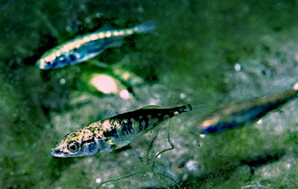
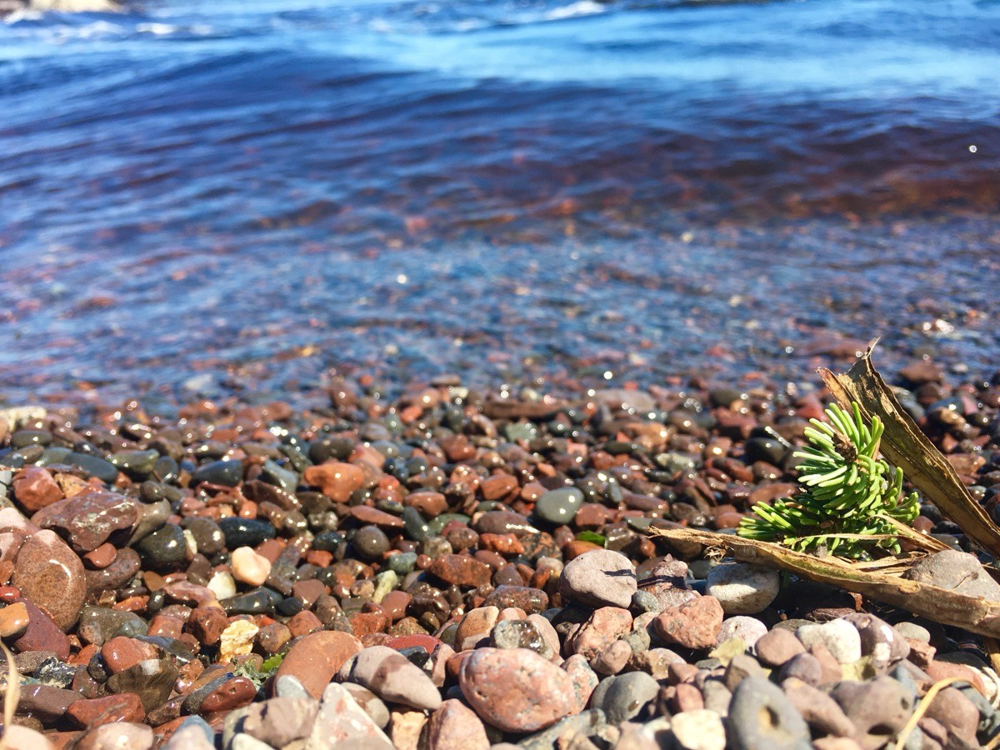

```{r}
#| include: false
selection_step_general <- function(p, fitness) {
  q <- 1 - p
  wbar <- p^2 * fitness[1] + 2 * p * q * fitness[2] +
    q^2 * fitness[3]
  (p^2 * fitness[1] + p * q * fitness[2]) / wbar
}

two_deme_step <- function(p1, p2, s = 0.1, m = 0.02, s1 = s, s2 = s) {
  p1s <- selection_step_general(p1, c(1 + s1, 1 + s1 / 2, 1))
  p2s <- selection_step_general(p2, c(1, 1 + s2 / 2, 1 + s2))
  c(p1 = (1 - m) * p1s + m * p2s,
    p2 = (1 - m) * p2s + m * p1s)
}

simulate_two_demes <- function(p1_0, p2_0, s = 0.1, m = 0.02,
                               generations = 200, s1 = s, s2 = s) {
  out <- matrix(NA_real_, generations + 1, 2,
                dimnames = list(NULL, c("p1", "p2")))
  out[1, ] <- c(p1_0, p2_0)
  for (t in seq_len(generations)) {
    out[t + 1, ] <- two_deme_step(out[t, 1], out[t, 2], m = m,
                                 s1 = s1, s2 = s2)
  }
  data.frame(generation = 0:generations, out,
             p_global = rowMeans(out),
             differentiation = abs(out[, 1] - out[, 2]))
}

# Protected polymorphism: both alleles increase when rare.
# Linearisation after selection-then-migration, additive, HWE.
leading_growth <- function(alpha, beta, m) {
  tau <- (1 - m) * (alpha + beta)
  disc <- tau * tau - 4 * (1 - 2 * m) * alpha * beta
  0.5 * (tau + sqrt(pmax(disc, 0)))
}

protected_both_alleles <- function(s1, s2, m) {
  a1 <- 1 + s1 / 2
  a2 <- (1 + s2 / 2) / (1 + s2)
  b1 <- (1 + s1 / 2) / (1 + s1)
  b2 <- 1 + s2 / 2
  leading_growth(a1, a2, m) > 1 && leading_growth(b1, b2, m) > 1
}

poly_map <- local({
  m <- 0.10
  s <- seq(0.005, 0.50, length.out = 101)
  z <- matrix(NA_real_, length(s), length(s))
  for (i in seq_along(s)) {
    for (j in seq_along(s)) {
      z[i, j] <- as.numeric(protected_both_alleles(s[i], s[j], m))
    }
  }
  list(s = s, z = z, m = m)
})
```

## Übersicht

**Woche 6** von 14 · **Do., 22. Okt. 2026, 08:15–10:00**

| Teil | Dauer | Was |
|---|---:|---|
| Vorlesung | ~45 min | Genetische Unterschiede → Modell → stabile Differenzen |
| Notebook | ~45 min | Trajektorien: wann bleiben Populationen verschieden? |

::: aside
Pfeiltasten · **M** Menü · **Esc** Übersicht
:::

## Lernziele

Nach heute können Sie …

1. an Beispielen sehen, dass es **genetische Unterschiede** zwischen Habitaten gibt,
2. die Frage stellen: können sie **bleiben**, obwohl jemand wandert?
3. dasselbe Denkschema wie Lotka–Volterra erkennen — Extra: Vererbung,
4. an Trajektorien sehen, wann $p_1\neq p_2$ **stabil** ist — und wann nicht.

## Heute in dieser Reihenfolge

1. Stichling: Unterschiede trotz Verbindung?
2. Dasselbe Schema wie Lotka–Volterra — Extra: Vererbung
3. Wann bleibt $p_1\neq p_2$ stabil?
4. Was übernimmt die Statistik von $F_{ST}$?

# Teil 1 · Zwei Habitate

## Letzte Woche: Mischung in der Stichprobe

Wahlund: zwei Gruppen in **einer** Probe → zu wenige Heterozygote.
Die Struktur war ein Artefakt des Poolens.

Heute ist die Struktur **real**: Meer und See.
Fische wechseln wirklich die Seite.

> Können genetische Unterschiede **bleiben**, obwohl Genfluss sie mischt?

## Dieselbe Art, zwei Welten

::::::: columns
::::: {.column width="48%"}
{fig-alt="Kelpwald" width="100%"}

**Meer:** voller Knochenpanzer, Stacheln
:::::
::::: {.column width="48%"}
{fig-alt="Stichlinge im Suesswasser" width="100%"}

**See / Bach:** oft wenige Platten, reduzierte Stacheln, andere Form
:::::
:::::::

Dreistachlige Stichlinge (*Gasterosteus aculeatus*): dieselbe Art, zwei Habitate.

::: aside
Kelpwald · Stichlinge. Wikimedia Commons
:::

## Kreuzungen: die Unterschiede sind genetisch

Peichel et al. (2001): Kreuzungen zwischen divergenten Ökotypen,
genetische Karte, QTL für Stacheln, Körperform und andere Merkmale.

Die Unterschiede sind **erblich** — nicht nur Plastizität.
Oft wenige Loci mit grossem Effekt plus weitere mit kleinerem
(Peichel & Marques 2017).

## Platten: ein Locus mit grossem Effekt

Colosimo et al. (2005): der Locus *Eda* erklärt einen grossen Teil der
Variation in den Knochenplatten.

Im Meer meist voller Panzer. In vielen Süsswasserpopulationen das
niedrig-gepanzerte Allel — und oft **dasselbe** Allel in unabhängigen Seen.

Ein Merkmal, ein Hauptlocus, parallele Wiederverwendung.

## Genome: dieselben Stellen, mehrmals

Jones et al. (2012): Genome aus mehreren Meer–Süsswasser-Paaren.

Der **Grossteil** des Genoms ist ähnlich (gemeinsame Herkunft, Genfluss).
Eine **Minderheit** der Loci ist stark differenziert — und in unabhängigen
Paaren oft dieselben Regionen.

*Eda* ist eines davon. Die meisten anderen haben kleineren Effekt.

## Trotzdem nicht isoliert

{fig-alt="Felskueste" width="52%"}

Fische und Larven wandern. Nach den Eiszeiten haben marine Fische
wiederholt Seen und Bäche besiedelt — Genfluss ist nicht null.

Trotzdem bleiben Platten und viele andere Merkmale lokal verschieden.

> Reicht die lokale Selektion, damit der Unterschied nicht wegmischt?

::: aside
Felsküste. Wikimedia Commons: *Rocky shore.jpg*
:::

## Die Intuition

Zwei Kräfte:

1. **Selektion** zieht jede Seite zu ihrem lokalen Optimum
   (voller Panzer im Meer, weniger Platten im See).
2. **Migration** mischt — wandernde Fische, Kolonisten.

Wann gewinnt welche Kraft? Können Unterschiede **bleiben**, obwohl Genfluss
sie ständig mischt?

## Genetische Unterschiede — und ein Scan nur als Motiv

Platten, parallele Seen: das ist nicht nur Phänotyp.
Jones et al. (2012): die meisten Loci ähnlich, ein paar stark verschieden —
dasselbe Muster, das man später als **$F_{ST}$-Scan** liest.

Heute modellieren wir nicht den Scan. Wir fragen zuerst:

> Können Unterschiede zwischen Populationen **stabil** sein,
> obwohl Individuen wandern?

## Die Frage an das Modell

Alle Loci teilen ungefähr dieselbe Migration.  
Nur manche spüren **entgegengesetzte Selektion**.

Dann kann $p_1\neq p_2$ ein Gleichgewicht sein — nicht nur ein Zufallsbild.

# Teil 2 · Dasselbe Denkschema wie Lotka–Volterra

## Woche 2: zwei Dichten

{fig-alt="Lotka-Volterra Zyklen" width="70%"}

Zustand: $(N,P)$ — Beute und Räuber.  
Jede Generation: wachsen, fressen, sterben → neuer Zustand.

Zwei Zahlen, eine Schleife.

## Heute: zwei Allele, nicht zwei Arten

Dieselbe Schleife — anderer Zustand.

| Lotka–Volterra | hier |
|---|---|
| zwei **Arten** $N$, $P$ | zwei **Allele** A, B |
| Dichten können unabhängig wachsen | Frequenzen: $p+q=1$ |
| fressen, sterben | überleben, **vererben** |
| keine Mendel-Genetik | Allele sitzen in Diploiden |

Wir brauchen eine Extra-Zutat, die LV nicht hatte: **Vererbung**.

## Vererbung: HWE in jeder Population

Woche 5: bei zufälliger Paarung folgen die Genotypen aus $p$

$$
AA,\;AB,\;BB \quad\text{wie}\quad p^2,\;2pq,\;q^2.
$$

Das nehmen wir **in jeder Deme getrennt** an.

Dann reicht eine Zahl pro Habitat: $p_1$ und $p_2$.
HWE in **jeder** Population — nicht im Pool (Woche 5).

## Zwei Habitate = zwei lokale $p$

::::::: columns
::::: {.column width="50%"}
### Habitat 1

See / Bach

**A** lokal besser (z. B. niedrig-gepanzerte *Eda*-Variante)  
Selektion schiebt $p_1$ nach oben
:::::
::::: {.column width="50%"}
### Habitat 2

Meer

**B** lokal besser (voller Panzer)  
Selektion schiebt $p_2$ nach unten
:::::
:::::::

Danach **Mischung**: ein Anteil $m$ wechselt die Seite
(wandernde Fische, Kolonisten).

## Eine Generation — nur das Gerüst

$$
(p_1,p_2)
\;\xrightarrow{\text{HWE + Selektion lokal}}\;
(p_1^S,p_2^S)
\;\xrightarrow{\text{Migration}}\;
(p_1',p_2').
$$

Intuition, grosse Sprünge:

- Selektion **trennt** die zwei Seiten
- Migration **zieht sie zusammen** (Anteil $m$ der Nachbarn einrühren)
- $m=0$: Isolation. $m$ gross: eine gemischte Population

Die genaue Fitnessformel lässt der Code rechnen. Das Konzept zählt.

## Was «einrühren» heisst

Nach der lokalen Selektion mischt Migration die zwei Frequenzen:

$$
p_1' = (1-m)\, p_1^S + m\, p_2^S,
\qquad
p_2' = (1-m)\, p_2^S + m\, p_1^S.
$$

$m$ = Anteil, der die Seite wechselt (Fische, Kolonisten).

Zahlen: $p_1^S=0.9$, $p_2^S=0.1$, $m=0.05$
$\rightarrow$ $p_1'=0.86$, $p_2'=0.14$.
Ein Schritt tilgt den Unterschied nicht.

$m=0$: Isolation. $m$ gross: die zwei Seiten fallen zusammen.

## Drei Lesarten desselben Paars $(p_1,p_2)$

| | Frage |
|---|---|
| lokale Anpassung | Ist das lokal passende Allel **hier** häufiger? |
| Polymorphismus vor Ort | Gibt es an einem Ort beide Allele? |
| Differenzierung | Bleibt $p_1\neq p_2$ — auch auf lange Sicht? |

$\bar p=0.5$ kann beides sein: maximal verschieden **oder** überall gemischt.

# Teil 3 · Stabile Unterschiede

## Darum simulieren

Selektion gegen Genfluss sieht man dem Stichling nicht an der Flosse ab.
Zwei Zahlen, viele Generationen — das ist eine **Schleife**, wie Woche 2.

> Trennen sich $p_1$ und $p_2$, und **bleiben** sie getrennt?

**Nicht heute:** $F_{ST}$ schätzen, Fenster, $p$-Werte. Dasselbe Bild ist
später die Grundlage dafür — **Statistikvorlesung**.

## Wenig Genfluss: $p_1\neq p_2$ bleibt

```{r}
#| fig-height: 3.9
#| fig-width: 7.6
#| out-width: 66%
sim_low <- simulate_two_demes(0.5, 0.5, s = 0.1, m = 0.01, generations = 200)
plot(sim_low$generation, sim_low$p1, type = "l", lwd = 3,
     col = "#d95f02", ylim = c(0, 1), xlab = "Generation",
     ylab = "Frequenz von A", main = "Gleiche Selektion, wenig Migration")
lines(sim_low$generation, sim_low$p2, lwd = 3, col = "#3182bd")
lines(sim_low$generation, sim_low$p_global, lwd = 2, lty = 2)
legend("right", c("p1  Habitat 1", "p2  Habitat 2", "Mittel"),
       col = c("#d95f02", "#3182bd", "black"),
       lwd = c(3, 3, 2), lty = c(1, 1, 2), bty = "n")
```

Die Kurven trennen sich und **bleiben** getrennt.
Das ist ein Gleichgewicht: Selektion und Migration halten sich die Waage.

## Viel Genfluss: die Unterschiede kippen

```{r}
#| fig-height: 3.9
#| fig-width: 7.6
#| out-width: 66%
sim_high <- simulate_two_demes(0.5, 0.5, s = 0.1, m = 0.3, generations = 200)
plot(sim_high$generation, sim_high$p1, type = "l", lwd = 3,
     col = "#d95f02", ylim = c(0, 1), xlab = "Generation",
     ylab = "Frequenz von A", main = "Dieselbe Selektion, viel Migration")
lines(sim_high$generation, sim_high$p2, lwd = 3, col = "#3182bd")
lines(sim_high$generation, sim_high$p_global, lwd = 2, lty = 2)
legend("right", c("p1  Habitat 1", "p2  Habitat 2", "Mittel"),
       col = c("#d95f02", "#3182bd", "black"),
       lwd = c(3, 3, 2), lty = c(1, 1, 2), bty = "n")
```

$\bar p$ bleibt in der Mitte — die zwei Habitate werden genomisch fast gleich.

**Gene swamping:** der Genfluss überschwemmt die lokale Anpassung.
Stabil ist dann *keine* Differenzierung.

## Der zentrale Punkt

Gerichtete Selektion in *einer* Population treibt $p$ oft an den Rand.

Zwei Habitate mit entgegengesetzter Selektion können etwas anderes:
einen **stabilen Unterschied** $p_1^*\neq p_2^*$, trotz ständigem Austausch.

Ob das eintritt, hängt von der Stärke der lokalen Selektion gegen $m$ ab —
nicht von einem universellen Slogan «$m>s$».

## Wann bleiben beide Allele?

$s_1$ Vorteil von A in Habitat 1, $s_2$ von B in Habitat 2. **$m$ fest**
($m=0.10$). Beide Allele bleiben, wenn jedes zunimmt, sobald es selten ist.

```{r}
#| fig-height: 3.6
#| fig-width: 4.8
#| out-width: 42%
par(mar = c(4.2, 4.2, 2.2, 0.8), pty = "s")
image(
  x = poly_map$s, y = poly_map$s, z = poly_map$z,
  col = c("#f4a582", "#2166ac"),
  xlab = "s1  (A in Habitat 1)",
  ylab = "s2  (B in Habitat 2)",
  main = "m = 0.10 fest",
  useRaster = TRUE
)
abline(0, 1, lwd = 2, col = "#111111")
legend(
  "topleft",
  c("beide Allele bleiben", "ein Allel geht verloren"),
  fill = c("#2166ac", "#f4a582"),
  bty = "n", cex = 0.85
)
```

Diagonale $s_1=s_2>0$: **immer** Polymorphismus. Weit davon: das stärkere
Allel kann das andere **global** verdrängen.

## Zurück zum Stichling

> Reicht die lokale Selektion, damit der Unterschied nicht wegmischt?

*Eda*-Platten: starker Unterschied Meer/See, oft dasselbe Allel parallel.
Jones et al. (2012): der Rest des Genoms oft gemischt.

Das Modell sagt, *wann* stabile Differenzen möglich sind.
Ob ein konkreter Locus dazugehört, ist eine andere Frage.

## Und $F_{ST}$?

$F_{ST}$ fasst zusammen, wie weit $p$ zwischen Populationen auseinanderliegt.
Scans suchen Stellen, an denen dieser Abstand ungewöhnlich gross ist.

Dieselbe Grösse und dasselbe Zwei-Demen-Bild sind später die **Grundlage**
für Schätzer und Tests. Das üben Sie in der **Statistikvorlesung** —
ohne das Bild sitzen Sie dort vor einer Formel ohne Bedeutung.

Heute reicht: wir können beschreiben, dass stabile Unterschiede
zwischen Populationen *existieren können*.

Nächste Woche: Diversität **in einer** Population — auch wenn die
Fitness in der Zeit wechselt.

## Take-home

1. Stichling Meer/See: parallele, genetische Unterschiede trotz Genfluss.
2. Modell wie Lotka–Volterra — Extra: HWE **in jeder** Population.
3. Selektion trennt, Migration mischt.
4. Es kann ein **stabiles** $p_1\neq p_2$ geben.
5. $s_1=s_2$: Polymorphismus bleibt; ungleich stark kann ein Allel verloren gehen.
6. Zu viel Genfluss: Gene swamping — Unterschiede kippen, Allele nicht zwingend.
7. $F_{ST}$-Scans nutzen genau diese Idee — Statistikvorlesung.

## Notebook (~45 min)

**→ [Notebook Woche 6 öffnen](notebook.html)** · Entwurf

$m$ fest, $s_1$ und $s_2$ ändern: wann bleiben beide Allele?

## Abschlussfragen

1. Welche zwei Kräfte stehen hinter einem stabilen Unterschied $p_1\neq p_2$?
2. Was ist analog zu Lotka–Volterra — und was muss extra rein (HWE)?
3. Warum HWE *in jeder* Population, nicht im Pool?
4. Kann $\bar p=0.5$ gelten, obwohl es kaum lokale Anpassung gibt?
5. Was übernimmt die Statistikvorlesung von $F_{ST}$ — und was nicht heute?

## Literatur

:::: {.lit}
1. **Peichel, C. L. et al. (2001).** The genetic architecture of divergence between threespine stickleback species. *Nature* 414: 901–905. [doi:10.1038/414901a](https://doi.org/10.1038/414901a)
2. **Colosimo, P. F. et al. (2005).** Widespread parallel evolution in sticklebacks by repeated fixation of Ectodysplasin alleles. *Science* 307: 1928–1933. [doi:10.1126/science.1107239](https://doi.org/10.1126/science.1107239)
3. **Jones, F. C. et al. (2012).** The genomic basis of adaptive evolution in threespine sticklebacks. *Nature* 484: 55–61. [doi:10.1038/nature10944](https://doi.org/10.1038/nature10944)
4. **Peichel, C. L. & Marques, D. A. (2017).** The genetic and molecular architecture of phenotypic diversity in sticklebacks. *Phil. Trans. R. Soc. B* 372: 20150486. [doi:10.1098/rstb.2015.0486](https://doi.org/10.1098/rstb.2015.0486)
5. **Lenormand, T. (2002).** Gene flow and the limits to natural selection. *Trends in Ecology & Evolution* 17: 183–189. [doi:10.1016/S0169-5347(02)02497-7](https://doi.org/10.1016/S0169-5347(02)02497-7)
::::

## Navigation

| | |
|---|---|
| Kursplan | [Kursplan](../../docs/course-outline.html) |
| Notebook | [Notebook Woche 6](notebook.html) |
| Zurück | [← Woche 5](../week-05/slides.html) |
| Weiter | [Woche 7 →](../week-07/slides.html) |
