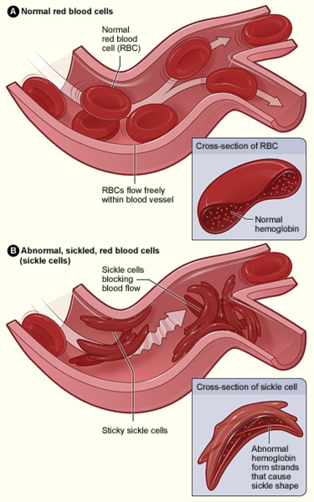
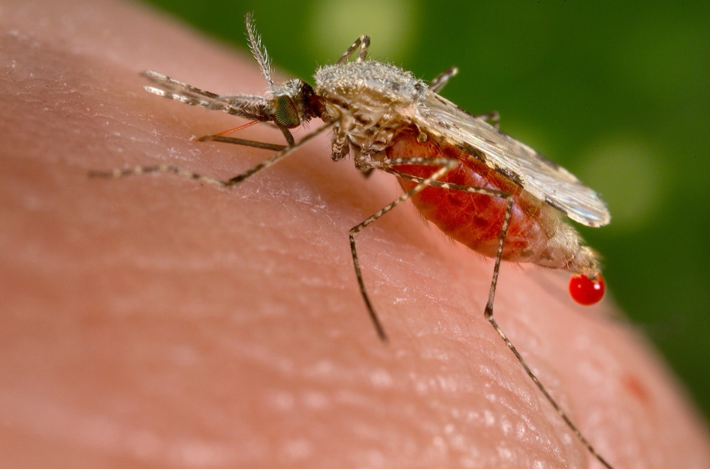

```{r}
#| include: false
selection_step_general <- function(p, fitness) {
  q <- 1 - p
  wbar <- p^2 * fitness[1] + 2 * p * q * fitness[2] + q^2 * fitness[3]
  (p^2 * fitness[1] + p * q * fitness[2]) / wbar
}

simulate_p <- function(p0, fitness, generations = 200) {
  p <- numeric(generations + 1)
  p[1] <- p0
  for (t in seq_len(generations)) {
    p[t + 1] <- selection_step_general(p[t], fitness)
  }
  data.frame(generation = 0:generations, p = p)
}

simulate_fluct <- function(p0, w1, w2, L, generations = 400) {
  p <- numeric(generations + 1)
  p[1] <- p0
  for (t in seq_len(generations)) {
    env1 <- ((t - 1) %/% L) %% 2 == 0
    p[t + 1] <- selection_step_general(p[t], if (env1) w1 else w2)
  }
  data.frame(generation = 0:generations, p = p)
}

overdom <- c(AA = 0.8, AB = 1, BB = 0.7)
underdom <- c(AA = 1, AB = 0.7, BB = 1)
w_sommer <- c(AA = 1.30, AB = 1.00, BB = 0.75)
w_winter <- c(AA = 0.75, AB = 1.00, BB = 1.30)

draw_loci <- function(poly, main) {
  n <- length(poly)
  plot(NA, xlim = c(0.4, n + 0.6), ylim = c(0, 1.15), axes = FALSE,
       xlab = "", ylab = "", main = main)
  for (i in seq_len(n)) {
    rect(i - 0.4, 0.18, i + 0.4, 0.95,
         col = if (poly[i] == 1) "#2166ac" else "#d9d9d9",
         border = "#4d4d4d", lwd = 1.4)
  }
}

# Lewontin & Hubby 1966: 18 loci, 7 polymorphic (order schematic)
klassik <- c(1, rep(0, 17))
elektrophorese <- c(1, 0, 1, 0, 0, 1, 0, 0, 1, 0, 0, 0, 1, 0, 1, 0, 0, 1)
```

## Übersicht

**Woche 7** von 14 · **Do., 29. Okt. 2026, 08:15–10:00**

| Teil | Dauer | Was |
|------|-------|-----|
| Vorlesung | ~45 min | Paradoxon → Selektion → zeitliche Fluktuation |
| Notebook | ~45 min | Draft: Zykluslänge und Polymorphismus |

::: aside
Pfeiltasten · **M** Menü · **Esc** Übersicht
:::

## Lernziele

Nach heute können Sie …

1. das **Diversitätsparadoxon** und die Antworten von **Kimura** und **Gillespie** **benennen**,
2. sagen, wann **konstante** Selektion Diversität hält — und wann nicht,
3. sagen, dass **Isolation** und **räumlich variierende Selektion** Diversität halten können — und das von zeitlicher Fluktuation **unterscheiden**,
4. an *Drosophila* sehen, dass Allele mit den **Saisons** schwingen können,
5. die **Zykluslänge** $L$ ändern und ablesen, wann Polymorphismus bleibt.

## Heute in dieser Reihenfolge

1. Warum so viel molekulare Diversität?
2. Kann **Selektion** sie halten — in einer Population, im Raum?
3. Was, wenn die Fitness **in der Zeit** wechselt?
4. *Drosophila*: Saisons, stehende Variation
5. Wann ist die Zykluslänge **kurz genug**?

# Teil 1 · Das Diversitätsparadoxon

## Vor molekularen Daten

Lange Zeit zählte man Gene vor allem über **sichtbare Mutanten**.

Klassische Erwartung:

- die meisten Loci sind homozygot «Wildtyp»
- schädliche Allele sind selten
- Selektion hält die Population sauber
- häufiger Polymorphismus ist die **Ausnahme**

Dann wurden Proteine sichtbar — ohne dass man den Phänotyp vorher kennen
musste.

## 1966: Enzyme als Daten

::::::: columns
::::: {.column width="48%"}
{fig-alt="Drosophila melanogaster" width="100%"}
:::::
::::: {.column width="48%"}
{fig-alt="Elektrophorese-Gel" width="100%"}
:::::
:::::::

Elektrophorese trennt Proteinvarianten nach Ladung.

Hubby & Lewontin maßen in *Drosophila* viele Enzymloci. Harris dasselbe
an menschlichen Enzymen. Kein sichtbares Merkmal nötig: derselbe Locus,
mehrere Banden, viele Heterozygote.

Harris (1966). Hubby & Lewontin (1966); Lewontin & Hubby (1966).

## Was man sah

```{r}
#| fig-height: 3.4
#| fig-width: 8.6
#| out-width: 88%
par(mfrow = c(1, 2), mar = c(2.2, 0.6, 2.4, 0.4))
draw_loci(klassik, "Klassik: fast monomorph")
draw_loci(elektrophorese, "Elektrophorese 1966")
```

Grau = ein Allel sichtbar. Blau = polymorph.

Bei 18 Loci war etwa **ein Drittel** polymorph; ein Individuum war an
rund **10%** der Loci heterozygot (Grössenordnung nach Lewontin & Hubby).

## Allelfrequenz und Genotypfrequenz

Ein Locus, zwei Allele A und B — dieselben Grössen wie in den Wochen 5–6.

- **Allelfrequenz** $p = f(A)$: Anteil der A-Kopien unter allen Kopien.
  $q = 1-p$.
- **Genotypfrequenzen** bei zufälliger Paarung (HWE):
  $p^2$ (AA), $2pq$ (AB), $q^2$ (BB).

$p$ nahe $0$ oder $1$: fast nur ein Allel, wenige Heterozygote.
Mittleres $p$: beide Allele häufig — das Muster von 1966.

Selektion wirkt auf **Genotypen**. Danach ist der Zustand wieder ein $p$.

## Das Diversitätsparadoxon

Gerichtete Selektion in einer Population treibt die Allelfrequenz $p$
oft nach $0$ oder $1$.
Dann bleibt an diesem Locus **keine** Diversität.

Die Enzymdaten zeigten das Gegenteil: stehende Variation an vielen Loci,
oft mit mittleren Frequenzen — nicht nur ein paar seltene Mutanten.

Wenn Selektion alles erklärt, darf es so viel häufige Variation nicht geben.

## Zwei Antworten

Das Paradoxon von 1966 hat zwei klassische Lesarten — nicht eine.

::::::: columns
::::: {.column width="48%"}
**Kimura (1968)**

Die molekulare Rate ist zu hoch, als dass jeder Unterschied von Selektion
getragen werden könnte.

**Neutralität:** die meisten Varianten sind selektiv fast gleich.
Dann *kann* Diversität hoch sein — ohne dass jeder Locus «gehalten» wird.

Dafür braucht man Zufall und endliche $N$. Das kommt ab Woche 9.
:::::
::::: {.column width="48%"}
**Gillespie (1991)**

Die Enzymdaten erzwingen keine Neutralität. Selektion — vor allem wenn
die Fitness **schwankt** — kann stehende molekulare Variation halten,
ohne die klassische Last an jedem Locus.

Später: Muster, die nach Zufall aussehen, können von Selektion an
*anderen* Loci kommen.
:::::
:::::::

## Neutralisten und Selektionisten — die Debatte läuft

Dieselbe Spaltung, heute in ganzen Genomen.

::::::: columns
::::: {.column width="48%"}
**Kern & Hahn (2018)**

Selektion formt Variation *und* Divergenz so stark, dass Neutralität
als Universalerklärung nicht hält.
:::::
::::: {.column width="48%"}
**Jensen et al. (2019)**

Kimura und Ohta hatten recht: Neutralität bleibt der Rahmen.
Selektion ist real — aber nicht die Default-Erklärung für alles.
:::::
:::::::

Heute Gillespies Frage konkret: wann hält **wechselnde** Selektion
Diversität? Kimuras Zufall: Woche 9.

# Teil 2 · Selektion als Ursache

## Kann Selektion Diversität halten?

Gerichtete Selektion in **einer** Population: die Allelfrequenz
$p\to 0$ oder $1$. Diversität am Locus verschwindet.

Zwei andere **konstante** Fitnesslandschaften **in einer** Population:

- **Überdominanz:** Heterozygote am fittesten — kann $p$ **innen** halten
- **Unterdominanz:** Heterozygote im Nachteil — hält sie in einer
  Population **nicht**

Zuerst der Blick zurück auf Woche 6: Diversität muss nicht in *einer*
gut gemischten Population sitzen.

## Isolation und räumliche Selektion

::::::: columns
::::: {.column width="42%"}
{fig-alt="Stichling" width="100%"}
:::::
::::: {.column width="58%"}
**Isolation:** kein Austausch. Verschiedene Orte können verschiedene
Allele tragen — lokal sogar fast fixiert. Die **Art** hält dann
Variation, jede lokale Population muss es nicht.

**Räumlich variierende Selektion** plus begrenzte Migration (Woche 6,
Stichling Meer/See): $p_1\neq p_2$ kann **stabil** bleiben.

Zu viel Genfluss: Gene swamping, der Unterschied kippt.
:::::
:::::::

Das erklärt Diversität **zwischen** Orten. 1966: oft *eine* Stichprobe —
dann braucht man einen Mechanismus **in** der Population.

::: aside
*Gasterosteus aculeatus.jpg* · Wikimedia Commons
:::

## Sichelzell-Allel und Malaria

::::::: columns
::::: {.column width="48%"}
{fig-alt="Normale und sichelfoermige Erythrozyten" width="100%"}
:::::
::::: {.column width="48%"}
{fig-alt="Anopheles" width="100%"}
:::::
:::::::

Am HBB-Locus ist das Sichelzell-Allel in vielen Malariagebieten
mittelhäufig. Heterozygote haben oft einen Vorteil gegen schwere Malaria;
Homozygote tragen die Sichelzellkrankheit.

**Vorsicht:** Das klassische Lehrbeispiel erklärt nicht die Enzym-Vielfalt
von 1966. Wären *alle* häufigen Polymorphismen überdominant, wäre die
Last sehr hoch.

Allison (1954); Überblick: Kwiatkowski (2005).

::: aside
NIH / Wikimedia: *Sickle cell 01.jpg*; *Anopheles stephensi.jpeg*
:::

## Heterozygote gewinnen: die Starts treffen sich

```{r}
#| fig-height: 3.6
#| fig-width: 7.6
#| out-width: 62%
starts <- c(0.05, 0.3, 0.7, 0.95)
plot(NA, xlim = c(0, 150), ylim = c(0, 1),
     xlab = "Generation", ylab = "p = f(A)",
     main = "Ueberdominanz: Starts treffen sich")
cols_s <- c("#2166ac", "#1b9e77", "#d95f02", "#762a83")
for (i in seq_along(starts)) {
  sim <- simulate_p(starts[i], overdom, 150)
  lines(sim$generation, sim$p, lwd = 3, col = cols_s[i])
}
legend("right", paste("p0 =", starts), col = cols_s, lwd = 3, bty = "n")
```

Kleine Störungen kehren zur Mitte zurück. Diversität bleibt.
Die Gleichung für den Treffpunkt kommt in der Modellierungsvorlesung —
heute sehen Sie, *dass* die Starts sich treffen.

## Heterozygote verlieren — Chromosomen, Hybride

::::::: columns
::::: {.column width="42%"}
{fig-alt="Drosophila melanogaster" width="100%"}
:::::
::::: {.column width="58%"}
Grosse **Inversionen** oder Chromosomenfusionen:
Heterozygote haben oft Probleme in der Meiose.

Dann gewinnt, was schon häufig ist. Hybride zwischen Anordnungen
sind im Nachteil — Bistabilität wie Woche 3, jetzt in Allelfrequenzen.
:::::
:::::::

Stehende Diversität in **einer** Population wird hier nicht gehalten.
Der Start entscheidet, welcher Rand gewinnt.

::: aside
*Drosophila melanogaster - side (aka).jpg* · Wikimedia Commons
:::

## Zwei Starts, zwei Endpunkte

```{r}
#| fig-height: 3.6
#| fig-width: 7.6
#| out-width: 62%
hat <- (underdom[2] - underdom[3]) / (2 * underdom[2] - underdom[1] - underdom[3])
plot(NA, xlim = c(0, 80), ylim = c(0, 1),
     xlab = "Generation", ylab = "p = f(A)",
     main = "Unterdominanz: instabile Schwelle")
lines(simulate_p(hat - 0.05, underdom, 80), lwd = 3, col = "#3182bd")
lines(simulate_p(hat + 0.05, underdom, 80), lwd = 3, col = "#d95f02")
abline(h = hat, lty = 2)
legend("right", c("Start unter der Schwelle", "Start ueber der Schwelle",
                  "instabiles Gleichgewicht"),
       col = c("#3182bd", "#d95f02", "black"), lwd = c(3, 3, 1),
       lty = c(1, 1, 2), bty = "n")
```

Kleine Störung bleibt im Becken. Selektion **erzeugt** hier keine
stehende Variation in einer Population.

# Teil 3 · Zeitlich fluktuierende Selektion

## Fitness muss nicht konstant sein

Überdominanz und Unterdominanz: dieselben Fitnessen, jede Generation,
**eine** Population.

Isolation und räumliche Selektion halten Diversität **im Raum** (Woche 6).

Gillespie: wenn die Fitness **in der Zeit** schwankt, kann Variation
auch in einer gemischten Population stehen bleiben — ohne Überdominanz
an jedem Locus.

Hier: **eine** Population, zwei Welten **nacheinander**.

> Wann kehrt $p$ zurück — und wann läuft es an den Rand?

## Drosophila: viele Generationen, zwei Saisons

::::::: columns
::::: {.column width="42%"}
{fig-alt="Drosophila melanogaster" width="100%"}
:::::
::::: {.column width="58%"}
Dieselbe Fliege wie 1966. In temperierten Populationen oft
**zehn oder mehr** Generationen pro Jahr.

Sommer und Winter sind verschiedene Welten: Temperatur, Nahrung,
Pathogene, Diapause.

Ein Allel, das im Sommer hilft, kann im Winter stören — und umgekehrt.
:::::
:::::::

::: aside
*Drosophila melanogaster - side (aka).jpg* · Wikimedia Commons
:::

## Obstgarten: Allele schwingen mit dem Jahr

Bergland et al. (2014): *D. melanogaster* in einem Pennsylvania-Obstgarten.
Viele SNPs ändern die Frequenz vom Frühling zum Herbst — und im
nächsten Jahr **zurück**. Nicht ein Sichelzell-Locus: dieselbe
saisonale Logik an vielen Stellen.

Wittmann et al. (2017): fluktuierende Selektion *kann* Polymorphismus
an vielen Loci halten. Keine Überdominanz an jedem Locus nötig.

## Käfige: die Population trackt die Saison

Rudman et al. (2022): Freilandkäfige, Genome über aufeinanderfolgende
Jahreszeiten. Die Frequenzen **folgen** der Saison — auf Variation,
die schon da war.

Neue Mutationen jeder Generation braucht man dafür nicht.
Stehende Diversität wird benutzt, nicht erst erzeugt.

Bergland et al. (2014); Wittmann et al. (2017); Rudman et al. (2022).

## Das Modell: zwei Saisons, Parameter $L$

Sommer: Allel A im Vorteil. Winter: Allel B.

Dieselbe Rekursion wie vorhin — Allelfrequenz $p$, Genotypen aus HWE,
drei Fitnessen — nur der Fitnessvektor wechselt alle $L$ Generationen.

**Parameter** $L$: Länge einer Saison in Generationen.

Sommer $w=(1.30,\ 1.00,\ 0.75)$, Winter $w=(0.75,\ 1.00,\ 1.30)$
für die Genotypen AA, AB, BB. Dieselben Zahlen gleich in den Kurven.

Ableitung, wann genau ein geschütztes Gleichgewicht existiert:
Modellierungsvorlesung. Heute die Trajektorie.

## Kurze Zyklen: $p$ bleibt innen

```{r}
#| fig-height: 3.5
#| fig-width: 8.2
#| out-width: 88%
sim_short <- simulate_fluct(0.5, w_sommer, w_winter, L = 5, 300)
plot(sim_short$generation, sim_short$p, type = "l", lwd = 3,
     col = "#2166ac", ylim = c(0, 1),
     xlab = "Generation", ylab = "p = f(A)",
     main = "L = 5 Generationen pro Saison")
abline(h = c(0, 1), col = "grey80")
```

Beide Allele bleiben häufig. Diversität wird **gehalten**.

## Lange Zyklen: $p$ an den Rand

```{r}
#| fig-height: 3.5
#| fig-width: 8.2
#| out-width: 88%
sim_long <- simulate_fluct(0.5, w_sommer, w_winter, L = 40, 300)
plot(sim_long$generation, sim_long$p, type = "l", lwd = 3,
     col = "#d95f02", ylim = c(0, 1),
     xlab = "Generation", ylab = "p = f(A)",
     main = "L = 40 Generationen pro Saison")
abline(h = c(0, 1), col = "grey80")
```

Eine Saison dauert zu lange: $p$ läuft fast nach $0$ oder $1$.
In unendlicher Population kommt das andere Allel oft zurück.
Nahe $0$ wäre mit Drift verloren — Woche 9.

## Wann kommt stabiler Polymorphismus?

Beide Allele müssen **irgendwann** im Vorteil sein. Sonst ist es
gerichtete Selektion mit Umweg.

Zusätzlich der Parameter $L$ (Saisonlänge):

| $L$ | was man sieht |
|---|---|
| kurz | $p$ oszilliert **innen** — Polymorphismus bleibt |
| lang | $p$ an den Rändern — Diversität nur noch knapp |
| eine Richtung für immer | $p\to 0$ oder $1$ — weg |

*Drosophila*: Saisons sind kurz gegen die Zeit bis zur Fixierung.
Deshalb *kann* die Variation stehen bleiben.

## Welcher Mechanismus, welches Gleichgewicht?

| Mechanismus | Diversität | Bild |
|---|---|---|
| gerichtete Selektion | in einer Population oft weg | Rand $0$ oder $1$ |
| Isolation | **zwischen** Orten | lokal oft Rand; Art polymorph |
| räumliche Selektion + begrenztes $m$ | **zwischen** Habitaten | Woche 6; zu viel $m$ wischt |
| Überdominanz | in einer Population | **stabil**, innen |
| Unterdominanz | in einer Population weg | **instabil**; zwei Ränder |
| zeitliche Fluktuation | in einer Population, hängt von $L$ ab | Oszillation innen — oder Rand |

1966 bleibt teilweise offen: häufige, fast neutrale Varianten brauchen
**endliche** Populationen — Woche 9.

## Take-home

1. 1966: mehr stehende Variation, als die Klassik erwartete.
2. Kimura: viele Unterschiede können **neutral** sein. Gillespie: Selektion
   kann molekulare Muster tragen. Die Debatte läuft.
3. Konstante Selektion in einer Population: Überdominanz hält, Unterdominanz nicht.
4. Isolation und räumliche Selektion (Woche 6) halten Diversität **zwischen**
   Orten — solange Migration nicht alles mischt.
5. Zeitlich fluktuierende Selektion: **eine** Population, nacheinander.
6. *Drosophila*: Allele können mit den Saisons schwingen
   (Bergland, Wittmann, Rudman). Parameter $L$: kurz → Polymorphismus;
   lang → Rand. Drift: Woche 9.

## Notebook (~45 min)

**→ [Notebook Woche 7 öffnen](notebook.html)** · Entwurf

Dieselbe Frage: $L$ ändern, ablesen wann Variation bleibt.

## Abschlussfragen

1. Was ist das Diversitätsparadoxon — und was antworteten Kimura und Gillespie?
2. Wann hält **konstante** Selektion Diversität — wann nicht?
3. Wann halten Isolation oder räumliche Selektion Diversität — und was
   macht zu viel Migration?
4. Was unterscheidet zeitliche Fluktuation von Selektion in zwei Habitaten?
5. Warum kann saisonale Selektion bei *Drosophila* Variation halten?
6. Was ändert die Zykluslänge $L$ an der Trajektorie von $p$?
7. Warum wäre $p$ nahe $0$ mit Drift in Gefahr — obwohl das Modell unendlich ist?

## Literatur

:::: {.lit}
1. **Hubby, J. L. & Lewontin, R. C. (1966).** A molecular approach … I. *Genetics* 54: 577–594.
2. **Lewontin, R. C. & Hubby, J. L. (1966).** A molecular approach … II. *Genetics* 54: 595–609.
3. **Harris, H. (1966).** Enzyme polymorphisms in man. *Proc. R. Soc. B* 164: 298–310.
4. **Kimura, M. (1968).** Evolutionary rate at the molecular level. *Nature* 217: 624–626.
5. **Gillespie, J. H. (1991).** *The Causes of Molecular Evolution.* Oxford University Press.
6. **Kern, A. D. & Hahn, M. W. (2018).** The Neutral Theory in Light of Natural Selection. *MBE* 35: 1366–1371.
7. **Jensen, J. D. et al. (2019).** The importance of the Neutral Theory … A response to Kern and Hahn 2018. *Evolution* 73: 111–114.
8. **Allison, A. C. (1954).** Protection afforded by sickle-cell trait … *BMJ* 1: 290–294.
9. **Bergland, A. O. et al. (2014).** Genomic evidence of rapid and stable adaptive oscillations … in Drosophila. *PLoS Genet.* 10: e1004775. [doi:10.1371/journal.pgen.1004775](https://doi.org/10.1371/journal.pgen.1004775)
10. **Wittmann, M. J. et al. (2017).** Seasonally fluctuating selection can maintain polymorphism at many loci … *PNAS* 114: E9932–E9941. [doi:10.1073/pnas.1702993114](https://doi.org/10.1073/pnas.1702993114)
11. **Rudman, S. M. et al. (2022).** Direct observation of adaptive tracking on standing genetic variation. *Nature* 603: 501–506. [doi:10.1038/s41586-021-04211-w](https://doi.org/10.1038/s41586-021-04211-w)
::::

## Navigation

| | |
|---|---|
| Kursplan | [Kursplan](../../docs/course-outline.html) |
| Notebook | [Notebook Woche 7](notebook.html) |
| Zurück | [← Woche 6](../week-06/slides.html) |
| Weiter | [Woche 8 →](../week-08/slides.html) |
