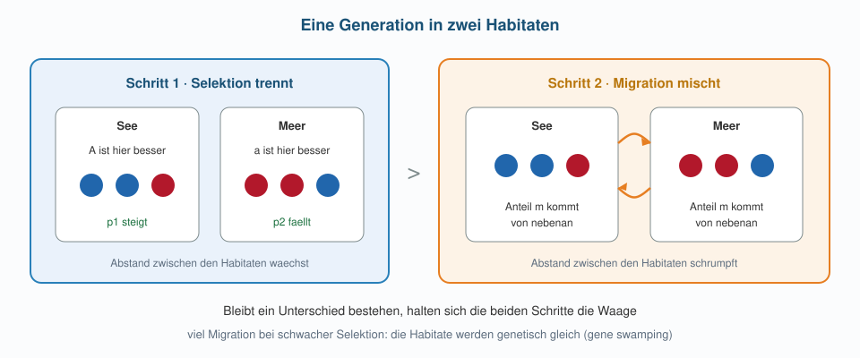

```{r}
#| include: false
scan <- read.csv("data/fst_scan.csv")

selektionsschritt <- function(p, w) {
  q <- 1 - p
  w_quer <- p^2 * w[1] + 2 * p * q * w[2] + q^2 * w[3]
  (p^2 * w[1] + p * q * w[2]) / w_quer
}

eine_generation <- function(p1, p2, s = 0.15, m = 0.02) {
  p1_s <- selektionsschritt(p1, c(1 + s, 1 + s / 2, 1))
  p2_s <- selektionsschritt(p2, c(1, 1 + s / 2, 1 + s))
  c((1 - m) * p1_s + m * p2_s,
    (1 - m) * p2_s + m * p1_s)
}

zwei_demen <- function(p1 = 0.5, p2 = 0.5, s = 0.15, m = 0.02,
                       generationen = 250) {
  bahn <- matrix(NA_real_, generationen + 1, 2)
  bahn[1, ] <- c(p1, p2)
  for (t in seq_len(generationen)) {
    bahn[t + 1, ] <- eine_generation(bahn[t, 1], bahn[t, 2], s = s, m = m)
  }
  data.frame(generation = 0:generationen, p1 = bahn[, 1], p2 = bahn[, 2])
}

fst <- function(p1, p2) {
  p_quer <- (p1 + p2) / 2
  if (p_quer <= 0 || p_quer >= 1) return(0)
  (((p1 - p_quer)^2 + (p2 - p_quer)^2) / 2) / (p_quer * (1 - p_quer))
}

zeige_demen <- function(sim, main) {
  plot(sim$generation, sim$p1, type = "l", lwd = 2.5, col = "#2166ac",
       ylim = c(0, 1), xlab = "Generation", ylab = "Frequenz von A",
       main = main)
  lines(sim$generation, sim$p2, lwd = 2.5, col = "#b2182b")
  legend("right", c("See", "Meer"), col = c("#2166ac", "#b2182b"),
         lwd = 2.5, bty = "n", cex = 0.9)
}
```

## Übersicht

**Woche 7** von 14 · **Do., 29. Okt. 2026, 08:15–10:00**

| Teil | Dauer | Was |
|------|-------|-----|
| Vorlesung | ~45 min | Stichling → zwei Demen → $F_{ST}$ → Scan |
| Notebook | ~45 min | Genfluss drehen, Ausreisser finden |

::: aside
Pfeiltasten · **M** Menü · **E** PDF · **Esc** Übersicht
:::

## Lernziele

Nach heute können Sie …

1. erklären, warum zwei Habitate genetisch verschieden bleiben können, obwohl Individuen wandern,
2. eine Generation als «Selektion lokal, dann Mischung» aufschreiben,
3. an Trajektorien erkennen, wann Genfluss die Unterschiede einebnet,
4. $F_{ST}$ als Mass für den Abstand zwischen Populationen lesen,
5. aus einer Tabelle die auffälligen Zeilen herausfiltern.

## Heute in dieser Reihenfolge

1. Derselbe Fisch in zwei Welten
2. Zwei Populationen statt einer
3. Selektion gegen Genfluss
4. Den Unterschied messen: $F_{ST}$
5. Ein Scan über das Genom — und zurück nach Tibet

::: aside
[Modul 2](../../docs/module-02-overview.html) · [Glossar](../../docs/glossary.html)
:::

# Teil 1 · Derselbe Fisch, zwei Welten

## Dreistachlige Stichlinge

::::: columns
::: {.column width="52%"}
{fig-alt="Dreistachliger Stichling" width="96%"}
:::
::: {.column width="48%"}
*Gasterosteus aculeatus* lebt im Meer und in Tausenden von Seen und Bächen der Nordhalbkugel.

Nach der letzten Eiszeit haben marine Fische immer wieder neu entstandene Süssgewässer besiedelt.
:::
:::::

## Zwei Formen desselben Fisches

| | Meer | See und Bach |
|---|---|---|
| Panzerplatten | vollständige Reihe | oft stark reduziert |
| Becken und Stacheln | kräftig | häufig zurückgebildet |
| Hauptgefahr | Raubfische | Insektenlarven, weniger Fische |
| Wasser | salzig, kalkreich | oft kalkarm |

Die Panzerung schützt vor Raubfischen, kostet aber Wachstum und Kalzium. Im See kehrt sich die Rechnung um.

## Ist das überhaupt genetisch?

Eine naheliegende Alternative: Vielleicht wachsen Fische im See einfach anders — Plastizität, wie bei den gelben Eidechsen.

Peichel et al. (2001) haben Meer- und Seeform gekreuzt und die Nachkommen kartiert. Ergebnis: Die Unterschiede werden **vererbt**, und sie hängen an wenigen Regionen mit grossem Effekt.

## Ein Locus für die Panzerung

Colosimo et al. (2005): Ein Grossteil der Plattenvariation geht auf den Locus *Eda* zurück.

Entscheidend ist der zweite Befund: In vielen **unabhängig** besiedelten Seen ist es **dasselbe** Allel, das sich durchsetzt — es lag als seltene Variante bereits im Meer bereit.

## Was die Genome zeigen

::::: columns
::: {.column width="54%"}
Jones et al. (2012) haben viele Meer–Süsswasser-Paare sequenziert:

- Der **Grossteil** des Genoms ist zwischen den Formen sehr ähnlich.
- Eine **Minderheit** von Regionen ist stark verschieden.
- In unabhängigen Paaren sind es oft **dieselben** Regionen.
:::
::: {.column width="46%"}
{fig-alt="Felskueste Lebensraum" width="96%"}
:::
:::::

## Und trotzdem: Genfluss

Die Populationen sind nicht isoliert. Meerfische wandern in Flussmündungen, Seefische werden ausgespült, neue Gewässer werden besiedelt.

Jede Generation mischt also einen Teil der Allele wieder zusammen.

## Die Frage an das Modell

> Können zwei Populationen an einem Locus dauerhaft verschieden bleiben, obwohl ständig Individuen zwischen ihnen wandern?

Und wenn ja: Warum gilt das nur für **manche** Regionen des Genoms und nicht für alle?

# Teil 2 · Zwei Populationen statt einer

## Der Zustand wird grösser

| Woche | Zustand |
|-------|---------|
| 2 | eine Dichte $N$ |
| 3 | zwei Dichten $N_1, N_2$ |
| 5–6 | eine Frequenz $p$ |
| **7** | **zwei Frequenzen $p_1, p_2$** |

$p_1$: Frequenz des Allels $A$ im See. $p_2$: dieselbe Frequenz im Meer.

## Eine Generation in zwei Schritten

{fig-alt="Selektion trennt Migration mischt" width="92%"}

## Schritt 1 · Selektion, lokal

In jedem Habitat gelten **eigene** Fitnesswerte: Im See ist $A$ besser, im Meer $B$.

Gerechnet wird wie in Woche 6 — nur zweimal, mit verschiedenen Fitnessvektoren:

```r
p1_s <- selektionsschritt(p1, c(1 + s, 1 + s/2, 1))   # See
p2_s <- selektionsschritt(p2, c(1, 1 + s/2, 1 + s))   # Meer
```

Hardy–Weinberg gilt dabei **in jedem Habitat getrennt** — nicht im Gesamttopf (Woche 5, Wahlund).

## Schritt 2 · Migration

Ein Anteil $m$ der Individuen stammt aus dem Nachbarhabitat:

$$
p_1' = (1-m)\,p_1^S + m\,p_2^S, \qquad
p_2' = (1-m)\,p_2^S + m\,p_1^S
$$

Zahlenbeispiel: $p_1^S = 0.9$, $p_2^S = 0.1$, $m = 0.05$ ergibt $p_1' = 0.86$ und $p_2' = 0.14$.

Eine Generation Mischung löscht den Unterschied nicht — aber sie knabbert daran.

## Wenig Genfluss

```{r}
#| fig-height: 3.5
#| fig-width: 7.8
zeige_demen(zwei_demen(m = 0.02, s = 0.15), "s = 0.15, m = 0.02")
```

Die beiden Kurven trennen sich und bleiben getrennt: ein **Gleichgewicht**, in dem sich Selektion und Migration die Waage halten.

## Viel Genfluss

```{r}
#| fig-height: 3.5
#| fig-width: 7.8
zeige_demen(zwei_demen(m = 0.30, s = 0.15), "s = 0.15, m = 0.30")
```

Jetzt gewinnt die Mischung: Beide Habitate landen fast beim selben Wert. Man nennt das **gene swamping**.

## Was entscheidet

Nicht die Stärke der Selektion allein und nicht die Migration allein, sondern ihr **Verhältnis**.

- Starke lokale Selektion, wenig Austausch → stabile Unterschiede
- Schwache Selektion, viel Austausch → eine gemischte Population

Genau deshalb betrifft die Differenzierung nur **einen Teil** des Genoms: Alle Loci teilen dieselbe Migration, aber nur wenige spüren starke entgegengesetzte Selektion.

# Teil 3 · Den Unterschied messen

## Warum eine Zahl nötig ist

Ein Genom hat Millionen von Positionen. Trajektorien kann man nicht für jede zeichnen.

Gesucht ist **eine Zahl pro Locus**, die sagt: Wie weit liegen die beiden Populationen hier auseinander?

## $F_{ST}$

Mit $\bar p = (p_1 + p_2)/2$:

$$
F_{ST} = \frac{\operatorname{Var}(p)}{\bar p\,(1-\bar p)}
$$

Im Zähler steht, wie stark die Populationen **voneinander** abweichen; im Nenner, wie viel Variation insgesamt möglich wäre.

$F_{ST} = 0$: identisch. $F_{ST} = 1$: in jedem Habitat ein anderes Allel fixiert.

## Drei Fälle zum Gefühl

```{r}
#| echo: true
round(c(
  "p1=0.5, p2=0.5" = fst(0.5, 0.5),
  "p1=0.6, p2=0.4" = fst(0.6, 0.4),
  "p1=0.95, p2=0.05" = fst(0.95, 0.05)
), 3)
```

Wichtig: $\bar p = 0.5$ gilt in allen drei Fällen. Der Mittelwert allein sagt nichts — erst der Abstand tut es.

## Unsere Simulationen als $F_{ST}$

```{r}
#| echo: true
wenig <- tail(zwei_demen(m = 0.02, s = 0.15), 1)
viel  <- tail(zwei_demen(m = 0.30, s = 0.15), 1)

round(c(
  "m = 0.02" = fst(wenig$p1, wenig$p2),
  "m = 0.30" = fst(viel$p1, viel$p2)
), 3)
```

Dieselbe Selektionsstärke, zehnmal weniger Austausch — und ein völlig anderer Wert. $F_{ST}$ übersetzt die Modellbilder in die Grösse, die man aus Daten schätzt.

# Teil 4 · Ein Scan über das Genom

## Was ein Scan ist

Man berechnet $F_{ST}$ nicht für einen Locus, sondern in **Fenstern** entlang des Genoms und trägt die Werte gegen die Position auf.

Unser Kursdatensatz: 700 Fenster auf drei Chromosomen, Meer gegen Süsswasser.

```{r}
#| echo: true
scan <- read.csv("data/fst_scan.csv")
head(scan, 3)
```

## Das Bild

```{r}
#| fig-height: 4
#| fig-width: 9
farben <- ifelse(scan$chr %% 2 == 0, "#7f8c8d", "#34495e")
plot(scan$x, scan$fst, pch = 16, cex = 0.7, col = farben,
     xlab = "Position entlang der Chromosomen 1-3", ylab = expression(F[ST]),
     main = "Differenzierung Meer gegen Suesswasser", ylim = c(0, 1))
treffer <- scan[scan$label != "", ]
points(treffer$x, treffer$fst, pch = 16, cex = 1.3, col = "#b2182b")
text(treffer$x, treffer$fst + 0.07, treffer$label, col = "#b2182b", cex = 0.9)
```

## Was dieses Bild sagt

Der **Hintergrund** liegt niedrig: Die meisten Fenster zeigen kaum Differenzierung — Genfluss und gemeinsame Herkunft halten die Populationen zusammen.

Wenige Fenster **ragen heraus**. Dort ist die lokale Selektion stark genug, um dem Genfluss standzuhalten. Die beiden markierten Spitzen entsprechen den bekannten Regionen für Panzerung und Beckenreduktion.

## Die Logik dahinter

1. Alle Loci teilen dieselbe Demografie und denselben Genfluss.
2. Deshalb bilden sie einen gemeinsamen **Hintergrund**.
3. Was deutlich darüber liegt, braucht eine zusätzliche Erklärung — zum Beispiel entgegengesetzte Selektion.

Das ist die Idee hinter allen Scans auf lokale Anpassung.

## Zurück nach Tibet

{fig-alt="Huerta-Sanchez 2014 Abbildung 1" width="62%"}

In Woche 1 sahen Sie dieses Bild: Tibeter:innen gegen Han-Chines:innen. **EPAS1** liegt weit ausserhalb der Wolke.

::: aside
Huerta-Sánchez et al. (2014), Abb. 1
:::

## Dasselbe Schema, andere Art

| | Stichling | Tibet |
|---|---|---|
| Zwei Gruppen | Meer / Süsswasser | Hochland / Tiefland |
| Hintergrund | fast das ganze Genom | fast das ganze Genom |
| Ausreisser | *Eda*, Becken | *EPAS1* |
| Selektionsdruck | Räuber, Ionen | Sauerstoffmangel |

Jetzt haben Sie das Modell, das hinter dem Bild aus Woche 1 steht.

## Was ein Ausreisser nicht ist

Ein hoher Wert ist ein **Hinweis**, kein Beweis:

- Auch ohne Selektion streut der Hintergrund; irgendein Fenster ist immer das höchste.
- Geringe Rekombination oder Populationsgeschichte können ähnliche Spitzen erzeugen.
- Beim EPAS1-Haplotyp kam die Variante zudem von aussen ins Genom (Woche 1).

Welche Schwelle sinnvoll ist und wie man Fehlalarme kontrolliert: **Statistikvorlesung**.

# Neu im Code · Zeilen auswählen

## Die Aufgabe

Aus 700 Fenstern sollen die auffälligen werden — ohne die Tabelle durchzuscrollen.

Bisher haben wir Spalten **gerechnet** (Woche 5) und Funktionen **wiederholt** (Woche 6). Jetzt wählen wir **Zeilen aus**.

## Eine Bedingung erzeugt Wahrheitswerte

```{r}
#| echo: true
head(scan$fst > 0.5, 12)
sum(scan$fst > 0.5)
```

Der Vergleich liefert für jede Zeile `TRUE` oder `FALSE`. `sum()` zählt die `TRUE`-Fälle, weil `TRUE` als $1$ zählt.

## Mit der Bedingung Zeilen herausgreifen

```{r}
#| echo: true
scan[scan$fst > 0.7, ]
```

In den eckigen Klammern steht vor dem Komma die **Zeilenauswahl**, nach dem Komma die Spalten. Leer heisst: alle.

## Die Schwelle aus den Daten

Statt eine Zahl zu raten, lassen wir die Verteilung selbst entscheiden:

```{r}
#| echo: true
schwelle <- quantile(scan$fst, 0.99)
schwelle

ausreisser <- scan[scan$fst > schwelle, ]
nrow(ausreisser)
```

`quantile(x, 0.99)` gibt den Wert, unter dem 99 % der Fenster liegen. Damit ist «auffällig» relativ zum eigenen Hintergrund definiert.

## Das Ergebnis ansehen

```{r}
#| echo: true
ausreisser[order(-ausreisser$fst), c("chr", "pos", "fst", "label")]
```

`order(-x)` sortiert absteigend. Beide bekannten Regionen sind dabei.

## Eine Warnung zum Werkzeug

Die Schwelle ist eine **Entscheidung**, kein Messergebnis.

Mit `0.99` erklären wir 1 % aller Fenster zu Ausreissern — auch dann, wenn gar keine Selektion im Spiel ist. Die Liste ist ein Ausgangspunkt für weitere Arbeit, kein Befund.

## Mini-Glossar R (heute)

| Konzept | Merksatz |
|---------|----------|
| `x > 0.5` | Wahrheitswerte für jede Zeile |
| `sum(bedingung)` | zählt die `TRUE` |
| `d[bedingung, ]` | Zeilen auswählen, alle Spalten |
| `quantile(x, 0.99)` | Schwelle aus der Verteilung |
| `order(-x)` | absteigend sortieren |
| `ifelse(test, a, b)` | elementweise Fallunterscheidung (Farben) |

## Programmierung ↔ Biologie

| Programmierung | Biologie |
|----------------|----------|
| Zeile der Tabelle | ein Fenster im Genom |
| Spalte `fst` | Abstand zwischen zwei Populationen |
| Bedingung + Auswahl | Kandidatenliste für lokale Anpassung |
| Quantil als Schwelle | «auffällig» relativ zum Hintergrund |

# Abschluss

## Take-home

1. Stichlinge zeigen erbliche, parallele Unterschiede zwischen Meer und Süsswasser — trotz Genfluss.
2. Eine Generation besteht aus lokaler Selektion und anschliessender Mischung.
3. Ob Unterschiede bleiben, entscheidet das Verhältnis von $s$ und $m$; zu viel Genfluss führt zu gene swamping.
4. $F_{ST}$ fasst den Abstand zweier Populationen in einer Zahl zusammen — Grundlage jedes Scans.
5. Ausreisser findet man durch Filtern mit einer Schwelle; die Schwelle ist eine Entscheidung.

## Notebook (~45 min)

**→ [Notebook Woche 7 öffnen](notebook.html)**

::::: columns
::: {.column width="20%"}
{fig-alt="Notebook" width="70%"}
:::
::: {.column width="80%"}
**A** $m$ und $s$ drehen: wann bleiben Unterschiede?  

**B** vom Gleichgewicht zu $F_{ST}$  

**C** den echten Scan filtern und die Ausreisser benennen
:::
:::::

## Abschlussfragen

1. Warum gilt Hardy–Weinberg hier pro Habitat und nicht für die Gesamtprobe?
2. Zwei Populationen haben beide $\bar p = 0.5$. Warum kann $F_{ST}$ trotzdem sehr verschieden sein?
3. Warum ist nur ein kleiner Teil des Genoms stark differenziert?
4. Was spricht dagegen, den höchsten Punkt eines Scans sofort «das Anpassungsgen» zu nennen?
5. Wann brauchen Sie `quantile()` statt einer festen Schwelle?

## Literatur

:::: {.lit}
1. **Peichel, C. L., et al. (2001).** The genetic architecture of divergence between threespine stickleback species. *Nature* 414: 901–905. [doi:10.1038/414901a](https://doi.org/10.1038/414901a)
2. **Colosimo, P. F., et al. (2005).** Widespread parallel evolution in sticklebacks by repeated fixation of Ectodysplasin alleles. *Science* 307: 1928–1933. [doi:10.1126/science.1107239](https://doi.org/10.1126/science.1107239)
3. **Jones, F. C., et al. (2012).** The genomic basis of adaptive evolution in threespine sticklebacks. *Nature* 484: 55–61. [doi:10.1038/nature10944](https://doi.org/10.1038/nature10944)
4. **Peichel, C. L., & Marques, D. A. (2017).** The genetic and molecular architecture of phenotypic diversity in sticklebacks. *Phil. Trans. R. Soc. B* 372: 20150486. [doi:10.1098/rstb.2015.0486](https://doi.org/10.1098/rstb.2015.0486)
5. **Huerta-Sánchez, E., et al. (2014).** Altitude adaptation in Tibetans caused by introgression of Denisovan-like DNA. *Nature* 512: 194–197. [doi:10.1038/nature13408](https://doi.org/10.1038/nature13408)

Kursdaten `fst_scan.csv`: Lehrabbildung mit realistischem Hintergrund und zwei bekannten Spitzen, siehe `data/README.md`.
::::

## Navigation

| | |
|---|---|
| Notebook | [Notebook Woche 7](notebook.html) |
| Zurück | [← Woche 6](../week-06/slides.html) |
| Weiter | [Woche 8 →](../week-08/slides.html) |
| Modul | [Modul 2](../../docs/module-02-overview.html) |
| PDF | Taste **E**, dann Drucken → Als PDF speichern |
