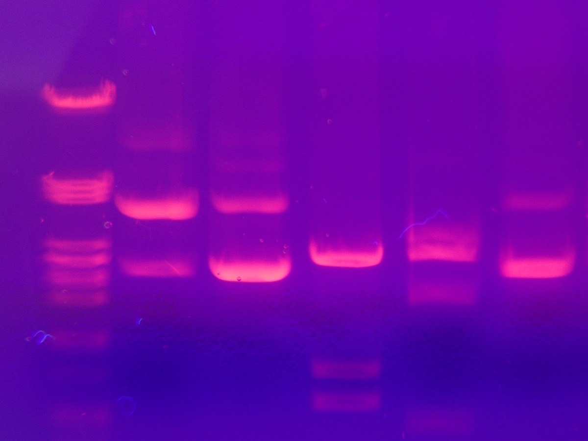
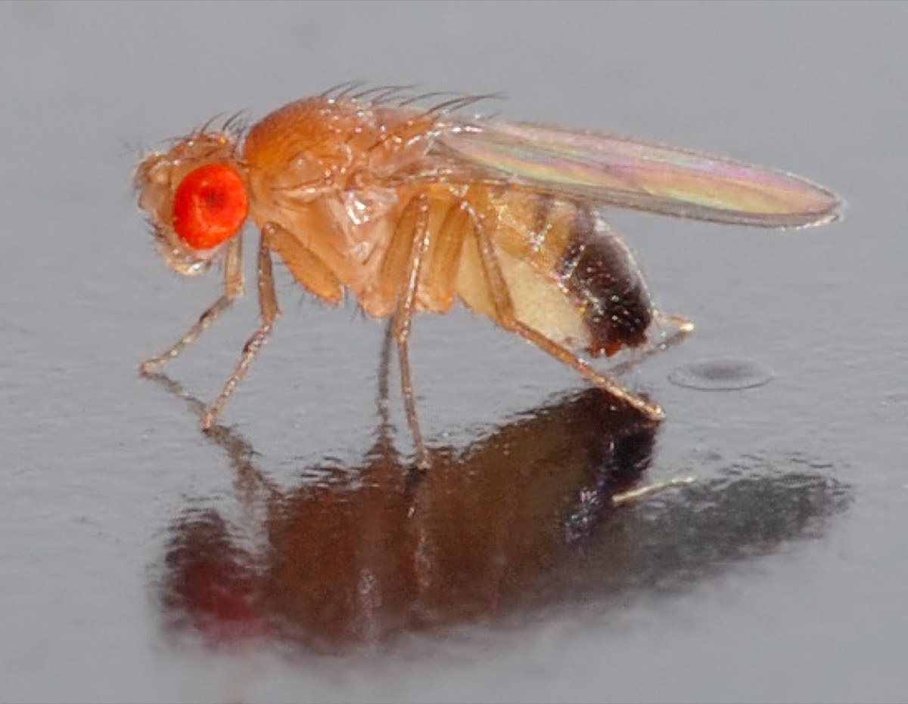

## Übersicht

**Woche 8** von 14 · **Checkpoint B** · **Do., 5. Nov. 2026, 08:15–10:00**

| Teil | Dauer | Was |
|------|-------|-----|
| Intro | ~20 min | Landkarte der Wochen 5–7 |
| Notebook | ~40 min | eine Frage, eine Abbildung · Entwurf |
| Präsentationen | ~30 min | 3–5 Minuten, Anwesenheit Pflicht |

::: aside
Pfeiltasten · **M** Menü · **Esc** Übersicht
:::

## Heute in dieser Reihenfolge

1. Landkarte: was die Wochen 5–7 gefragt haben
2. Eine Frage wählen, **eine** Abbildung
3. 3–5 Minuten vortragen

## Heute in einem Blick

::::: columns
::: {.column width="22%"}
{fig-alt="Biologie" width="70%"}
:::
::: {.column width="22%"}
{fig-alt="Modell" width="70%"}
:::
::: {.column width="22%"}
{fig-alt="Code" width="70%"}
:::
::: {.column width="22%"}
{fig-alt="Praesentation" width="70%"}
:::
:::::

**Frage** → leichtes Modell → **eine** Abbildung → biologische Pointe.
Die Mathematik ist das Gerüst der Abbildung. Ableiten und Tests:
andere Vorlesungen — das Bild nehmen Sie mit.

## Landkarte — die Fragen

::::::: columns
::::: {.column width="24%"}
{fig-alt="Elektrophorese" width="100%"}

**5** · Eine Population?
:::::
::::: {.column width="24%"}
{fig-alt="Stichling" width="100%"}

**6** · Unterschiede bleiben?
:::::
::::: {.column width="24%"}
{fig-alt="Motoo Kimura" width="100%"}

**7** · Warum so viel Variation?
:::::
::::: {.column width="24%"}
{fig-alt="Drosophila" width="100%"}

**7** · Halten Saisons die Variation?
:::::
:::::::

Immer dieselbe Schleife: Frage → Bild → was das Modell *nicht* kann.

## Was wir gebraucht haben

| | Wozu | Nicht heute |
|---|---|---|
| **Plot** (W5) | Nullbild vs. Genotypen | $\chi^2$, $F_{IS}$ |
| **zwei $p$ iterieren** (W6) | Selektion gegen Genfluss | $F_{ST}$-Schätzer |
| **Zykluslänge $L$** (W7) | wann Oszillation innen bleibt | Drift, wenn $p$ nahe $0$ |

Mathematik, Statistik und Code tauchen auf, weil die Biologie sie **braucht** —
nicht als eigenes Kapitel.

## Drei Fragen — eine wählen

1. **Resistenz in einer Population.** Kann ein Vorteil-Allel häufig werden
   — Sichelzelle, Duffy, ein Sweep? (Parameter $s$, $h$)
2. **See und Meer.** Bleiben zwei Habitate verschieden, obwohl jemand
   wandert? (Stichling; Parameter $m$)
3. **1966 und Saisons.** Wie bleibt Variation in einer Population?
   (Überdominanz, Schwelle, oder Zykluslänge $L$; *Drosophila*)

Eine Frage, **eine** Abbildung, eine Modellgrenze.

## Gemeinsame Annahmen

Deterministisch heisst hier:

- unendlich grosse Population (keine Drift)
- $p$ ist ein Mittelwert, kein Schicksal einer Kopie
- ein Locus, zwei Allele

Das reicht für die drei Fragen. Eine **neue** Mutation beginnt mit einer
Kopie — das ist Woche 9, nicht die heutige Note.

## Brücke zur nächsten Einheit

Sobald ein vorteilhaftes Allel **häufig** ist, beschreibt der Mittelwert
$p$ die Dynamik gut.

Eine neue Mutation beginnt mit **einer** Kopie. Dann entscheidet Zufall
über frühes Aussterben — auch bei $s>0$.

Wochen 9–11: Etablierung, Rettung, Checkpoint C.

## Checkpoint B · heute

::::: columns
::: {.column width="18%"}
{fig-alt="Wichtig" width="80%"}
:::
::: {.column width="82%"}
Heute wird **präsentiert und benotet**.
Sie müssen **anwesend sein und vortragen**.
:::
:::::

Vortrag (3–5 Min.):

1. biologische Frage
2. welchen Parameter Sie geändert haben (einer reicht)
3. **eine** Abbildung
4. biologisches Ergebnis
5. eine Modellgrenze

## Notebook

**→ [Notebook Woche 8 öffnen](notebook.html)** · Entwurf

Nur **eine** der drei Fragen. Fertige Hilfsfunktionen dürfen bleiben;
die Note gilt der Frage und der Abbildung, nicht dem Code-Umfang.

## Take-home

1. Eine biologische Frage, **eine** Abbildung, eine Pointe.
2. Die Kurve ist die Mathematik — Ableiten kommt später.
3. Anwesenheit: ohne Vortrag kein Checkpoint B.

## Navigation

| | |
|---|---|
| Kursplan | [Kursplan](../../docs/course-outline.html) |
| Notebook | [Notebook Woche 8](notebook.html) |
| Zurück | [← Woche 7](../week-07/slides.html) |
| Weiter | [Woche 9 →](../week-09/slides.html) |
