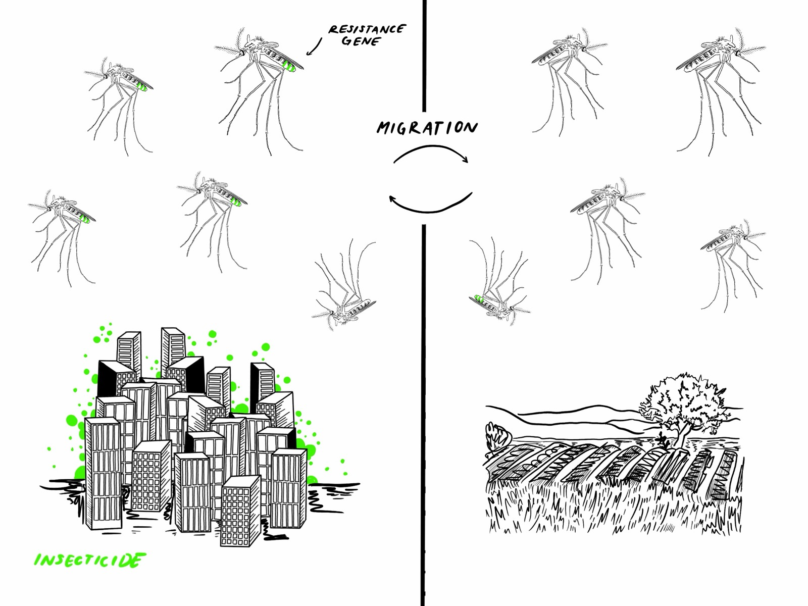

```{r}
#| include: false
source("../slides-ggplot.R")

logistisch <- function(x, c, b) 1 / (1 + exp(-b * (x - c)))

x <- seq(-8, 8, by = 1)
n <- 40
k_sommer <- c(0, 0, 0, 0, 0, 0, 3, 10, 15, 27, 39, 37, 40, 39, 40, 40, 40)
k_winter <- c(0, 1, 0, 3, 5, 7, 7, 14, 16, 24, 30, 36, 32, 32, 38, 37, 40)
clines <- rbind(
  data.frame(x = x, p = k_sommer / n, saison = "Sommer"),
  data.frame(x = x, p = k_winter / n, saison = "Winter")
)
saison_farben <- c(Sommer = "#d95f02", Winter = "#2166ac")
```

## Übersicht

**Woche 8** von 14 · **Checkpoint B** · **Do., 5. Nov. 2026, 08:15–10:00**

| Teil | Dauer | Was |
|------|-------|-----|
| Intro | ~15 min | Resistenz im Raum · eine Cline · die Frage |
| Notebook | ~45 min | zwei Abbildungen erzeugen, Antwort finden |
| Gruppen | ~30 min | Assistenz kommt vorbei · 1–2 Min. erklären |

::: aside
Pfeiltasten · **M** Menü · **E** PDF · **Esc** Übersicht
:::

## Checkpoint B — Anwesenheitspflicht

::::: columns
::: {.column width="18%"}
{fig-alt="Wichtig" width="75%"}
:::
::: {.column width="82%"}
Heute ist **Checkpoint B**.  
Sie müssen **anwesend sein** und in der Gruppe Ihre Antwort erklären (nicht an der Tafel).

**Kein Programmieren:** Sie führen nur Funktionen aus, die im Notebook bereitstehen.

[Modul 2](../../docs/module-02-overview.html) · Kursinfo auf ILIAS
:::
:::::

# Resistenz im Raum

## Stadt und Land

{fig-alt="Skizze: Stadt mit Insektizid und resistenten Mücken, Land ohne Insektizid, Migration dazwischen" height="400px" fig-align="center"}

Stadt: **Insektizid**, das Resistenz-Allel **R** ist im Vorteil · Land: R kostet etwas · die Mücken **fliegen** hin und her.

[Abbildung: Emma Ochsner]{.small}

## Das Modell: Stellen in einer Reihe

```{r}
#| fig-height: 3.2
#| fig-width: 9.5
k <- 9
pos <- seq_len(k)
p_r <- logistisch(pos, 5, 1.1)
y0 <- 0
pfeile <- data.frame(x = pos[-k] + 0.22, xend = pos[-1] - 0.22)
ggplot() +
  annotate("rect", xmin = 0.4, xmax = 4.9, ymin = -0.75, ymax = 0.75,
           fill = "#e8f3e0", colour = NA) +
  annotate("rect", xmin = 5.1, xmax = 9.6, ymin = -0.75, ymax = 0.75,
           fill = "#e6e6e6", colour = NA) +
  geom_curve(data = pfeile, aes(x = x, xend = xend, y = 0.22, yend = 0.22),
             curvature = -0.5, colour = "#555555", linewidth = 0.5,
             arrow = arrow(length = unit(0.12, "cm"))) +
  geom_curve(data = pfeile, aes(x = xend, xend = x, y = -0.22, yend = -0.22),
             curvature = -0.5, colour = "#555555", linewidth = 0.5,
             arrow = arrow(length = unit(0.12, "cm"))) +
  geom_point(aes(pos, y0, fill = p_r), shape = 21, size = 13,
             colour = "grey25", stroke = 0.6) +
  scale_fill_gradient(low = "white", high = "#b2182b", limits = c(0, 1),
                      guide = "none") +
  annotate("text", x = 1.5, y = 0.58, label = "m/2", size = 6,
           colour = "#333333") +
  annotate("text", x = 1.5, y = -0.58, label = "m/2", size = 6,
           colour = "#333333") +
  annotate("text", x = 2.65, y = -1.05, size = 6.2, colour = "#2e7d32",
           label = "Land: r im Vorteil (s)") +
  annotate("text", x = 7.35, y = -1.05, size = 6.2, colour = "#424242",
           label = "Stadt: R im Vorteil (s)") +
  coord_cartesian(xlim = c(0.4, 9.6), ylim = c(-1.2, 0.8)) +
  theme_void()
```

- Jeder Kreis ist eine Stelle, je **dunkler**, desto mehr R. An jeder Stelle wirkt Selektion $s$ wie in Woche 7.
- Pro Generation fliegt ein Anteil $m/2$ zu **jeder Nachbarstelle**, nicht weiter.

## Eine Cline

```{r}
#| fig-height: 3.4
#| fig-width: 8
xs <- seq(-8, 8, length.out = 200)
ggplot(data.frame(x = xs, p = logistisch(xs, 0, 1)), aes(x, p)) +
  annotate("rect", xmin = -2, xmax = 2, ymin = -Inf, ymax = Inf,
           fill = "#d5e4f0", alpha = 0.6) +
  geom_vline(xintercept = 0, linetype = "dashed", colour = "#b2182b") +
  geom_line(colour = "#2166ac", linewidth = 1.2) +
  annotate("text", x = 0.3, y = 0.08, label = "Zentrum", hjust = 0,
           colour = "#b2182b", size = 4) +
  annotate("segment", x = -2, xend = 2, y = 1.07, yend = 1.07,
           colour = "#2166ac",
           arrow = arrow(ends = "both", length = unit(0.15, "cm"))) +
  annotate("text", x = -2.2, y = 1.07, label = "Breite", hjust = 1,
           colour = "#2166ac", size = 4) +
  coord_cartesian(ylim = c(0, 1.1)) +
  labs(x = "Position (km): links Land, rechts Stadt mit Insektizid",
       y = "Frequenz von R") +
  theme_slide()
```

Zwei Zahlen beschreiben sie: **Zentrum** (wo $p = 0.5$) und **Breite** (wie lang der Übergang ist). Das Notebook passt eine logistische Kurve an und liefert beide.

## Sommer und Winter

```{r}
#| fig-height: 3.5
#| fig-width: 8
ggplot(clines, aes(x, p, colour = saison, shape = saison)) +
  geom_vline(xintercept = 0, linetype = "dotted", colour = "grey60") +
  geom_point(size = 2.8) +
  scale_colour_manual(values = saison_farben, name = NULL) +
  scale_shape_manual(values = c(Sommer = 16, Winter = 17), name = NULL) +
  coord_cartesian(ylim = c(0, 1)) +
  labs(x = "Position (km): links Land, rechts Stadt mit Insektizid",
       y = "Frequenz von R") +
  theme_slide() +
  theme(legend.position = "right")
```

An denselben 17 Stellen gemessen: einmal im Sommer, einmal im Winter.

## Die Frage

> Die Winter-Cline ist anders als die Sommer-Cline.  
> **Was** ist anders — und kann das die Selektion $s$ oder die Migration $m$ erklären?

# Auftrag

## Notebook (~45 min)

**→ [Notebook Woche 8 öffnen](notebook.html)** · [Rmd](notebook.Rmd) · [R](notebook.R)

Mit `zeige_modell(s = …, m = …)` legen Sie das Modell über die Daten.

1. **Finden Sie Parameterwerte** $s$ und $m$ für die Sommer- und die Winter-Cline.
2. **Welche Parameter haben Sie gefunden?** → Tabelle im Notebook
3. **Sind diese Parameter plausibel?**

## Erklären in 1–2 Minuten

Zeigen Sie der Assistenz **eine** Abbildung und beantworten Sie:

1. Welche $s$ und $m$ passen zum Sommer, welche zum Winter?
2. Sind diese Werte plausibel? (Fliegen Mücken im Winter mehr oder weniger? Wird gespritzt?)

# Abschluss

## Take-home

1. Eine Cline ist Selektion gegen Genfluss im Raum — wie Woche 7, nur mit vielen Stellen.
2. Zentrum und Breite fassen eine Cline in zwei Zahlen zusammen.
3. Ein Modell zeigt, **welche** Ursachen passen. Welche es tatsächlich war, entscheidet erst ein biologisches Argument.

## Ausblick · Modul 3

Alle Modelle dieses Moduls waren **deterministisch**: $p$ folgte einer festen Regel.

Eine neue Mutation beginnt jedoch mit **einer einzigen Kopie** — dann entscheidet der Zufall, ob sie überhaupt je häufig wird.

Wochen 9–11: Zufall, Etablierung, evolutionäre Rettung · Checkpoint C.

## Literatur

:::: {.lit}
1. **Haldane, J. B. S. (1948).** The theory of a cline. *Journal of Genetics* 48: 277–284.
2. **Slatkin, M. (1973).** Gene flow and selection in a cline. *Genetics* 75: 733–756.
3. **Lenormand, T., Bourguet, D., Guillemaud, T., & Raymond, M. (1999).** Tracking the evolution of insecticide resistance in the mosquito *Culex pipiens*. *Nature* 400: 861–864.

Kursdaten Sommer/Winter: für den Kurs erfunden, angelehnt an Lenormand et al. (1999).
::::

## Navigation

| | |
|---|---|
| Notebook | [Quarto](notebook.html) · [Rmd](notebook.Rmd) · [R](notebook.R) |
| Zurück | [← Woche 7](../week-07/slides.html) |
| Weiter | [Woche 9 →](../week-09/slides.html) |
| Modul | [Modul 2](../../docs/module-02-overview.html) |
| PDF | [slides.pdf](slides.pdf) · oder Taste **E**, dann Drucken |
